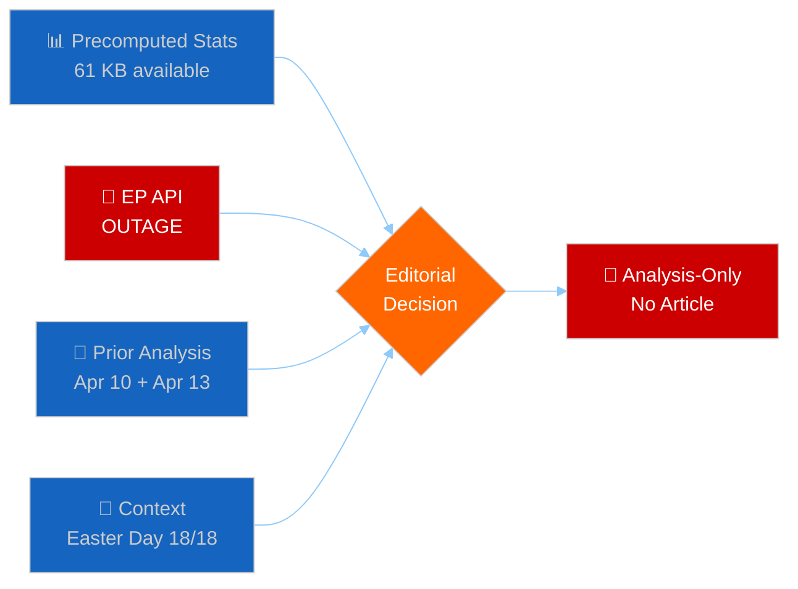
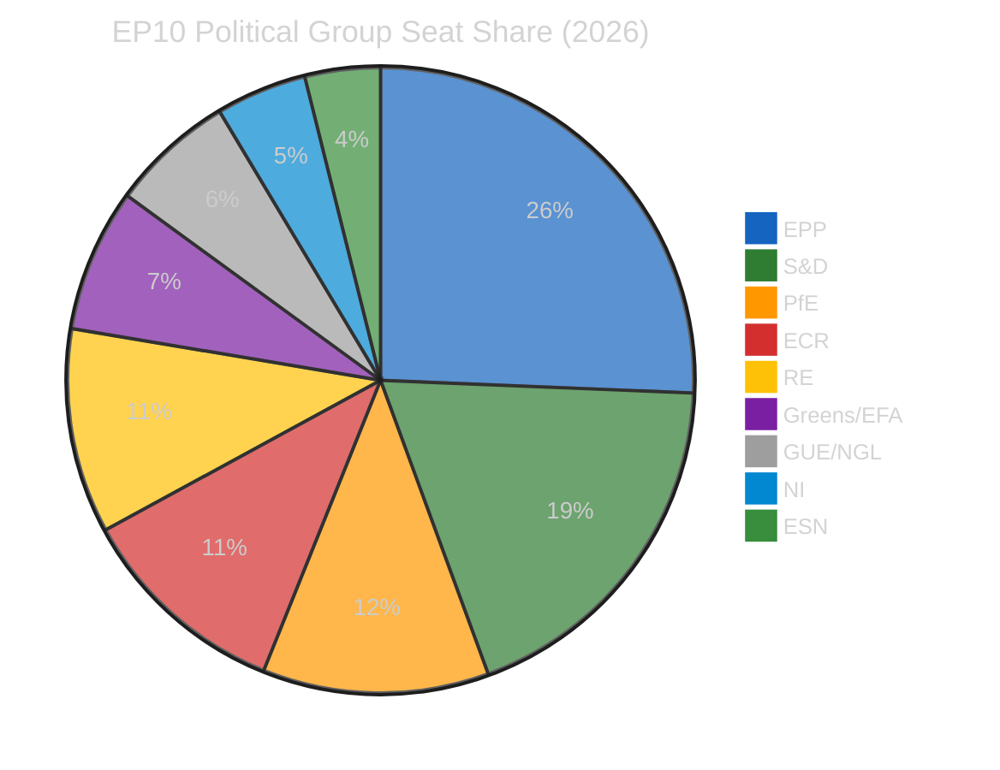

# 🧩 Synthesis Summary — Motions Intelligence (2026-04-13, Run 39)

## 📋 Synthesis Context

| Field | Value |
|-------|-------|
| **Synthesis ID** | SYN-2026-04-13-MOTIONS-RUN39 |
| **Analysis Date** | 2026-04-13 |
| **Data Sources** | Precomputed stats (2004-2026), prior run cross-references |
| **Period** | Easter Recess Day 18/18 (final day) — Parliament resumes April 14 |
| **Overall Confidence** | 🟡 MEDIUM (no live feed data — EP API outage) |
| **Article Type** | motions |
| **Outcome** | Analysis-only PR (no article generated due to EP API outage) |

## 🎯 Intelligence Dashboard

**Decision**: ANALYSIS-ONLY PR. EP API completely unreachable (HTTP 000, 9 consecutive MCP timeouts). No live feed data available for motions article. Precomputed stats provide background intelligence only — insufficient for feed-first article per content quality rules.

## 🔗 Cross-Session Intelligence Continuity

### Prior Motions Analysis (2026-04-10, Run SYN-2026-04-10-001)

The April 10 motions synthesis identified:
- **Top significance**: US Tariff Countermeasures (TA-10-2026-0096) at 8.4/10
- **Geopolitical assertiveness pivot**: Trade defence + defence procurement + development strategy = coherent package
- **Three-pole system**: Renew-ECR competitiveness alliance (0.95 cohesion) as structural EP10 feature
- **Q1 record output**: 100 adopted texts, +46.2% above 2025 pace
- **Anti-corruption milestone**: TA-10-2026-0094 with 24-month transposition window

### Prior Propositions Analysis (2026-04-13, Run 41)

Today's propositions synthesis confirmed:
- **US tariff deadline T-2**: April 15 implementation deadline creates urgency for post-Easter restart
- **Banking Union trilogue**: SRMR3/BRRD3/DGSD2 negotiations with Council starting late April
- **Pipeline congestion**: 13 new COD procedures awaiting committee assignment
- **Risk landscape**: Trade policy at CRITICAL (16/25), Financial Regulation at HIGH (12/25)

## 📊 Motions-Specific Intelligence from Precomputed Stats

### 2026 Q1 Motions Activity (Projected Full-Year)

| Metric | 2024 | 2025 | 2026 (proj.) | Trend |
|--------|:----:|:----:|:------------:|:-----:|
| Resolutions | 108 | 135 | 180 | ↑ (+33%) |
| Roll-call votes | 375 | 420 | 567 | ↑ (+35%) |
| Legislative acts | 72 | 78 | 114 | ↑ (+46%) |
| Adopted texts | 459 | 347 | 104 (Q1 actual) | → |
| Questions | 3,950 | 4,941 | 6,147 | ↑ (+24%) |

### Political Landscape (EP10, 720 MEPs)

**Key dynamics for motions**:
- Right bloc (EPP+PfE+ECR+ESN) holds 52.3% — sufficient for motions requiring simple majority
- Grand Coalition (EPP+S&D) at 44.5% — needs Renew (10.6%) for absolute majority
- Minimum winning coalition requires 3 groups (EPP+S&D+Renew = 55.1%)
- Fragmentation index 6.59 — highest in EP history, complicating resolution consensus

### Derived Intelligence Relevant to Motions

| Indicator | Value | Interpretation |
|-----------|:-----:|---------------|
| Resolution-to-legislation ratio | 1.58 | Each legislative act generates 1.6 associated resolutions |
| Roll-call vote yield | 20.1% | 1 in 5 roll-call votes produces a legislative act |
| Oversight per session | 113.8 questions | High oversight intensity — motions reflect this |
| Debate intensity | 236.3 speeches/session | Active plenary floor engagement |
| MEP stability index | 0.949 | Low turnover — experienced MEPs driving motions |

## 🔮 Post-Easter Motions Outlook

### Scenario 1: Orderly Restart (Probability: Likely)

Parliament resumes April 14 with structured agenda. The March 26 adopted texts (TA-10-2026-0090 through 0096) provide a clear baseline for follow-up motions. Expected activity:
- Resolution implementation monitoring motions (trade countermeasures, anti-corruption)
- Committee-stage motions on 13 pending COD procedures
- Oral questions on Easter-period developments (US tariff situation)

### Scenario 2: Crisis-Driven Session (Probability: Possible)

If US tariff deadline (April 15) triggers escalation, emergency motions and joint resolutions likely. INTA emergency session confirmed by prior committee-reports analysis. Could generate 5-10 urgent motions in first post-Easter week.

### Scenario 3: Delayed Restart (Probability: Unlikely)

Extended infrastructure or political delays push substantive motions to week of April 20. Low probability given the tariff deadline urgency.

## 📝 Recommendations for Next Motions Run

1. **Priority data fetch**: `get_adopted_texts_feed(one-week)` — capture any new adopted texts from the restart
2. **Voting records**: `get_voting_records(topic: "tariff")` — monitor trade-related votes
3. **Coalition tracking**: `analyze_coalition_dynamics` with March 26 voting data for baseline
4. **Question monitoring**: `get_parliamentary_questions_feed` for post-recess interpellations
5. **Cross-reference**: Link to this analysis for continuity (SYN-2026-04-13-MOTIONS-RUN39)
