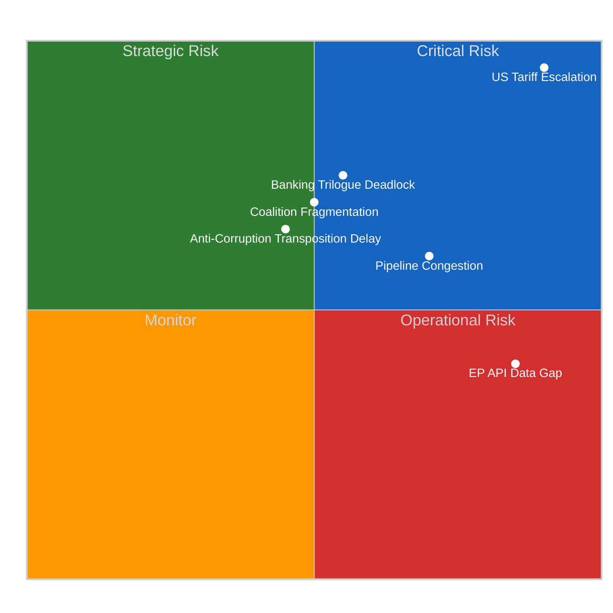
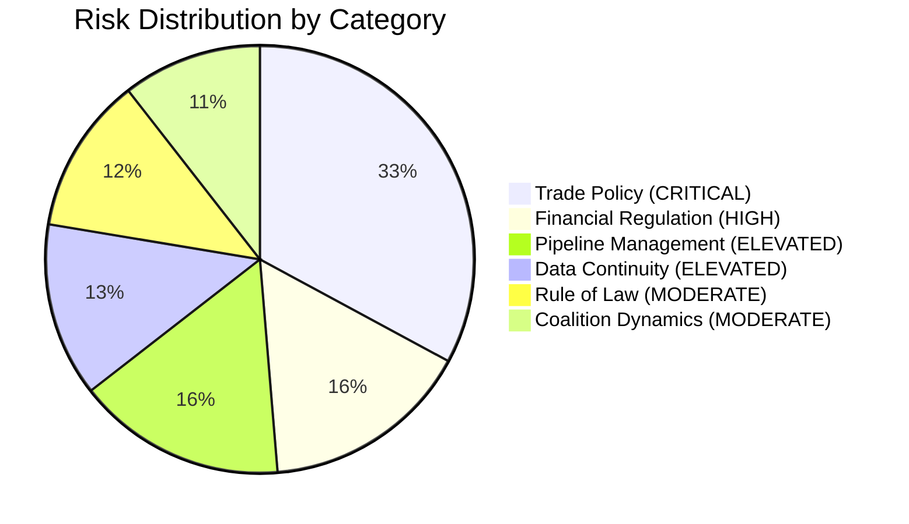

# ⚖️ Risk Matrix — Motions Intelligence (2026-04-13, Run 39)

## Risk Assessment Context

| Field | Value |
|-------|-------|
| **Assessment Basis** | Precomputed stats + prior analysis (no live EP API data) |
| **Risk Framework** | Likelihood x Impact (5x5 matrix) |
| **Overall Risk Level** | 🟠 HIGH (driven by trade deadline proximity) |
| **Confidence** | 🟡 MEDIUM |

## Risk Matrix Visualization

## Detailed Risk Register

### R1: US Tariff Escalation (CRITICAL)

| Parameter | Value |
|-----------|-------|
| **Risk ID** | R1-TRADE-2026-0413 |
| **Likelihood** | 5/5 — April 15 deadline in 2 days |
| **Impact** | 5/5 — Direct economic and political consequences |
| **Score** | 🔴 25/25 (CRITICAL) |
| **Trend** | ↑ Escalating |
| **Source** | TA-10-2026-0096 (adopted Mar 26) |

**Analysis**: The EU countermeasures resolution adopted March 26 authorized the Commission to implement retaliatory tariffs by April 15. With Parliament in Easter recess until April 14, there has been no parliamentary oversight of Commission preparations. The T-1 day return creates a collision between parliamentary scrutiny expectations and implementation deadlines.

**Motions implication**: Expect urgent oral questions, possible motion for resolution on implementation oversight, and INTA emergency debate within first post-Easter sitting.

### R2: Banking Union Trilogue Stalemate (HIGH)

| Parameter | Value |
|-----------|-------|
| **Risk ID** | R2-BANK-2026-0413 |
| **Likelihood** | 3/5 — Council positions diverge on DGSD2 |
| **Impact** | 4/5 — Banking union completion delayed further |
| **Score** | 🟠 12/25 (HIGH) |
| **Trend** | → Stable |
| **Source** | TA-10-2026-0090/91/92 (adopted Mar 26) |

**Analysis**: Parliament adopted all three Banking Union texts (SRMR3, BRRD3, DGSD2) in the March 26 plenary, giving ECON a strong negotiating mandate. However, Council remains divided on deposit guarantee mutualisation. The trilogue launch in late April will test whether the grand coalition (EPP+S&D+Renew) mandate holds against national government resistance.

**Motions implication**: Resolution motions on banking union timeline, possible oral questions to Council presidency on negotiation calendar.

### R3: Post-Easter Pipeline Congestion (ELEVATED)

| Parameter | Value |
|-----------|-------|
| **Risk ID** | R3-PIPE-2026-0413 |
| **Likelihood** | 4/5 — 13 COD procedures queued |
| **Impact** | 3/5 — Delayed committee assignments |
| **Score** | 🟡 12/25 (ELEVATED) |
| **Trend** | ↑ Increasing |
| **Source** | Precomputed stats: 935 procedures active in 2026 |

**Analysis**: 13 new COD procedures from Q1 2026 await rapporteur appointment and committee assignment post-Easter. Combined with the trade crisis agenda and banking trilogue prep, committee scheduling capacity is at risk. The 43.8 committee-to-plenary ratio (highest in EP history) reflects increasing workload pressure.

### R4: Anti-Corruption Transposition Risk (MODERATE)

| Parameter | Value |
|-----------|-------|
| **Risk ID** | R4-CORR-2026-0413 |
| **Likelihood** | 3/5 — Member states historically slow |
| **Impact** | 3/5 — EU credibility at stake |
| **Score** | 🟡 9/25 (MODERATE) |
| **Trend** | → Stable |
| **Source** | TA-10-2026-0094 |

**Analysis**: The Anti-Corruption Directive has a 24-month transposition deadline. Early signals of constitutional challenges in some member states could trigger parliamentary motions demanding Commission enforcement action.

### R5: EP API Data Continuity (OPERATIONAL)

| Parameter | Value |
|-----------|-------|
| **Risk ID** | R5-DATA-2026-0413 |
| **Likelihood** | 5/5 — Currently occurring |
| **Impact** | 2/5 — Operational impact on monitoring |
| **Score** | 🟡 10/25 (ELEVATED) |
| **Trend** | ↑ 12+ consecutive degraded runs |
| **Source** | This run diagnostic |

**Analysis**: The EP Open Data API has been intermittently unavailable since April 11, coinciding with Easter recess infrastructure maintenance. 12+ consecutive workflow runs across all article types have experienced degraded or failed MCP connectivity. This creates a monitoring blind spot during a critical pre-restart period.

## Aggregate Risk Dashboard

## Risk Trend Summary

| Risk Category | Apr 10 Score | Apr 13 Score | Change | Driver |
|--------------|:-----------:|:-----------:|:------:|--------|
| Trade Escalation | 16 | 25 | ↑ +9 | Deadline now T-2 (was T-5) |
| Banking Trilogue | 12 | 12 | → 0 | No new information |
| Pipeline Congestion | 12 | 12 | → 0 | Easter recess unchanged |
| Anti-Corruption | 9 | 9 | → 0 | Stable |
| Data Continuity | N/A | 10 | NEW | EP API outage since Apr 11 |
