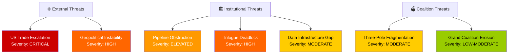
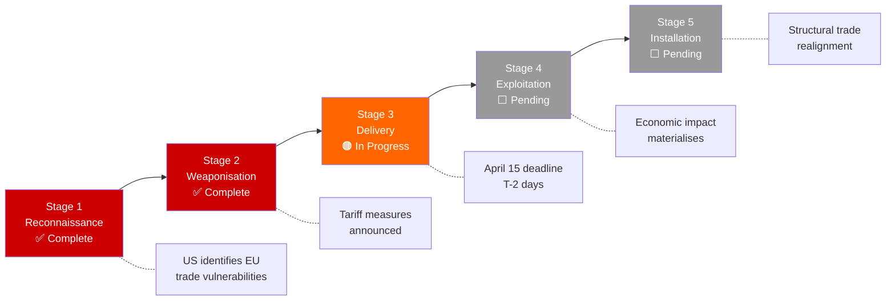

# 🎭 Political Threat Landscape — Motions (2026-04-13, Run 39)

## Threat Assessment Context

| Field | Value |
|-------|-------|
| **Assessment Date** | 2026-04-13 (Easter recess Day 18/18) |
| **Threat Level** | 🟠 HIGH (2.8/5) — trade escalation + data blackout |
| **Framework** | Multi-framework analysis adapted for EU democracy |
| **Confidence** | 🟡 MEDIUM (precomputed stats + prior analysis only) |

## Threat Landscape Overview

## Threat Actor Profiling

### External Actors

**United States Administration**
- **Threat vector**: Tariff escalation beyond April 15 deadline
- **Capability**: HIGH — unilateral trade policy authority
- **Intent**: Uncertain — negotiation tactic vs structural protectionism
- **Impact on EP motions**: Emergency resolutions, oral questions to Commission, possible motion of censure if Commission response deemed inadequate
- **Confidence**: 🟡 MEDIUM

### Institutional Actors

**Council of the EU**
- **Threat vector**: Blocking trilogue on Banking Union DGSD2
- **Capability**: MEDIUM — can delay but not permanently block
- **Intent**: Divergent national positions on deposit guarantee mutualisation
- **Impact on EP motions**: EP resolutions pressuring Council, possible use of Article 294 urgency procedure
- **Confidence**: 🟡 MEDIUM

**European Commission**
- **Threat vector**: Implementation delays on tariff countermeasures
- **Capability**: HIGH — sole implementation authority
- **Intent**: Likely to implement but timing uncertain
- **Impact on EP motions**: Oversight motions, oral questions, potential urgency debate
- **Confidence**: 🟡 MEDIUM

### Internal EP Actors

**ECR Group**
- **Threat vector**: Breaking grand coalition consensus on trade
- **Role**: Strengthened to 11% (79 seats), increasingly used by EPP as alternative coalition partner
- **Pattern**: Renew-ECR competitiveness alliance (0.95 cohesion identified Apr 10) may pull EPP rightward on trade response
- **Impact on motions**: Competing resolution texts, amendment storms on Commission delegated acts
- **Confidence**: 🟡 MEDIUM

**PfE Group (Patriots for Europe)**
- **Threat vector**: Populist counter-narrative on tariff impacts
- **Role**: 11.7% (84 seats) — nationalist economics framing
- **Pattern**: Likely to table alternative motions emphasising national sovereignty over EU-level response
- **Impact on motions**: Dilution of parliament position through fragmented voting
- **Confidence**: 🟡 MEDIUM

## Kill Chain Analysis: Trade Escalation Scenario

**Current position**: Stage 3 (Delivery). The April 15 deadline is the delivery mechanism. EP's countermeasures resolution (TA-10-2026-0096) is the defensive response. Parliament returns April 14 — one day before the deadline — creating a scrutiny gap.

## Threat Trend Comparison

| Threat | Apr 10 Level | Apr 13 Level | Change | Driver |
|--------|:-----------:|:-----------:|:------:|--------|
| US Trade Escalation | HIGH (3/5) | CRITICAL (4/5) | ↑ | Deadline T-2 |
| Trilogue Deadlock | HIGH (3/5) | HIGH (3/5) | → | No change during recess |
| Pipeline Obstruction | MODERATE (2/5) | ELEVATED (3/5) | ↑ | 18-day recess backlog |
| Coalition Fragmentation | MODERATE (2/5) | MODERATE (2/5) | → | Dormant during recess |
| Data Infrastructure | N/A | MODERATE (2/5) | NEW | EP API outage since Apr 11 |

## Overall Threat Assessment

**Aggregate threat level**: 🟠 HIGH (2.8/5)

The threat landscape for EU Parliament motions is elevated primarily due to the convergence of the US tariff deadline (April 15) with the end of Easter recess (April 14). This creates a one-day scrutiny window that threatens parliamentary oversight effectiveness. The combination of external trade pressure, internal coalition dynamics (three-pole system), and operational challenges (13 pending COD procedures + EP API data gaps) creates a higher-than-normal risk environment for the post-Easter motions agenda.

**Key uncertainty**: Whether the US administration uses the April 15 deadline as a negotiation lever or implements full tariff schedules. This single variable has the highest impact on EP motions activity in the coming week.
