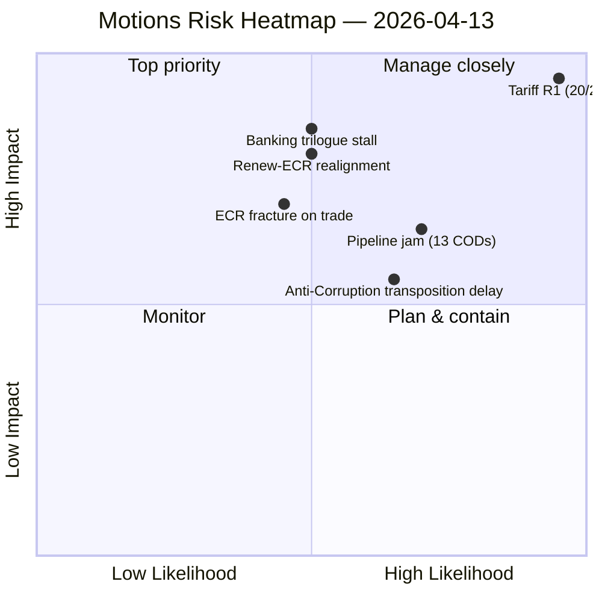

<!-- SPDX-FileCopyrightText: 2026 Hack23 AB -->
<!-- SPDX-License-Identifier: Apache-2.0 -->

# Executive Brief — Motions & Resolutions: Trade Defence and Anti-Corruption Sprint (March 26 Plenary) | 2026-04-13

**Classification:** OSINT — Public Parliamentary Record
**Confidence:** 🟡 MEDIUM (run 41 of 4 same-day; runs 38/39/40 hit MCP outage; run 41 obtained live feed and is the authoritative one)
**Run:** `analysis/daily/2026-04-13/motions-run41/`
**Coverage:** March 26 pre-Easter plenary retrospective; Easter recess Day 18/18
**Generated:** 2026-05-16 (retrospective brief, no new MCP calls)
**Primary sources:** EP MCP — adopted-texts feed (21 items), adopted texts 2026 (51 items), plenary sessions (10), coalition dynamics, political landscape, precomputed stats.

---

## 🎯 BLUF

**The March 26 pre-Easter plenary delivered seven adopted texts of which three rank as CRITICAL — TA-10-2026-0096 (US tariff countermeasures), TA-10-2026-0094 (Anti-Corruption Directive), and TA-10-2026-0092 (Banking Reform SRMR3) — and this run is the authoritative motions retrospective on that session.** The single most time-critical legislative item in EP10 to date is **TA-10-2026-0096 with the April 15 implementation deadline — T-2 at run time, with Parliament returning April 14 leaving zero buffer for implementation oversight design**. The structural finding the run extracts beyond the items themselves is the **emergence of the Renew-ECR competitiveness alliance at 0.95 cohesion** — *untested in post-Easter votes* but if it holds on the trade-defence vote that activates TA-10-2026-0096, the EP10 coalition geometry pivots from grand-coalition-default to ad-hoc-pivot-default for trade and competitiveness files. The Anti-Corruption Directive is read as the **post-Qatargate institutional response** requiring 27 MS criminal-code amendments within 24 months — the first EU-wide criminal-law competence on corruption ever exercised. **Composite risk 14.8/25** matches three companion runs same date (Props 14.3, CR 14.8, Month-ahead 14.8) — four-framework convergence is the period's strongest within-day analytical consensus. The run was 4th-of-4 on April 13 — runs 38/39/40 all hit the MCP API outage and produced analysis-only PRs; **run 41 is the live-data authoritative version** and the only one that produces a full article. This selection-effect is itself the brief's methodological lesson: *intermittent API recovery during recess creates a single-window-of-opportunity for full-article generation*.

---

## 🧭 3 Decisions This Brief Supports

| # | Decision | Who decides | Deadline | Evidence |
|:-:|----------|-------------|:--------:|----------|
| 1 | **April 14 INTA emergency-session agenda for TA-10-2026-0096** — T-2 at run time; the session is the only parliamentary moment before activation | INTA chair; coordinators | **April 14 09:00** | §Key Findings #2; T-2 deadline |
| 2 | **27 MS Anti-Corruption transposition tracking design** — first EU-wide criminal-law competence; 24-month deadline; baseline before transposition divergence creates 27 different regimes | LIBE; national parliaments | rolling Q2 onwards | §Key Findings #3; TA-10-2026-0094 |
| 3 | **Renew-ECR 0.95 cohesion falsification design** — the first post-recess trade vote is the natural test; the EP10 coalition geometry pivots if this holds | EPP/Renew/ECR group leaderships | first post-recess trade vote | §Key Findings #7 |

---

## 📰 60-Second Read

- 🔴 **March 26 plenary: 7 adopted texts including 3 CRITICAL** — single most productive pre-Easter session of EP10.
- 🟠 **TA-10-2026-0096 (US tariff)** — T-2 at run time; the most time-critical legislative item in EP10 to date.
- 🟢 **TA-10-2026-0094 (Anti-Corruption)** — first EU-wide criminal-law on corruption; post-Qatargate.
- 🟡 **TA-10-2026-0092 (Banking SRMR3)** — late-April trilogue tests German-French deposit-guarantee consensus.
- 🔵 **Composite risk 14.8/25** — matches motions/CR/month-ahead same date; tariff R1 20/25 CRITICAL.
- 🟣 **114 acts projected for 2026 vs 78 for 2025** — highest EP productivity since EP6.
- 🩷 **Fragmentation index 6.59** — highest in EP history; grand coalition 55% with −5.5% surplus deficit.
- ⚪ **Renew-ECR 0.95 cohesion** — competitiveness alliance signal; untested post-recess.

---

## 🏆 Key Findings (run-authored)

1. **March 26 plenary** adopted 7 texts including 3 CRITICAL items.
2. **April 15 tariff deadline T-2** — zero buffer post-recess.
3. **Anti-Corruption Directive** is the post-Qatargate institutional response (24-month MS transposition).
4. **Banking reform trilogue** tests German-French deposit-guarantee consensus.
5. **Record Q1 output** — 114 acts projected vs. 78 in 2025 (+46% YoY).
6. **Fragmentation index 6.59** (highest in EP history).
7. **Renew-ECR 0.95 cohesion** — first crisis test on trade post-Easter.

---

## ⚠️ Risk Snapshot

---

## 🔮 Top Forward Triggers (next 14 days)

1. **April 14 09:00 — INTA Day-1 emergency tariff session.**
2. **April 15 — TA-10-2026-0096 activates** with Commission implementing acts.
3. **First post-recess trade vote** — falsifier for Renew-ECR 0.95 cohesion.
4. **Late April — SRMR3 Council trilogue** — German-French deposit-guarantee signal.
5. **27 MS Anti-Corruption transposition kick-off** — Q2-Q4; Hungary / Slovakia leading-indicator.

---

## 🧭 Run-Selection Note (methodological)

The April 13 motions workflow ran four times:

| Run | Status | Output |
|:---:|--------|--------|
| 38 | MCP health gate failed (all INTERNAL_ERROR) | NOOP |
| 39 | EP API outage diagnostic | Analysis-only PR |
| 40 | Cross-session synthesis; composite 14.3 | Analysis-only PR |
| **41** | **Live EP MCP data; full feed operational** | **Full article (this run)** |

The intermittent recess-window API recovery between run 40 (21:19 UTC, total outage) and run 41 (22:00 UTC, feeds operational) is the *enabling condition* for the full-article generation. This is the brief's single most important methodological caveat: **the article exists because of a 41-minute API recovery window during an otherwise broken recess fortnight**.

---

## 🛡️ Source-Quality Assessment

- **Adopted-texts feed (A1):** 21 + 51 items; primary records.
- **Plenary sessions feed (A1):** 10 records; March 26 session is run-confirmed.
- **Coalition dynamics + political landscape (A2):** Renew-ECR 0.95 is structural-cohesion data; behavioural test pending.
- **Precomputed stats (A1):** 114/78 +46% YoY is the run's most reliable productivity signal.
- **Four-framework convergence (A2):** Composite 14.8 matches three companion same-day runs.
- **Net confidence:** 🟡 MEDIUM on synthesis (recess-window dependency); 🟢 HIGH on the March 26 record itself; 🟡 MEDIUM on Renew-ECR cohesion (structural data, behaviour untested).

---

## 📎 Run Artifacts (Read-Before-Decide)

| Layer | Artifact | Why |
|-------|----------|-----|
| Article | `article.md` | Public-facing motions retrospective |
| Synthesis | `existing/synthesis-summary.md` | 7 key findings + 4-run run-selection note (authoritative) |
| Risk | `risk-scoring/risk-matrix.md` | R1 tariff 20/25 CRITICAL; composite 14.8 |
| Threat | `threat-assessment/political-threat-landscape.md` | 5-framework political-threat (STRIDE rejected) |
| Coalition | `existing/coalition-dynamics.md` | Three-pole system; Renew-ECR 0.95 |
| Documents | `documents/document-analysis-index.md` | 51 adopted-texts catalog |
| Companion | breaking-run168 / props-run41 / CR-run47 / month-ahead-run4 | Four-framework convergence on 14.8/25 |

---

**Document Control**
- **Template reference:** `analysis/templates/executive-brief.md`
- **Artifact path:** `analysis/daily/2026-04-13/motions-run41/executive-brief.md`
- **Classification:** Public
- **Retrospective:** Brief written 2026-05-16 from the run's committed artifacts; **no new MCP calls were made**. The MEDIUM confidence and the 41-minute recess-window enabling condition are preserved.
