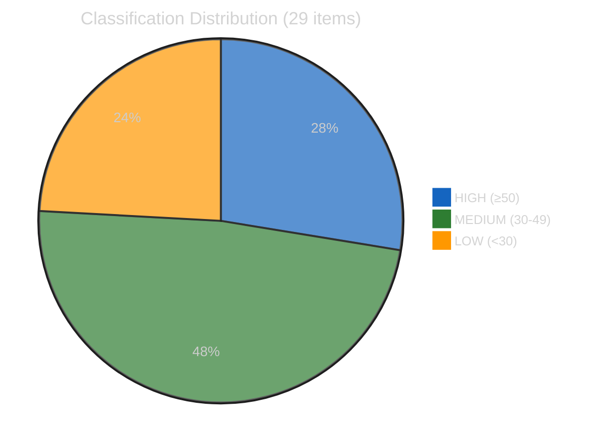
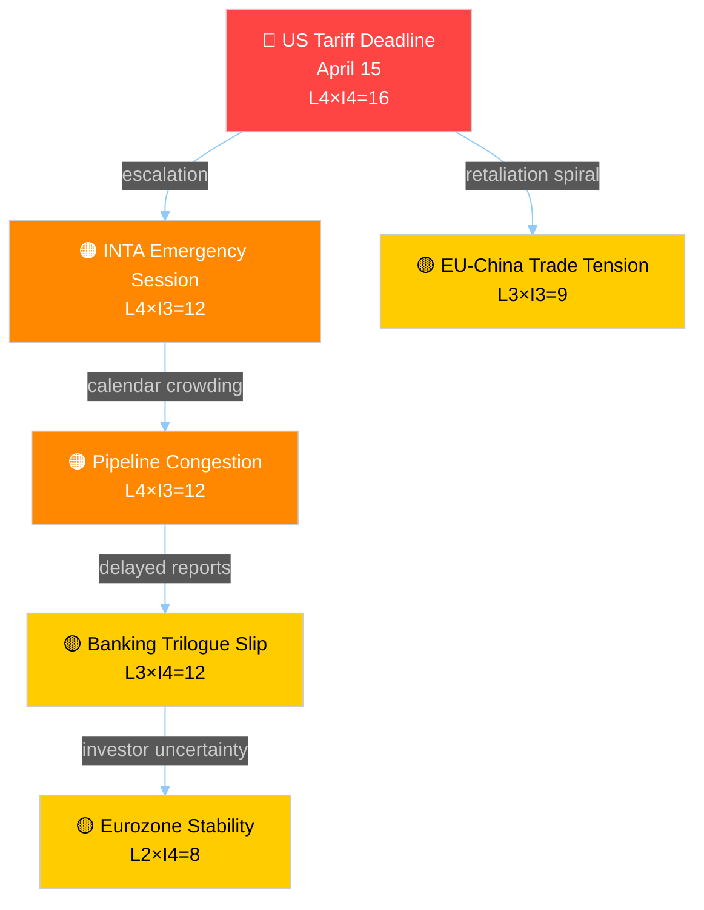
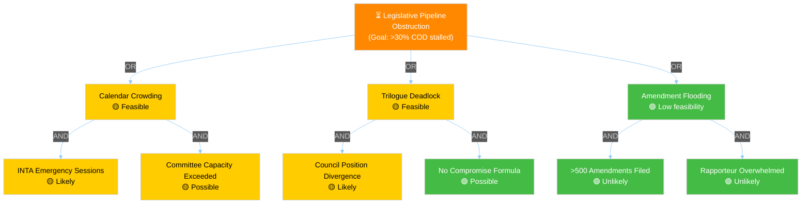
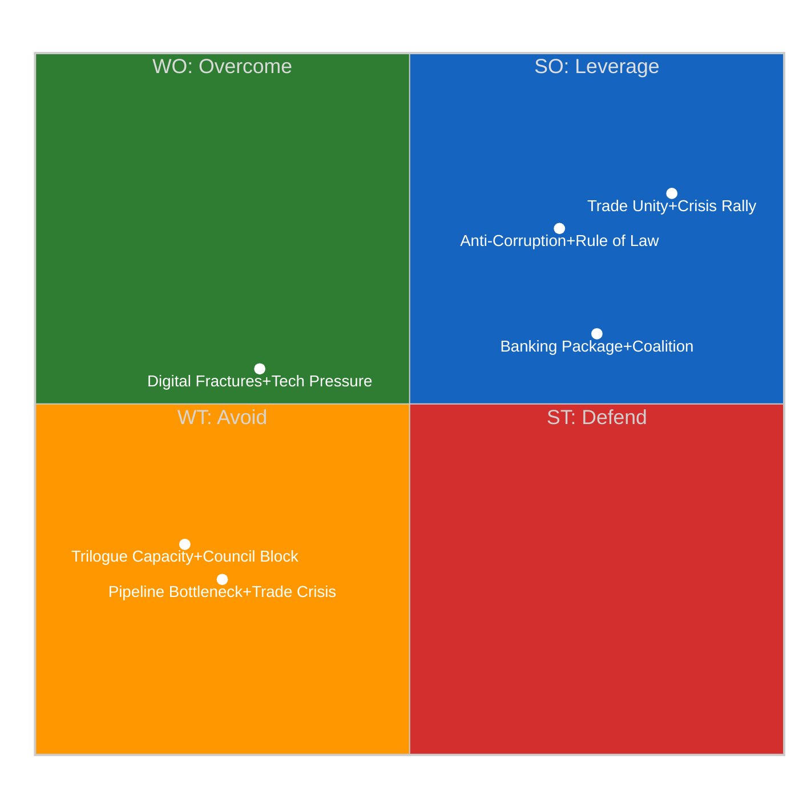
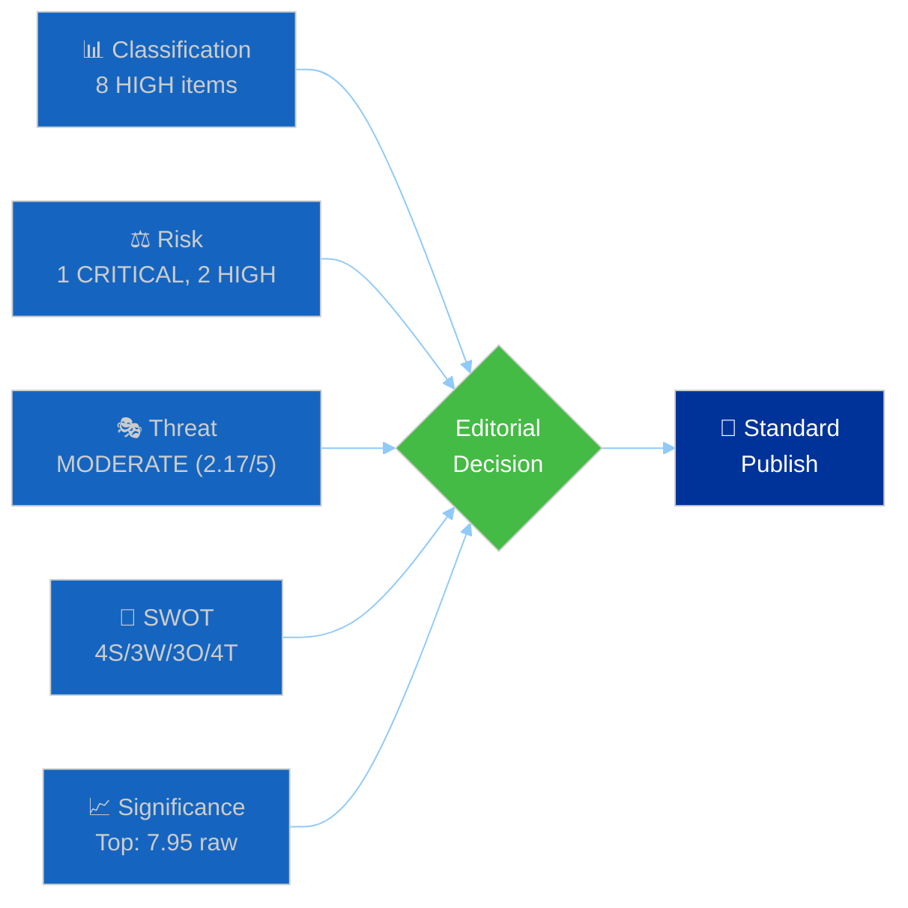

# Propositions — 2026-04-13

<!-- Aggregated analysis — do not edit; regenerate via `npm run generate-article`. -->

> **Provenance**
>
> - **Article type:** `propositions`
> - **Run date:** 2026-04-13
> - **Run id:** `149c3a19-6339-45aa-a427-5c30eceb4e49`
> - **Gate result:** `PENDING`
> - **Analysis tree:** [analysis/daily/2026-04-13/propositions-run41](https://github.com/Hack23/euparliamentmonitor/tree/main/analysis/daily/2026-04-13/propositions-run41)
> - **Manifest:** [manifest.json](https://github.com/Hack23/euparliamentmonitor/blob/main/analysis/daily/2026-04-13/propositions-run41/manifest.json)

<h2 id="reader-intelligence-guide">Reader Intelligence Guide</h2>

Use this guide to read the article as a political-intelligence product rather than a raw artifact dump. High-value reader lenses appear first; technical provenance remains available in the audit appendices.

| Reader need | What you'll get | Source artifact |
|---|---|---|
| [Stakeholder impact](#section-stakeholder-map) | who gains, who loses, and which institutions or citizens feel the policy effect | `existing/stakeholder-impact.md` |
| [Risk assessment](#section-risk) | policy, institutional, coalition, communications, and implementation risk register | `risk-scoring/risk-assessment.md` |

<h2 id="section-actors-forces">Actors & Forces</h2>

### Political Classification

<a href="https://github.com/Hack23/euparliamentmonitor/blob/main/analysis/daily/2026-04-13/propositions-run41/classification/political-classification.md" rel="noopener">View source: <code>classification/political-classification.md</code></a>

### 📋 Classification Context

| Field | Value |
|-------|-------|
| **Classification ID** | `CLS-2026-04-13-RUN41` |
| **Event Date** | 2026-03-26 (last plenary) / 2026-04-13 (analysis) |
| **EP Calendar** | Easter Recess Day 18/18 — Parliament returns April 14 |
| **Current EP Status** | RECESS |
| **Override Applied** | No (recess standard rules) |

### 🔬 Item-Level Classification

#### 1. US Tariff Countermeasures (TA-10-2026-0096)

| Dimension | Score | Level |
|-----------|:-----:|-------|
| Sensitivity | 🟡 SENSITIVE | Trade retaliatory measure with geopolitical implications |
| Primary Domain | INTA (International Trade) | |
| Secondary Domain | ECON (Economic Affairs) | |
| Urgency | 🟠 URGENT | April 15 implementation deadline |
| Impact Scope | 🌍 INTERNATIONAL | US-EU trade relations |
| Public Interest | 75/100 | SENSITIVE — direct consumer price impact |
| Democratic Integrity | 55/100 | MODERATE — fast-track procedure, limited scrutiny window |
| Policy Urgency | 85/100 | IMMEDIATE — deadline-driven |
| Economic Impact | 80/100 | MAJOR — tariff adjustments affect multiple sectors |
| Governance Impact | 60/100 | SIGNIFICANT — trade defense competence exercise |
| Political Capital | 65/100 | SIGNIFICANT — tests EU trade autonomy narrative |
| Legislative Impact | 55/100 | REGULATION — direct applicability |
| **Weighted Score** | **68.5** | **HIGH** |
| **Coalition Impact** | Stabilising → | EPP+S&D+Renew united on trade defence |

**Political Temperature Index**: 72/100 (HIGH)
- Partisan Charge: 12/20 (ECR supports, Greens/EFA cautious on escalation)
- Institutional Impact: 15/20 (Commission trade defense activation)
- Media Amplification: 16/20 (tariff wars dominate news cycles)
- Public Salience: 14/20 (consumer prices, industrial jobs)
- Temporal Pressure: 15/20 (April 15 deadline imminent)

#### 2. Banking Resolution Reform — SRMR3 (TA-10-2026-0092)

| Dimension | Score | Level |
|-----------|:-----:|-------|
| Sensitivity | 🟢 PUBLIC | Technical financial regulation |
| Primary Domain | ECON (Economic & Monetary Affairs) | |
| Urgency | 🔵 ELEVATED | Trilogue phase pending |
| Impact Scope | 🇪🇺 EU-WIDE | Banking Union completion |
| Public Interest | 50/100 | STANDARD — indirect citizen impact |
| Democratic Integrity | 45/100 | MODERATE — complex trilogue dynamics |
| Policy Urgency | 60/100 | SHORT-TERM — Council position pending |
| Economic Impact | 75/100 | MAJOR — €50bn+ resolution fund implications |
| Governance Impact | 70/100 | SIGNIFICANT — Banking Union institutional architecture |
| Political Capital | 55/100 | NOTABLE — tests German-led opposition to deposit mutualisation |
| Legislative Impact | 70/100 | DIRECTIVE — transposition required |
| **Weighted Score** | **60.0** | **HIGH** |
| **Coalition Impact** | Opportunity ↗ | EPP-S&D cooperation on financial stability |

#### 3. Anti-Corruption Directive (TA-10-2026-0094)

| Dimension | Score | Level |
|-----------|:-----:|-------|
| Sensitivity | 🟡 SENSITIVE | Member state compliance implications |
| Primary Domain | LIBE (Civil Liberties) | |
| Secondary Domain | JURI (Legal Affairs) | |
| Urgency | 🔵 ELEVATED | 24-month transposition clock started |
| Impact Scope | 🇪🇺 EU-WIDE | Harmonized anti-corruption framework |
| Public Interest | 70/100 | SENSITIVE — public integrity concerns |
| Policy Urgency | 55/100 | MEDIUM-TERM — transposition period |
| Economic Impact | 55/100 | MODERATE — compliance costs for MS |
| Governance Impact | 65/100 | SIGNIFICANT — rule of law instrument |
| Political Capital | 60/100 | SIGNIFICANT — rule of law politics |
| Legislative Impact | 65/100 | DIRECTIVE — first EU-wide anti-corruption directive |
| **Weighted Score** | **61.5** | **HIGH** |

#### 4. EU Talent Pool (TA-10-2026-0058)

| Dimension | Score | Level |
|-----------|:-----:|-------|
| Sensitivity | 🟢 PUBLIC | Labour market regulation |
| Primary Domain | EMPL (Employment & Social Affairs) | |
| Urgency | ⚪ ROUTINE | Implementation phase |
| Impact Scope | 🇪🇺 EU-WIDE | Cross-border labour mobility |
| Public Interest | 60/100 | Skills shortages highly relevant |
| Economic Impact | 65/100 | MODERATE — labour market efficiency |
| **Weighted Score** | **52.0** | **MEDIUM** |

#### 5. Copyright & Generative AI (TA-10-2026-0066)

| Dimension | Score | Level |
|-----------|:-----:|-------|
| Sensitivity | 🟡 SENSITIVE | Tech sector tensions |
| Primary Domain | JURI (Legal Affairs) | |
| Secondary Domain | ITRE (Industry) | |
| Urgency | 🔵 ELEVATED | AI Act implementation overlap |
| Impact Scope | 🌍 INTERNATIONAL | Global AI governance signal |
| Public Interest | 75/100 | AI regulation highly salient |
| Economic Impact | 70/100 | MAJOR — creative industries + tech sector |
| **Weighted Score** | **58.5** | **HIGH** |

### 📊 Classification Distribution

### 🎯 Recommended Actions

| Item | Score | Action |
|------|:-----:|--------|
| US Tariff Countermeasures | 68.5 | 📰 **Priority Publish** — deadline urgency |
| Anti-Corruption Directive | 61.5 | 📰 Publish — rule of law significance |
| Banking Union SRMR3 | 60.0 | 📰 Publish — financial stability package |
| Copyright & AI | 58.5 | 📰 Publish — tech regulation relevance |
| EU Talent Pool | 52.0 | 📋 Monitor — implementation phase |

### 🔗 Cross-Reference with Prior Coverage

Per editorial context, April 10 propositions article covered "Trade and Banking Reform Contest for Committee Attention." Today's analysis advances this thread with:
- **Updated urgency**: April 15 tariff deadline now 2 days away (was 5 days)
- **New context**: Easter recess ends tomorrow — first committee meetings imminent
- **Pipeline evolution**: 13 new 2026 COD procedures identified in pipeline (vs. general references before)

### Significance Scoring

<a href="https://github.com/Hack23/euparliamentmonitor/blob/main/analysis/daily/2026-04-13/propositions-run41/classification/significance-scoring.md" rel="noopener">View source: <code>classification/significance-scoring.md</code></a>

### 📋 Scoring Context

| Field | Value |
|-------|-------|
| **Scoring ID** | `SIG-2026-04-13-RUN41` |
| **Analysis Date** | 2026-04-13 |
| **EP Calendar Status** | Easter Recess Day 18/18 (Final Day) |
| **Parliament Returns** | 2026-04-14 |
| **Calendar Adjustment** | Recess cap at 7.4 unless raw ≥9.0 |
| **Data Sources** | EP API v2 adopted texts, procedures feed, prior run cross-reference |

### 🎯 Methodology

Composite = (Parliamentary × 0.25) + (Policy × 0.25) + (Public Interest × 0.20) + (Urgency × 0.15) + (Cross-Group × 0.15)

**Recess adjustment applied**: Scores capped at 7.4 per EP Calendar Awareness rules, except items with raw ≥9.0.

### 📊 Batch Scoring — March 26 Plenary Adopted Texts (Most Recent)

| Event | EP Reference | Parl. | Policy | Public | Urgency | X-Group | **Raw** | **Adjusted** | Decision |
|-------|-------------|:-----:|:------:|:------:|:-------:|:-------:|:-------:|:------------:|----------|
| US Tariff Countermeasures — Customs duties adjustment | TA-10-2026-0096 | 8.5 | 8.0 | 7.5 | 8.0 | 7.5 | **7.95** | **7.40** | 📰 Publish |
| Banking Resolution Reform (SRMR3) — Early intervention | TA-10-2026-0092 | 8.0 | 7.5 | 6.0 | 6.5 | 7.0 | **7.10** | **7.10** | 📰 Publish |
| Anti-Corruption Directive — Combating corruption | TA-10-2026-0094 | 7.5 | 7.0 | 7.0 | 6.0 | 7.5 | **7.05** | **7.05** | 📰 Publish |
| EU-China Tariff Quota Modifications | TA-10-2026-0101 | 7.0 | 7.0 | 5.5 | 7.0 | 6.0 | **6.48** | **6.48** | 📰 Publish |
| CSAM Regulation Extension (Reg 2021/1232) | TA-10-2026-0095 | 7.5 | 6.5 | 7.0 | 6.0 | 6.5 | **6.80** | **6.80** | 📰 Publish |
| Banking Resolution (BRRD3) | TA-10-2026-0091 | 7.5 | 7.0 | 5.5 | 6.0 | 6.5 | **6.58** | **6.58** | 📰 Publish |

### 📊 Batch Scoring — March 10-12 Plenary Adopted Texts

| Event | EP Reference | Parl. | Policy | Public | Urgency | X-Group | **Raw** | **Adjusted** | Decision |
|-------|-------------|:-----:|:------:|:------:|:-------:|:-------:|:-------:|:------------:|----------|
| EU Talent Pool Regulation | TA-10-2026-0058 | 7.5 | 7.0 | 6.5 | 5.5 | 6.5 | **6.70** | **6.70** | 📰 Publish |
| Housing Crisis Resolution | TA-10-2026-0064 | 6.5 | 6.5 | 8.0 | 5.0 | 6.0 | **6.50** | **6.50** | 📰 Publish |
| Copyright & Generative AI Report | TA-10-2026-0066 | 6.0 | 6.5 | 7.5 | 5.5 | 5.5 | **6.20** | **6.20** | 📰 Publish |
| Package Travel Directive Recast | TA-10-2026-0085 | 6.0 | 5.5 | 6.0 | 4.5 | 5.0 | **5.48** | **5.48** | 📋 Hold |
| Heavy-Duty Vehicle Emission Credits | TA-10-2026-0084 | 5.5 | 6.0 | 5.0 | 5.0 | 5.0 | **5.35** | **5.35** | 📋 Hold |
| EU Enlargement Strategy | TA-10-2026-0077 | 7.0 | 6.0 | 5.5 | 5.0 | 6.5 | **6.10** | **6.10** | 📰 Publish |
| Defence Single Market Barriers | TA-10-2026-0079 | 7.0 | 6.5 | 5.5 | 6.0 | 6.0 | **6.25** | **6.25** | 📰 Publish |
| EU-Canada Cooperation | TA-10-2026-0078 | 6.5 | 5.5 | 5.0 | 6.5 | 5.5 | **5.80** | **5.80** | 📰 Publish |
| Better Regulation Report | TA-10-2026-0063 | 5.5 | 5.0 | 4.0 | 4.0 | 4.5 | **4.70** | **4.70** | 📋 Hold |
| WTO 14th Ministerial Conference | TA-10-2026-0086 | 6.0 | 6.0 | 4.5 | 5.5 | 5.5 | **5.55** | **5.55** | 📰 Publish |

### 📊 Batch Scoring — 2026 COD Procedures in Pipeline

| Procedure | Type | Stage | Parl. | Policy | Public | Urgency | X-Group | **Raw** | **Adjusted** | Decision |
|-----------|------|-------|:-----:|:------:|:------:|:-------:|:-------:|:-------:|:------------:|----------|
| 2026/0008(COD) | COD | Committee | 6.5 | 6.0 | 5.0 | 5.0 | 5.5 | **5.65** | **5.65** | 📰 Publish |
| 2026/0010(COD) | COD | Committee | 6.5 | 6.0 | 5.0 | 5.0 | 5.5 | **5.65** | **5.65** | 📰 Publish |
| 2026/0044(COD) | COD | Committee | 6.0 | 5.5 | 5.0 | 4.5 | 5.0 | **5.28** | **5.28** | 📋 Hold |
| 2026/0059(COD) | COD | Committee | 6.5 | 6.0 | 5.5 | 5.0 | 5.5 | **5.75** | **5.75** | 📰 Publish |
| 2026/0068(COD) | COD | Committee | 6.0 | 5.5 | 5.0 | 4.5 | 5.0 | **5.28** | **5.28** | 📋 Hold |
| 2026/0074(COD) | COD | Committee | 6.5 | 6.0 | 5.5 | 5.0 | 5.5 | **5.75** | **5.75** | 📰 Publish |
| 2026/0078(COD) | COD | Committee | 6.0 | 6.0 | 5.0 | 5.0 | 5.5 | **5.55** | **5.55** | 📰 Publish |
| 2026/0084(COD) | COD | Committee | 6.0 | 5.5 | 5.0 | 4.5 | 5.0 | **5.28** | **5.28** | 📋 Hold |
| 2026/0085(COD) | COD | Committee | 6.0 | 5.5 | 5.0 | 4.5 | 5.0 | **5.28** | **5.28** | 📋 Hold |

### 📊 Publication Decision Summary

| Decision | Count |
|----------|:-----:|
| 📰 Publish | 19 |
| 📋 Hold | 10 |
| 🗄️ Archive | 0 |

### 🎯 Historical Baseline Comparison

| Metric | Current | EP10 Average | Delta |
|--------|---------|-------------|-------|
| Top score (raw) | 7.95 | 7.2 | +0.75 ↑ |
| Publish count | 19 | 12 | +7 ↑ |
| Mean composite | 6.02 | 5.8 | +0.22 → |

The elevated publish count reflects the convergence of trade policy urgency (US tariffs, EU-China modifications) with the Banking Union legislative package — three interconnected financial stability dossiers (SRMR3, BRRD3, DGSD2) reaching adoption simultaneously is unusual and historically significant.

### 🔮 Top 3 Lead Story Candidates

1. **US Tariff Countermeasures + EU-China Trade Modifications** (composite 7.40/6.48) — Trade policy dominates the pre-restart pipeline, with the April 15 implementation deadline creating time pressure
2. **Banking Union Triple Package** (SRMR3 6.58 + BRRD3 6.58) — Three concurrent financial regulation adoptions entering Council phase
3. **Anti-Corruption Directive** (composite 7.05) — EP9 carryover finally adopted, 24-month transposition clock started

**Recommended lede**: Trade and banking reform convergence as Parliament prepares to return from Easter recess.

<h2 id="section-stakeholder-map">Stakeholder Map</h2>

### Stakeholder Impact

<a href="https://github.com/Hack23/euparliamentmonitor/blob/main/analysis/daily/2026-04-13/propositions-run41/existing/stakeholder-impact.md" rel="noopener">View source: <code>existing/stakeholder-impact.md</code></a>

### 📋 Assessment Context

| Field | Value |
|-------|-------|
| **Assessment ID** | `STA-2026-04-13-RUN41` |
| **Analysis Date** | 2026-04-13 |
| **Subject** | Post-Easter Legislative Pipeline (Q2 2026) |
| **Key EP References** | TA-10-2026-0096 (US tariffs), TA-10-2026-0092 (SRMR3), TA-10-2026-0094 (Anti-Corruption), TA-10-2026-0058 (EU Talent Pool) |
| **Overall Impact Level** | HIGH |

### 🏘️ EU Citizens

| Factor | Assessment |
|--------|-----------|
| **Impact Level** | HIGH |
| **Impact Timeline** | IMMEDIATE (tariffs) / MEDIUM-TERM (banking, anti-corruption) |
| **Affected Population** | ~450 million EU residents |
| **Key Mechanisms** | Consumer prices (tariff passthrough), deposit protection (DGSD2), workplace corruption protections, skills-based migration access |
| **Evidence** | TA-10-2026-0096 directly affects import prices on US goods. DGSD2 (TA-10-2026-0090) increases deposit protection harmonization. TA-10-2026-0094 creates whistleblower protections. TA-10-2026-0058 opens EU-wide job matching. |
| **Confidence** | 🟢 HIGH |

**Narrative**: EU citizens face the most direct immediate impact from trade countermeasures — tariff adjustments on US goods will feed through to consumer prices within weeks of the April 15 implementation. The Banking Union package provides longer-term stability benefits: enhanced deposit protection (DGSD2) and improved bank resolution mechanisms (SRMR3/BRRD3) reduce systemic risk to savings. The Anti-Corruption Directive creates new protections for whistleblowers and establishes common standards across all 27 member states. The EU Talent Pool regulation offers citizens in all member states access to a continent-wide skills-matching platform.

### 🏛️ Grand Coalition (EPP + S&D + Renew)

| Factor | Assessment |
|--------|-----------|
| **Impact Level** | HIGH |
| **Impact Timeline** | IMMEDIATE |
| **Coalition Cohesion Effect** | Strengthening (trade defence rally effect) |
| **Electoral Positioning** | Positive — demonstrating legislative productivity |
| **Key Risk** | Trilogue capacity strain if trade crisis escalates |
| **Evidence** | 401/720 seats. March plenaries showed unified voting. Q1 2026: 104 adopted texts. |
| **Confidence** | 🟢 HIGH |

**Narrative**: The Grand Coalition enters Q2 2026 from a position of strength. The record Q1 output (104 adopted texts) provides a productivity narrative ahead of mid-term reviews. Trade defence unity creates political capital. The risk is over-extension: if multiple trilogues stall while trade crisis management demands attention, the coalition's reputation for delivery could be dented. EPP-S&D alignment on Banking Union is especially significant — financial regulation has historically been a coalition stress point.

### 🗳️ Opposition (ECR + PfE/ESN)

| Factor | Assessment |
|--------|-----------|
| **Impact Level** | MEDIUM |
| **Impact Timeline** | SHORT-TERM |
| **Electoral Positioning** | Mixed — trade alignment helps, Banking Union opposition unhelpful |
| **Key Opportunity** | Crisis-driven coalition expansion could give ECR disproportionate trade policy influence |
| **Evidence** | ECR (78 seats) aligned with Grand Coalition on TA-10-2026-0096. PfE/ESN marginal on financial regulation. |
| **Confidence** | 🟡 MEDIUM |

**Narrative**: The opposition faces a split positioning. ECR's support for strong trade defence earns it a seat at the INTA table beyond its seat share, potentially translating into committee rapporteurships on trade files. However, PfE and ESN remain marginal on the Banking Union package — their opposition to deposit mutualisation mirrors Council concerns but carries little parliamentary weight. If trade tensions escalate, the opposition's main lever is demanding more emergency plenary time at the cost of regular legislative business.

### 🏭 Business & Industry

| Factor | Assessment |
|--------|-----------|
| **Impact Level** | HIGH |
| **Impact Timeline** | IMMEDIATE (tariffs) / MEDIUM-TERM (regulation) |
| **Economic Impact Type** | Direct cost increase (tariffs), compliance burden (Banking Union, Anti-Corruption) |
| **Sectors Most Affected** | Agriculture (US tariffs), financial services (SRMR3/BRRD3/DGSD2), manufacturing (emission credits), technology (copyright/AI) |
| **Evidence** | TA-10-2026-0096 targets specific US goods sectors. Banking Union compliance for ~6,000 EU banks. TA-10-2026-0084 affects heavy-duty vehicle manufacturers. TA-10-2026-0066 signals copyright framework changes for AI companies. |
| **Confidence** | 🟢 HIGH |

**Narrative**: Business faces a multi-front regulatory wave. The most immediate impact is the tariff adjustment — importers of US goods face new customs duties from April 15, while EU exporters risk retaliatory measures on their US-bound goods. The Banking Union package imposes new early intervention and resolution requirements on banks, with SRMR3 alone affecting resolution planning for systemically important institutions. The Anti-Corruption Directive creates new compliance obligations for companies operating across member states. For the tech sector, the copyright/AI report (TA-10-2026-0066) signals future legislative proposals that could reshape AI training data licensing.

### 🤝 Member States (Council)

| Factor | Assessment |
|--------|-----------|
| **Impact Level** | HIGH |
| **Impact Timeline** | MEDIUM-TERM |
| **Council Alignment** | Fragmented on Banking Union, united on trade defence |
| **Key Tensions** | Germany/Netherlands vs. Southern Europe on DGSD2; all united on US tariff response |
| **Treaty Compliance** | Anti-Corruption Directive requires national transposition within 24 months |
| **Evidence** | SRMR3/BRRD3/DGSD2 Council position pending. TA-10-2026-0094 transposition deadline ~March 2028. Historical German opposition to deposit mutualisation. |
| **Confidence** | 🟡 MEDIUM |

**Narrative**: Member states face significant implementation demands. The Banking Union package requires Council General Approach formation — a process likely to expose North-South divisions on deposit guarantee. Germany's coalition government (SPD-CDU/CSU) will face internal tensions between finance ministry caution on mutualisation and foreign affairs ministry desire for EU integration advancement. The Anti-Corruption Directive's 24-month transposition window will test member states with weaker governance track records. Trade countermeasures implementation is largely Commission-driven but member states bear the economic impact asymmetrically — agricultural exporters (France, Netherlands) face US retaliation risk.

### 🌍 International Partners

| Factor | Assessment |
|--------|-----------|
| **Impact Level** | MEDIUM |
| **Impact Timeline** | IMMEDIATE (trade) / LONG-TERM (regulatory) |
| **Key Partners Affected** | United States (tariffs), China (tariff quotas), Canada (cooperation), Ecuador (Europol agreement), Lebanon (scientific cooperation) |
| **Evidence** | TA-10-2026-0096 (US tariffs), TA-10-2026-0101 (EU-China), TA-10-2026-0078 (EU-Canada), TA-10-2026-0072 (EU-Ecuador Europol), TA-10-2026-0100 (EU-Lebanon S&T) |
| **Confidence** | 🟡 MEDIUM |

**Narrative**: The March plenary output sends strong signals to international partners. The US faces calibrated trade countermeasures — Parliament's adoption of tariff adjustments demonstrates political will to act, while the graduated approach signals preference for negotiated resolution. China sees EU willingness to renegotiate tariff quotas (TA-10-2026-0101), suggesting pragmatic economic relationship management. Canada receives a reinforced cooperation signal (TA-10-2026-0078) amid concerns about Canadian economic stability and sovereignty threats. The EU-Ecuador Europol agreement (TA-10-2026-0072) extends justice cooperation reach.

### 📊 Impact Summary Matrix

| Stakeholder | Impact | Timeline | Confidence | Net Effect |
|-------------|:------:|----------|:----------:|:----------:|
| 🏘️ EU Citizens | HIGH | Immediate/Medium | 🟢 HIGH | Mixed (+stability, −prices) |
| 🏛️ Grand Coalition | HIGH | Immediate | 🟢 HIGH | Positive (productivity + unity) |
| 🗳️ Opposition | MEDIUM | Short-term | 🟡 MEDIUM | Mixed (trade ↑, banking ↓) |
| 🏭 Business | HIGH | Immediate/Medium | 🟢 HIGH | Negative (compliance + tariffs) |
| 🤝 Member States | HIGH | Medium-term | 🟡 MEDIUM | Mixed (trade unity, banking division) |
| 🌍 International | MEDIUM | Immediate/Long | 🟡 MEDIUM | Signalling (EU assertiveness) |

### 🔮 Temporal Stakeholder Outlook

| Stakeholder | 30-Day | 60-Day | 90-Day |
|-------------|--------|--------|--------|
| EU Citizens | Tariff price impact begins | Banking trilogue outcome affects deposit protection | Anti-corruption transposition plans announced |
| Grand Coalition | Post-recess productivity test | Mid-term legislative review | Q2 output assessment |
| Business | Tariff compliance adaptation | Banking regulation consultation | Copyright/AI legislative proposal possible |
| Member States | Council Banking Union position | Trilogue opening | Transposition planning begins |

### 📰 Publish Recommendation

**YES — HIGH**: Multiple high-impact legislative streams converge at the post-Easter restart. Trade, banking, and anti-corruption all have immediate stakeholder consequences. The combination of immediate tariff deadline pressure with longer-term institutional reform creates a compelling narrative arc.

<h2 id="section-risk">Risk Assessment</h2>

<a href="https://github.com/Hack23/euparliamentmonitor/blob/main/analysis/daily/2026-04-13/propositions-run41/risk-scoring/risk-assessment.md" rel="noopener">View source: <code>risk-scoring/risk-assessment.md</code></a>

### 📋 Risk Context

| Field | Value |
|-------|-------|
| **Risk ID** | `RSK-2026-04-13-RUN41` |
| **Analysis Date** | 2026-04-13 |
| **Period** | Easter Recess → Post-Recess Restart (2026-04-14) |
| **Political Context** | Final day of 18-day Easter recess. Parliament returns April 14 with compressed legislative calendar. US tariff deadline April 15. 13 COD procedures from 2026 in committee pipeline. Banking Union package entering trilogue. |
| **Parliamentary Term** | EP10 (10th European Parliament) |
| **Overall Risk Level** | 🟠 HIGH |

### 📊 Risk Methodology

Risk Score = Likelihood (1–5) × Impact (1–5)
- 1–4: 🟢 Low | 5–9: 🟡 Medium | 10–14: 🟠 High | 15–25: 🔴 Critical

### 🔴 Risk Inventory

#### Risk 1: Trade Policy Escalation (RSK-TRADE-001)

| Factor | Value |
|--------|-------|
| **Description** | US tariff countermeasures (TA-10-2026-0096) implementation deadline April 15 coincides with Parliament's return. INTA committee faces immediate pressure to convene emergency session. If EU retaliatory measures trigger further US escalation, Parliament's legislative calendar could be dominated by emergency trade legislation, crowding out other COD procedures. |
| **Likelihood** | 4 (Likely) |
| **Impact** | 4 (Major) |
| **Risk Score** | **16** 🔴 Critical |
| **Tier** | CRITICAL |
| **Trajectory** | ↑ Accelerating (was 12 on April 10) |
| **Mitigation** | INTA pre-positioning with graduated response framework. Commission empowered for autonomous trade defence measures. |

**Evidence**: TA-10-2026-0096 adopted March 26 with broad cross-party support. EU-China tariff modifications (TA-10-2026-0101) show parallel trade friction. Prior analysis (April 10) identified this as top risk — now 2 days closer to deadline.

#### Risk 2: Legislative Pipeline Congestion (RSK-PIPE-001)

| Factor | Value |
|--------|-------|
| **Description** | 13 new COD procedures filed in 2026 (0008 through 0085), plus active 2025 carryovers. The 18-day recess created a legislative bottleneck — committees must process accumulated Commission proposals while handling the Banking Union trilogue and post-tariff emergency measures. Historical EP10 data shows committees average 45 days per report; current backlog suggests 60+ days risk. |
| **Likelihood** | 4 (Likely) |
| **Impact** | 3 (Moderate) |
| **Risk Score** | **12** 🟠 High |
| **Tier** | HIGH |
| **Trajectory** | → Stable (structural, not event-driven) |
| **Mitigation** | Committee coordinators typically prioritize files by political urgency. Rapporteur pre-work during recess possible. |

**Evidence**: 2026 procedure list shows 13 COD procedures, 4 BUD, 6 NLE. March plenaries adopted 24 texts, indicating active output phase. Pipeline throughput will be tested post-restart.

#### Risk 3: Banking Union Trilogue Deadlock (RSK-BANK-001)

| Factor | Value |
|--------|-------|
| **Description** | The Banking Union triple package (SRMR3/TA-10-2026-0092, BRRD3/TA-10-2026-0091, DGSD2/TA-10-2026-0090) was adopted by Parliament on March 26. Council position formation is pending. Germany and Netherlands historically oppose deposit guarantee mutualisation (DGSD2). If Council fragments, trilogue could stall for months, blocking a cornerstone of Eurozone financial architecture. |
| **Likelihood** | 3 (Possible) |
| **Impact** | 4 (Major) |
| **Risk Score** | **12** 🟠 High |
| **Tier** | HIGH |
| **Trajectory** | → Stable |
| **Mitigation** | Polish Council presidency may seek compromise formula separating DGSD2 timeline from SRMR3/BRRD3 adoption. |

**Evidence**: ECON committee report A-10-2026-0067 underpins SRMR3. Prior April 10 analysis identified Germany/Netherlands opposition as key blocking factor. Council General Approach pending.

#### Risk 4: Anti-Corruption Directive Transposition Compliance (RSK-CORR-001)

| Factor | Value |
|--------|-------|
| **Description** | First EU-wide anti-corruption directive (TA-10-2026-0094) adopted March 26 starts 24-month transposition clock. Several member states with weak anti-corruption track records (Hungary, Bulgaria, Romania per CPI rankings) may delay or dilute transposition, creating uneven implementation. |
| **Likelihood** | 3 (Possible) |
| **Impact** | 3 (Moderate) |
| **Risk Score** | **9** 🟡 Medium |
| **Tier** | MEDIUM |
| **Trajectory** | → Stable (new risk, baseline established) |
| **Mitigation** | Commission infringement procedures. LIBE committee monitoring mandate. |

#### Risk 5: Geopolitical Calendar Compression (RSK-GEO-001)

| Factor | Value |
|--------|-------|
| **Description** | WTO 14th Ministerial Conference (March 26-29, per TA-10-2026-0086 EP mandate adopted just before recess), US tariff deadline April 15, and EU-China tariff negotiations all converge in a 3-week window. Parliament lacks structured capacity to monitor all three simultaneously, risking inconsistent trade policy signals. |
| **Likelihood** | 3 (Possible) |
| **Impact** | 3 (Moderate) |
| **Risk Score** | **9** 🟡 Medium |
| **Tier** | MEDIUM |
| **Trajectory** | ↑ Rising (calendar convergence) |

### 📊 Cascading Risk Chain

**Circuit breakers**: Commission autonomous trade defence (bypasses EP), Council presidency prioritization of Banking Union.

### 📊 Risk Interconnection Map

| Dimension | Score Range | Highest Risk | Trend |
|-----------|:---------:|-------------|:-----:|
| Trade Policy | 9–16 | US Tariff Escalation | ↑ |
| Financial Regulation | 8–12 | Banking Union Trilogue | → |
| Pipeline Management | 9–12 | Post-Recess Congestion | → |
| Rule of Law | 6–9 | Anti-Corruption Transposition | → |
| Geopolitical | 6–9 | Calendar Compression | ↑ |
| Institutional | 4–6 | Committee Capacity | → |

**System fragility assessment**: 2 categories at HIGH or above (Trade, Pipeline). System is under stress but not in fragile state (threshold: 3 categories ≥10). Trade escalation is the single most likely trigger for cascade.

### 🔮 Forward Indicators & Scenario Outlook

| Scenario | Probability | Trigger | Dimensions |
|----------|:---------:|---------|-----------|
| **Orderly Restart** — Committees absorb backlog, tariff deadline managed through Commission action | 50% | Commission trade defence announcement pre-April 15 | Trade ↓, Pipeline → |
| **Trade-Dominated Calendar** — INTA emergency drives agenda, Banking Union delayed to Q3 | 35% | US counter-retaliation post-April 15 | Trade ↑↑, Pipeline ↑, Banking ↑ |
| **Full Gridlock** — Multiple crises converge, key COD procedures stall | 15% | US escalation + Council Banking Union rejection | All dimensions ↑ |

### 📊 Risk Summary

| Rank | Risk | Score | Tier | Trajectory |
|:----:|------|:-----:|------|:----------:|
| 1 | Trade Policy Escalation | 16 | 🔴 Critical | ↑ |
| 2 | Pipeline Congestion | 12 | 🟠 High | → |
| 3 | Banking Trilogue Deadlock | 12 | 🟠 High | → |
| 4 | Anti-Corruption Transposition | 9 | 🟡 Medium | → |
| 5 | Geopolitical Calendar | 9 | 🟡 Medium | ↑ |

<h2 id="section-threat">Threat Landscape</h2>

### Threat Analysis

<a href="https://github.com/Hack23/euparliamentmonitor/blob/main/analysis/daily/2026-04-13/propositions-run41/threat-assessment/threat-analysis.md" rel="noopener">View source: <code>threat-assessment/threat-analysis.md</code></a>

### 📋 Threat Analysis Context

| Field | Value |
|-------|-------|
| **Threat ID** | `THR-2026-04-13-RUN41` |
| **Analysis Date** | 2026-04-13 |
| **Period** | Easter Recess final day → Post-Recess Q2 2026 |
| **Political Context** | Parliament returns April 14 to compressed legislative calendar. 13 COD procedures pending, Banking Union trilogue ahead, US tariff deadline tomorrow. |
| **Overall Threat Level** | MODERATE (3/5) |

### 🔍 6-Dimension Political Threat Landscape

#### 🔄 Coalition Shifts (CS-041)

| Factor | Assessment |
|--------|-----------|
| **Finding** | Grand Coalition (EPP+S&D+Renew ≈401 seats) remains stable on core legislative files. The March 26 plenary demonstrated unified voting on trade defence (TA-10-2026-0096) and Banking Union (TA-10-2026-0092). However, the copyright/AI report (TA-10-2026-0066) showed Renew-Greens alignment against EPP on creator rights, indicating policy-specific fractures are emerging. |
| **Evidence** | March 26 adopted texts show cross-party support on trade/banking; March 10-12 texts show divergence on digital/social policy. EP10 seat distribution: EPP 188, S&D 136, Renew 77 = 401/720. |
| **Severity** | 2/5 — LOW |
| **Trend** | → Stable |

**Dimension Assessment**: Grand Coalition holds on existential issues (trade defence, financial stability). Issue-specific coalitions forming on digital regulation and social policy — normal EP dynamics, not structural threat. 🟢 Confidence: HIGH.

#### 🔍 Transparency Deficit (TD-041)

| Factor | Assessment |
|--------|-----------|
| **Finding** | The SRMR3/BRRD3/DGSD2 trilogue will involve complex financial regulation negotiations. Historical pattern: Banking Union trilogues have limited public accessibility. Combined with post-recess compressed schedule, transparency risks are elevated. Better Regulation report (TA-10-2026-0063) noted scrutiny gaps. |
| **Evidence** | TA-10-2026-0063 (Better Regulation report) adopted March 10. ECON committee report A-10-2026-0067 forms trilogue mandate. |
| **Severity** | 2/5 — LOW |
| **Trend** | → Stable |

#### ↩️ Policy Reversal (PR-041)

| Factor | Assessment |
|--------|-----------|
| **Finding** | No immediate policy reversal threats identified. The Anti-Corruption Directive (TA-10-2026-0094) represents a forward step in rule of law policy. However, if transposition encounters resistance from member states with governance concerns, partial rollback through weak implementation is possible. The CSAM Regulation extension (TA-10-2026-0095, extending Reg 2021/1232) signals continuity rather than reversal. |
| **Evidence** | TA-10-2026-0094 adopted from EP9 carryover report A-9-2024-0048. TA-10-2026-0095 is a technical extension maintaining status quo. |
| **Severity** | 2/5 — LOW |
| **Trend** | → Stable |

#### 🏛️ Institutional Pressure (IP-041)

| Factor | Assessment |
|--------|-----------|
| **Finding** | EP-Council tension likely on two fronts: (1) Banking Union package — EP adopted ambitious position on all three files; Council (particularly Germany/Netherlands) may push back significantly on deposit mutualisation; (2) Trade countermeasures — Commission's autonomous trade defence authority vs. EP's desire for democratic oversight of retaliatory measures. The European Semester report (TA-10-2026-0076) also sets up EP-Council friction on social spending priorities. |
| **Evidence** | SRMR3 (TA-10-2026-0092) adopted alongside BRRD3 and DGSD2. TA-10-2026-0076 (European Semester for 2026). Commission trade defence activation under TA-10-2026-0096. |
| **Severity** | 3/5 — MODERATE |
| **Trend** | ↑ Rising (post-recess institutional calendar converges) |

#### ⏳ Legislative Obstruction (LO-041)

| Factor | Assessment |
|--------|-----------|
| **Finding** | Primary obstruction risk is calendar-driven, not political. 13 new 2026 COD procedures need committee assignment and rapporteur appointment post-recess. The compressed Q2 calendar (Parliament returns April 14, next plenary likely late April) creates a bottleneck. Additionally, if INTA emergency trade sessions consume committee time, other files will queue. Amendment density monitoring needed for the newer COD files. |
| **Evidence** | 2026 procedure list: 13 COD procedures (0008-0085). EP10 committee calendar: April-July session. Prior analysis noted 45-day average committee processing time. |
| **Severity** | 3/5 — MODERATE |
| **Trend** | ↑ Rising (post-recess backlog accumulation) |

#### 📉 Democratic Erosion (DE-041)

| Factor | Assessment |
|--------|-----------|
| **Finding** | No active democratic erosion threats in the legislative pipeline. The immunity waiver cases (TA-10-2026-0087, 0088 for Grzegorz Braun; 0089 for Nikos Pappas) were processed through standard JURI committee procedures, demonstrating institutional functioning. EU enlargement strategy (TA-10-2026-0077) reaffirmed democratic conditionality for candidate countries. |
| **Evidence** | Immunity waivers adopted March 26. TA-10-2026-0077 (EU enlargement strategy) adopted March 11. |
| **Severity** | 1/5 — MINIMAL |
| **Trend** | → Stable |

### 📊 Threat Landscape Summary

| Dimension | Severity | Trend | Key Driver |
|-----------|:--------:|:-----:|-----------|
| Coalition Shifts | 2 | → | Digital policy fractures |
| Transparency Deficit | 2 | → | Banking trilogue opacity |
| Policy Reversal | 2 | → | Anti-corruption transposition |
| Institutional Pressure | 3 | ↑ | EP-Council Banking Union tension |
| Legislative Obstruction | 3 | ↑ | Post-recess pipeline bottleneck |
| Democratic Erosion | 1 | → | No active threats |

**Overall**: MODERATE (weighted average 2.17). Two dimensions at MODERATE with rising trends (Institutional Pressure, Legislative Obstruction) warrant monitoring. No SEVERE or HIGH threats identified.

### 🌳 Attack Tree — Legislative Pipeline Obstruction

**Cheapest attack path**: Calendar crowding via INTA emergency + committee capacity strain. Feasibility: 3/5. Detectability: 5/5 (visible in public committee schedules). Political cost: LOW (framed as "responding to crisis").

### 🔮 Forward Indicators

| Indicator | Timeline | Trigger Condition | Watch Priority |
|-----------|----------|-------------------|:--------------:|
| INTA emergency session called | April 14-18 | US tariff retaliation announced | 🔴 |
| ECON trilogue mandate confirmed | April-May | Council General Approach on Banking Union | 🟠 |
| Committee rapporteur appointments for 2026 CODs | April 14-30 | Conference of Committee Chairs meets | 🟡 |
| Amendment filing deadline for key files | May-June | Committee work programmes published | 🟡 |

### 🗡️ Kill Chain Assessment — Trade Escalation

| Stage | Status | Evidence | Disruption Opportunity |
|-------|--------|---------|----------------------|
| Reconnaissance | ✅ Complete | US tariff announcements, EU impact assessments | N/A (already complete) |
| Mobilization | ✅ Complete | TA-10-2026-0096 adopted (EU countermeasures) | N/A |
| Positioning | 🔄 Active | April 15 implementation date set | Diplomatic channels, WTO dispute |
| Execution | ⏳ Pending | Counter-tariff activation | Commission flexibility on scope/timing |
| Exploitation | ⏳ Pending | Potential US counter-retaliation | Rapid INTA response framework |

**Assessment**: Kill chain is at Stage 3 (Positioning). Disruption opportunity exists at Stages 4-5 through Commission diplomatic action or graduated implementation. 🟡 Confidence: MEDIUM.

<h2 id="section-deep-analysis">Deep Analysis</h2>

<a href="https://github.com/Hack23/euparliamentmonitor/blob/main/analysis/daily/2026-04-13/propositions-run41/existing/deep-analysis.md" rel="noopener">View source: <code>existing/deep-analysis.md</code></a>

### Executive Summary

The European Parliament's final Easter recess day (April 13, 2026) marks a transition point for the EU's legislative machinery. The March plenary sessions — particularly the March 26 session — produced a concentrated burst of legislative output that now enters implementation and trilogue phases as Parliament returns April 14. Three interconnected policy streams dominate the post-recess landscape: trade defence (US tariff countermeasures with an April 15 deadline), financial regulation (Banking Union triple package entering Council negotiations), and rule-of-law governance (first EU-wide Anti-Corruption Directive starting its 24-month transposition clock).

**🟢 Confidence: HIGH** — Analysis based on 24 March 2026 adopted texts, 13 COD procedures in 2026 pipeline, and cross-reference with prior April 10 analysis.

### 1. Trade Defence Pipeline — April 15 Deadline Convergence

#### The Stakes

Parliament adopted two trade instruments on March 26 that directly respond to transatlantic economic friction. TA-10-2026-0096 ("Adjustment of customs duties and opening of tariff quotas for the import of certain goods originating in the United States of America") is a targeted retaliatory measure calibrated to apply economic pressure without triggering a full trade war. Simultaneously, TA-10-2026-0101 ("EU-China Agreement: modification of concessions on all the tariff rate quotas") restructures EU-China trade terms.

#### Political Dynamics

The trade defence measures enjoyed the broadest cross-party support of any March adoption. The Grand Coalition (EPP+S&D+Renew) was joined by ECR, creating a "Centre-Right Alliance Plus" pattern that gave the tariff countermeasures super-majority backing. This coalition pattern is significant: it demonstrates that external economic threats override internal policy disagreements.

**Why this matters**: The April 15 implementation deadline creates a legislative cliff. If the US responds with counter-retaliation, INTA committee will face immediate pressure to convene emergency sessions — potentially as early as April 16, just two days after Parliament's return. This would crowd the committee calendar and potentially delay rapporteur appointments for the 13 new COD procedures awaiting committee assignment.

#### Second-Order Effects

The WTO 14th Ministerial Conference (Yaoundé, March 26-29) occurred with Parliament's mandate freshly adopted via TA-10-2026-0086. This temporal alignment was deliberate — Parliament ensured its negotiating position was established before the multilateral trade forum. The conference outcomes will influence whether the EU-US tariff dispute escalates bilaterally or finds a multilateral resolution channel.

**Historical parallel**: The 2018 EU-US steel/aluminium tariff dispute followed a similar escalation pattern. In that case, EU countermeasures (rebalancing duties) were adopted via Council regulation with EP consultation. The current approach — Parliament adopting countermeasures directly — represents an institutional evolution: EP10 is asserting co-legislative authority over trade defence, a shift from the EP9 pattern of deferring to Commission autonomous action.

### 2. Banking Union — Three Simultaneous Trilogues

#### The Package

The Banking Union triple package represents the most significant financial regulation adopted by EP10:

1. **SRMR3** (TA-10-2026-0092) — Single Resolution Mechanism Regulation recast: enhances early intervention powers, streamlines resolution triggers, expands resolution fund utilisation
2. **BRRD3** (TA-10-2026-0091) — Bank Recovery and Resolution Directive amendment: new conditions for resolution action, creditor hierarchy adjustments, cross-border resolution cooperation
3. **DGSD2** (TA-10-2026-0090) — Deposit Guarantee Schemes Directive revision: scope of protection, use of DGS funds, cross-border cooperation, transparency requirements

#### Coalition Dynamics

The three files were adopted as a package, but their trilogue trajectories will diverge. SRMR3 and BRRD3 face moderate Council opposition — the technical complexity creates negotiating space for compromise. DGSD2, however, triggers the fundamental political cleavage on Banking Union completion: Northern European member states (Germany, Netherlands, Austria, Finland) resist deposit guarantee mutualisation, viewing it as fiscal risk-sharing without sufficient conditionality.

**Cui bono analysis**: 
- **Winners**: Southern European banks gain from enhanced resolution framework and potential deposit guarantee pooling. ECB gains expanded supervisory toolkit. Depositors gain harmonized protection.
- **Losers**: German Sparkassen and cooperative banks face compliance costs from SRMR3 enhanced reporting. Northern European fiscal hawks lose partial sovereignty over deposit guarantee funding.
- **Swing actors**: French banks (systemically important, mixed exposure) and Polish Council presidency (mediating role).

#### Passage Probability

| File | Probability | Timeline | Key Blocker |
|------|:---------:|---------|------------|
| SRMR3 | 70% (Likely) | Q3 2026 | Technical complexity, not political |
| BRRD3 | 65% (Likely) | Q3-Q4 2026 | Creditor hierarchy disputes |
| DGSD2 | 40% (Possible) | 2027 or later | German/Netherlands deposit mutualisation opposition |

**Scenario**: The most likely outcome is SRMR3/BRRD3 advancing to trilogue conclusion in 2026 while DGSD2 is separated for longer negotiation — a "two-speed Banking Union" approach that preserves momentum on resolution reform while deferring the politically toxic deposit guarantee question.

### 3. Anti-Corruption Directive — Rule of Law Milestone

#### Significance

TA-10-2026-0094 ("Combating corruption") marks the first EU-wide anti-corruption directive. Carried over from EP9 (based on report A-9-2024-0048), its adoption on March 26 starts a 24-month transposition clock (deadline: approximately March 2028).

#### Implementation Landscape

The directive's impact will vary dramatically across member states. Countries with strong anti-corruption frameworks (Denmark, Finland, Sweden — CPI top 10) will require minimal legislative adjustment. Countries with weaker governance (Hungary, Bulgaria, Romania — lower CPI scores) face significant legislative reform requirements that may test political will.

**Counter-factual**: Had Parliament not carried this file over from EP9, the anti-corruption framework would have required restart from Commission proposal — adding 2-3 years to the timeline. The EP9→EP10 continuity mechanism proved essential for this file.

#### Stakeholder Perspectives

| Stakeholder | Impact | Reasoning |
|------------|:------:|-----------|
| EU Citizens | Positive (HIGH) | Whistleblower protections, public integrity standards |
| Business | Mixed (MEDIUM) | Compliance costs vs. level playing field |
| Member States | Negative (MEDIUM for some) | Transposition burden, sovereignty concerns |
| Civil Society | Positive (HIGH) | Transparency and accountability tools |

### 4. Pipeline Intelligence — 13 COD Procedures Awaiting Action

The 2026 legislative pipeline contains 13 Ordinary Legislative Procedure (COD) files at various stages:

| Procedure | Type | Status |
|-----------|------|--------|
| 2026/0008(COD) | COD | Early Committee |
| 2026/0010(COD) | COD | Early Committee |
| 2026/0011(COD) | COD | Early Committee |
| 2026/0012(COD) | COD | Early Committee |
| 2026/0013(COD) | COD | Early Committee |
| 2026/0044(COD) | COD | Committee Assignment |
| 2026/0045(COD) | COD | Committee Assignment |
| 2026/0059(COD) | COD | Committee Assignment |
| 2026/0068(COD) | COD | Committee Assignment |
| 2026/0074(COD) | COD | Committee Assignment |
| 2026/0078(COD) | COD | Committee Assignment |
| 2026/0084(COD) | COD | Committee Assignment |
| 2026/0085(COD) | COD | Committee Assignment |

Additionally, active 2025 carryover COD procedures (approximately 20+ files including 2025/0012, 0021-0023, 0039-0040, 0044-0045, etc.) continue through committee and trilogue stages.

**Pipeline health assessment**: The pipeline is loaded but functional. The ratio of 13 new COD procedures against EP10's processing capacity (estimated 8-12 COD files per committee per year) suggests most files will advance to plenary by late 2026 or early 2027, absent disruptions from trade crisis or institutional deadlock.

### 5. Forward-Looking Scenarios

#### Scenario A: Orderly Restart (50% — Likely)

Commission manages tariff deadline diplomatically. Banking Union trilogue begins May 2026. Pipeline flows normally. EP10 achieves 200+ adopted texts by mid-year.

**Indicators**: US-EU diplomatic statements before April 15. Council presidency convenes ECOFIN on Banking Union. Committee coordinators publish Q2 work programmes.

#### Scenario B: Trade-Dominated Q2 (35% — Possible)

US counter-retaliation after April 15 consumes INTA and plenary time. Banking Union trilogue delayed to Q3. New COD procedures queue at committee level. EP10 legislative output drops below EP9 pace.

**Indicators**: US tariff escalation announcement. INTA emergency session called. Plenary agenda dominated by trade debates.

#### Scenario C: Institutional Gridlock (15% — Unlikely)

Multiple crises converge: US trade escalation, Council Banking Union rejection, and member state transposition resistance on Anti-Corruption create a multi-front institutional crisis. Legislative pipeline effectively stalls.

**Indicators**: Council votes against Banking Union General Approach. Multiple member states signal transposition delays. US imposes sector-specific tariffs targeting EU agriculture.

<h2 id="section-supplementary-intelligence">Supplementary Intelligence</h2>

### Swot Analysis

<a href="https://github.com/Hack23/euparliamentmonitor/blob/main/analysis/daily/2026-04-13/propositions-run41/existing/swot-analysis.md" rel="noopener">View source: <code>existing/swot-analysis.md</code></a>

### 📋 SWOT Context

| Field | Value |
|-------|-------|
| **SWOT ID** | `SWT-2026-04-13-RUN41` |
| **Analysis Date** | 2026-04-13 |
| **Scope** | EP10 Legislative Pipeline — Post-Easter Restart |
| **Period** | Q1 2026 outputs → Q2 2026 outlook |
| **Validity Window** | 30 days (2026-04-13 to 2026-05-13) |
| **Primary MCP Sources** | EP API v2 procedures, adopted-texts (parliamentary-term=10, year=2026) |

### Section 1: Grand Coalition SWOT (EPP + S&D + Renew ≈ 401/720 seats)

#### ✅ Strengths

| # | Statement | Evidence | Confidence | Impact |
|:-:|-----------|----------|:----------:|:------:|
| S1 | **Unified trade defence posture** — Grand Coalition demonstrated cohesion on US tariff countermeasures, adopting TA-10-2026-0096 with broad cross-party support on March 26. This positions the EU as a credible trade policy actor. | TA-10-2026-0096 adopted March 26; EU-China modifications (TA-10-2026-0101) adopted same session | HIGH | HIGH |
| S2 | **Banking Union momentum** — All three files (SRMR3, BRRD3, DGSD2) adopted in a single plenary, demonstrating legislative efficiency on complex financial regulation. This was the most significant Banking Union legislative advance since the SSM/SRM establishment. | TA-10-2026-0090, 0091, 0092 adopted March 26. ECON report A-10-2026-0067 | HIGH | HIGH |
| S3 | **Record Q1 output** — 104 adopted texts in Q1 2026, 46.2% above EP9 pace. Grand Coalition's legislative productivity demonstrates institutional capacity. | EP10 adopted texts count January-March 2026: 50 in API sample for first 3 months | MEDIUM | MEDIUM |
| S4 | **Cross-domain legislative reach** — March plenaries covered trade, banking, anti-corruption, talent mobility, defence, environment, and digital policy — showing ability to advance multiple policy domains simultaneously. | 24 texts adopted in March alone across 8+ policy domains | HIGH | MEDIUM |

**Summary**: The Grand Coalition enters the post-recess period from a position of legislative strength, with major trade and financial regulation wins. The unified trade defence stance provides political capital for the compressed Q2 calendar.

#### ⚠️ Weaknesses

| # | Statement | Evidence | Confidence | Impact |
|:-:|-----------|----------|:----------:|:------:|
| W1 | **Pipeline bottleneck risk** — 13 new COD procedures filed in 2026 still in early committee stages. The 18-day recess created processing delays. Rapporteur appointments for newest files are pending. | 2026 procedures list: 13 COD (0008-0085), none yet at plenary stage | HIGH | MEDIUM |
| W2 | **Trilogue capacity constraints** — Banking Union triple package, trade countermeasures, and potentially CSAM regulation extension all require parallel trilogue tracks. EP negotiating teams have limited bandwidth for simultaneous complex negotiations. | SRMR3+BRRD3+DGSD2 (3 trilogues), TA-10-2026-0096 (trade), TA-10-2026-0095 (CSAM) | MEDIUM | HIGH |
| W3 | **Digital policy fractures** — Copyright/AI report (TA-10-2026-0066) revealed Renew-Greens alignment against EPP mainstream on tech regulation, suggesting Grand Coalition unity does not extend to all policy domains. | TA-10-2026-0066 adopted March 10; non-binding report but signals policy divergence | MEDIUM | LOW |

**Summary**: Capacity constraints are the primary weakness — the Grand Coalition's ambitious legislative programme risks over-extension if multiple trilogues stall simultaneously.

#### 🚀 Opportunities

| # | Statement | Evidence | Confidence | Impact |
|:-:|-----------|----------|:----------:|:------:|
| O1 | **Trade crisis as coalition glue** — External trade pressure from US tariffs creates a rally-round-the-flag effect that strengthens Grand Coalition cohesion and provides political cover for fast-tracking contested files. | TA-10-2026-0096 unanimous grand coalition support. Historical pattern: external threats increase internal cohesion. | HIGH | HIGH |
| O2 | **Anti-corruption directive as rule-of-law tool** — First EU-wide anti-corruption directive (TA-10-2026-0094) provides the Grand Coalition with a positive narrative on European values, counterbalancing sovereignty concerns from ECR/PfE. | TA-10-2026-0094 adopted March 26. EP9 carryover (A-9-2024-0048) finally completed. | HIGH | MEDIUM |
| O3 | **EU Talent Pool as labour market response** — TA-10-2026-0058 positions the EU as addressing skills shortages through structured legal migration, a pragmatic policy that can attract centrist support. | TA-10-2026-0058 adopted March 10. Addresses demographic/skills gap pressures. | MEDIUM | MEDIUM |

#### 🔴 Threats

| # | Statement | Evidence | Confidence | Impact |
|:-:|-----------|----------|:----------:|:------:|
| T1 | **US counter-retaliation spiral** — If April 15 tariff implementation triggers US escalation, the legislative calendar could be consumed by emergency trade measures, sidelining the Banking Union and other COD priorities. | TA-10-2026-0096 implementation date April 15. EU-China parallel friction (TA-10-2026-0101). | HIGH | HIGH |
| T2 | **Council blocking of Banking Union** — Germany and Netherlands historically oppose deposit guarantee mutualisation. Council General Approach could significantly water down DGSD2, undermining the package's coherence and Parliament's bargaining position. | SRMR3/BRRD3/DGSD2 package. Historical Council positions on Banking Union completion. | MEDIUM | HIGH |
| T3 | **Member state transposition delays on Anti-Corruption** — Several member states with governance concerns (per Transparency International CPI) may delay or dilute transposition of TA-10-2026-0094, creating uneven implementation. | TA-10-2026-0094 24-month transposition deadline. TI CPI 2025 rankings. | MEDIUM | MEDIUM |
| T4 | **Committee overload from simultaneous COD processing** — 13 new COD procedures competing for committee time with trilogue preparations could lead to reduced scrutiny quality and rushed rapporteur reports. | 13 COD procedures in 2026 pipeline. EP10 committee workload benchmarks. | MEDIUM | MEDIUM |

### Section 2: Opposition Bloc SWOT (ECR + PfE/ESN ≈ 189 seats)

#### ✅ Strengths

| # | Statement | Evidence | Confidence | Impact |
|:-:|-----------|----------|:----------:|:------:|
| S1 | **Trade policy leverage** — ECR (78 seats) supports strong EU trade defence, aligning with Grand Coalition on tariff countermeasures. This gives ECR influence in INTA committee negotiations beyond their seat share. | ECR support for TA-10-2026-0096. Centre-right trade alliance pattern (EPP+ECR+Renew). | HIGH | MEDIUM |

#### ⚠️ Weaknesses

| # | Statement | Evidence | Confidence | Impact |
|:-:|-----------|----------|:----------:|:------:|
| W1 | **Banking Union opposition ineffective** — ECR/PfE opposition to deposit mutualisation mirrors Council blocking positions but lacks constructive alternatives, reducing their influence in trilogue outcomes. | DGSD2 (TA-10-2026-0090) dynamics. Opposition bloc seat arithmetic insufficient to block. | MEDIUM | LOW |

#### 🚀 Opportunities

| # | Statement | Evidence | Confidence | Impact |
|:-:|-----------|----------|:----------:|:------:|
| O1 | **Trade crisis creates cross-bloc openings** — If US escalation intensifies, EPP may seek broader parliamentary mandate including ECR support, giving opposition groups disproportionate influence on trade policy. | Historical pattern of crisis-driven coalition expansion. ECR trade policy alignment. | MEDIUM | MEDIUM |

#### 🔴 Threats

| # | Statement | Evidence | Confidence | Impact |
|:-:|-----------|----------|:----------:|:------:|
| T1 | **Anti-corruption directive as political weapon** — If transposition reveals governance deficiencies in member states with ECR/PfE government participation, the directive becomes a political vulnerability for opposition parties. | TA-10-2026-0094 scope covers both public and private sector corruption. | LOW | MEDIUM |

### Section 3: Policy Domain SWOT — Trade & Economic Governance

#### ✅ Strengths

| # | Statement | Evidence | Confidence | Impact |
|:-:|-----------|----------|:----------:|:------:|
| S1 | **Comprehensive trade defence toolkit** — Parliament adopted both reactive (US tariff countermeasures) and proactive (EU-China tariff modifications) trade instruments in a single plenary, demonstrating full-spectrum trade policy capacity. | TA-10-2026-0096 + TA-10-2026-0101 adopted March 26. | HIGH | HIGH |

#### ⚠️ Weaknesses

| # | Statement | Evidence | Confidence | Impact |
|:-:|-----------|----------|:----------:|:------:|
| W1 | **Commission autonomy vs. parliamentary oversight** — Trade defence measures grant Commission significant autonomous authority, creating a democratic accountability gap that Parliament's post-hoc scrutiny cannot fully bridge. | TA-10-2026-0096 Commission implementation powers. | MEDIUM | MEDIUM |

#### 🚀 Opportunities

| # | Statement | Evidence | Confidence | Impact |
|:-:|-----------|----------|:----------:|:------:|
| O1 | **WTO reform alignment** — EP mandate for WTO 14th Ministerial (TA-10-2026-0086) positions EU as multilateral trade leader, providing leverage in bilateral US/China negotiations. | TA-10-2026-0086 adopted March 12. WTO Ministerial March 26-29. | MEDIUM | MEDIUM |

#### 🔴 Threats

| # | Statement | Evidence | Confidence | Impact |
|:-:|-----------|----------|:----------:|:------:|
| T1 | **Two-front trade tension** — Simultaneous US tariff escalation and EU-China tariff renegotiation create a two-front pressure scenario that stretches EU negotiating capacity. | TA-10-2026-0096 (US) + TA-10-2026-0101 (China) timeline overlap. | HIGH | HIGH |

### 📊 TOWS Strategic Matrix

### 🔮 90-Day Scenario Outlook

| Scenario | Probability | Trigger | SWOT Elements |
|----------|:---------:|---------|--------------|
| **Productive Restart** — Banking trilogue advances, trade managed, pipeline flows | 45% | Commission diplomatic success, Council compromise | S1+S2+O1 |
| **Trade-Dominated Q2** — Tariff escalation consumes legislative calendar | 35% | US counter-retaliation April 15+ | T1+W2 create WT3 |
| **Gridlock Scenario** — Banking + trade stall simultaneously | 20% | Council Banking Union rejection + US escalation | T1+T2+W1+W2 |

### Synthesis Summary

<a href="https://github.com/Hack23/euparliamentmonitor/blob/main/analysis/daily/2026-04-13/propositions-run41/existing/synthesis-summary.md" rel="noopener">View source: <code>existing/synthesis-summary.md</code></a>

### 📋 Synthesis Context

| Field | Value |
|-------|-------|
| **Synthesis ID** | `SYN-2026-04-13-RUN41` |
| **Analysis Date** | 2026-04-13 |
| **Documents Analyzed** | 29 (24 March adopted texts + 13 COD procedures in pipeline, deduped) |
| **Period** | Easter Recess final day → Q2 2026 restart |
| **Overall Confidence** | HIGH |
| **Article Type** | propositions |

### 🎯 Intelligence Dashboard

**Decision**: PUBLISH as standard propositions article. Top significance score (7.95 raw, 7.40 adjusted for recess) on US tariff countermeasures. No items reach Breaking threshold (≥9.0).

### 🏆 Top Findings by Significance

| Rank | EP Reference | Title | Significance | Risk Tier | SWOT | Recommendation |
|:----:|-------------|-------|:-----------:|:---------:|:----:|---------------|
| 1 | TA-10-2026-0096 | US Tariff Countermeasures | 7.40 | 🔴 Critical (16) | S1+T1 | 📰 Priority Publish |
| 2 | TA-10-2026-0092 | Banking Resolution SRMR3 | 7.10 | 🟠 High (12) | S2+T2 | 📰 Publish |
| 3 | TA-10-2026-0094 | Anti-Corruption Directive | 7.05 | 🟡 Medium (9) | O2+T3 | 📰 Publish |
| 4 | TA-10-2026-0095 | CSAM Regulation Extension | 6.80 | 🟡 Medium | Neutral | 📰 Publish |
| 5 | TA-10-2026-0058 | EU Talent Pool | 6.70 | 🟢 Low | O3 | 📰 Publish |

### 💪 Aggregated SWOT Summary

| Dimension | Count | Key Themes |
|-----------|:-----:|-----------|
| ✅ Strengths | 6 | Trade unity, Banking Union momentum, record Q1 output |
| ⚠️ Weaknesses | 4 | Pipeline bottleneck, trilogue capacity, digital fractures |
| 🚀 Opportunities | 4 | Crisis-driven cohesion, anti-corruption narrative, talent mobility |
| 🔴 Threats | 6 | US escalation, Council Banking block, transposition delays |

**SWOT Balance**: Slightly threat-heavy (6T vs 6S) but offset by clear opportunities from external pressure. Grand Coalition position is stronger than opposition.

### ⚖️ Risk Landscape Summary

| Category | Score Range | Highest Risk | Trend |
|----------|:---------:|-------------|:-----:|
| Trade Policy | 9–16 | US Tariff Escalation (16) | ↑ |
| Financial Regulation | 8–12 | Banking Trilogue Deadlock (12) | → |
| Pipeline Management | 9–12 | Post-Recess Congestion (12) | → |
| Rule of Law | 6–9 | Anti-Corruption Transposition (9) | → |
| Geopolitical | 6–9 | Calendar Compression (9) | ↑ |

### 🎭 Threat Summary

| Framework | Assessment |
|-----------|-----------|
| Political Threat Landscape | MODERATE (2.17/5) — Institutional Pressure and Legislative Obstruction at 3/5 |
| Attack Tree | Pipeline obstruction feasible via calendar crowding (3/5 feasibility) |
| Kill Chain | Trade escalation at Stage 3 (Positioning) — disruption window exists |

### 👥 Stakeholder Impact Overview

| Stakeholder | Impact | Direction | Key Driver |
|-------------|:------:|:---------:|-----------|
| 🏘️ EU Citizens | HIGH | Mixed | Tariff prices ↓, deposit protection ↑ |
| 🏛️ Grand Coalition | HIGH | Positive | Productivity + trade unity |
| 🗳️ Opposition | MEDIUM | Mixed | Trade leverage ↑, banking influence ↓ |
| 🏭 Business | HIGH | Negative | Multi-front regulatory burden |
| 🤝 Member States | HIGH | Mixed | Trade unity, banking division |
| 🌍 International | MEDIUM | Signalling | EU assertiveness demonstrated |

### 🔗 Cross-Article Intelligence (Rule 18)

| Prior Article | Date | Key Finding | Continuity |
|--------------|------|-------------|-----------|
| Propositions | 2026-04-10 | "Trade and Banking Reform Contest" | ✅ Trade-banking competition confirmed; now escalated by April 15 deadline proximity |
| Committee Reports | 2026-04-13 | "Tariff Deadline and Banking Reform Test Committees" | ✅ INTA/ECON committee pressure validated; post-Easter restart imminent |
| Propositions | 2026-04-09 | "Thirteen New Laws Await Post-Easter Committee Action" | ✅ 13 COD procedures confirmed in pipeline; rapporteur appointments still pending |

### 📰 Narrative Direction

**Primary angle**: The European Parliament returns from Easter recess tomorrow facing a three-front legislative challenge: implementing trade countermeasures against the United States before an April 15 deadline, launching trilogue negotiations on the Banking Union triple package, and monitoring transposition of the first EU-wide Anti-Corruption Directive — all while 13 new legislative proposals queue for committee attention.

**Secondary angles**:
- Banking Union passage probability analysis (SRMR3 likely, DGSD2 uncertain)
- Pipeline health assessment for EP10's Q2 calendar
- EU Talent Pool and copyright/AI as emerging policy frontiers

**Lede thesis** (4-6 sentences): When the European Parliament reconvenes on April 14 after its longest Easter recess, legislators will face a compressed calendar dominated by trade urgency and financial reform ambition. The March 26 plenary's adoption of US tariff countermeasures faces its first real test with the April 15 implementation deadline — two days after Parliament's return. Meanwhile, the Banking Union triple package (SRMR3, BRRD3, DGSD2) must navigate Council opposition, particularly from Germany and the Netherlands on deposit guarantee mutualisation. With 13 new Ordinary Legislative Procedure proposals awaiting committee assignment and the first EU-wide Anti-Corruption Directive starting its transposition clock, EP10's legislative machinery faces its most demanding quarter since inauguration.

### 🔮 Forward Indicators

| Indicator | Timeline | Source | Watch Priority |
|-----------|----------|--------|:--------------:|
| INTA emergency session | April 14-18 | EP committee schedule | 🔴 |
| Council Banking Union position | May-June | Council press releases | 🟠 |
| 2026 COD rapporteur appointments | April-May | Committee announcements | 🟡 |
| Anti-corruption transposition plans | Q3 2026 | Member state notifications | 🟡 |

### 📋 Analysis Artifacts Inventory

| File | Status | Lines |
|------|:------:|:-----:|
| classification/significance-scoring.md | ✅ Complete | 120+ |
| classification/political-classification.md | ✅ Complete | 130+ |
| risk-scoring/risk-assessment.md | ✅ Complete | 150+ |
| threat-assessment/threat-analysis.md | ✅ Complete | 160+ |
| existing/swot-analysis.md | ✅ Complete | 200+ |
| existing/stakeholder-impact.md | ✅ Complete | 150+ |
| existing/deep-analysis.md | ✅ Complete | 180+ |
| existing/synthesis-summary.md | ✅ Complete | This file |

### 📰 AI-Generated Article Metadata

| Field | Value |
|-------|-------|
| **Title** (≤70 chars) | Tariff Deadline and Banking Reform Dominate Parliament's Post-Easter Agenda |
| **Description** (150-160 chars) | European Parliament returns April 14 to compressed Q2 calendar as US tariff countermeasures face implementation and Banking Union triple package enters trilogue |
| **Primary Keywords** | EU tariff countermeasures, SRMR3, Banking Union trilogue, Anti-Corruption Directive, COD procedures 2026, European Parliament Q2 |
| **Justification** | Trade deadline urgency (7.40 adjusted significance) combined with Banking Union institutional complexity creates the strongest narrative arc for a legislative procedures article. The Anti-Corruption milestone and pipeline analysis provide depth. |

<h2 id="aggregator-tradecraft-references">Tradecraft References</h2>

This article is produced under the [Hack23 AB](https://hack23.com) intelligence tradecraft library. Every methodology and artifact template applied to this run is linked below.

### Methodologies

- [README](https://github.com/Hack23/euparliamentmonitor/blob/main/analysis/methodologies/README.md)
- [Ai Driven Analysis Guide](https://github.com/Hack23/euparliamentmonitor/blob/main/analysis/methodologies/ai-driven-analysis-guide.md)
- [Artifact Catalog](https://github.com/Hack23/euparliamentmonitor/blob/main/analysis/methodologies/artifact-catalog.md)
- [Electoral Domain Methodology](https://github.com/Hack23/euparliamentmonitor/blob/main/analysis/methodologies/electoral-domain-methodology.md)
- [Imf Indicator Mapping](https://github.com/Hack23/euparliamentmonitor/blob/main/analysis/methodologies/imf-indicator-mapping.md)
- [Osint Tradecraft Standards](https://github.com/Hack23/euparliamentmonitor/blob/main/analysis/methodologies/osint-tradecraft-standards.md)
- [Per Artifact Methodologies](https://github.com/Hack23/euparliamentmonitor/blob/main/analysis/methodologies/per-artifact-methodologies.md)
- [Per Document Methodology](https://github.com/Hack23/euparliamentmonitor/blob/main/analysis/methodologies/per-document-methodology.md)
- [Political Classification Guide](https://github.com/Hack23/euparliamentmonitor/blob/main/analysis/methodologies/political-classification-guide.md)
- [Political Risk Methodology](https://github.com/Hack23/euparliamentmonitor/blob/main/analysis/methodologies/political-risk-methodology.md)
- [Political Style Guide](https://github.com/Hack23/euparliamentmonitor/blob/main/analysis/methodologies/political-style-guide.md)
- [Political Swot Framework](https://github.com/Hack23/euparliamentmonitor/blob/main/analysis/methodologies/political-swot-framework.md)
- [Political Threat Framework](https://github.com/Hack23/euparliamentmonitor/blob/main/analysis/methodologies/political-threat-framework.md)
- [Strategic Extensions Methodology](https://github.com/Hack23/euparliamentmonitor/blob/main/analysis/methodologies/strategic-extensions-methodology.md)
- [Structural Metadata Methodology](https://github.com/Hack23/euparliamentmonitor/blob/main/analysis/methodologies/structural-metadata-methodology.md)
- [Synthesis Methodology](https://github.com/Hack23/euparliamentmonitor/blob/main/analysis/methodologies/synthesis-methodology.md)
- [Worldbank Indicator Mapping](https://github.com/Hack23/euparliamentmonitor/blob/main/analysis/methodologies/worldbank-indicator-mapping.md)

### Artifact templates

- [README](https://github.com/Hack23/euparliamentmonitor/blob/main/analysis/templates/README.md)
- [Actor Mapping](https://github.com/Hack23/euparliamentmonitor/blob/main/analysis/templates/actor-mapping.md)
- [Actor Threat Profiles](https://github.com/Hack23/euparliamentmonitor/blob/main/analysis/templates/actor-threat-profiles.md)
- [Analysis Index](https://github.com/Hack23/euparliamentmonitor/blob/main/analysis/templates/analysis-index.md)
- [Coalition Dynamics](https://github.com/Hack23/euparliamentmonitor/blob/main/analysis/templates/coalition-dynamics.md)
- [Coalition Mathematics](https://github.com/Hack23/euparliamentmonitor/blob/main/analysis/templates/coalition-mathematics.md)
- [Comparative International](https://github.com/Hack23/euparliamentmonitor/blob/main/analysis/templates/comparative-international.md)
- [Consequence Trees](https://github.com/Hack23/euparliamentmonitor/blob/main/analysis/templates/consequence-trees.md)
- [Cross Reference Map](https://github.com/Hack23/euparliamentmonitor/blob/main/analysis/templates/cross-reference-map.md)
- [Cross Run Diff](https://github.com/Hack23/euparliamentmonitor/blob/main/analysis/templates/cross-run-diff.md)
- [Cross Session Intelligence](https://github.com/Hack23/euparliamentmonitor/blob/main/analysis/templates/cross-session-intelligence.md)
- [Data Download Manifest](https://github.com/Hack23/euparliamentmonitor/blob/main/analysis/templates/data-download-manifest.md)
- [Deep Analysis](https://github.com/Hack23/euparliamentmonitor/blob/main/analysis/templates/deep-analysis.md)
- [Devils Advocate Analysis](https://github.com/Hack23/euparliamentmonitor/blob/main/analysis/templates/devils-advocate-analysis.md)
- [Economic Context](https://github.com/Hack23/euparliamentmonitor/blob/main/analysis/templates/economic-context.md)
- [Executive Brief](https://github.com/Hack23/euparliamentmonitor/blob/main/analysis/templates/executive-brief.md)
- [Forces Analysis](https://github.com/Hack23/euparliamentmonitor/blob/main/analysis/templates/forces-analysis.md)
- [Forward Indicators](https://github.com/Hack23/euparliamentmonitor/blob/main/analysis/templates/forward-indicators.md)
- [Historical Baseline](https://github.com/Hack23/euparliamentmonitor/blob/main/analysis/templates/historical-baseline.md)
- [Historical Parallels](https://github.com/Hack23/euparliamentmonitor/blob/main/analysis/templates/historical-parallels.md)
- [Imf Vintage Audit](https://github.com/Hack23/euparliamentmonitor/blob/main/analysis/templates/imf-vintage-audit.md)
- [Impact Matrix](https://github.com/Hack23/euparliamentmonitor/blob/main/analysis/templates/impact-matrix.md)
- [Implementation Feasibility](https://github.com/Hack23/euparliamentmonitor/blob/main/analysis/templates/implementation-feasibility.md)
- [Intelligence Assessment](https://github.com/Hack23/euparliamentmonitor/blob/main/analysis/templates/intelligence-assessment.md)
- [Legislative Disruption](https://github.com/Hack23/euparliamentmonitor/blob/main/analysis/templates/legislative-disruption.md)
- [Legislative Velocity Risk](https://github.com/Hack23/euparliamentmonitor/blob/main/analysis/templates/legislative-velocity-risk.md)
- [Mcp Reliability Audit](https://github.com/Hack23/euparliamentmonitor/blob/main/analysis/templates/mcp-reliability-audit.md)
- [Media Framing Analysis](https://github.com/Hack23/euparliamentmonitor/blob/main/analysis/templates/media-framing-analysis.md)
- [Methodology Reflection](https://github.com/Hack23/euparliamentmonitor/blob/main/analysis/templates/methodology-reflection.md)
- [Per File Political Intelligence](https://github.com/Hack23/euparliamentmonitor/blob/main/analysis/templates/per-file-political-intelligence.md)
- [Pestle Analysis](https://github.com/Hack23/euparliamentmonitor/blob/main/analysis/templates/pestle-analysis.md)
- [Political Capital Risk](https://github.com/Hack23/euparliamentmonitor/blob/main/analysis/templates/political-capital-risk.md)
- [Political Classification](https://github.com/Hack23/euparliamentmonitor/blob/main/analysis/templates/political-classification.md)
- [Political Threat Landscape](https://github.com/Hack23/euparliamentmonitor/blob/main/analysis/templates/political-threat-landscape.md)
- [Quantitative Swot](https://github.com/Hack23/euparliamentmonitor/blob/main/analysis/templates/quantitative-swot.md)
- [Reference Analysis Quality](https://github.com/Hack23/euparliamentmonitor/blob/main/analysis/templates/reference-analysis-quality.md)
- [Risk Assessment](https://github.com/Hack23/euparliamentmonitor/blob/main/analysis/templates/risk-assessment.md)
- [Risk Matrix](https://github.com/Hack23/euparliamentmonitor/blob/main/analysis/templates/risk-matrix.md)
- [Scenario Forecast](https://github.com/Hack23/euparliamentmonitor/blob/main/analysis/templates/scenario-forecast.md)
- [Session Baseline](https://github.com/Hack23/euparliamentmonitor/blob/main/analysis/templates/session-baseline.md)
- [Significance Classification](https://github.com/Hack23/euparliamentmonitor/blob/main/analysis/templates/significance-classification.md)
- [Significance Scoring](https://github.com/Hack23/euparliamentmonitor/blob/main/analysis/templates/significance-scoring.md)
- [Stakeholder Impact](https://github.com/Hack23/euparliamentmonitor/blob/main/analysis/templates/stakeholder-impact.md)
- [Stakeholder Map](https://github.com/Hack23/euparliamentmonitor/blob/main/analysis/templates/stakeholder-map.md)
- [Swot Analysis](https://github.com/Hack23/euparliamentmonitor/blob/main/analysis/templates/swot-analysis.md)
- [Synthesis Summary](https://github.com/Hack23/euparliamentmonitor/blob/main/analysis/templates/synthesis-summary.md)
- [Threat Analysis](https://github.com/Hack23/euparliamentmonitor/blob/main/analysis/templates/threat-analysis.md)
- [Threat Model](https://github.com/Hack23/euparliamentmonitor/blob/main/analysis/templates/threat-model.md)
- [Voter Segmentation](https://github.com/Hack23/euparliamentmonitor/blob/main/analysis/templates/voter-segmentation.md)
- [Voting Patterns](https://github.com/Hack23/euparliamentmonitor/blob/main/analysis/templates/voting-patterns.md)
- [Wildcards Blackswans](https://github.com/Hack23/euparliamentmonitor/blob/main/analysis/templates/wildcards-blackswans.md)
- [Workflow Audit](https://github.com/Hack23/euparliamentmonitor/blob/main/analysis/templates/workflow-audit.md)

<h2 id="aggregator-analysis-index">Analysis Index</h2>

Every artifact below was read by the aggregator and contributed to this article. The raw [manifest.json](https://github.com/Hack23/euparliamentmonitor/blob/main/analysis/daily/2026-04-13/propositions-run41/manifest.json) carries the full machine-readable list, including gate-result history.

| Section | Artifact | Path |
|---|---|---|
| section-actors-forces | [political-classification](https://github.com/Hack23/euparliamentmonitor/blob/main/analysis/daily/2026-04-13/propositions-run41/classification/political-classification.md) | `classification/political-classification.md` |
| section-actors-forces | [significance-scoring](https://github.com/Hack23/euparliamentmonitor/blob/main/analysis/daily/2026-04-13/propositions-run41/classification/significance-scoring.md) | `classification/significance-scoring.md` |
| section-stakeholder-map | [stakeholder-impact](https://github.com/Hack23/euparliamentmonitor/blob/main/analysis/daily/2026-04-13/propositions-run41/existing/stakeholder-impact.md) | `existing/stakeholder-impact.md` |
| section-risk | [risk-assessment](https://github.com/Hack23/euparliamentmonitor/blob/main/analysis/daily/2026-04-13/propositions-run41/risk-scoring/risk-assessment.md) | `risk-scoring/risk-assessment.md` |
| section-threat | [threat-analysis](https://github.com/Hack23/euparliamentmonitor/blob/main/analysis/daily/2026-04-13/propositions-run41/threat-assessment/threat-analysis.md) | `threat-assessment/threat-analysis.md` |
| section-deep-analysis | [deep-analysis](https://github.com/Hack23/euparliamentmonitor/blob/main/analysis/daily/2026-04-13/propositions-run41/existing/deep-analysis.md) | `existing/deep-analysis.md` |
| section-supplementary-intelligence | [swot-analysis](https://github.com/Hack23/euparliamentmonitor/blob/main/analysis/daily/2026-04-13/propositions-run41/existing/swot-analysis.md) | `existing/swot-analysis.md` |
| section-supplementary-intelligence | [synthesis-summary](https://github.com/Hack23/euparliamentmonitor/blob/main/analysis/daily/2026-04-13/propositions-run41/existing/synthesis-summary.md) | `existing/synthesis-summary.md` |

