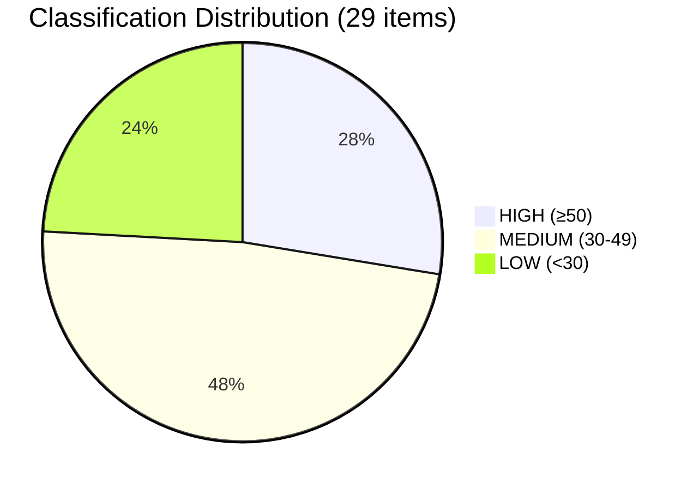

# 🏷️ Political Classification — Legislative Procedures (2026-04-13)

## 📋 Classification Context

| Field | Value |
|-------|-------|
| **Classification ID** | `CLS-2026-04-13-RUN41` |
| **Event Date** | 2026-03-26 (last plenary) / 2026-04-13 (analysis) |
| **EP Calendar** | Easter Recess Day 18/18 — Parliament returns April 14 |
| **Current EP Status** | RECESS |
| **Override Applied** | No (recess standard rules) |

## 🔬 Item-Level Classification

### 1. US Tariff Countermeasures (TA-10-2026-0096)

| Dimension | Score | Level |
|-----------|:-----:|-------|
| Sensitivity | 🟡 SENSITIVE | Trade retaliatory measure with geopolitical implications |
| Primary Domain | INTA (International Trade) | |
| Secondary Domain | ECON (Economic Affairs) | |
| Urgency | 🟠 URGENT | April 15 implementation deadline |
| Impact Scope | 🌍 INTERNATIONAL | US-EU trade relations |
| Public Interest | 75/100 | SENSITIVE — direct consumer price impact |
| Democratic Integrity | 55/100 | MODERATE — fast-track procedure, limited scrutiny window |
| Policy Urgency | 85/100 | IMMEDIATE — deadline-driven |
| Economic Impact | 80/100 | MAJOR — tariff adjustments affect multiple sectors |
| Governance Impact | 60/100 | SIGNIFICANT — trade defense competence exercise |
| Political Capital | 65/100 | SIGNIFICANT — tests EU trade autonomy narrative |
| Legislative Impact | 55/100 | REGULATION — direct applicability |
| **Weighted Score** | **68.5** | **HIGH** |
| **Coalition Impact** | Stabilising → | EPP+S&D+Renew united on trade defence |

**Political Temperature Index**: 72/100 (HIGH)
- Partisan Charge: 12/20 (ECR supports, Greens/EFA cautious on escalation)
- Institutional Impact: 15/20 (Commission trade defense activation)
- Media Amplification: 16/20 (tariff wars dominate news cycles)
- Public Salience: 14/20 (consumer prices, industrial jobs)
- Temporal Pressure: 15/20 (April 15 deadline imminent)

### 2. Banking Resolution Reform — SRMR3 (TA-10-2026-0092)

| Dimension | Score | Level |
|-----------|:-----:|-------|
| Sensitivity | 🟢 PUBLIC | Technical financial regulation |
| Primary Domain | ECON (Economic & Monetary Affairs) | |
| Urgency | 🔵 ELEVATED | Trilogue phase pending |
| Impact Scope | 🇪🇺 EU-WIDE | Banking Union completion |
| Public Interest | 50/100 | STANDARD — indirect citizen impact |
| Democratic Integrity | 45/100 | MODERATE — complex trilogue dynamics |
| Policy Urgency | 60/100 | SHORT-TERM — Council position pending |
| Economic Impact | 75/100 | MAJOR — €50bn+ resolution fund implications |
| Governance Impact | 70/100 | SIGNIFICANT — Banking Union institutional architecture |
| Political Capital | 55/100 | NOTABLE — tests German-led opposition to deposit mutualisation |
| Legislative Impact | 70/100 | DIRECTIVE — transposition required |
| **Weighted Score** | **60.0** | **HIGH** |
| **Coalition Impact** | Opportunity ↗ | EPP-S&D cooperation on financial stability |

### 3. Anti-Corruption Directive (TA-10-2026-0094)

| Dimension | Score | Level |
|-----------|:-----:|-------|
| Sensitivity | 🟡 SENSITIVE | Member state compliance implications |
| Primary Domain | LIBE (Civil Liberties) | |
| Secondary Domain | JURI (Legal Affairs) | |
| Urgency | 🔵 ELEVATED | 24-month transposition clock started |
| Impact Scope | 🇪🇺 EU-WIDE | Harmonized anti-corruption framework |
| Public Interest | 70/100 | SENSITIVE — public integrity concerns |
| Policy Urgency | 55/100 | MEDIUM-TERM — transposition period |
| Economic Impact | 55/100 | MODERATE — compliance costs for MS |
| Governance Impact | 65/100 | SIGNIFICANT — rule of law instrument |
| Political Capital | 60/100 | SIGNIFICANT — rule of law politics |
| Legislative Impact | 65/100 | DIRECTIVE — first EU-wide anti-corruption directive |
| **Weighted Score** | **61.5** | **HIGH** |

### 4. EU Talent Pool (TA-10-2026-0058)

| Dimension | Score | Level |
|-----------|:-----:|-------|
| Sensitivity | 🟢 PUBLIC | Labour market regulation |
| Primary Domain | EMPL (Employment & Social Affairs) | |
| Urgency | ⚪ ROUTINE | Implementation phase |
| Impact Scope | 🇪🇺 EU-WIDE | Cross-border labour mobility |
| Public Interest | 60/100 | Skills shortages highly relevant |
| Economic Impact | 65/100 | MODERATE — labour market efficiency |
| **Weighted Score** | **52.0** | **MEDIUM** |

### 5. Copyright & Generative AI (TA-10-2026-0066)

| Dimension | Score | Level |
|-----------|:-----:|-------|
| Sensitivity | 🟡 SENSITIVE | Tech sector tensions |
| Primary Domain | JURI (Legal Affairs) | |
| Secondary Domain | ITRE (Industry) | |
| Urgency | 🔵 ELEVATED | AI Act implementation overlap |
| Impact Scope | 🌍 INTERNATIONAL | Global AI governance signal |
| Public Interest | 75/100 | AI regulation highly salient |
| Economic Impact | 70/100 | MAJOR — creative industries + tech sector |
| **Weighted Score** | **58.5** | **HIGH** |

## 📊 Classification Distribution

## 🎯 Recommended Actions

| Item | Score | Action |
|------|:-----:|--------|
| US Tariff Countermeasures | 68.5 | 📰 **Priority Publish** — deadline urgency |
| Anti-Corruption Directive | 61.5 | 📰 Publish — rule of law significance |
| Banking Union SRMR3 | 60.0 | 📰 Publish — financial stability package |
| Copyright & AI | 58.5 | 📰 Publish — tech regulation relevance |
| EU Talent Pool | 52.0 | 📋 Monitor — implementation phase |

## 🔗 Cross-Reference with Prior Coverage

Per editorial context, April 10 propositions article covered "Trade and Banking Reform Contest for Committee Attention." Today's analysis advances this thread with:
- **Updated urgency**: April 15 tariff deadline now 2 days away (was 5 days)
- **New context**: Easter recess ends tomorrow — first committee meetings imminent
- **Pipeline evolution**: 13 new 2026 COD procedures identified in pipeline (vs. general references before)
