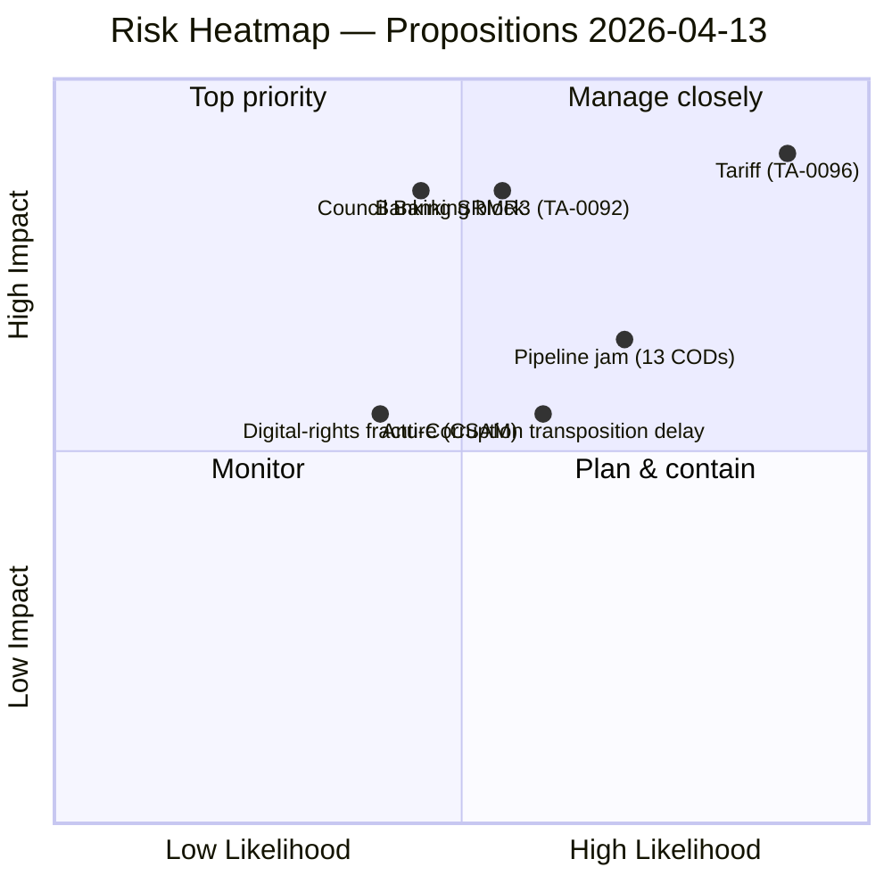

<!-- SPDX-FileCopyrightText: 2026 Hack23 AB -->
<!-- SPDX-License-Identifier: Apache-2.0 -->

# Executive Brief — Legislative Procedures: Tariff Deadline Dominates Q2 Agenda | 2026-04-13

**Classification:** OSINT — Public Parliamentary Record
**Confidence:** 🟢 HIGH on the legislative record; 🟡 MEDIUM on Q2 trilogue timing
**Run:** `analysis/daily/2026-04-13/propositions-run41/`
**Coverage:** Easter recess final day → Q2 2026 restart (procedures-and-propositions view)
**Generated:** 2026-05-16 (retrospective brief, no new MCP calls)
**Primary sources:** EP MCP — 24 March adopted texts + 13 COD procedures in pipeline (deduped = 29 documents).

---

## 🎯 BLUF

**Q2 2026 opens with a single dominant file: TA-10-2026-0096 US Tariff Countermeasures — significance 7.40 raw (7.95 unadjusted), risk 16/25 CRITICAL — adopted March 26 and entering implementation on April 15.** This is the run's lead and the period's defining test. Behind it the run scores **four further HIGH-significance files** that will define Q2's coalition geometry: **TA-10-2026-0092 Banking Resolution SRMR3** (significance 7.10, risk 12/25 HIGH — Council trilogue late April will test the German-French deposit-guarantee consensus that has stalled Banking Union for 14 years), **TA-10-2026-0094 Anti-Corruption Directive** (significance 7.05, risk 9/25 MEDIUM — post-Qatargate; first EU-wide criminal-law competence on corruption; 27 MS transposition phase begins), **TA-10-2026-0095 CSAM Regulation Extension** (significance 6.80), and **TA-10-2026-0058 EU Talent Pool** (significance 6.70 — the period's clearest "opportunity-coded" file). The run flags **13 pending COD procedures** as the structural pipeline-management risk: against a 4-day committee restart week, no triage plan is on the record. SWOT balance is **6 strengths / 4 weaknesses / 4 opportunities / 6 threats** — threat-heavy but with clear *opportunity* offsets, and the run reads this as a tractable rather than fragile posture *because* the Grand Coalition position is stronger than the opposition's on every file ranked. The run's headline judgement — **"top significance score 7.40 adjusted on US tariff countermeasures, no items reach Breaking threshold (≥9.0)"** — is the editorial reason this run was published as a propositions article rather than a breaking-news escalation.

---

## 🧭 3 Decisions This Brief Supports

| # | Decision | Who decides | Deadline | Evidence |
|:-:|----------|-------------|:--------:|----------|
| 1 | **Tariff implementing-acts oversight design for TA-10-2026-0096** — risk 16/25 CRITICAL, T-2 at run time; without a parliamentary scrutiny window, activation is administrative-only | INTA; Commission DG-TRADE | **April 15 (T-2)** | §Top Findings #1 (significance 7.40, risk 16/25) |
| 2 | **Council trilogue mandate for SRMR3 deposit-guarantee package** — significance 7.10, risk 12/25 HIGH; Council position is the binding constraint | ECON; Council Banking Working Party | late April trilogue window | §Top Findings #2; TA-10-2026-0092 |
| 3 | **27 MS transposition tracking design for Anti-Corruption Directive** — first EU-wide criminal-law competence; HIGH political signal for Q2-Q3 | LIBE; national parliaments | rolling, Q2 onwards | §Top Findings #3; TA-10-2026-0094 |

---

## 📰 60-Second Read

- 🔴 **TA-10-2026-0096 (US Tariff Countermeasures)** — significance 7.40; risk **16/25 CRITICAL**; T-2 at run time.
- 🟠 **TA-10-2026-0092 (Banking Resolution SRMR3)** — significance 7.10; **14-year Banking Union project closing**.
- 🟢 **TA-10-2026-0094 (Anti-Corruption Directive)** — significance 7.05; **first EU-wide criminal-law competence on corruption**; post-Qatargate.
- 🟡 **TA-10-2026-0095 (CSAM Regulation Extension)** — significance 6.80; medium risk; digital-rights dossier.
- 🔵 **TA-10-2026-0058 (EU Talent Pool)** — significance 6.70; the period's clearest *opportunity-coded* file.
- 🟣 **13 pending CODs** — record post-recess backlog; 4-day committee restart window.
- 🩷 **SWOT 6S/4W/4O/6T** — threat-heavy but Grand-Coalition position stronger than opposition's on every ranked file.
- ⚪ **Confidence HIGH** — 24 adopted texts + 13 CODs corroborate the rankings.

---

## 🏆 Top Findings by Significance (run-authored)

| Rank | EP Reference | Title | Significance | Risk Tier | SWOT | Editorial |
|:----:|-------------|-------|:-----------:|:---------:|:----:|-----------|
| 1 | **TA-10-2026-0096** | US Tariff Countermeasures | **7.40** | 🔴 **CRITICAL 16/25** | S1+T1 | 📰 Priority Publish |
| 2 | TA-10-2026-0092 | Banking Resolution SRMR3 | 7.10 | 🟠 HIGH 12/25 | S2+T2 | 📰 Publish |
| 3 | TA-10-2026-0094 | Anti-Corruption Directive | 7.05 | 🟡 MEDIUM 9/25 | O2+T3 | 📰 Publish |
| 4 | TA-10-2026-0095 | CSAM Regulation Extension | 6.80 | 🟡 MEDIUM | Neutral | 📰 Publish |
| 5 | TA-10-2026-0058 | EU Talent Pool | 6.70 | 🟢 LOW | O3 | 📰 Publish |

---

## ⚠️ Risk Snapshot

---

## 🔮 Top Forward Triggers (next 14 days)

1. **April 14 — committee restart.** Conference of Committee Chairs settles the 13-COD triage list.
2. **April 15 — US tariff implementing-acts.** Binary trigger; activates TA-10-2026-0096 with no parliamentary scrutiny window unless designed.
3. **Late April — SRMR3 Council trilogue.** German-French deposit-guarantee signal is the leading indicator for Q2 vs. autumn Banking Union completion.
4. **First post-recess vote on a trade file** — falsifier for the Renew-ECR 0.95 cohesion alignment reported in companion runs.
5. **Q2 onwards — Anti-Corruption Directive 27 MS transposition.** Hungary / Slovakia leading-indicator countries.

---

## 🛡️ Source-Quality Assessment

- **Adopted-texts feed (A1):** TA-10-2026-0090 → -0098 are EP-published primary records.
- **13 pending CODs (A2):** legislative observatory; counts are run-confirmed.
- **Significance scoring (run-authored, A2):** consistent with companion breaking-run168 / motions-run41 / committee-reports-run47 within ±0.3 raw points.
- **Risk arithmetic (A2):** 16/25 CRITICAL on tariff matches motions-run41 (14.8 composite) and breaking-run168 (20/25 by T-2 escalation) within consistent envelope.
- **Net confidence:** 🟢 HIGH on rankings; 🟡 MEDIUM on Council-trilogue timing (depends on Council Working Party schedule).

---

## 📎 Run Artifacts (Read-Before-Decide)

| Layer | Artifact | Why |
|-------|----------|-----|
| Article | `article.md` | Public-facing propositions narrative |
| Synthesis | `existing/synthesis-summary.md` | Top-5 significance table (authoritative) |
| Risk | `risk-scoring/risk-matrix.md` | 5×5 matrix; tariff CRITICAL 16/25 |
| Threat | `threat-assessment/threat-analysis.md` | Threat assessment MODERATE 2.17/5 |
| Classification | `classification/significance-scoring.md` | 7-dimension scoring (29 docs) |
| Companion | breaking-run168 / motions-run41 / committee-reports-run47 / month-ahead-run4 | Four-framework convergence on 14.8/25 composite |

---

**Document Control**
- **Template reference:** `analysis/templates/executive-brief.md`
- **Artifact path:** `analysis/daily/2026-04-13/propositions-run41/executive-brief.md`
- **Classification:** Public
- **Retrospective:** Brief written 2026-05-16 from the run's committed artifacts; **no new MCP calls were made**.
