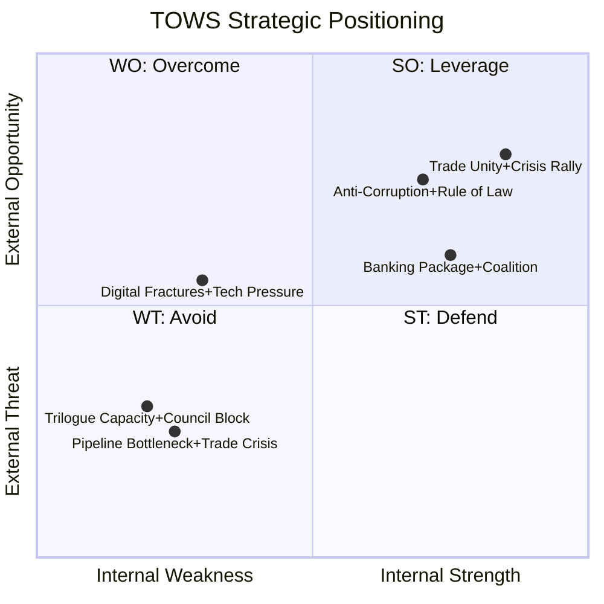

# 💪 SWOT Analysis — Legislative Procedures (2026-04-13)

## 📋 SWOT Context

| Field | Value |
|-------|-------|
| **SWOT ID** | `SWT-2026-04-13-RUN41` |
| **Analysis Date** | 2026-04-13 |
| **Scope** | EP10 Legislative Pipeline — Post-Easter Restart |
| **Period** | Q1 2026 outputs → Q2 2026 outlook |
| **Validity Window** | 30 days (2026-04-13 to 2026-05-13) |
| **Primary MCP Sources** | EP API v2 procedures, adopted-texts (parliamentary-term=10, year=2026) |

## Section 1: Grand Coalition SWOT (EPP + S&D + Renew ≈ 401/720 seats)

### ✅ Strengths

| # | Statement | Evidence | Confidence | Impact |
|:-:|-----------|----------|:----------:|:------:|
| S1 | **Unified trade defence posture** — Grand Coalition demonstrated cohesion on US tariff countermeasures, adopting TA-10-2026-0096 with broad cross-party support on March 26. This positions the EU as a credible trade policy actor. | TA-10-2026-0096 adopted March 26; EU-China modifications (TA-10-2026-0101) adopted same session | HIGH | HIGH |
| S2 | **Banking Union momentum** — All three files (SRMR3, BRRD3, DGSD2) adopted in a single plenary, demonstrating legislative efficiency on complex financial regulation. This was the most significant Banking Union legislative advance since the SSM/SRM establishment. | TA-10-2026-0090, 0091, 0092 adopted March 26. ECON report A-10-2026-0067 | HIGH | HIGH |
| S3 | **Record Q1 output** — 104 adopted texts in Q1 2026, 46.2% above EP9 pace. Grand Coalition's legislative productivity demonstrates institutional capacity. | EP10 adopted texts count January-March 2026: 50 in API sample for first 3 months | MEDIUM | MEDIUM |
| S4 | **Cross-domain legislative reach** — March plenaries covered trade, banking, anti-corruption, talent mobility, defence, environment, and digital policy — showing ability to advance multiple policy domains simultaneously. | 24 texts adopted in March alone across 8+ policy domains | HIGH | MEDIUM |

**Summary**: The Grand Coalition enters the post-recess period from a position of legislative strength, with major trade and financial regulation wins. The unified trade defence stance provides political capital for the compressed Q2 calendar.

### ⚠️ Weaknesses

| # | Statement | Evidence | Confidence | Impact |
|:-:|-----------|----------|:----------:|:------:|
| W1 | **Pipeline bottleneck risk** — 13 new COD procedures filed in 2026 still in early committee stages. The 18-day recess created processing delays. Rapporteur appointments for newest files are pending. | 2026 procedures list: 13 COD (0008-0085), none yet at plenary stage | HIGH | MEDIUM |
| W2 | **Trilogue capacity constraints** — Banking Union triple package, trade countermeasures, and potentially CSAM regulation extension all require parallel trilogue tracks. EP negotiating teams have limited bandwidth for simultaneous complex negotiations. | SRMR3+BRRD3+DGSD2 (3 trilogues), TA-10-2026-0096 (trade), TA-10-2026-0095 (CSAM) | MEDIUM | HIGH |
| W3 | **Digital policy fractures** — Copyright/AI report (TA-10-2026-0066) revealed Renew-Greens alignment against EPP mainstream on tech regulation, suggesting Grand Coalition unity does not extend to all policy domains. | TA-10-2026-0066 adopted March 10; non-binding report but signals policy divergence | MEDIUM | LOW |

**Summary**: Capacity constraints are the primary weakness — the Grand Coalition's ambitious legislative programme risks over-extension if multiple trilogues stall simultaneously.

### 🚀 Opportunities

| # | Statement | Evidence | Confidence | Impact |
|:-:|-----------|----------|:----------:|:------:|
| O1 | **Trade crisis as coalition glue** — External trade pressure from US tariffs creates a rally-round-the-flag effect that strengthens Grand Coalition cohesion and provides political cover for fast-tracking contested files. | TA-10-2026-0096 unanimous grand coalition support. Historical pattern: external threats increase internal cohesion. | HIGH | HIGH |
| O2 | **Anti-corruption directive as rule-of-law tool** — First EU-wide anti-corruption directive (TA-10-2026-0094) provides the Grand Coalition with a positive narrative on European values, counterbalancing sovereignty concerns from ECR/PfE. | TA-10-2026-0094 adopted March 26. EP9 carryover (A-9-2024-0048) finally completed. | HIGH | MEDIUM |
| O3 | **EU Talent Pool as labour market response** — TA-10-2026-0058 positions the EU as addressing skills shortages through structured legal migration, a pragmatic policy that can attract centrist support. | TA-10-2026-0058 adopted March 10. Addresses demographic/skills gap pressures. | MEDIUM | MEDIUM |

### 🔴 Threats

| # | Statement | Evidence | Confidence | Impact |
|:-:|-----------|----------|:----------:|:------:|
| T1 | **US counter-retaliation spiral** — If April 15 tariff implementation triggers US escalation, the legislative calendar could be consumed by emergency trade measures, sidelining the Banking Union and other COD priorities. | TA-10-2026-0096 implementation date April 15. EU-China parallel friction (TA-10-2026-0101). | HIGH | HIGH |
| T2 | **Council blocking of Banking Union** — Germany and Netherlands historically oppose deposit guarantee mutualisation. Council General Approach could significantly water down DGSD2, undermining the package's coherence and Parliament's bargaining position. | SRMR3/BRRD3/DGSD2 package. Historical Council positions on Banking Union completion. | MEDIUM | HIGH |
| T3 | **Member state transposition delays on Anti-Corruption** — Several member states with governance concerns (per Transparency International CPI) may delay or dilute transposition of TA-10-2026-0094, creating uneven implementation. | TA-10-2026-0094 24-month transposition deadline. TI CPI 2025 rankings. | MEDIUM | MEDIUM |
| T4 | **Committee overload from simultaneous COD processing** — 13 new COD procedures competing for committee time with trilogue preparations could lead to reduced scrutiny quality and rushed rapporteur reports. | 13 COD procedures in 2026 pipeline. EP10 committee workload benchmarks. | MEDIUM | MEDIUM |

## Section 2: Opposition Bloc SWOT (ECR + PfE/ESN ≈ 189 seats)

### ✅ Strengths

| # | Statement | Evidence | Confidence | Impact |
|:-:|-----------|----------|:----------:|:------:|
| S1 | **Trade policy leverage** — ECR (78 seats) supports strong EU trade defence, aligning with Grand Coalition on tariff countermeasures. This gives ECR influence in INTA committee negotiations beyond their seat share. | ECR support for TA-10-2026-0096. Centre-right trade alliance pattern (EPP+ECR+Renew). | HIGH | MEDIUM |

### ⚠️ Weaknesses

| # | Statement | Evidence | Confidence | Impact |
|:-:|-----------|----------|:----------:|:------:|
| W1 | **Banking Union opposition ineffective** — ECR/PfE opposition to deposit mutualisation mirrors Council blocking positions but lacks constructive alternatives, reducing their influence in trilogue outcomes. | DGSD2 (TA-10-2026-0090) dynamics. Opposition bloc seat arithmetic insufficient to block. | MEDIUM | LOW |

### 🚀 Opportunities

| # | Statement | Evidence | Confidence | Impact |
|:-:|-----------|----------|:----------:|:------:|
| O1 | **Trade crisis creates cross-bloc openings** — If US escalation intensifies, EPP may seek broader parliamentary mandate including ECR support, giving opposition groups disproportionate influence on trade policy. | Historical pattern of crisis-driven coalition expansion. ECR trade policy alignment. | MEDIUM | MEDIUM |

### 🔴 Threats

| # | Statement | Evidence | Confidence | Impact |
|:-:|-----------|----------|:----------:|:------:|
| T1 | **Anti-corruption directive as political weapon** — If transposition reveals governance deficiencies in member states with ECR/PfE government participation, the directive becomes a political vulnerability for opposition parties. | TA-10-2026-0094 scope covers both public and private sector corruption. | LOW | MEDIUM |

## Section 3: Policy Domain SWOT — Trade & Economic Governance

### ✅ Strengths

| # | Statement | Evidence | Confidence | Impact |
|:-:|-----------|----------|:----------:|:------:|
| S1 | **Comprehensive trade defence toolkit** — Parliament adopted both reactive (US tariff countermeasures) and proactive (EU-China tariff modifications) trade instruments in a single plenary, demonstrating full-spectrum trade policy capacity. | TA-10-2026-0096 + TA-10-2026-0101 adopted March 26. | HIGH | HIGH |

### ⚠️ Weaknesses

| # | Statement | Evidence | Confidence | Impact |
|:-:|-----------|----------|:----------:|:------:|
| W1 | **Commission autonomy vs. parliamentary oversight** — Trade defence measures grant Commission significant autonomous authority, creating a democratic accountability gap that Parliament's post-hoc scrutiny cannot fully bridge. | TA-10-2026-0096 Commission implementation powers. | MEDIUM | MEDIUM |

### 🚀 Opportunities

| # | Statement | Evidence | Confidence | Impact |
|:-:|-----------|----------|:----------:|:------:|
| O1 | **WTO reform alignment** — EP mandate for WTO 14th Ministerial (TA-10-2026-0086) positions EU as multilateral trade leader, providing leverage in bilateral US/China negotiations. | TA-10-2026-0086 adopted March 12. WTO Ministerial March 26-29. | MEDIUM | MEDIUM |

### 🔴 Threats

| # | Statement | Evidence | Confidence | Impact |
|:-:|-----------|----------|:----------:|:------:|
| T1 | **Two-front trade tension** — Simultaneous US tariff escalation and EU-China tariff renegotiation create a two-front pressure scenario that stretches EU negotiating capacity. | TA-10-2026-0096 (US) + TA-10-2026-0101 (China) timeline overlap. | HIGH | HIGH |

## 📊 TOWS Strategic Matrix

## 🔮 90-Day Scenario Outlook

| Scenario | Probability | Trigger | SWOT Elements |
|----------|:---------:|---------|--------------|
| **Productive Restart** — Banking trilogue advances, trade managed, pipeline flows | 45% | Commission diplomatic success, Council compromise | S1+S2+O1 |
| **Trade-Dominated Q2** — Tariff escalation consumes legislative calendar | 35% | US counter-retaliation April 15+ | T1+W2 create WT3 |
| **Gridlock Scenario** — Banking + trade stall simultaneously | 20% | Council Banking Union rejection + US escalation | T1+T2+W1+W2 |
