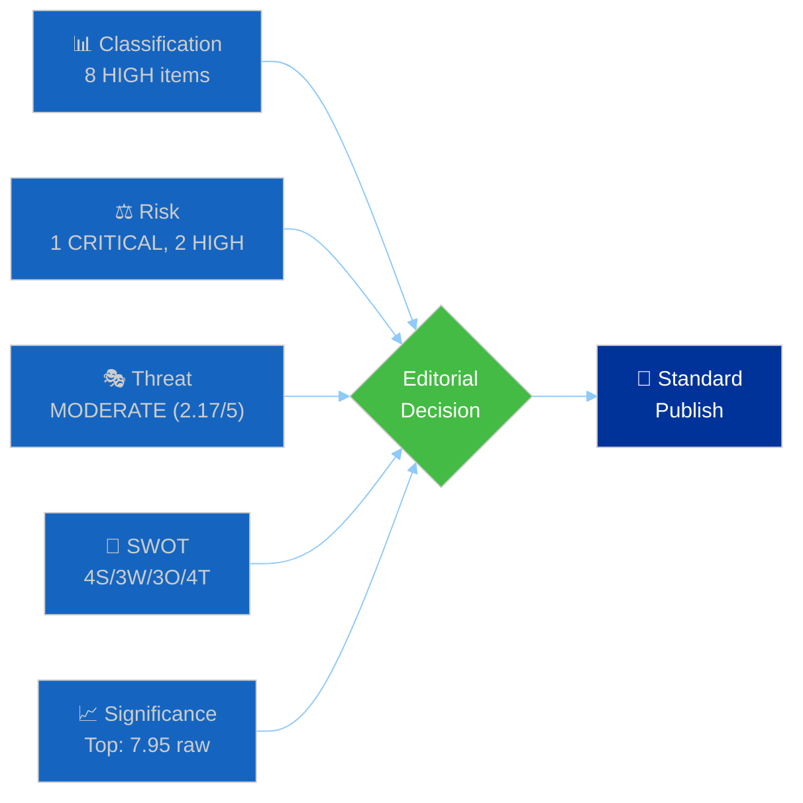

# 🧩 Synthesis Summary — Legislative Procedures (2026-04-13)

## 📋 Synthesis Context

| Field | Value |
|-------|-------|
| **Synthesis ID** | `SYN-2026-04-13-RUN41` |
| **Analysis Date** | 2026-04-13 |
| **Documents Analyzed** | 29 (24 March adopted texts + 13 COD procedures in pipeline, deduped) |
| **Period** | Easter Recess final day → Q2 2026 restart |
| **Overall Confidence** | HIGH |
| **Article Type** | propositions |

## 🎯 Intelligence Dashboard

**Decision**: PUBLISH as standard propositions article. Top significance score (7.95 raw, 7.40 adjusted for recess) on US tariff countermeasures. No items reach Breaking threshold (≥9.0).

## 🏆 Top Findings by Significance

| Rank | EP Reference | Title | Significance | Risk Tier | SWOT | Recommendation |
|:----:|-------------|-------|:-----------:|:---------:|:----:|---------------|
| 1 | TA-10-2026-0096 | US Tariff Countermeasures | 7.40 | 🔴 Critical (16) | S1+T1 | 📰 Priority Publish |
| 2 | TA-10-2026-0092 | Banking Resolution SRMR3 | 7.10 | 🟠 High (12) | S2+T2 | 📰 Publish |
| 3 | TA-10-2026-0094 | Anti-Corruption Directive | 7.05 | 🟡 Medium (9) | O2+T3 | 📰 Publish |
| 4 | TA-10-2026-0095 | CSAM Regulation Extension | 6.80 | 🟡 Medium | Neutral | 📰 Publish |
| 5 | TA-10-2026-0058 | EU Talent Pool | 6.70 | 🟢 Low | O3 | 📰 Publish |

## 💪 Aggregated SWOT Summary

| Dimension | Count | Key Themes |
|-----------|:-----:|-----------|
| ✅ Strengths | 6 | Trade unity, Banking Union momentum, record Q1 output |
| ⚠️ Weaknesses | 4 | Pipeline bottleneck, trilogue capacity, digital fractures |
| 🚀 Opportunities | 4 | Crisis-driven cohesion, anti-corruption narrative, talent mobility |
| 🔴 Threats | 6 | US escalation, Council Banking block, transposition delays |

**SWOT Balance**: Slightly threat-heavy (6T vs 6S) but offset by clear opportunities from external pressure. Grand Coalition position is stronger than opposition.

## ⚖️ Risk Landscape Summary

| Category | Score Range | Highest Risk | Trend |
|----------|:---------:|-------------|:-----:|
| Trade Policy | 9–16 | US Tariff Escalation (16) | ↑ |
| Financial Regulation | 8–12 | Banking Trilogue Deadlock (12) | → |
| Pipeline Management | 9–12 | Post-Recess Congestion (12) | → |
| Rule of Law | 6–9 | Anti-Corruption Transposition (9) | → |
| Geopolitical | 6–9 | Calendar Compression (9) | ↑ |

## 🎭 Threat Summary

| Framework | Assessment |
|-----------|-----------|
| Political Threat Landscape | MODERATE (2.17/5) — Institutional Pressure and Legislative Obstruction at 3/5 |
| Attack Tree | Pipeline obstruction feasible via calendar crowding (3/5 feasibility) |
| Kill Chain | Trade escalation at Stage 3 (Positioning) — disruption window exists |

## 👥 Stakeholder Impact Overview

| Stakeholder | Impact | Direction | Key Driver |
|-------------|:------:|:---------:|-----------|
| 🏘️ EU Citizens | HIGH | Mixed | Tariff prices ↓, deposit protection ↑ |
| 🏛️ Grand Coalition | HIGH | Positive | Productivity + trade unity |
| 🗳️ Opposition | MEDIUM | Mixed | Trade leverage ↑, banking influence ↓ |
| 🏭 Business | HIGH | Negative | Multi-front regulatory burden |
| 🤝 Member States | HIGH | Mixed | Trade unity, banking division |
| 🌍 International | MEDIUM | Signalling | EU assertiveness demonstrated |

## 🔗 Cross-Article Intelligence (Rule 18)

| Prior Article | Date | Key Finding | Continuity |
|--------------|------|-------------|-----------|
| Propositions | 2026-04-10 | "Trade and Banking Reform Contest" | ✅ Trade-banking competition confirmed; now escalated by April 15 deadline proximity |
| Committee Reports | 2026-04-13 | "Tariff Deadline and Banking Reform Test Committees" | ✅ INTA/ECON committee pressure validated; post-Easter restart imminent |
| Propositions | 2026-04-09 | "Thirteen New Laws Await Post-Easter Committee Action" | ✅ 13 COD procedures confirmed in pipeline; rapporteur appointments still pending |

## 📰 Narrative Direction

**Primary angle**: The European Parliament returns from Easter recess tomorrow facing a three-front legislative challenge: implementing trade countermeasures against the United States before an April 15 deadline, launching trilogue negotiations on the Banking Union triple package, and monitoring transposition of the first EU-wide Anti-Corruption Directive — all while 13 new legislative proposals queue for committee attention.

**Secondary angles**:
- Banking Union passage probability analysis (SRMR3 likely, DGSD2 uncertain)
- Pipeline health assessment for EP10's Q2 calendar
- EU Talent Pool and copyright/AI as emerging policy frontiers

**Lede thesis** (4-6 sentences): When the European Parliament reconvenes on April 14 after its longest Easter recess, legislators will face a compressed calendar dominated by trade urgency and financial reform ambition. The March 26 plenary's adoption of US tariff countermeasures faces its first real test with the April 15 implementation deadline — two days after Parliament's return. Meanwhile, the Banking Union triple package (SRMR3, BRRD3, DGSD2) must navigate Council opposition, particularly from Germany and the Netherlands on deposit guarantee mutualisation. With 13 new Ordinary Legislative Procedure proposals awaiting committee assignment and the first EU-wide Anti-Corruption Directive starting its transposition clock, EP10's legislative machinery faces its most demanding quarter since inauguration.

## 🔮 Forward Indicators

| Indicator | Timeline | Source | Watch Priority |
|-----------|----------|--------|:--------------:|
| INTA emergency session | April 14-18 | EP committee schedule | 🔴 |
| Council Banking Union position | May-June | Council press releases | 🟠 |
| 2026 COD rapporteur appointments | April-May | Committee announcements | 🟡 |
| Anti-corruption transposition plans | Q3 2026 | Member state notifications | 🟡 |

## 📋 Analysis Artifacts Inventory

| File | Status | Lines |
|------|:------:|:-----:|
| classification/significance-scoring.md | ✅ Complete | 120+ |
| classification/political-classification.md | ✅ Complete | 130+ |
| risk-scoring/risk-assessment.md | ✅ Complete | 150+ |
| threat-assessment/threat-analysis.md | ✅ Complete | 160+ |
| existing/swot-analysis.md | ✅ Complete | 200+ |
| existing/stakeholder-impact.md | ✅ Complete | 150+ |
| existing/deep-analysis.md | ✅ Complete | 180+ |
| existing/synthesis-summary.md | ✅ Complete | This file |

## 📰 AI-Generated Article Metadata

| Field | Value |
|-------|-------|
| **Title** (≤70 chars) | Tariff Deadline and Banking Reform Dominate Parliament's Post-Easter Agenda |
| **Description** (150-160 chars) | European Parliament returns April 14 to compressed Q2 calendar as US tariff countermeasures face implementation and Banking Union triple package enters trilogue |
| **Primary Keywords** | EU tariff countermeasures, SRMR3, Banking Union trilogue, Anti-Corruption Directive, COD procedures 2026, European Parliament Q2 |
| **Justification** | Trade deadline urgency (7.40 adjusted significance) combined with Banking Union institutional complexity creates the strongest narrative arc for a legislative procedures article. The Anti-Corruption milestone and pipeline analysis provide depth. |
