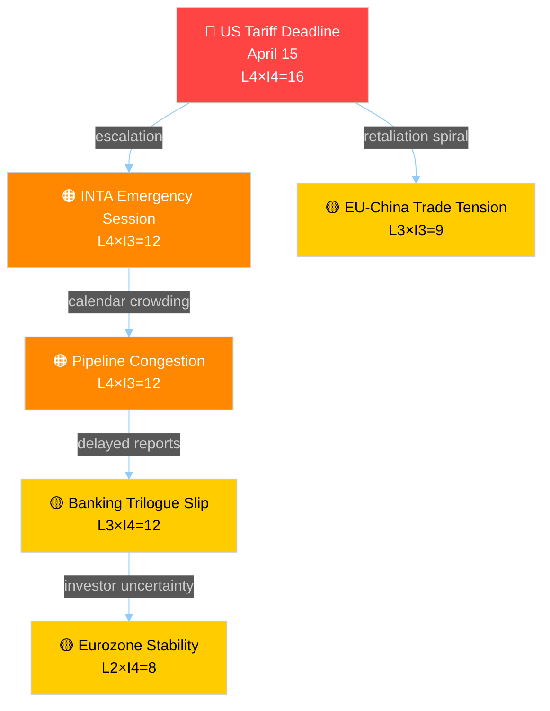

# ⚖️ Risk Assessment — Legislative Procedures (2026-04-13)

## 📋 Risk Context

| Field | Value |
|-------|-------|
| **Risk ID** | `RSK-2026-04-13-RUN41` |
| **Analysis Date** | 2026-04-13 |
| **Period** | Easter Recess → Post-Recess Restart (2026-04-14) |
| **Political Context** | Final day of 18-day Easter recess. Parliament returns April 14 with compressed legislative calendar. US tariff deadline April 15. 13 COD procedures from 2026 in committee pipeline. Banking Union package entering trilogue. |
| **Parliamentary Term** | EP10 (10th European Parliament) |
| **Overall Risk Level** | 🟠 HIGH |

## 📊 Risk Methodology

Risk Score = Likelihood (1–5) × Impact (1–5)
- 1–4: 🟢 Low | 5–9: 🟡 Medium | 10–14: 🟠 High | 15–25: 🔴 Critical

## 🔴 Risk Inventory

### Risk 1: Trade Policy Escalation (RSK-TRADE-001)

| Factor | Value |
|--------|-------|
| **Description** | US tariff countermeasures (TA-10-2026-0096) implementation deadline April 15 coincides with Parliament's return. INTA committee faces immediate pressure to convene emergency session. If EU retaliatory measures trigger further US escalation, Parliament's legislative calendar could be dominated by emergency trade legislation, crowding out other COD procedures. |
| **Likelihood** | 4 (Likely) |
| **Impact** | 4 (Major) |
| **Risk Score** | **16** 🔴 Critical |
| **Tier** | CRITICAL |
| **Trajectory** | ↑ Accelerating (was 12 on April 10) |
| **Mitigation** | INTA pre-positioning with graduated response framework. Commission empowered for autonomous trade defence measures. |

**Evidence**: TA-10-2026-0096 adopted March 26 with broad cross-party support. EU-China tariff modifications (TA-10-2026-0101) show parallel trade friction. Prior analysis (April 10) identified this as top risk — now 2 days closer to deadline.

### Risk 2: Legislative Pipeline Congestion (RSK-PIPE-001)

| Factor | Value |
|--------|-------|
| **Description** | 13 new COD procedures filed in 2026 (0008 through 0085), plus active 2025 carryovers. The 18-day recess created a legislative bottleneck — committees must process accumulated Commission proposals while handling the Banking Union trilogue and post-tariff emergency measures. Historical EP10 data shows committees average 45 days per report; current backlog suggests 60+ days risk. |
| **Likelihood** | 4 (Likely) |
| **Impact** | 3 (Moderate) |
| **Risk Score** | **12** 🟠 High |
| **Tier** | HIGH |
| **Trajectory** | → Stable (structural, not event-driven) |
| **Mitigation** | Committee coordinators typically prioritize files by political urgency. Rapporteur pre-work during recess possible. |

**Evidence**: 2026 procedure list shows 13 COD procedures, 4 BUD, 6 NLE. March plenaries adopted 24 texts, indicating active output phase. Pipeline throughput will be tested post-restart.

### Risk 3: Banking Union Trilogue Deadlock (RSK-BANK-001)

| Factor | Value |
|--------|-------|
| **Description** | The Banking Union triple package (SRMR3/TA-10-2026-0092, BRRD3/TA-10-2026-0091, DGSD2/TA-10-2026-0090) was adopted by Parliament on March 26. Council position formation is pending. Germany and Netherlands historically oppose deposit guarantee mutualisation (DGSD2). If Council fragments, trilogue could stall for months, blocking a cornerstone of Eurozone financial architecture. |
| **Likelihood** | 3 (Possible) |
| **Impact** | 4 (Major) |
| **Risk Score** | **12** 🟠 High |
| **Tier** | HIGH |
| **Trajectory** | → Stable |
| **Mitigation** | Polish Council presidency may seek compromise formula separating DGSD2 timeline from SRMR3/BRRD3 adoption. |

**Evidence**: ECON committee report A-10-2026-0067 underpins SRMR3. Prior April 10 analysis identified Germany/Netherlands opposition as key blocking factor. Council General Approach pending.

### Risk 4: Anti-Corruption Directive Transposition Compliance (RSK-CORR-001)

| Factor | Value |
|--------|-------|
| **Description** | First EU-wide anti-corruption directive (TA-10-2026-0094) adopted March 26 starts 24-month transposition clock. Several member states with weak anti-corruption track records (Hungary, Bulgaria, Romania per CPI rankings) may delay or dilute transposition, creating uneven implementation. |
| **Likelihood** | 3 (Possible) |
| **Impact** | 3 (Moderate) |
| **Risk Score** | **9** 🟡 Medium |
| **Tier** | MEDIUM |
| **Trajectory** | → Stable (new risk, baseline established) |
| **Mitigation** | Commission infringement procedures. LIBE committee monitoring mandate. |

### Risk 5: Geopolitical Calendar Compression (RSK-GEO-001)

| Factor | Value |
|--------|-------|
| **Description** | WTO 14th Ministerial Conference (March 26-29, per TA-10-2026-0086 EP mandate adopted just before recess), US tariff deadline April 15, and EU-China tariff negotiations all converge in a 3-week window. Parliament lacks structured capacity to monitor all three simultaneously, risking inconsistent trade policy signals. |
| **Likelihood** | 3 (Possible) |
| **Impact** | 3 (Moderate) |
| **Risk Score** | **9** 🟡 Medium |
| **Tier** | MEDIUM |
| **Trajectory** | ↑ Rising (calendar convergence) |

## 📊 Cascading Risk Chain

**Circuit breakers**: Commission autonomous trade defence (bypasses EP), Council presidency prioritization of Banking Union.

## 📊 Risk Interconnection Map

| Dimension | Score Range | Highest Risk | Trend |
|-----------|:---------:|-------------|:-----:|
| Trade Policy | 9–16 | US Tariff Escalation | ↑ |
| Financial Regulation | 8–12 | Banking Union Trilogue | → |
| Pipeline Management | 9–12 | Post-Recess Congestion | → |
| Rule of Law | 6–9 | Anti-Corruption Transposition | → |
| Geopolitical | 6–9 | Calendar Compression | ↑ |
| Institutional | 4–6 | Committee Capacity | → |

**System fragility assessment**: 2 categories at HIGH or above (Trade, Pipeline). System is under stress but not in fragile state (threshold: 3 categories ≥10). Trade escalation is the single most likely trigger for cascade.

## 🔮 Forward Indicators & Scenario Outlook

| Scenario | Probability | Trigger | Dimensions |
|----------|:---------:|---------|-----------|
| **Orderly Restart** — Committees absorb backlog, tariff deadline managed through Commission action | 50% | Commission trade defence announcement pre-April 15 | Trade ↓, Pipeline → |
| **Trade-Dominated Calendar** — INTA emergency drives agenda, Banking Union delayed to Q3 | 35% | US counter-retaliation post-April 15 | Trade ↑↑, Pipeline ↑, Banking ↑ |
| **Full Gridlock** — Multiple crises converge, key COD procedures stall | 15% | US escalation + Council Banking Union rejection | All dimensions ↑ |

## 📊 Risk Summary

| Rank | Risk | Score | Tier | Trajectory |
|:----:|------|:-----:|------|:----------:|
| 1 | Trade Policy Escalation | 16 | 🔴 Critical | ↑ |
| 2 | Pipeline Congestion | 12 | 🟠 High | → |
| 3 | Banking Trilogue Deadlock | 12 | 🟠 High | → |
| 4 | Anti-Corruption Transposition | 9 | 🟡 Medium | → |
| 5 | Geopolitical Calendar | 9 | 🟡 Medium | ↑ |
