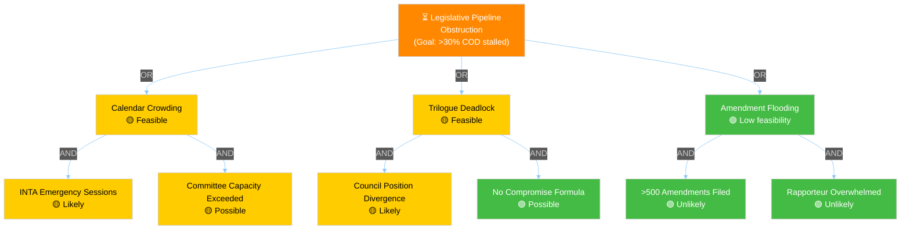

# 🎭 Threat Analysis — Legislative Procedures (2026-04-13)

## 📋 Threat Analysis Context

| Field | Value |
|-------|-------|
| **Threat ID** | `THR-2026-04-13-RUN41` |
| **Analysis Date** | 2026-04-13 |
| **Period** | Easter Recess final day → Post-Recess Q2 2026 |
| **Political Context** | Parliament returns April 14 to compressed legislative calendar. 13 COD procedures pending, Banking Union trilogue ahead, US tariff deadline tomorrow. |
| **Overall Threat Level** | MODERATE (3/5) |

## 🔍 6-Dimension Political Threat Landscape

### 🔄 Coalition Shifts (CS-041)

| Factor | Assessment |
|--------|-----------|
| **Finding** | Grand Coalition (EPP+S&D+Renew ≈401 seats) remains stable on core legislative files. The March 26 plenary demonstrated unified voting on trade defence (TA-10-2026-0096) and Banking Union (TA-10-2026-0092). However, the copyright/AI report (TA-10-2026-0066) showed Renew-Greens alignment against EPP on creator rights, indicating policy-specific fractures are emerging. |
| **Evidence** | March 26 adopted texts show cross-party support on trade/banking; March 10-12 texts show divergence on digital/social policy. EP10 seat distribution: EPP 188, S&D 136, Renew 77 = 401/720. |
| **Severity** | 2/5 — LOW |
| **Trend** | → Stable |

**Dimension Assessment**: Grand Coalition holds on existential issues (trade defence, financial stability). Issue-specific coalitions forming on digital regulation and social policy — normal EP dynamics, not structural threat. 🟢 Confidence: HIGH.

### 🔍 Transparency Deficit (TD-041)

| Factor | Assessment |
|--------|-----------|
| **Finding** | The SRMR3/BRRD3/DGSD2 trilogue will involve complex financial regulation negotiations. Historical pattern: Banking Union trilogues have limited public accessibility. Combined with post-recess compressed schedule, transparency risks are elevated. Better Regulation report (TA-10-2026-0063) noted scrutiny gaps. |
| **Evidence** | TA-10-2026-0063 (Better Regulation report) adopted March 10. ECON committee report A-10-2026-0067 forms trilogue mandate. |
| **Severity** | 2/5 — LOW |
| **Trend** | → Stable |

### ↩️ Policy Reversal (PR-041)

| Factor | Assessment |
|--------|-----------|
| **Finding** | No immediate policy reversal threats identified. The Anti-Corruption Directive (TA-10-2026-0094) represents a forward step in rule of law policy. However, if transposition encounters resistance from member states with governance concerns, partial rollback through weak implementation is possible. The CSAM Regulation extension (TA-10-2026-0095, extending Reg 2021/1232) signals continuity rather than reversal. |
| **Evidence** | TA-10-2026-0094 adopted from EP9 carryover report A-9-2024-0048. TA-10-2026-0095 is a technical extension maintaining status quo. |
| **Severity** | 2/5 — LOW |
| **Trend** | → Stable |

### 🏛️ Institutional Pressure (IP-041)

| Factor | Assessment |
|--------|-----------|
| **Finding** | EP-Council tension likely on two fronts: (1) Banking Union package — EP adopted ambitious position on all three files; Council (particularly Germany/Netherlands) may push back significantly on deposit mutualisation; (2) Trade countermeasures — Commission's autonomous trade defence authority vs. EP's desire for democratic oversight of retaliatory measures. The European Semester report (TA-10-2026-0076) also sets up EP-Council friction on social spending priorities. |
| **Evidence** | SRMR3 (TA-10-2026-0092) adopted alongside BRRD3 and DGSD2. TA-10-2026-0076 (European Semester for 2026). Commission trade defence activation under TA-10-2026-0096. |
| **Severity** | 3/5 — MODERATE |
| **Trend** | ↑ Rising (post-recess institutional calendar converges) |

### ⏳ Legislative Obstruction (LO-041)

| Factor | Assessment |
|--------|-----------|
| **Finding** | Primary obstruction risk is calendar-driven, not political. 13 new 2026 COD procedures need committee assignment and rapporteur appointment post-recess. The compressed Q2 calendar (Parliament returns April 14, next plenary likely late April) creates a bottleneck. Additionally, if INTA emergency trade sessions consume committee time, other files will queue. Amendment density monitoring needed for the newer COD files. |
| **Evidence** | 2026 procedure list: 13 COD procedures (0008-0085). EP10 committee calendar: April-July session. Prior analysis noted 45-day average committee processing time. |
| **Severity** | 3/5 — MODERATE |
| **Trend** | ↑ Rising (post-recess backlog accumulation) |

### 📉 Democratic Erosion (DE-041)

| Factor | Assessment |
|--------|-----------|
| **Finding** | No active democratic erosion threats in the legislative pipeline. The immunity waiver cases (TA-10-2026-0087, 0088 for Grzegorz Braun; 0089 for Nikos Pappas) were processed through standard JURI committee procedures, demonstrating institutional functioning. EU enlargement strategy (TA-10-2026-0077) reaffirmed democratic conditionality for candidate countries. |
| **Evidence** | Immunity waivers adopted March 26. TA-10-2026-0077 (EU enlargement strategy) adopted March 11. |
| **Severity** | 1/5 — MINIMAL |
| **Trend** | → Stable |

## 📊 Threat Landscape Summary

| Dimension | Severity | Trend | Key Driver |
|-----------|:--------:|:-----:|-----------|
| Coalition Shifts | 2 | → | Digital policy fractures |
| Transparency Deficit | 2 | → | Banking trilogue opacity |
| Policy Reversal | 2 | → | Anti-corruption transposition |
| Institutional Pressure | 3 | ↑ | EP-Council Banking Union tension |
| Legislative Obstruction | 3 | ↑ | Post-recess pipeline bottleneck |
| Democratic Erosion | 1 | → | No active threats |

**Overall**: MODERATE (weighted average 2.17). Two dimensions at MODERATE with rising trends (Institutional Pressure, Legislative Obstruction) warrant monitoring. No SEVERE or HIGH threats identified.

## 🌳 Attack Tree — Legislative Pipeline Obstruction

**Cheapest attack path**: Calendar crowding via INTA emergency + committee capacity strain. Feasibility: 3/5. Detectability: 5/5 (visible in public committee schedules). Political cost: LOW (framed as "responding to crisis").

## 🔮 Forward Indicators

| Indicator | Timeline | Trigger Condition | Watch Priority |
|-----------|----------|-------------------|:--------------:|
| INTA emergency session called | April 14-18 | US tariff retaliation announced | 🔴 |
| ECON trilogue mandate confirmed | April-May | Council General Approach on Banking Union | 🟠 |
| Committee rapporteur appointments for 2026 CODs | April 14-30 | Conference of Committee Chairs meets | 🟡 |
| Amendment filing deadline for key files | May-June | Committee work programmes published | 🟡 |

## 🗡️ Kill Chain Assessment — Trade Escalation

| Stage | Status | Evidence | Disruption Opportunity |
|-------|--------|---------|----------------------|
| Reconnaissance | ✅ Complete | US tariff announcements, EU impact assessments | N/A (already complete) |
| Mobilization | ✅ Complete | TA-10-2026-0096 adopted (EU countermeasures) | N/A |
| Positioning | 🔄 Active | April 15 implementation date set | Diplomatic channels, WTO dispute |
| Execution | ⏳ Pending | Counter-tariff activation | Commission flexibility on scope/timing |
| Exploitation | ⏳ Pending | Potential US counter-retaliation | Rapid INTA response framework |

**Assessment**: Kill chain is at Stage 3 (Positioning). Disruption opportunity exists at Stages 4-5 through Commission diplomatic action or graduated implementation. 🟡 Confidence: MEDIUM.
