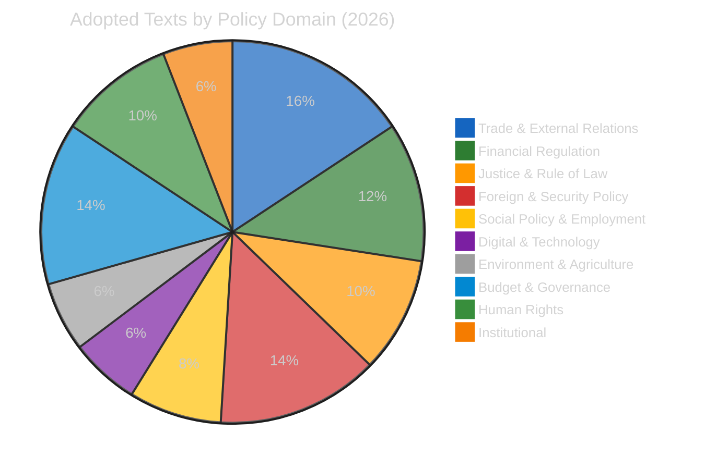

# 🏷️ Political Classification — Key Adopted Texts (14 April 2026)

---

## 📋 Classification Context

| Field | Value |
|-------|-------|
| **Classification ID** | CLS-2026-04-14-169 |
| **Date** | 2026-04-14 00:25 UTC |
| **Methodology** | 7-dimension political classification |
| **Items Classified** | 8 key adopted texts (from 51 total 2026 texts) |

---

## 📊 Classification Dashboard

---

## 📋 Key Text Classifications

### TA-10-2026-0096: US Tariff Countermeasures

| Dimension | Classification | Score | Confidence |
|-----------|---------------|-------|------------|
| **Policy Domain** | Trade & External Relations | — | 🟢 High |
| **Political Sensitivity** | 🔴 RESTRICTED | 9/10 | 🟢 High |
| **Coalition Impact** | 🔴 HIGH | Cross-cutting: PPE supports, ECR divided | 🟡 Medium |
| **Legislative Stage** | ✅ Adopted (26 March 2026) | Implementation pending | 🟢 High |
| **External Impact** | 🔴 CRITICAL | €15-20bn bilateral trade; US-EU relations | 🟡 Medium |
| **Urgency** | 🔴 IMMEDIATE | Implementation deadline April 15 | 🟢 High |
| **Historical Precedent** | UNPRECEDENTED | First EP-authorized US countermeasures in EP10 | 🟢 High |

**Classification narrative:** This is the most politically consequential adopted text of the EP10 term to date. The tariff countermeasures represent a fundamental shift in EU trade policy posture — from reactive complaint to proactive retaliation. The cross-cutting political dynamics (PPE trade defence hawks vs ECR Atlantic alliance moderates vs S&D worker protection advocates) create a unique three-way coalition stress test. 🟢 High confidence.

### TA-10-2026-0092: SRMR3 Banking Reform

| Dimension | Classification | Score | Confidence |
|-----------|---------------|-------|------------|
| **Policy Domain** | Financial Regulation | — | 🟢 High |
| **Political Sensitivity** | 🟡 SENSITIVE | 7/10 | 🟢 High |
| **Coalition Impact** | 🟡 MODERATE | PPE-S&D-Renew aligned; ECR skeptical | 🟡 Medium |
| **Legislative Stage** | ✅ EP Position Adopted → Trilogue | — | 🟢 High |
| **External Impact** | 🟡 MODERATE | Banking sector stability; ECB role | 🟡 Medium |
| **Urgency** | 🟠 HIGH | Trilogue window late April | 🟡 Medium |
| **Historical Precedent** | CONTINUATION | Banking Union project since 2012 | 🟢 High |

### TA-10-2026-0094: Anti-Corruption Directive

| Dimension | Classification | Score | Confidence |
|-----------|---------------|-------|------------|
| **Policy Domain** | Justice & Rule of Law | — | 🟢 High |
| **Political Sensitivity** | 🟡 SENSITIVE | 7/10 | 🟢 High |
| **Coalition Impact** | 🟡 MODERATE | Broad support; ECR resistance on enforcement | 🟡 Medium |
| **Legislative Stage** | ✅ EP Position Adopted → Final Endorsement | — | 🟢 High |
| **External Impact** | 🟡 MODERATE | EU credibility; Transparency International support | 🟢 High |
| **Urgency** | 🟡 MEDIUM | Late April plenary window | 🟡 Medium |
| **Historical Precedent** | LANDMARK | First comprehensive EU anti-corruption framework | 🟢 High |

### TA-10-2026-0066: Copyright & Generative AI

| Dimension | Classification | Score | Confidence |
|-----------|---------------|-------|------------|
| **Policy Domain** | Digital & Technology | — | 🟢 High |
| **Political Sensitivity** | 🟡 SENSITIVE | 6/10 | 🟡 Medium |
| **Coalition Impact** | 🟢 LOW | Broadly consensual | 🟡 Medium |
| **Urgency** | 🟢 LOW | Adopted March 10 — implementation phase | 🟢 High |

### TA-10-2026-0079: Defence Single Market

| Dimension | Classification | Score | Confidence |
|-----------|---------------|-------|------------|
| **Policy Domain** | Foreign & Security Policy | — | 🟢 High |
| **Political Sensitivity** | 🟡 SENSITIVE | 6/10 | 🟡 Medium |
| **Coalition Impact** | 🟡 MODERATE | PPE-ECR aligned; Greens/Left skeptical | 🟡 Medium |
| **Urgency** | 🟡 MEDIUM | Adopted March 11 — awaiting Council | 🟡 Medium |

### TA-10-2026-0077: EU Enlargement Strategy

| Dimension | Classification | Score | Confidence |
|-----------|---------------|-------|------------|
| **Policy Domain** | External Relations | — | 🟢 High |
| **Political Sensitivity** | 🟡 SENSITIVE | 6/10 | 🟢 High |
| **Coalition Impact** | 🟡 MODERATE | PPE-S&D supportive; ECR cautious on timeline | 🟡 Medium |
| **Urgency** | 🟡 MEDIUM | Strategic direction document — long-term | 🟢 High |

### TA-10-2026-0064: Housing Crisis Resolution

| Dimension | Classification | Score | Confidence |
|-----------|---------------|-------|------------|
| **Policy Domain** | Social Policy | — | 🟢 High |
| **Political Sensitivity** | 🟢 PUBLIC | 6/10 | 🟢 High |
| **Coalition Impact** | 🟢 LOW | Near-universal concern | 🟢 High |
| **Urgency** | 🟡 MEDIUM | Resolution — implementation depends on Commission | 🟡 Medium |

### TA-10-2026-0078: EU-Canada Enhanced Cooperation

| Dimension | Classification | Score | Confidence |
|-----------|---------------|-------|------------|
| **Policy Domain** | External Relations | — | 🟢 High |
| **Political Sensitivity** | 🟡 SENSITIVE | 5/10 | 🟡 Medium |
| **Coalition Impact** | 🟢 LOW | Broadly supportive in context of US tensions | 🟡 Medium |
| **Urgency** | 🟡 MEDIUM | Geopolitical context — Canada sovereignty threats | 🟡 Medium |

---

## 📊 Procedure Type Distribution (2026)

| Type | Count | Description | Key Items |
|------|-------|-------------|-----------|
| **COD** (Ordinary legislative) | 13 | Co-decision procedures | SRMR3, tariffs, anti-corruption |
| **INI** (Own-initiative) | 15+ | Parliament reports | Housing, enlargement, AI copyright |
| **BUD** (Budget) | 5 | Budget procedures | Globalisation fund mobilisations |
| **NLE** (Non-legislative consent) | 5 | International agreements | Ecuador-Europol, ship sales convention |
| **IMM** (Immunity) | 8+ | MEP immunity procedures | Grzegorz Braun immunity waiver |

---

## 📚 Sources

- European Parliament Open Data Portal — 51 adopted texts for 2026
- 51 legislative procedures tracked (year=2026)
- Political classification guide methodology (7 dimensions)
