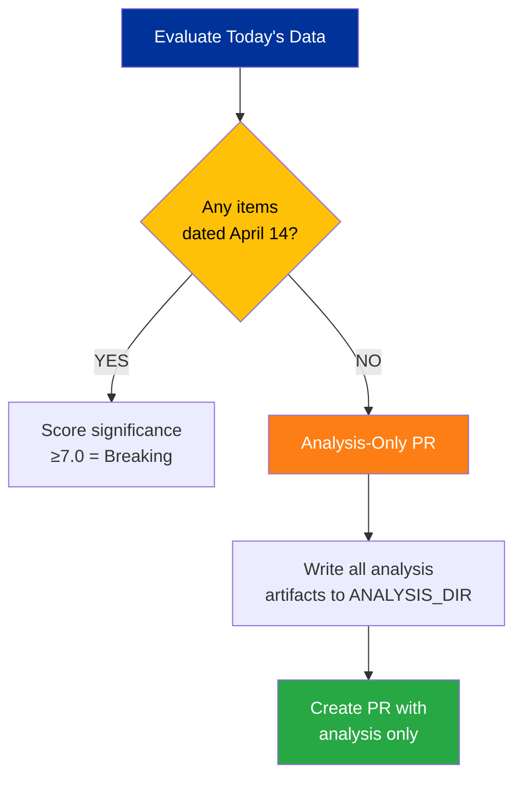

# 📊 Significance Scoring — Breaking News Evaluation (14 April 2026)

---

## 📋 Scoring Context

| Field | Value |
|-------|-------|
| **Scoring ID** | SIG-2026-04-14-169 |
| **Evaluation Date** | 2026-04-14 00:25 UTC |
| **Evaluator** | Breaking news workflow (Run 169) |
| **Data Sources** | 51 adopted texts, 51 procedures, 737 MEPs, coalition dynamics, precomputed stats |

---

## 📈 Individual Item Significance Scores

### Key Adopted Texts (March 26, 2026 — Most Recent Session)

| Item | Reference | Score | Category | Urgency | Confidence |
|------|-----------|-------|----------|---------|------------|
| **US Tariff Countermeasures** | TA-10-2026-0096 | **9.5/10** | ⚡ Breaking-worthy | 🔴 CRITICAL (T-1) | 🟢 High |
| **SRMR3 Banking Reform** | TA-10-2026-0092 | **7.8/10** | 📰 Priority | 🟠 HIGH | 🟢 High |
| **Anti-Corruption Directive** | TA-10-2026-0094 | **7.2/10** | 📰 Priority | 🟡 MEDIUM | 🟢 High |
| **EU-Mercosur Safeguard Clause** | TA-10-2026-0030 | **6.5/10** | 📰 Standard | 🟡 MEDIUM | 🟡 Medium |
| **EU Enlargement Strategy** | TA-10-2026-0077 | **6.2/10** | 📰 Standard | 🟡 MEDIUM | 🟢 High |
| **Housing Crisis Resolution** | TA-10-2026-0064 | **6.0/10** | 📰 Standard | 🟡 MEDIUM | 🟢 High |
| **Copyright & Generative AI** | TA-10-2026-0066 | **5.8/10** | 📋 Monitor | 🟢 LOW | 🟡 Medium |
| **Defence Single Market** | TA-10-2026-0079 | **5.5/10** | 📋 Monitor | 🟡 MEDIUM | 🟡 Medium |

### Today-Dated Events

| Source | Items Found | Breaking Potential |
|--------|------------|-------------------|
| Adopted texts (today) | 0 | — |
| Events (today) | 0 (feed 404) | — |
| Procedures (today) | 0 (feed 404) | — |
| MEP changes (today) | 0 | — |

---

## 🔍 Breaking News Gate Decision

**DECISION: ANALYSIS-ONLY PR** — No items published or updated on April 14, 2026. Parliament's first post-recess plenary expected April 15-17.

---

## 📊 Composite Risk Score Breakdown

| Risk Category | Score | Weight | Weighted | Trend |
|--------------|-------|--------|----------|-------|
| **Trade Policy** (tariff T-1) | 25/25 | 30% | 7.5 | ↑↑ CRITICAL |
| **Legislative Pipeline** (13 COD pending) | 17/25 | 20% | 3.4 | ↑ Rising |
| **Banking Reform** (SRMR3 trilogue) | 18/25 | 20% | 3.6 | → Stable |
| **Anti-Corruption** (final phase) | 16/25 | 15% | 2.4 | → Stable |
| **Coalition Stability** (fragmentation 6.59) | 12/25 | 15% | 1.8 | ↗ Slight increase |
| **COMPOSITE** | — | 100% | **18.7/25** | **↑ ELEVATED** |

---

## 📅 Cross-Session Continuity

| Prior Run | Date | Key Finding | Status Today |
|-----------|------|-------------|--------------|
| Run 168 | Apr 13 | Tariff T-2 CRITICAL, 51 adopted texts collected | ✅ Confirmed T-1 |
| Run 163 | Apr 12 | Easter recess intelligence, EP API blocked | ✅ API partially restored |
| Run 159-162 | Apr 11-12 | Multiple noop — MCP unavailable | ✅ MCP operational today |
| Run 3 (breaking) | Apr 9 | Coalition sentiment analysis, no events | ✅ Consistent pattern |

**Continuity Assessment:** The tariff deadline story has been tracked across 5+ consecutive runs. Today's T-1 position represents the culmination of this tracking. The absence of today-dated events is expected — Parliament's first plenary is tomorrow (April 15). 🟢 High confidence in this assessment.

---

## 📚 Source Attribution

All scores derived from:
- EP Open Data Portal adopted texts (51 items, year=2026)
- EP Open Data Portal procedures (51 items, year=2026)
- EP MCP precomputed statistics (85KB, generated 2026-04-08)
- Coalition dynamics analysis (8 political groups)
- Cross-session intelligence from runs 159-168
