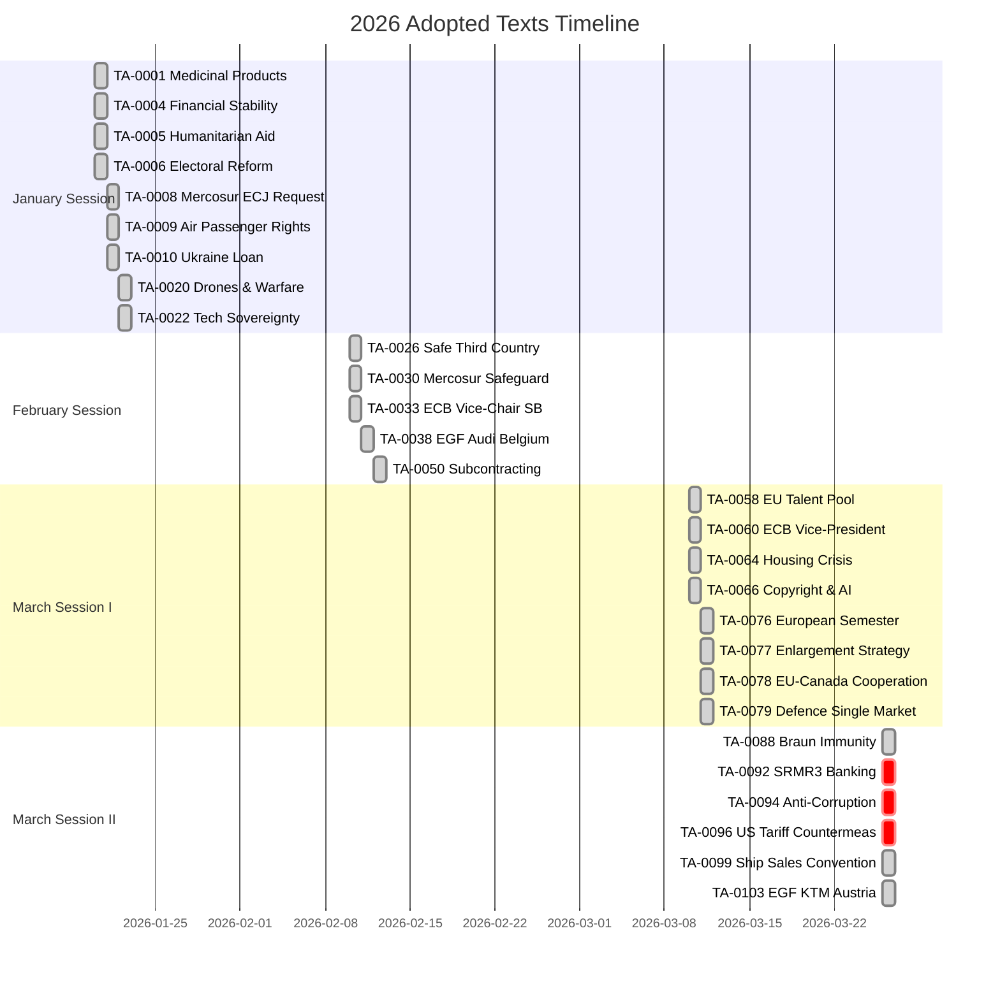

# 📄 Document Analysis Index — Key EP Texts (14 April 2026)

---

## 📋 Index Context

| Field | Value |
|-------|-------|
| **Index ID** | DOC-2026-04-14-169 |
| **Date** | 2026-04-14 00:25 UTC |
| **Documents Indexed** | 51 adopted texts (2026) |
| **Focus Period** | March 26, 2026 session (most recent adoptions) |

---

## 📊 Document Timeline

---

## 📋 Critical Document Analysis (March 26 Session)

### TA-10-2026-0096: Adjustment of Customs Duties — US Tariff Countermeasures

| Attribute | Detail |
|-----------|--------|
| **Reference** | TA-10-2026-0096 |
| **Procedure** | 2025/0261(COD) — Ordinary legislative procedure |
| **Date Adopted** | 26 March 2026 |
| **Political Context** | EU response to US tariffs on European goods. Parliament authorized Commission to adjust customs duties and open tariff quotas on selected US imports. This is the first proactive EU trade countermeasure authorized by EP10. |
| **Stakeholder Impact** | **EU exporters:** Protected from asymmetric trade burden. **US agricultural sector:** Directly targeted. **EU consumers:** Short-term price increases on US goods. **Commission:** Gains trade enforcement credibility. |
| **Procedure Stage** | ✅ EP adopted → Implementation April 15 → Commission implementing acts pending |
| **Coalition Dynamics** | PPE led trade defence coalition. S&D supported worker protection angle. ECR divided — protectionist wing vs Atlantic alliance moderates. Renew supported with reservations on escalation risk. |
| **Significance** | 🔴 **9.5/10** — CRITICAL. Implementation deadline T-1. Potential trade war trigger. |

### TA-10-2026-0092: SRMR3 — Early Intervention & Resolution Funding

| Attribute | Detail |
|-----------|--------|
| **Reference** | TA-10-2026-0092 |
| **Procedure** | 2023/0111(COD) — Ordinary legislative procedure |
| **Date Adopted** | 26 March 2026 |
| **Political Context** | Third revision of the Single Resolution Mechanism Regulation. Part of the Banking Union triple package (SRMR3 + BRRD3 + DGSD2). Addresses early intervention measures and resolution fund contributions. Three-year legislative process. |
| **Stakeholder Impact** | **Banking sector:** New resolution framework requirements. **ECB/SRB:** Expanded intervention toolkit. **Depositors:** Enhanced protection through DGSD2 linkage. **Member states:** Fiscal backstop implications. |
| **Procedure Stage** | ✅ EP position adopted → Council trilogue expected late April |
| **Coalition Dynamics** | PPE-S&D-Renew tripartite support. ECR skeptical on resolution fund scope and moral hazard concerns. Greens cautious on banking industry influence. |
| **Significance** | 🟠 **7.8/10** — HIGH. Banking Union completion milestone. Trilogue outcome uncertain. |

### TA-10-2026-0094: Combating Corruption

| Attribute | Detail |
|-----------|--------|
| **Reference** | TA-10-2026-0094 |
| **Procedure** | 2023/0135(COD) — Ordinary legislative procedure |
| **Date Adopted** | 26 March 2026 |
| **Political Context** | First comprehensive EU anti-corruption directive. Post-Qatargate institutional response. Establishes minimum standards for corruption offences and penalties across member states. |
| **Stakeholder Impact** | **Civil society:** Transparency International strongly supportive. **Member states:** Implementation burden — many need new legislation. **Business:** Compliance costs for anti-corruption programs. **EP itself:** Credibility restoration post-Qatargate. |
| **Procedure Stage** | ✅ EP position adopted → Final plenary endorsement window late April |
| **Coalition Dynamics** | Broad cross-party support. ECR resistance focused on enforcement mechanisms and subsidiarity concerns. PfE abstentions expected. |
| **Significance** | 🟡 **7.2/10** — PRIORITY. Landmark legislation with strong institutional momentum. |

---

## 📊 Document Clusters by Theme

### Trade & External Relations Cluster

| Reference | Title | Date | Significance |
|-----------|-------|------|-------------|
| TA-10-2026-0096 | US Tariff Countermeasures | Mar 26 | 🔴 9.5/10 |
| TA-10-2026-0086 | WTO 14th Ministerial Conference | Mar 12 | 🟡 5.5/10 |
| TA-10-2026-0078 | EU-Canada Enhanced Cooperation | Mar 11 | 🟡 5.0/10 |
| TA-10-2026-0030 | EU-Mercosur Safeguard Clause | Feb 10 | 🟡 6.5/10 |
| TA-10-2026-0008 | EU-Mercosur ECJ Opinion Request | Jan 21 | 🟡 5.5/10 |

### Financial & Economic Cluster

| Reference | Title | Date | Significance |
|-----------|-------|------|-------------|
| TA-10-2026-0092 | SRMR3 Banking Reform | Mar 26 | 🟠 7.8/10 |
| TA-10-2026-0060 | ECB Vice-President Appointment | Mar 10 | 🟡 5.0/10 |
| TA-10-2026-0034 | ECB Annual Report 2025 | Feb 10 | 🟢 4.0/10 |
| TA-10-2026-0033 | ECB SB Vice-Chair | Feb 10 | 🟢 4.0/10 |
| TA-10-2026-0004 | Financial Stability | Jan 20 | 🟡 5.0/10 |

### Rule of Law & Human Rights Cluster

| Reference | Title | Date | Significance |
|-----------|-------|------|-------------|
| TA-10-2026-0094 | Anti-Corruption Directive | Mar 26 | 🟡 7.2/10 |
| TA-10-2026-0083 | Georgia Political Prisoners | Mar 12 | 🟡 5.5/10 |
| TA-10-2026-0046 | Iran Regime Oppression | Feb 12 | 🟡 5.0/10 |
| TA-10-2026-0045 | Uganda Post-Election | Feb 12 | 🟡 5.0/10 |
| TA-10-2026-0015 | EU Magnitsky Act | Jan 21 | 🟡 6.0/10 |

---

## 📚 Sources

- European Parliament Open Data Portal — `get_adopted_texts(year=2026, limit=50)` — 51 items returned
- Procedure references from `get_procedures(year=2026, limit=50)` — 51 procedures
- All dates verified from EP adoption records
