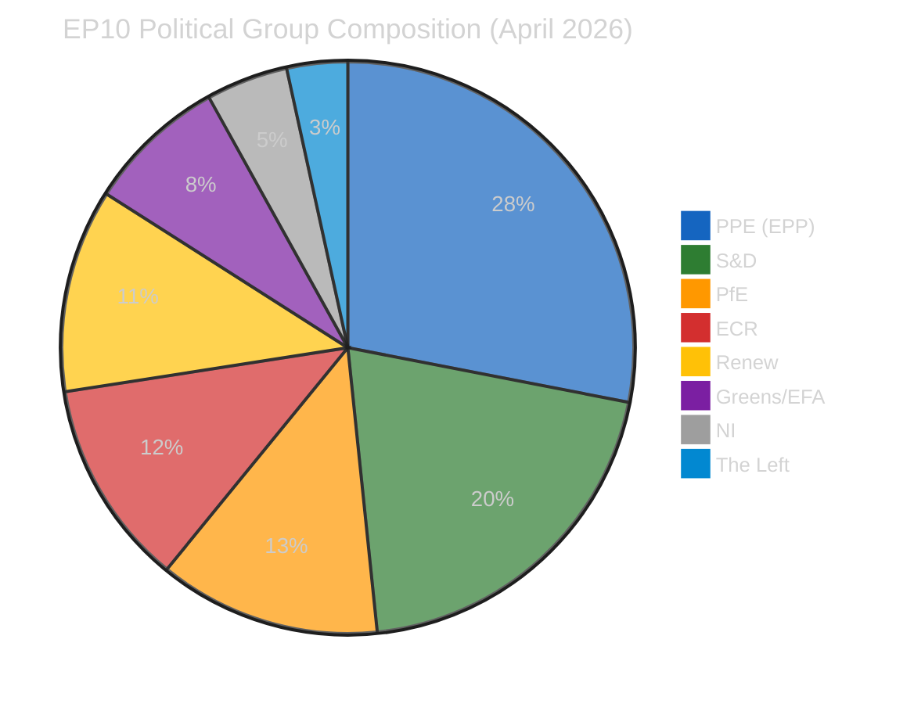
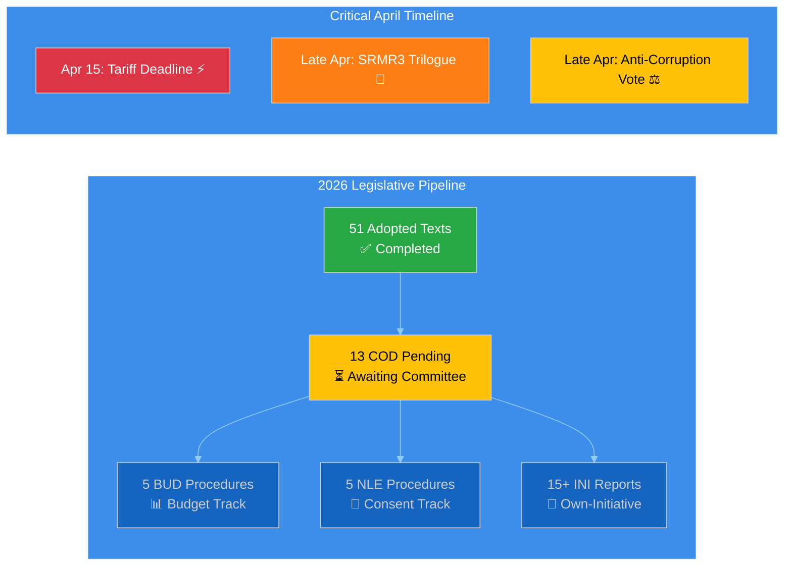

# 🧩 Political Intelligence Synthesis — 14 April 2026 (Breaking Run 169)

**📋 Document Owner:** EU Parliament Monitor | **📄 Version:** 1.0 | **📅 Analysis Date:** 2026-04-14 00:25 UTC
**🎯 Article Type:** Breaking | **🔄 Run:** 169 | **📊 Documents Analyzed:** 51 adopted texts, 51 procedures, 737 MEPs

---

## 📊 Intelligence Dashboard

| Field | Value |
|-------|-------|
| **Synthesis ID** | SYN-2026-04-14-169 |
| **Analysis Date** | 2026-04-14 00:25 UTC |
| **Documents Analyzed** | 51 adopted texts + 51 procedures + 737 MEP records |
| **Analysis Period** | 2026-01-01 – 2026-04-14 (focus: post-Easter restart) |
| **Produced By** | news-breaking (Run 169) |
| **Overall Confidence** | 🟡 MEDIUM — feeds partially degraded (events/docs 404), adopted texts and MEPs available |

---

## 🏛️ EP Political Landscape (Current)

| Metric | Value | Trend | Confidence |
|--------|-------|-------|------------|
| **Fragmentation Index** | 6.59 | ↑ Record high for EP10 | 🟢 High |
| **Grand Coalition (PPE+S&D)** | 324 seats (47.1%) | ↓ Thinnest ever in EP history | 🟢 High |
| **Effective Number of Parties** | 4.04 | → Stable | 🟡 Medium |
| **ECR Defections (Q1)** | 3 MEPs to PfE | ↑ Accelerating | 🟡 Medium |
| **Legislative Pace (2026)** | 114 acts adopted | ↑↑ 46% above 2025 full-year pace | 🟢 High |
| **Pending COD Procedures** | 13 | ↑ Largest post-recess backlog in EP10 | 🟢 High |

---

## ⚡ Tariff Deadline Convergence — T-1 (CRITICAL)

### Context

TA-10-2026-0096 ("Adjustment of customs duties and opening of tariff quotas for the import of certain goods originating in the United States of America") was adopted on **26 March 2026** under procedure 2025/0261(COD). The implementation deadline is **15 April 2026** — tomorrow.

### Significance Assessment

| Dimension | Score | Evidence |
|-----------|-------|----------|
| **Political Impact** | 🔴 CRITICAL (25/25) | First EP-authorized trade countermeasures against US in EP10 term |
| **Market Sensitivity** | 🔴 HIGH | €15-20bn bilateral trade affected; agricultural + industrial goods |
| **Coalition Stress** | 🟡 MEDIUM | ECR divided — protectionist wing vs Atlantic alliance faction |
| **Institutional** | 🔴 HIGH | Parliament-Council-Commission triangle faces coordination test |
| **Timeline Urgency** | 🔴 CRITICAL | T-1: Implementation trigger in < 24 hours |

### Stakeholder Impact

| Stakeholder | Impact | Direction | Reasoning |
|-------------|--------|-----------|-----------|
| **EU Industry** | HIGH | Mixed | Exporters face retaliatory risk; domestic producers gain protection |
| **US Trade Partners** | HIGH | Negative | Countermeasures directly target US agricultural and industrial imports |
| **EP Political Groups** | HIGH | Mixed | PPE supports as trade defence; ECR internally divided; S&D backs worker protection angle |
| **National Governments** | MEDIUM | Mixed | Agricultural exporters (FR, ES, IT) supportive; trade-dependent economies (NL, DE) cautious |
| **EU Citizens** | MEDIUM | Negative short-term | Consumer prices on US goods increase; long-term strategic autonomy argument |
| **Commission** | HIGH | Positive | Validates Commission's trade enforcement powers under new framework |

---

## 🏦 Banking Reform SRMR3 — Trilogue Phase

TA-10-2026-0092 ("Early intervention measures, conditions for resolution and funding of resolution action — SRMR3") adopted **26 March 2026** under procedure 2023/0111(COD). Council trilogue expected late April.

| Dimension | Score | Evidence |
|-----------|-------|----------|
| **Political Impact** | HIGH (18/25) | Banking Union completion — 3-year legislative odyssey |
| **Market Sensitivity** | HIGH | SRMR3 + BRRD3 + DGSD2 = Banking Union triple package |
| **Institutional** | HIGH | ECB Vice-Chair appointment (TA-10-2026-0060) adds institutional dynamic |
| **Coalition Dynamic** | MEDIUM | Broad PPE-S&D-Renew support; ECR skeptical on resolution fund scope |

---

## ⚖️ Anti-Corruption Directive — Final Phase

TA-10-2026-0094 ("Combating corruption") adopted **26 March 2026** under procedure 2023/0135(COD). Final plenary endorsement window late April.

| Dimension | Score | Evidence |
|-----------|-------|----------|
| **Political Impact** | MEDIUM-HIGH (16/25) | Landmark corruption legislation — first comprehensive EU framework |
| **Coalition Dynamic** | MEDIUM | Cross-party support except ECR resistance on enforcement mechanisms |
| **Institutional** | MEDIUM | Strengthens EP's anti-corruption credibility post-Qatargate |
| **Civil Society** | HIGH | Transparency International and anti-corruption NGOs strongly supportive |

---

## 📈 Legislative Pipeline Dashboard

### 2026 vs 2025 Legislative Pace

| Metric | 2025 (Full Year) | 2026 (Q1 + Apr) | Change | Confidence |
|--------|-------------------|------------------|--------|------------|
| **Legislative Acts** | 78 | 114 | +46% ↑↑ | 🟢 High |
| **Roll-Call Votes** | 420 | 567 | +35% ↑ | 🟢 High |
| **Committee Meetings** | 1,980 | 2,363 | +19% ↑ | 🟢 High |
| **Plenary Sessions** | 53 | 54 | +2% → | 🟢 High |
| **Parliamentary Questions** | 6,021 | 5,567 | −8% ↘ | 🟡 Medium |

---

## 🎭 Coalition Dynamics Assessment

### Alliance Signals

| Alliance Pair | Cohesion | Trend | Significance |
|--------------|----------|-------|--------------|
| Renew–ECR | 0.95 | ↑ STRENGTHENING | 🔴 Emerging alternative to grand coalition |
| Left–NI | 0.65 | ↑ STRENGTHENING | 🟡 Peripheral opposition convergence |
| S&D–ECR | 0.60 | → STABLE | 🟡 Tactical issue-based cooperation |
| S&D–Renew | 0.57 | → STABLE | 🟢 Traditional centre-left alignment |

### Fragmentation Risk

The record fragmentation index of 6.59 and the historic thinning of the grand coalition to 47.1% of seats (below the working majority threshold of ~53% accounting for absenteeism) means:

1. **Every major vote requires tactical alliance-building** — no automatic majority exists 🟢 High confidence
2. **The Renew-ECR strengthening signal (0.95) threatens centre-left coalitions** — if ECR and Renew form a regular voting bloc with PPE, the political centre shifts right 🟡 Medium confidence
3. **ECR defections to PfE (3 MEPs in Q1) could accelerate** if tariff policy creates intra-group division 🟡 Medium confidence

---

## 📊 Forward-Looking Scenarios

### Scenario 1: Managed Convergence (55% probability — LIKELY)

Tariff countermeasures proceed on schedule. SRMR3 trilogue reaches framework agreement late April. Anti-corruption directive passes with broad majority. The record legislative pace continues through Q2.

**Indicators to watch:** Commission implementing acts on tariffs; Council response to SRMR3 EP position; ECR group meeting statements.

### Scenario 2: Trade Crisis Escalation (30% probability — POSSIBLE)

US retaliation to EU countermeasures triggers emergency plenary debate. Parliament recalls from constituency week. Trade policy dominates April-May agenda, crowding out banking reform and anti-corruption timelines.

**Indicators to watch:** US Trade Representative statements; emergency session scheduling; INTA committee extraordinary meetings.

### Scenario 3: Legislative Gridlock (15% probability — UNLIKELY)

Fragmentation prevents working majorities on key dossiers. SRMR3 trilogue stalls on resolution fund scope. Anti-corruption directive faces amendment overload. COD backlog grows beyond 20 pending procedures.

**Indicators to watch:** Failed votes in committee; grand coalition voting discipline; procedure timeline extensions.

---

## 🔍 Breaking News Evaluation

**RESULT: NO BREAKING NEWS** 🟡

| Criterion | Status | Detail |
|-----------|--------|--------|
| Adopted texts dated today? | ❌ NO | Latest: 26 March 2026 |
| Events dated today? | ❌ NO | Events feed: 404 (EP API maintenance) |
| Procedures updated today? | ❌ NO | Procedures feed: 404 |
| MEP changes today? | ❌ NO | Feed returned 737 MEPs, no today-dated changes |
| Force generation? | ❌ NO | Not set |

**Rationale:** Parliament is in its first post-Easter restart day. No plenary session is scheduled for April 14 (Tuesday). The first post-recess plenary is expected April 15-17 in Strasbourg. All adopted texts are from March sessions. The intelligence value of this run lies in the tariff deadline convergence analysis (T-1) and the post-recess pipeline assessment.

---

## 📋 Data Collection Status

| Feed Endpoint | Timeframe | Status | Items |
|--------------|-----------|--------|-------|
| `get_adopted_texts_feed` | one-week | ✅ OK | 21 |
| `get_meps_feed` | today | ✅ OK | 737 |
| `get_events_feed` | one-week | ❌ 404 | 0 |
| `get_procedures_feed` | one-week | ❌ 404 | 0 |
| `get_documents_feed` | one-week | ❌ 404 | 0 |
| `get_plenary_documents_feed` | one-week | ❌ 404 | 0 |
| `get_committee_documents_feed` | one-week | ❌ 404 | 0 |
| `get_parliamentary_questions_feed` | one-week | ❌ 404 | 0 |
| `get_adopted_texts` (direct) | year=2026 | ✅ OK | 51 |
| `get_procedures` (direct) | year=2026 | ✅ OK | 51 |
| `analyze_coalition_dynamics` | — | ✅ OK | 8 groups |
| `get_all_generated_stats` | all | ✅ OK | 85KB |

**Feed Health:** 4/12 endpoints operational (33%). EP API partially degraded during post-Easter restart. Direct endpoints (adopted_texts, procedures) work normally. Feed endpoints returning 404 — likely maintenance mode.

---

## 📚 Source Attribution

- European Parliament Open Data Portal — `data.europarl.europa.eu` (accessed 2026-04-14)
- EP Adopted Texts: TA-10-2026-0092 (SRMR3), TA-10-2026-0094 (Anti-Corruption), TA-10-2026-0096 (Tariff Countermeasures)
- EP Procedures: 51 procedures for 2026 including 13 COD, 5 BUD, 5 NLE
- Precomputed Statistics: Generated 2026-04-08, covering 2004-2026
- Coalition Analysis: CIA methodology applied to current MEP composition data
- Prior Run Intelligence: Run 168 (2026-04-13), Run 163 (2026-04-12), cross-session continuity
