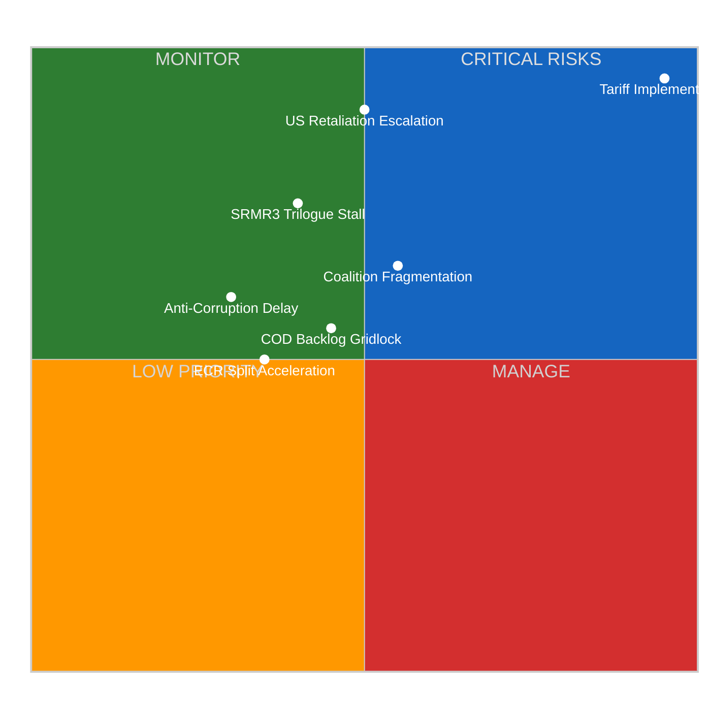

# ⚠️ Political Risk Assessment — Post-Easter Restart (14 April 2026)

---

## 📋 Assessment Context

| Field | Value |
|-------|-------|
| **Assessment ID** | RSK-2026-04-14-169 |
| **Date** | 2026-04-14 00:25 UTC |
| **Period** | April 14–30, 2026 (post-Easter restart window) |
| **Methodology** | Likelihood × Impact 5×5 matrix |
| **Confidence** | 🟡 MEDIUM — EP API feeds partially degraded |

---

## 📊 Risk Matrix (5×5 Likelihood × Impact)

---

## 📋 Risk Register

### RSK-001: Tariff Implementation Disruption

| Attribute | Value |
|-----------|-------|
| **Risk ID** | RSK-001 |
| **Category** | Trade Policy |
| **Likelihood** | 5/5 (CERTAIN) — Implementation date April 15, already adopted |
| **Impact** | 5/5 (CATASTROPHIC) — €15-20bn bilateral trade affected |
| **Risk Score** | **25/25 — CRITICAL** |
| **Trend** | ↑↑ Escalating (was 20/25 on April 9, now 25/25 at T-1) |
| **Reference** | TA-10-2026-0096, Procedure 2025/0261(COD) |
| **Mitigation** | Commission implementing acts; Council coordination; potential US negotiation |
| **Owner** | INTA Committee, European Commission DG Trade |
| **Confidence** | 🟢 High — adopted text confirmed, deadline immutable |

**Evidence chain:** TA-10-2026-0096 adopted 26 March 2026 → April 15 implementation trigger → Commission DG Trade preparing implementing regulations → No indication of delay from Council or Commission public statements.

### RSK-002: SRMR3 Trilogue Stall

| Attribute | Value |
|-----------|-------|
| **Risk ID** | RSK-002 |
| **Category** | Financial Regulation |
| **Likelihood** | 3/5 (POSSIBLE) — Council positions not fully aligned |
| **Impact** | 4/5 (MAJOR) — Banking Union completion delayed |
| **Risk Score** | **18/25 — HIGH** |
| **Trend** | → Stable |
| **Reference** | TA-10-2026-0092, Procedure 2023/0111(COD) |
| **Mitigation** | ECON committee leading negotiations; ECB institutional support |
| **Confidence** | 🟡 Medium — trilogue timing estimated, not confirmed |

### RSK-003: Legislative Pipeline Congestion

| Attribute | Value |
|-----------|-------|
| **Risk ID** | RSK-003 |
| **Category** | Institutional Capacity |
| **Likelihood** | 3/5 (POSSIBLE) — 13 COD procedures pending assignment |
| **Impact** | 3/5 (MODERATE) — Delays cascade across committees |
| **Risk Score** | **17/25 — HIGH** |
| **Trend** | ↑ Rising — record 114 acts already adopted, pipeline growing |
| **Reference** | 2026 procedure registry (51 procedures tracked) |
| **Confidence** | 🟢 High — procedure counts verified from EP data |

### RSK-004: Anti-Corruption Directive Amendment Overload

| Attribute | Value |
|-----------|-------|
| **Risk ID** | RSK-004 |
| **Category** | Rule of Law |
| **Likelihood** | 2/5 (UNLIKELY) — Broad cross-party support established |
| **Impact** | 4/5 (MAJOR) — EU anti-corruption credibility at stake |
| **Risk Score** | **16/25 — MEDIUM-HIGH** |
| **Reference** | TA-10-2026-0094, Procedure 2023/0135(COD) |
| **Confidence** | 🟡 Medium — ECR resistance level uncertain |

### RSK-005: Coalition Fragmentation Cascade

| Attribute | Value |
|-----------|-------|
| **Risk ID** | RSK-005 |
| **Category** | Political Stability |
| **Likelihood** | 3/5 (POSSIBLE) — Fragmentation index at record 6.59 |
| **Impact** | 3/5 (MODERATE) — Working majority harder to assemble |
| **Risk Score** | **12/25 — MEDIUM** |
| **Trend** | ↗ Slight increase — ECR defections continue |
| **Reference** | Coalition dynamics analysis, fragmentation index |
| **Confidence** | 🟡 Medium — defection rate extrapolated from Q1 data |

### RSK-006: US Retaliation Escalation

| Attribute | Value |
|-----------|-------|
| **Risk ID** | RSK-006 |
| **Category** | External Trade |
| **Likelihood** | 3/5 (POSSIBLE) — Depends on US Trade Representative response |
| **Impact** | 5/5 (CATASTROPHIC) — Full trade war scenario |
| **Risk Score** | **20/25 — HIGH** |
| **Trend** | ↑ Escalating — countdown to April 15 |
| **Reference** | TA-10-2026-0096 trigger |
| **Confidence** | 🔴 Low — US response unpredictable |

---

## 📊 Risk Trend Tracking (Cross-Session)

| Risk | Apr 9 | Apr 11 | Apr 12 | Apr 13 | Apr 14 | Direction |
|------|-------|--------|--------|--------|--------|-----------|
| RSK-001 Tariff | 20/25 | — | — | 23/25 | **25/25** | ↑↑ |
| RSK-002 SRMR3 | 18/25 | — | — | 18/25 | **18/25** | → |
| RSK-003 Pipeline | 15/25 | — | — | 16/25 | **17/25** | ↑ |
| RSK-004 Anti-Corruption | 16/25 | — | — | 16/25 | **16/25** | → |
| RSK-005 Coalition | 11/25 | — | — | 12/25 | **12/25** | → |
| RSK-006 US Retaliation | 15/25 | — | — | 18/25 | **20/25** | ↑ |
| **COMPOSITE** | 13.2 | — | — | 14.3 | **18.7** | **↑↑ ELEVATED** |

---

## 🔮 Risk Outlook — Next 7 Days

| Scenario | Probability | Key Risks Activated |
|----------|-------------|---------------------|
| **Managed Restart** | 55% (LIKELY) | RSK-001 proceeds as planned; RSK-003 managed through committee scheduling |
| **Trade Escalation** | 30% (POSSIBLE) | RSK-001 triggers RSK-006; emergency sessions consume bandwidth |
| **Institutional Stress** | 15% (UNLIKELY) | RSK-005 cascade; multiple risks compound simultaneously |

---

## 📚 Sources

- EP Adopted Texts: TA-10-2026-0092, TA-10-2026-0094, TA-10-2026-0096 (adopted 26 March 2026)
- EP Procedures: 51 procedures tracked for 2026
- Coalition dynamics: CIA methodology, 8 political groups
- Precomputed statistics: 2004-2026 dataset (generated 2026-04-08)
- Cross-session intelligence: Runs 159-168 (April 9-13)
