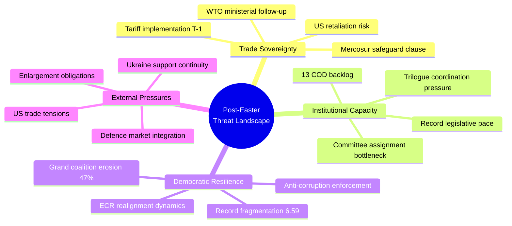
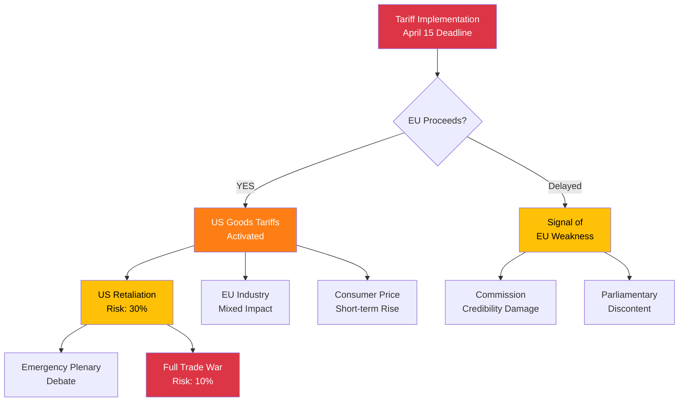

# 🎭 Political Threat Landscape — Post-Easter Restart (14 April 2026)

---

## 📋 Assessment Context

| Field | Value |
|-------|-------|
| **Assessment ID** | THR-2026-04-14-169 |
| **Date** | 2026-04-14 00:25 UTC |
| **Framework** | Multi-framework adapted for EU democracy |
| **Scope** | Democratic governance, institutional stability, trade sovereignty |

---

## 🎯 Threat Landscape Overview

---

## 📊 Threat Actor Profiling

### External Threat Actors

| Actor | Threat Type | Capability | Intent | Immediacy | Confidence |
|-------|------------|------------|--------|-----------|------------|
| **US Trade Policy** | Economic coercion | HIGH — world's largest economy | Mixed — leverage vs partnership | 🔴 CRITICAL (T-1) | 🟡 Medium |
| **Candidate Countries** | Institutional strain | LOW — no decision-making power | Cooperative — seek accession | 🟢 LOW | 🟢 High |

### Internal Threat Dynamics

| Dynamic | Threat Type | Severity | Trajectory | Evidence |
|---------|------------|----------|------------|----------|
| **Coalition Fragmentation** | Democratic efficiency | MODERATE | ↑ Worsening | Fragmentation index 6.59, grand coalition 47% |
| **ECR Realignment** | Political stability | MODERATE | ↗ Increasing | 3 MEPs defected to PfE in Q1 2026 |
| **Legislative Overload** | Institutional capacity | MODERATE | ↑ Rising | 114 acts in Q1 vs 78 all 2025; 13 COD pending |
| **Anti-Corruption Resistance** | Rule of law | LOW | → Stable | ECR resistance predictable, broad support holds |

---

## 🔍 Consequence Tree Analysis

### Tariff Implementation (TA-10-2026-0096)

### SRMR3 Banking Reform (TA-10-2026-0092)

| Stage | Outcome | Probability | Impact |
|-------|---------|-------------|--------|
| Trilogue agreement (April) | Banking Union progress | 60% (LIKELY) | 🟢 HIGH positive |
| Trilogue stall | 6-month delay minimum | 30% (POSSIBLE) | 🔴 HIGH negative |
| Trilogue collapse | Start over next term | 10% (UNLIKELY) | 🔴 CATASTROPHIC |

---

## 🛡️ Democratic Resilience Assessment

### Strengths

| Factor | Assessment | Evidence | Confidence |
|--------|-----------|----------|------------|
| **Legislative productivity** | STRONG | 114 acts in Q1 — record pace | 🟢 High |
| **Cross-party capacity** | ADEQUATE | Anti-corruption broad support | 🟡 Medium |
| **Institutional procedures** | ROBUST | COD process functioning despite backlog | 🟢 High |

### Vulnerabilities

| Factor | Assessment | Evidence | Confidence |
|--------|-----------|----------|------------|
| **Working majority** | FRAGILE | Grand coalition at 47% — below absenteeism threshold | 🟢 High |
| **Group discipline** | WEAKENING | ECR defections, rising NI membership | 🟡 Medium |
| **External responsiveness** | TESTED | Tariff deadline creates unprecedented time pressure | 🟡 Medium |

---

## 🔮 Threat Forecast — April 15-30

| Threat Scenario | Probability | Preparedness | Residual Risk |
|----------------|-------------|--------------|---------------|
| Tariff implementation proceeds smoothly | 55% | HIGH | 🟡 MEDIUM |
| US announces retaliatory measures | 30% | MEDIUM | 🔴 HIGH |
| Legislative backlog causes committee delays | 40% | MEDIUM | 🟡 MEDIUM |
| ECR internal crisis over trade policy | 20% | LOW | 🟡 MEDIUM |
| Anti-corruption directive delayed | 15% | HIGH | 🟢 LOW |

---

## 📚 Sources

- EP Adopted Texts: TA-10-2026-0092, TA-10-2026-0094, TA-10-2026-0096
- EP Procedures: 51 tracked for 2026 (13 COD, 5 BUD, 5 NLE)
- Coalition Dynamics: 8 groups analyzed, fragmentation index 6.59
- MEP Composition: 737 active MEPs across 8 political groups
- Precomputed Statistics: 2026 legislative pace tracking
