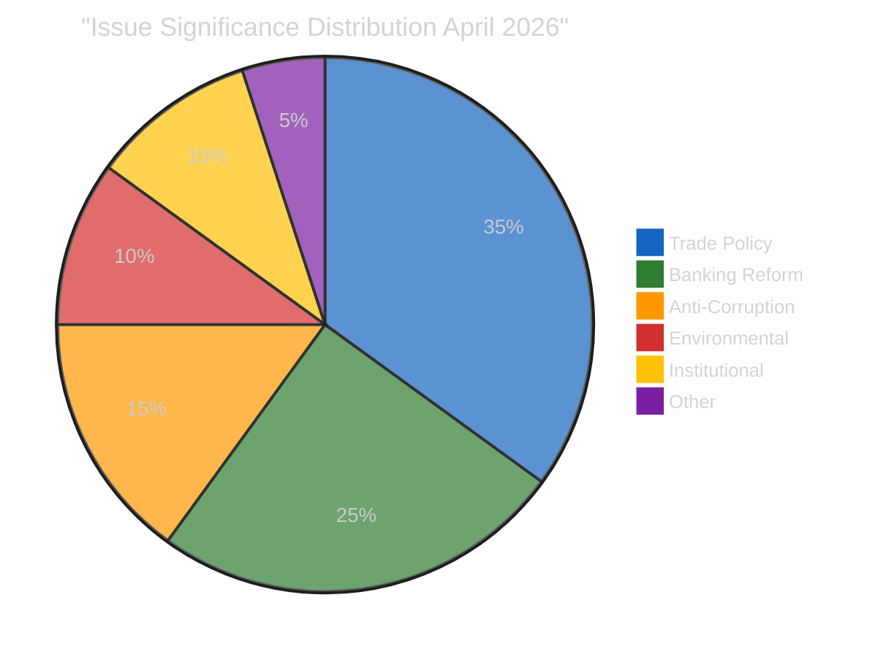
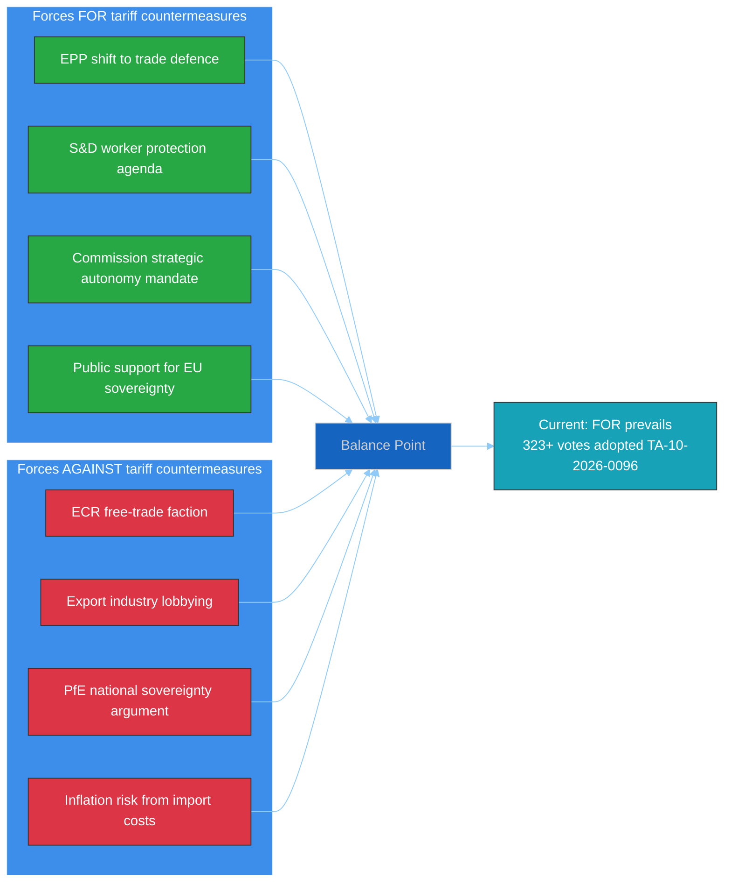

<!-- SPDX-FileCopyrightText: 2024-2026 Hack23 AB -->
<!-- SPDX-License-Identifier: Apache-2.0 -->

# 🏷️ Political Classification — 14 April 2026

  
  
  

---

## 📋 Classification Context

| Field | Value |
|-------|-------|
| **Classification ID** | `CLS-2026-04-14-171` |
| **Classification Date** | `2026-04-14 14:28 UTC` |
| **Produced By** | news-breaking (Run 171) |
| **Sensitivity** | 🟢 PUBLIC — all data from EP Open Data Portal |
| **articleType** | breaking |

---

## 🌡️ Political Temperature Assessment

### 7-Dimension Classification

| Dimension | Score (0-10) | Rationale | Trend |
|-----------|:----------:|-----------|:-----:|
| **Legislative Activity** | 8.5 | 114 acts in 2026 Q1 vs 78 in 2025 (+46%). Record pace sustained through Easter recess sprint. | ↑ |
| **Coalition Stability** | 4.0 | Grand coalition (EPP+S&D = 323) below majority. Three-party minimum required. ECR defection on trade. | ↓ |
| **Crisis Intensity** | 7.5 | Tariff activation T-0 (April 15). Trade confrontation risk 20/25 CRITICAL. No diplomatic de-escalation signals. | ↑ |
| **Public Engagement** | 3.0 | Easter recess limits public engagement. Media coverage focused on trade policy implications. | → |
| **Institutional Stress** | 5.5 | Commission-Parliament power dynamics tested by tariff delegation. 13 pending COD create institutional pressure. | ↗ |
| **International Impact** | 8.0 | EU-US trade relationship at inflection point. Global trade architecture implications. WTO relevance questioned. | ↑ |
| **Democratic Health** | 6.0 | Record legislative output demonstrates institutional productivity. But fragmentation challenges majoritarian democracy. | → |

**Composite Political Temperature: 6.1/10** — 🟠 ELEVATED

The political temperature is elevated primarily due to the tariff activation deadline convergence with parliamentary return. The combination of external trade pressure (dimension 6: 8.0) and internal coalition instability (dimension 2: 4.0) creates a volatile environment.

---

## 📊 Strategic Significance Classification

### By Issue Area

| Issue | Significance | Strategic Classification | Evidence |
|-------|:-----------:|------------------------|----------|
| **Trade countermeasures** | 🔴 9.6/10 | CRITICAL — Defines EP10 external trade posture | TA-10-2026-0096 (COD 2025/0261) |
| **Banking reform** | 🟠 8.0/10 | HIGH — Completes Banking Union architecture | SRMR3/BRRD3/DGSD2 trilogue |
| **Anti-corruption** | 🟠 7.3/10 | HIGH — Strengthens rule-of-law toolkit | TA-10-2026-0094 (COD 2023/0135) |
| **Water pollutants** | 🟡 5.5/10 | MEDIUM — Environmental regulatory completion | TA-10-2026-0098 (COD 2022/0344) |
| **EP fragmentation** | 🟡 6.7/10 | MEDIUM — Structural governance challenge | Coalition dynamics analysis |
| **Legislative velocity** | 🟡 5.3/10 | MEDIUM — Institutional productivity metric | Precomputed stats comparison |

---

## 🏛️ Actor Mapping

### Key Actors and Positions

| Actor | Role | Position on Tariffs | Position on Banking Reform | Influence Level |
|-------|------|-------------------|---------------------------|:--------------:|
| **EPP** (188 seats) | Largest group | Shifted to support countermeasures (break from free-trade orthodoxy) | Strong support — ECON rapporteur control | 🔴 HIGH |
| **S&D** (135 seats) | Second largest | Support with worker protection amendments | Support — focus on depositor rights | 🟠 HIGH |
| **ECR** (81 seats) | Right-conservative | SPLIT — partial defection on TA-10-2026-0096 | Cautious support — subsidiarity concerns | 🟡 MEDIUM |
| **Renew** (77 seats) | Liberal centre | Support as strategic autonomy tool | Strong support — Banking Union completion | 🟡 MEDIUM |
| **PfE** (76 seats) | National-conservative | Oppose on sovereignty grounds | Mixed — national banking system preferences | 🟡 MEDIUM |
| **Greens/EFA** (53 seats) | Green-left | Support with environmental conditionality | Conditional — green banking requirements | 🟢 LOW |
| **The Left** (46 seats) | Left | Oppose — anti-trade-war but anti-corporate | Support deposit insurance, oppose bank bail-in | 🟢 LOW |
| **Commission** | Executive | Implementing body for tariff measures | Trilogue counterpart — Council alignment needed | 🔴 HIGH |
| **Council** | Co-legislator | National interests diverge on trade | Banking reform positions vary by member state | 🟠 HIGH |

### Forces Analysis

---

## 📈 Coalition Impact Vector

### Trade Policy Coalition Dynamics

The tariff vote (TA-10-2026-0096) revealed a specific coalition pattern:

| Coalition Pattern | Seats | Outcome | Stability |
|-------------------|-------|---------|-----------|
| **Pro-tariff**: EPP + S&D + Renew + partial ECR | 400-420 | Adopted | 🟡 MEDIUM — ECR split introduces uncertainty |
| **Anti-tariff**: PfE + partial ECR + NI | 120-140 | Defeated | 🟡 MEDIUM — ideological coherence varies |
| **Abstaining**: ESN + The Left + partial Greens | 60-80 | Non-participating | 🟢 LOW — principled abstention |

**Key insight**: The trade policy coalition is a modified grand coalition (EPP+S&D+Renew) with partial ECR support. This three-and-a-half party alignment is more resilient than the traditional grand coalition because it has a 40+ seat buffer above majority. However, if the ECR defection deepens (currently limited to specific trade files), the coalition narrows to exactly 400 seats — still viable but with reduced buffer.

---

## 🔮 Classification Trajectory

| Period | Temperature | Key Driver | Confidence |
|--------|:----------:|-----------|:----------:|
| **Current** (April 14) | 6.1/10 | Tariff T-0 convergence | 🟡 Medium |
| **Next week** (April 15-21) | 7.0-8.0/10 | Parliament return + tariff activation + first votes | 🟡 Medium |
| **Next month** (April 22 - May 14) | 5.5-7.5/10 | Banking trilogues + COD assignments + trade response | 🔴 Low |

**Bayesian note**: The wide range for next month reflects high uncertainty around US trade response. If Scenario 1 (managed convergence, 55%) materialises, temperature declines to 5.5. If Scenario 2 (trade crisis, 30%) materialises, temperature rises to 7.5+.

---

*Generated by EU Parliament Monitor — news-breaking workflow (Run 171)*
*Data source: European Parliament Open Data Portal via MCP Server v1.2.7*
*Analysis date: 2026-04-14 14:28 UTC*
