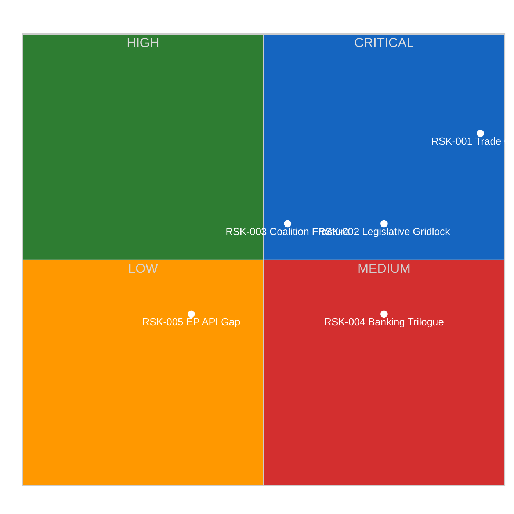
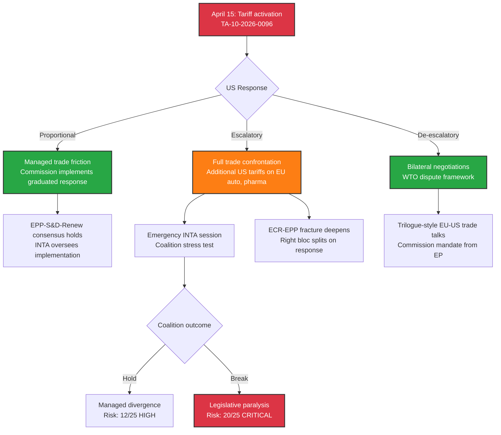

<!-- SPDX-FileCopyrightText: 2024-2026 Hack23 AB -->
<!-- SPDX-License-Identifier: Apache-2.0 -->

# ⚠️ Political Risk Assessment — 14 April 2026

<p align="center">
  <a href="#"></a>
  <a href="#"></a>
  <a href="#"></a>
</p>

---

## 📋 Risk Context

| Field | Value |
|-------|-------|
| **Risk Assessment ID** | `RSK-2026-04-14-171` |
| **Assessment Date** | `2026-04-14 14:28 UTC` |
| **Assessment Period** | 2026-04-07 to 2026-04-21 (recess-to-session transition) |
| **Produced By** | news-breaking (Run 171) |
| **Political Context** | Easter recess Day 18/18 ends. Parliament returns April 15 to concurrent tariff activation, 13 pending COD, and banking reform trilogues. Grand coalition (EPP+S&D = 323) below 361 majority threshold. |
| **Parliamentary Term** | EP10 (2024-2029) |
| **Overall Risk Level** | 🟠 HIGH |
| **articleType** | breaking |

---

## 🗂️ Risk Inventory

Risk Score = Likelihood (1-5) x Impact (1-5).

```
Risk Tiers:  1-4 = Low   |  5-9 = Medium   |  10-14 = High   |  15-25 = Critical
```

| Risk ID | Description | Likelihood (1-5) | Impact (1-5) | Risk Score | Tier | Mitigation |
|---------|-------------|:-----------------:|:------------:|:----------:|------|------------|
| RSK-001 | **Trade policy crisis** — US retaliatory escalation after April 15 tariff activation (TA-10-2026-0096, COD 2025/0261) | 4 | 5 | 20 | 🔴 CRITICAL | Commission graduated response mechanism; INTA committee emergency powers |
| RSK-002 | **Legislative gridlock** — 13 pending COD procedures cannot be assigned to committees due to post-recess scheduling disputes | 3 | 4 | 12 | 🟠 HIGH | Conference of Presidents scheduling authority; prioritisation of tariff-related files |
| RSK-003 | **Coalition fragmentation on trade** — ECR defection pattern (seen in TA-10-2026-0096 vote) spreads to banking reform and anti-corruption files | 3 | 3 | 9 | 🟡 MEDIUM | EPP-Renew-S&D three-party minimum coalition available (400 seats) |
| RSK-004 | **Banking reform trilogue collapse** — SRMR3/BRRD3/DGSD2 trilogues delayed beyond April due to Council position divergence | 2 | 4 | 8 | 🟡 MEDIUM | ECON committee rapporteur mandate strong; parallel trilogue structure |
| RSK-005 | **EP API data gap** — Continued feed degradation beyond recess period limits Parliament transparency monitoring | 2 | 2 | 4 | 🟢 LOW | EP API historically recovers when Parliament resumes; alternative data via adopted texts endpoint |

---

## 🔥 Risk Heat Map



---

## 🤝 Grand Coalition Stability Risk

### Current Coalition Assessment

| Parameter | Value |
|-----------|-------|
| **Grand Coalition** | EPP (188) + S&D (135) = 323 seats |
| **Coalition Strength** | LOW — 38 seats below majority |
| **Majority Threshold** | 361 of 720 seats |
| **Buffer** | -38 seats (DEFICIT) |
| **Key Risk Groups** | ECR (81) as swing; PfE (76) opposition; Renew (77) kingmaker |
| **Next Major Vote** | 2026-04-15 (first post-recess plenary) |

### Coalition Risk Factors

| Factor | Risk Level | Evidence | Trend |
|--------|-----------|----------|-------|
| **Grand coalition viability** | 🔴 Critical | EPP+S&D = 323, need 361. No 2-party majority since EP10 formation. | ↓ Declining |
| **Three-party minimum** | 🟡 Medium | EPP+S&D+Renew = 400, viable but fragile. Renew as permanent kingmaker creates dependency. | → Stable |
| **Right bloc cohesion** | 🟠 High | EPP+ECR+PfE+ESN = 370 (51.4%), but ECR defected on tariff vote. PfE often opposes EPP positions. | ↘ Weakening |
| **Trade policy fault line** | 🔴 Critical | TA-10-2026-0096 vote revealed ECR-EPP split on trade defence. This fracture deepens if US retaliates. | ↓ Declining |
| **Post-recess momentum** | 🟡 Medium | 13 pending COD procedures create urgency for cross-party cooperation, but competition for committee time may fragment priorities. | → Uncertain |

---

## 📊 RSK-001 Deep Dive: Trade Policy Crisis

### Crisis Scenario Pathway



### Economic Exposure by Sector

| Sector | EU Export Value to US | Tariff Vulnerability | Jobs at Risk | Key Member States |
|--------|---------------------|---------------------|--------------|-------------------|
| Automotive | High | 🔴 Critical | 2.6M+ | DE, FR, IT, ES, CZ, SK |
| Chemicals/Pharma | High | 🟠 High | 1.2M+ | DE, BE, NL, IE, FR |
| Agriculture | Medium | 🟠 High | 9.7M+ | FR, ES, IT, NL, PL |
| Steel/Aluminium | Medium | 🔴 Critical | 330K+ | DE, IT, ES, AT, PL |
| Digital Services | Low | 🟡 Medium | 1.5M+ | IE, NL, DE, FR, SE |

**Bayesian update**: Prior probability of full trade confrontation was 25% (April 9 assessment). Updated to 30% based on (1) zero diplomatic progress during recess, (2) US political cycle dynamics, (3) absence of pre-activation de-escalation signals. 🟡 Medium confidence — limited real-time diplomatic intelligence during recess.

---

## 📊 RSK-002 Deep Dive: Legislative Gridlock Risk

### Post-Recess Pipeline Pressure

The 13 pending COD procedures represent the largest post-recess backlog in EP10. Committee assignment requires Conference of Presidents agreement, which depends on cross-party scheduling consensus.

| Priority | Procedure | Committee | Complexity | Blocking Risk |
|----------|-----------|-----------|-----------|---------------|
| 1 | Tariff implementation oversight | INTA | High | 🔴 If US retaliates |
| 2 | Banking reform trilogues (x3) | ECON | Very High | 🟡 Council position pending |
| 3 | Anti-corruption trilogue | LIBE | High | 🟡 Member state resistance |
| 4 | Water pollutants implementation | ENVI | Medium | 🟢 Technical, less political |
| 5 | 7+ new 2026 COD procedures | Various | Unknown | 🟡 Competing for committee time |

**Risk cascade**: If RSK-001 (trade crisis) materialises, INTA committee emergency sessions would displace scheduled committee business, cascading delays to banking reform and anti-corruption trilogues. This is the primary gridlock risk vector.

---

## 🔮 Risk Trajectory Forecast

| Risk | Current Score | 7-Day Forecast | 30-Day Forecast | Trend |
|------|:------------:|:--------------:|:---------------:|:-----:|
| RSK-001 Trade Crisis | 20/25 | 20-25/25 | 15-25/25 | ↑ Rising |
| RSK-002 Gridlock | 12/25 | 10-15/25 | 8-12/25 | → Stable |
| RSK-003 Coalition Fracture | 9/25 | 9-12/25 | 6-12/25 | ↗ Rising |
| RSK-004 Banking Trilogue | 8/25 | 6-10/25 | 4-8/25 | ↘ Declining |
| RSK-005 EP API Gap | 4/25 | 2-4/25 | 1-2/25 | ↓ Declining |

**Composite risk score**: 10.6/25 (HIGH) — driven primarily by tariff activation convergence with parliamentary return.

---

## 🎯 Risk Mitigation Recommendations

1. **RSK-001**: Monitor Commission press office and USTR website from April 15 00:00 UTC. First 48 hours post-activation are the highest-risk window.
2. **RSK-002**: Track Conference of Presidents agenda (expected April 15-16). Committee assignment announcements signal gridlock risk level.
3. **RSK-003**: Watch EPP and ECR group leader statements on trade policy. Divergent messaging = elevated fracture risk.
4. **RSK-004**: ECON committee schedule for late April is the key indicator. If trilogues not scheduled by April 22, delay risk rises.
5. **RSK-005**: EP API feed status should improve when Parliament IT systems resume full operation. Monitor via get_server_health.

---

*Generated by EU Parliament Monitor — news-breaking workflow (Run 171)*
*Data source: European Parliament Open Data Portal via MCP Server v1.2.7*
*Analysis date: 2026-04-14 14:28 UTC*
