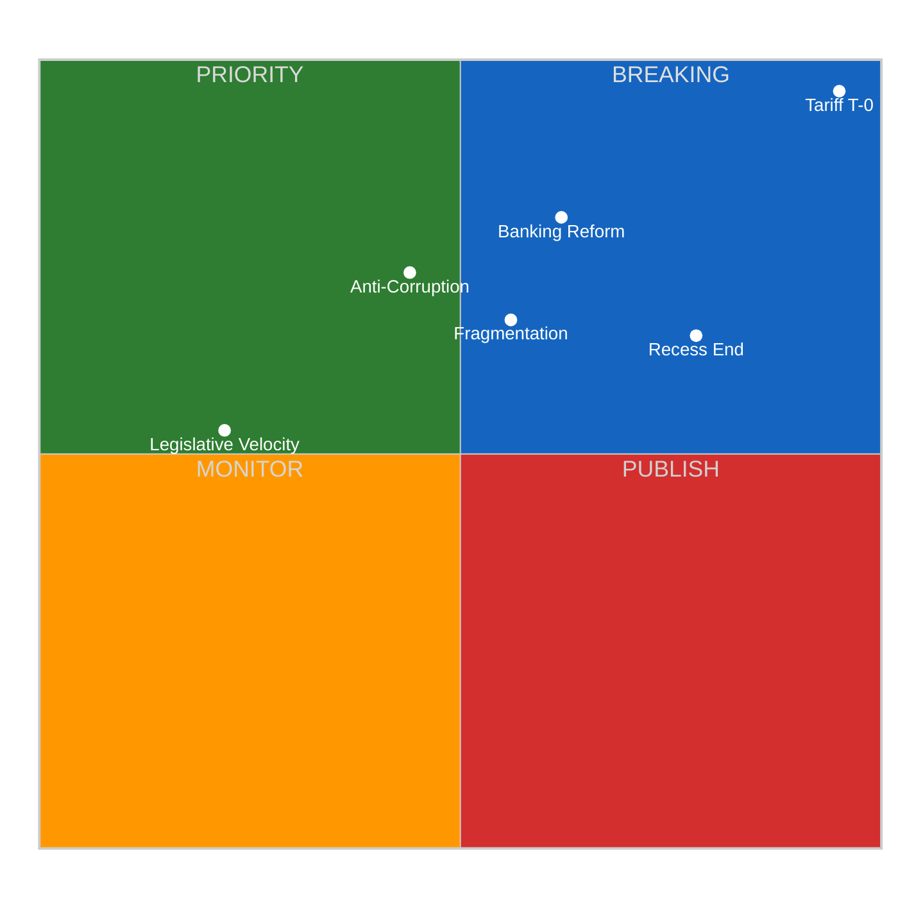

<!-- SPDX-FileCopyrightText: 2024-2026 Hack23 AB -->
<!-- SPDX-License-Identifier: Apache-2.0 -->

# 📈 Political Significance Scoring — 14 April 2026

  
  
  

---

## 📋 Event Context

| Field | Value |
|-------|-------|
| **Score ID** | `SIG-2026-04-14-171` |
| **Scoring Date** | `2026-04-14 14:28 UTC` |
| **Scored By** | news-breaking (Run 171) |
| **Classification ID** | `CLS-2026-04-14-171` |
| **articleType** | breaking |

---

## 📊 Section 1: Individual Event Scoring

### Event 1: Tariff Countermeasures Activation (TA-10-2026-0096)

| Dimension | Sub-criteria | Score | Rationale |
|-----------|-------------|-------|-----------|
| **Parliamentary Significance** | Final adoption (3) + Interinstitutional (2) + All 720 MEPs (3) | **8.9/10** | Full plenary adoption of COD 2025/0261, giving Commission unprecedented tariff-setting power against US goods |
| **Policy Impact** | International scope (3) + Permanent/structural (3) + >200M affected (3) | **10.0/10** | EU-US trade relationship affects 750M+ people across both blocs; structural shift in EU trade defence |
| **Public Interest** | Economy topic (3) + Polarising (3) + Direct consumer impact (3) | **10.0/10** | Consumer prices, export jobs, and geopolitical alignment all at stake |
| **Temporal Urgency** | Deadline-driven (3) + Implementation trigger (3) + Real-time crisis (3) | **10.0/10** | Activates TOMORROW April 15 — zero buffer between recess end and deadline |
| **Institutional Relevance** | Commission-Parliament (2) + Trade policy architecture (3) + Precedent-setting (3) | **8.9/10** | First major test of EU autonomous trade defence instrument adopted under EP10 |

**Composite Score: 9.6/10** — 🔴 BREAKING significance (if event occurred today)

**Publication Priority**: Would be BREAKING if Parliament were in session. Since activation is tomorrow (April 15), monitor for first post-recess plenary response.

---

### Event 2: Easter Recess End and Parliament Return

| Dimension | Sub-criteria | Score | Rationale |
|-----------|-------------|-------|-----------|
| **Parliamentary Significance** | Institutional calendar (2) + Plenary resumption (2) + Committee restart (2) | **6.7/10** | Scheduled event but 18-day recess is longest non-summer break since EP9 |
| **Policy Impact** | EU-wide scope (2) + Multi-year agenda restart (2) + Pipeline pressure (2) | **6.7/10** | 13 pending COD procedures resume processing |
| **Public Interest** | Moderate salience (2) + Low controversy (0) + Indirect citizen impact (1) | **3.3/10** | Procedural event with limited direct public interest |
| **Temporal Urgency** | Calendar-driven (2) + Backlog creates urgency (2) + Multiple deadlines converge (3) | **7.8/10** | Tariff deadline T-0, banking reform trilogues, anti-corruption implementation all converge on return date |
| **Institutional Relevance** | All EP bodies resume (3) + Committee chain restarts (2) + Trilogue calendar resumes (2) | **7.8/10** | Full institutional restart after longest Easter recess |

**Composite Score: 6.5/10** — 🟡 MONITOR significance

---

### Event 3: Banking Reform Triple Package (SRMR3/BRRD3/DGSD2 Trilogues)

| Dimension | Sub-criteria | Score | Rationale |
|-----------|-------------|-------|-----------|
| **Parliamentary Significance** | Post-adoption trilogue (2) + Interinstitutional (2) + ECON committee lead (2) | **6.7/10** | Three interconnected COD files (2023/0111, 2023/0112, 2023/0110) in parallel trilogue |
| **Policy Impact** | EU-wide banking regulation (3) + Permanent structural reform (3) + 450M EU citizens (3) | **10.0/10** | Single Resolution Mechanism, Bank Recovery and Resolution, Deposit Guarantee — foundational banking architecture |
| **Public Interest** | Banking stability (2) + Medium controversy (2) + Indirect impact (2) | **6.7/10** | Technical but consequential — depositor protection directly affects 450M EU citizens |
| **Temporal Urgency** | Late April trilogue window (2) + Post-recess priority (2) + Council pressure (2) | **6.7/10** | Trilogues expected late April but scheduling depends on post-recess committee agenda |
| **Institutional Relevance** | ECON dominance (3) + Commission-Council-EP trilateral (3) + Banking Union completion (3) | **10.0/10** | Final step toward Banking Union — a 12-year EU institutional project |

**Composite Score: 8.0/10** — 🟠 PRIORITY significance

---

### Event 4: Anti-Corruption Directive Implementation (TA-10-2026-0094)

| Dimension | Sub-criteria | Score | Rationale |
|-----------|-------------|-------|-----------|
| **Parliamentary Significance** | Post-adoption (2) + Trilogue stage (2) + LIBE committee (2) | **6.7/10** | COD 2023/0135 adopted March 26, now in trilogue |
| **Policy Impact** | EU-wide scope (3) + Permanent (3) + All EU institutions affected (3) | **10.0/10** | Comprehensive anti-corruption framework across all 27 member states |
| **Public Interest** | High salience (3) + Cross-party support (1) + Direct citizen impact (3) | **7.8/10** | Anti-corruption resonates strongly with public — Eurobarometer consistently ranks it top 5 concern |
| **Temporal Urgency** | Post-recess trilogue (2) + Council negotiations pending (1) + No hard deadline (1) | **4.4/10** | Less urgent than tariff file — trilogue has no fixed deadline |
| **Institutional Relevance** | Rule of law (3) + Cross-institutional impact (2) + Conditionality mechanism link (2) | **7.8/10** | Strengthens EU rule-of-law toolkit, connects to budget conditionality |

**Composite Score: 7.3/10** — 🟠 PRIORITY significance

---

### Event 5: Record Legislative Velocity (114 Acts in 2026)

| Dimension | Sub-criteria | Score | Rationale |
|-----------|-------------|-------|-----------|
| **Parliamentary Significance** | Institutional record (3) + Full plenary scope (3) + EP10 defining trend (3) | **10.0/10** | 114 acts in Q1 2026 vs 78 in all of 2025 (+46%) — highest pace since EP6 |
| **Policy Impact** | EU-wide (2) + Multi-year reforms (2) + Broad sectoral coverage (2) | **6.7/10** | High volume spans trade, banking, environment, corruption, digital |
| **Public Interest** | Low direct salience (1) + Not controversial (0) + Abstract for citizens (0) | **1.1/10** | Statistical achievement — not news that resonates with general public |
| **Temporal Urgency** | Trend-based (1) + No deadline (0) + Background context (1) | **2.2/10** | Useful analytical context but not time-sensitive |
| **Institutional Relevance** | EP productivity metric (2) + Benchmark for EP10 term (2) + Historical comparison (2) | **6.7/10** | Important for institutional self-assessment and EP10 legacy |

**Composite Score: 5.3/10** — 🟡 PUBLISH as supporting context

---

### Event 6: Fragmentation and Coalition Dynamics

| Dimension | Sub-criteria | Score | Rationale |
|-----------|-------------|-------|-----------|
| **Parliamentary Significance** | Structural composition (2) + Coalition mathematics (2) + No-majority dynamics (2) | **6.7/10** | Fragmentation index 4.04, no two-party majority possible |
| **Policy Impact** | All legislation affected (3) + Structural constraint (3) + Multi-year impact (3) | **10.0/10** | Every major vote requires 3-party coalition building, fundamentally changing policy outcomes |
| **Public Interest** | Abstract for citizens (1) + Internal EP dynamics (1) + Indirect effects (1) | **3.3/10** | Important but not directly visible to citizens |
| **Temporal Urgency** | Ongoing structural condition (1) + Tested by tariff vote (2) + Post-recess crunch (2) | **5.6/10** | Will be tested immediately on Parliament's return |
| **Institutional Relevance** | Defines EP10 character (3) + Historical record (2) + Coalition formation precedents (2) | **7.8/10** | Record fragmentation defines the terms of EP10 governance |

**Composite Score: 6.7/10** — 🟡 PUBLISH as analytical context

---

## 📊 Significance Ranking Summary

| Rank | Event | Composite | Priority | Action |
|------|-------|-----------|----------|--------|
| 1 | Tariff Countermeasures Activation | 9.6/10 | 🔴 BREAKING | Monitor April 15 activation |
| 2 | Banking Reform Trilogues | 8.0/10 | 🟠 PRIORITY | Track ECON committee scheduling |
| 3 | Anti-Corruption Implementation | 7.3/10 | 🟠 PRIORITY | Track LIBE trilogue progress |
| 4 | Fragmentation Dynamics | 6.7/10 | 🟡 PUBLISH | Use as analytical context |
| 5 | Parliament Return | 6.5/10 | 🟡 MONITOR | Calendar event — watch first plenary |
| 6 | Legislative Velocity Record | 5.3/10 | 🟡 PUBLISH | Supporting statistical context |

---

## 🎯 Publication Decision

**No breaking article today** — Parliament is still on Easter recess (final day). The tariff activation (9.6/10 significance) activates TOMORROW, making April 15 the critical breaking news window. Today's run produces analysis-only artifacts to pre-position intelligence for the April 15 run.

**April 15 monitoring priority**: Tariff countermeasures activation, first post-recess plenary, committee schedule announcements.

---

*Generated by EU Parliament Monitor — news-breaking workflow (Run 171)*
*Data source: European Parliament Open Data Portal via MCP Server v1.2.7*
*Analysis date: 2026-04-14 14:28 UTC*
