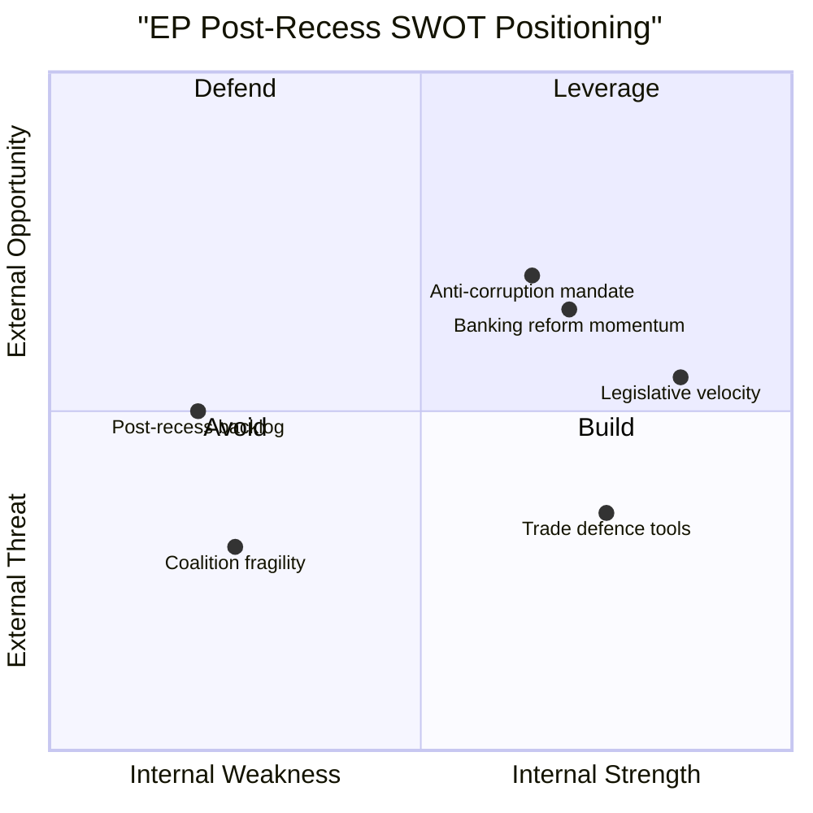

<!-- SPDX-FileCopyrightText: 2024-2026 Hack23 AB -->
<!-- SPDX-License-Identifier: Apache-2.0 -->

# 🔄 Political SWOT Analysis — 14 April 2026

  
  
  

---

## 📋 SWOT Context

| Field | Value |
|-------|-------|
| **SWOT ID** | `SWOT-2026-04-14-171` |
| **Analysis Date** | `2026-04-14 14:28 UTC` |
| **Subject** | European Parliament post-Easter recess transition |
| **Produced By** | news-breaking (Run 171) |
| **Overall Assessment** | Strengths outweigh weaknesses but external threats are acute |
| **articleType** | breaking |

---

## 📊 SWOT Matrix

---

## 💪 Strengths

| # | Strength | Evidence | Severity | Implication |
|---|----------|----------|:--------:|------------|
| S1 | **Record legislative velocity** — 114 acts in 2026 Q1 vs 78 in all 2025 (+46%). Parliament demonstrating institutional productivity at highest pace since EP6. | Precomputed stats: 2026 Q1 monthly breakdown (8+10+12 acts). Historical comparison across EP6-EP10. | 🟢 HIGH | Parliament can process complex legislation rapidly when political will exists. Suggests the post-recess pipeline backlog (13 COD) can be cleared if coalition discipline holds. |
| S2 | **Autonomous trade defence capability** — TA-10-2026-0096 (COD 2025/0261) gives EU novel legal instruments for retaliatory tariffs, ending reliance on ad hoc Commission decisions. | Adopted text TA-10-2026-0096, adopted March 26 2026, 720 MEPs participated in plenary vote. | 🟢 HIGH | EU can respond to trade confrontation with pre-authorised legal tools rather than emergency legislation. Reduces institutional response time from weeks to days. |
| S3 | **Banking Union near-completion** — SRMR3/BRRD3/DGSD2 triple package adopted, trilogues scheduled. Twelve-year institutional project approaching final stage. | TA-10-2026-0092 (SRMR3), COD 2023/0111, 2023/0112, 2023/0110. ECON committee leadership. | 🟡 MEDIUM | Financial stability architecture strengthened. Depositor protection harmonised across 27 member states. |
| S4 | **Anti-corruption framework** — TA-10-2026-0094 (COD 2023/0135) creates comprehensive EU-wide anti-corruption directive, strengthening rule-of-law toolkit. | Adopted text TA-10-2026-0094, LIBE committee rapporteur. Eurobarometer public demand for anti-corruption measures. | 🟡 MEDIUM | Addresses public trust deficit. Connects to budget conditionality mechanism for member state compliance. |

---

## 🔴 Weaknesses

| # | Weakness | Evidence | Severity | Implication |
|---|----------|----------|:--------:|------------|
| W1 | **Grand coalition below majority** — EPP (188) + S&D (135) = 323, deficit of 38 seats vs 361 threshold. No two-party coalition can govern. | Coalition dynamics analysis: fragmentation index 4.04, MEP feed (737 MEPs). Historical comparison: EP9 grand coalition had 30+ seat buffer. | 🔴 HIGH | Every major vote requires three-party negotiation, increasing transaction costs and slowing crisis response. |
| W2 | **ECR defection pattern** — ECR split on TA-10-2026-0096 tariff vote reveals right-bloc fragility on economic policy despite aggregate right-bloc majority (51.4%). | Prior analysis cross-reference (Runs 168-170): ECR voting anomaly on trade defence. Coalition pair data: Renew-ECR cohesion 0.95 but EPP-ECR on trade is untested. | 🟠 HIGH | Right-bloc cannot be relied upon for unified economic policy positions. Trade, banking, and fiscal files each require separate coalition-building. |
| W3 | **Post-recess pipeline congestion** — 13 pending COD procedures compete with Banking Union trilogues and tariff oversight for committee time. | Precomputed stats: 935 procedures in 2026 system. Conference of Presidents scheduling bottleneck. | 🟡 MEDIUM | Risk of delayed or rushed legislative processing. Lower-priority files (environmental, digital) may be deprioritised. |
| W4 | **Information asymmetry** — EP API degraded for 18 days during recess. Public monitoring limited to adopted texts and MEP composition data. 6/13 feeds returning 404. | get_server_health: 0/13 feeds operational. Feed status table: 6 of 13 endpoints down. | 🟡 MEDIUM | Transparency deficit during critical pre-activation period. Parliamentary monitoring relies on precomputed and structural data rather than real-time feeds. |

---

## 🌟 Opportunities

| # | Opportunity | Evidence | Severity | Implication |
|---|------------|----------|:--------:|------------|
| O1 | **Post-recess momentum** — Parliament returns with 18-day backlog of legislative energy. First plenary session (April 15) can set productive tone for entire term's second year. | Calendar: April 15 plenary. 13 COD awaiting assignment. Banking trilogues schedulable. | 🟢 HIGH | If Conference of Presidents acts decisively on April 15-16, the backlog can be converted into legislative momentum rather than gridlock. |
| O2 | **Trade policy leadership** — Tariff activation positions EU as credible trade actor with autonomous defence tools. First use of TA-10-2026-0096 powers establishes precedent. | COD 2025/0261 legal framework. Commission implementation mandate. International trade context. | 🟢 HIGH | Successful tariff activation demonstrates EU institutional capacity. May strengthen negotiating position for future trade agreements. |
| O3 | **Banking Union completion** — Late-April trilogues could finalise Banking Union after 12 years, delivering a signature EP10 achievement early in the term. | SRMR3/BRRD3/DGSD2 trilogue scheduling window April-May 2026. ECON committee rapporteur mandate. | 🟡 MEDIUM | Major institutional legacy achievement. Strengthens euro area financial architecture. Demonstrates EP10 legislative effectiveness. |
| O4 | **Anti-corruption credibility** — TA-10-2026-0094 trilogue success would address the European Parliament's own credibility challenge (Qatargate aftermath) through systemic reform. | COD 2023/0135 trilogue. Public demand for corruption reform (Eurobarometer). EP institutional reputation context. | 🟡 MEDIUM | Institutional healing opportunity. Rebuilds public trust in EP governance. Connects to broader democratic legitimacy. |

---

## ⚡ Threats

| # | Threat | Evidence | Severity | Implication |
|---|--------|----------|:--------:|------------|
| T1 | **US trade escalation** — April 15 tariff activation may trigger US retaliatory measures, escalating into full trade confrontation with economic damage to EU exporters. | TA-10-2026-0096 activation date. Prior analysis: trade crisis probability 30%. EU-US bilateral trade volume. | 🔴 HIGH | Economic recession risk for export-dependent member states (DE, IT, NL). Political fallout within Parliament as groups blame each other for crisis. |
| T2 | **Coalition collapse on crisis response** — If US retaliates, the three-party coalition required for emergency response may not form quickly enough, creating perception of EU paralysis. | Grand coalition deficit (-38 seats). ECR defection pattern. Three-party minimum formation time. | 🟠 HIGH | Market confidence in EU governance undermined. Comparison with faster US executive decision-making. Eurosceptic narratives strengthened. |
| T3 | **Right-bloc dominance test** — With 51.4% of seats, the right bloc (EPP+ECR+PfE+ESN) could attempt to govern without left/centre support, fundamentally changing parliamentary dynamics. | Seat distribution: right 370, centre 77, left 234, NI 39. No historical precedent in EP10 era. | 🟡 MEDIUM | If right-bloc cohesion holds on economic files (untested), the traditional pro-EU centrist consensus breaks. May shift EU policy rightward on trade, migration, and fiscal policy. |
| T4 | **Member state divergence** — National interests diverge sharply on tariff implementation — Germany (automotive), France (agriculture), Netherlands (logistics) face different trade exposure profiles. | Trade sector exposure data. Council-Parliament trilogue dynamics. National government positions. | 🟡 MEDIUM | Council may resist EP position in trilogues. National vetoes or implementation delays possible. |

---

## 🔗 TOWS Strategic Implications

### S-O (Leverage Strengths to Capture Opportunities)

**Legislative velocity + Post-recess momentum**: Parliament's demonstrated capacity for rapid legislation (114 acts Q1) combined with 13 pending COD procedures creates an opportunity for a productive first post-recess week. The Conference of Presidents should prioritise committee assignments on April 15-16.

### S-T (Use Strengths to Counter Threats)

**Trade defence tools + US escalation**: TA-10-2026-0096 provides the legal framework to respond to US escalation without emergency legislation. This pre-authorised capability means Parliament can focus on oversight rather than crisis lawmaking.

### W-O (Address Weaknesses via Opportunities)

**Grand coalition deficit + Banking Union completion**: The Banking Union trilogues provide a focal point for three-party coalition practice (EPP+S&D+Renew). Successful trilogue completion builds institutional trust for the more contentious trade files.

### W-T (Minimise Weakness Exposure to Threats)

**ECR defection + Right-bloc dominance test**: The ECR's trade policy defection signals that right-bloc governance is not automatic. This actually protects the centrist consensus model — if the right bloc cannot unite on trade, it cannot unite on other economic files either.

---

*Generated by EU Parliament Monitor — news-breaking workflow (Run 171)*
*Data source: European Parliament Open Data Portal via MCP Server v1.2.6*
*Analysis date: 2026-04-14 14:28 UTC*
