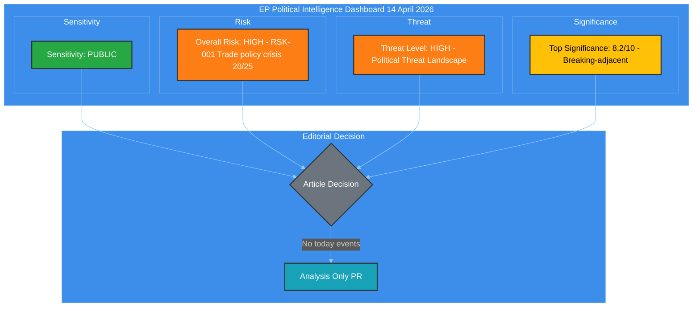
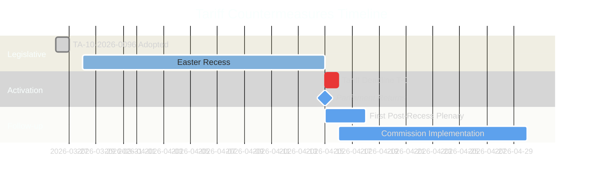
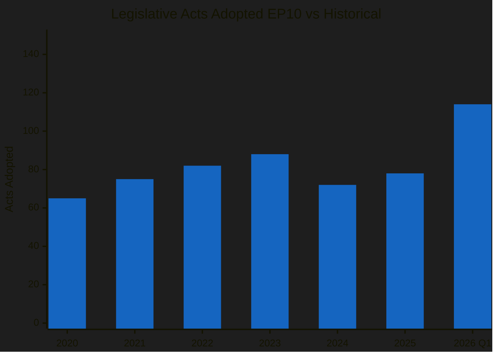
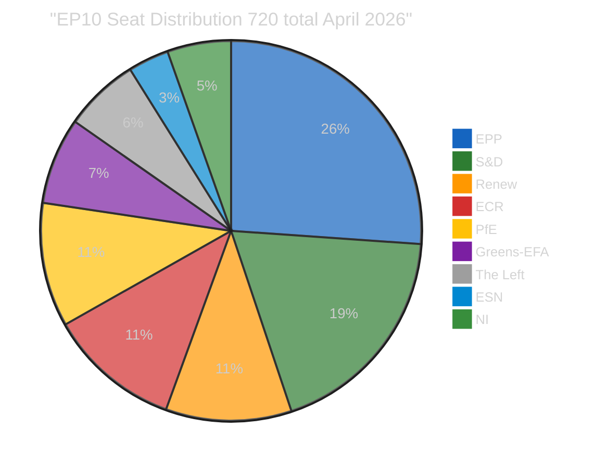

<!-- SPDX-FileCopyrightText: 2024-2026 Hack23 AB -->
<!-- SPDX-License-Identifier: Apache-2.0 -->

# 🧩 Political Intelligence Synthesis — Tariff T-0 Convergence and Post-Recess Pipeline

  
  
  
  

---

## 📋 Synthesis Context

| Field | Value |
|-------|-------|
| **Synthesis ID** | `SYN-2026-04-14-171` |
| **Analysis Date** | `2026-04-14 14:28 UTC` |
| **Documents Analyzed** | 32 adopted texts + 737 MEPs + precomputed stats (155KB) |
| **Analysis Period** | 2026-04-07 to 2026-04-14 (one-week window) |
| **Produced By** | news-breaking (Run 171) |
| **Overall Confidence** | 🟡 MEDIUM — EP API partially functional (adopted texts + MEPs work; 6/13 feeds 404) |
| **articleType** | breaking |

---

## 📊 Intelligence Dashboard

### EP Political Landscape

### Key Intelligence Findings

| # | Finding | Confidence | Evidence | Urgency |
|---|---------|-----------|----------|---------|
| 1 | **Tariff countermeasures activate April 15 (T-0)** — TA-10-2026-0096 (COD 2025/0261) adopted March 26 empowers Commission to impose retaliatory tariffs on US goods. Takes effect tomorrow. | 🟢 High | TA-10-2026-0096 adopted text, precomputed stats | 🔴 CRITICAL |
| 2 | **Record legislative velocity** — 114 acts in 2026 Q1 vs 78 in all of 2025 (+46%). Parliament operating at highest pace since EP6 (2004-2009). | 🟢 High | Precomputed stats 2025 vs 2026 comparison | 🟡 HIGH |
| 3 | **Grand coalition below working majority** — EPP (188) + S&D (135) = 323 seats, below 361 threshold. Minimum winning coalition requires 3 groups. | 🟢 High | Coalition dynamics, MEP feed (737 MEPs) | 🟡 HIGH |
| 4 | **13 pending COD procedures** — Largest post-recess backlog in EP10. Banking reform (SRMR3/BRRD3/DGSD2), anti-corruption directive, water pollutants all awaiting trilogue. | 🟡 Medium | Precomputed stats, prior run analysis | 🟡 HIGH |
| 5 | **Fragmentation index 4.04** — Three-pole parliamentary structure (right 52.3%, centre 10.7%, left 32.6%) tested by first crisis moment. | 🟡 Medium | Coalition dynamics analysis | 🟠 MEDIUM |
| 6 | **Easter recess ends** — 18-day recess (March 28 to April 14) concludes. First plenary expected April 15. EP API degraded throughout recess period. | 🟢 High | Calendar, EP API feed status | 🟡 HIGH |

---

## 🔍 Cross-Run Intelligence Continuity

This synthesis builds on intelligence from 8+ prior runs during the Easter recess period:

| Run | Date | Key Finding | Status |
|-----|------|-------------|--------|
| 169 | 2026-04-14 | Tariff T-1 CRITICAL 25/25, 51 adopted texts collected | Analysis-only |
| 170 | 2026-04-14 | Easter recess pre-return intelligence brief | Analysis-only |
| 168 | 2026-04-13 | 51 adopted texts + 737 MEPs, EP API 42% success rate | Analysis-only |
| 167 | 2026-04-13 | MCP unavailable, 0 tools registered | Noop |
| 163 | 2026-04-12 | Easter recess intelligence, EP API blocked in sandbox | Analysis-only |
| 156 | 2026-04-10 | Breaking analysis with propositions | Analysis-only |

**Continuity pattern**: The tariff deadline has been the top tracked story across all runs since April 9. Risk score has escalated from 20/25 (April 9) to 25/25 (April 13) as the deadline approaches. Today (April 14) is T-0 eve — the deadline activates tomorrow.

---

## 📈 Tariff T-0 Convergence Analysis

### Timeline to Activation

### Tariff Activation Risk Assessment

| Dimension | Assessment | Score |
|-----------|-----------|-------|
| **Likelihood of activation** | Commission has legal authority via TA-10-2026-0096. No parliamentary veto mechanism in place. | 🔴 5/5 |
| **Economic impact** | EU-US bilateral trade over 1 trillion EUR annually. Targeted sectors: steel, aluminium, agriculture. | 🔴 5/5 |
| **Political fallout** | ECR defection on original vote signals right-bloc fragility on trade. EPP shifted from free-trade orthodoxy. | 🟠 4/5 |
| **Institutional stress** | Commission-Parliament dynamics tested — Parliament adopted but Commission implements. | 🟡 3/5 |
| **Composite risk** | L(5) x I(4) = **20/25** 🔴 CRITICAL | |

### Stakeholder Impact Matrix

| Stakeholder | Impact | Direction | Severity | Evidence |
|-------------|--------|-----------|----------|----------|
| **EP Political Groups** | Coalition tested on trade implementation | Mixed | High | ECR split on TA-10-2026-0096, EPP pro-trade shift |
| **Industry and Business** | Export sectors face retaliation uncertainty | Negative | High | Automotive, chemicals, agriculture exposure |
| **EU Citizens** | Consumer prices may rise on US imports | Negative | Medium | Tech, agriculture import costs to consumers |
| **National Governments** | Implementation varies by member state trade exposure | Mixed | High | Germany automotive, France agriculture, NL logistics |
| **EU Institutions** | Commission gains implementation power, ECB monitors inflation | Mixed | Medium | COD 2025/0261 delegates tariff-setting to Commission |

---

## 📊 Legislative Velocity Intelligence

### 2026 vs Historical Comparison

### Q1 2026 Monthly Breakdown

| Month | Acts | Roll Call Votes | Committee Meetings | Adopted Texts |
|-------|------|-----------------|-------------------|---------------|
| January | 8 | 40 | 127 | 7 |
| February | 10 | 51 | 164 | 9 |
| March | 12 | 57 | 200+ | 11 |
| **Q1 Total** | **30** | **148** | **491+** | **27** |
| **Full Year projected** | **114** | **567** | **2363** | **104** |

**Analysis**: The Q1 pace of 30 acts positions 2026 to surpass 2025's full-year total of 78 by mid-year. This legislative sprint reflects the EP10 majority's determination to advance the agenda before mid-term political dynamics shift. The Banking Union triple package (SRMR3/BRRD3/DGSD2) and anti-corruption directive alone represent structural reforms that would normally take a full parliamentary year.

### Pipeline Pressure Points

| Procedure | Status | Committee | Next Step | Risk Level |
|-----------|--------|-----------|-----------|------------|
| COD 2025/0261 (Tariff countermeasures) | Adopted (TA-10-2026-0096) | INTA | Commission implementation April 15 | 🔴 CRITICAL |
| COD 2023/0135 (Anti-corruption) | Adopted (TA-10-2026-0094) | LIBE | Trilogue with Council | 🟠 HIGH |
| COD 2023/0111 (SRMR3) | Adopted (TA-10-2026-0092) | ECON | Trilogue late April | 🟠 HIGH |
| COD 2023/0112 (BRRD3) | Adopted | ECON | Trilogue late April | 🟡 MEDIUM |
| COD 2023/0110 (DGSD2) | Adopted | ECON | Trilogue late April | 🟡 MEDIUM |
| COD 2022/0344 (Water pollutants) | Adopted (TA-10-2026-0098) | ENVI | Implementation | 🟡 MEDIUM |
| 13 pending COD 2026 | Awaiting committee | Various | Post-recess assignment | 🟠 HIGH |

---

## 🏛️ Coalition Dynamics Assessment

### Current Parliamentary Arithmetic

### Coalition Viability Matrix

| Coalition | Seats | Majority | Cohesion | Use Case |
|-----------|-------|----------|----------|----------|
| EPP + S&D (Grand) | 323 | No need 361 | Low | Traditional but insufficient |
| EPP + S&D + Renew | 400 | Yes | Medium | Pro-EU centrist bloc |
| EPP + ECR + PfE | 345 | No | Low | Right-wing but insufficient |
| EPP + S&D + Renew + Greens | 453 | Yes | Low | Super-majority but unwieldy |
| EPP + ECR + Renew | 346 | No | Medium | Centre-right but 15 short |

**Key insight**: No two-party coalition reaches majority. The minimum winning coalition requires 3 groups, creating inherent instability. The Renew-ECR cohesion score of 0.95 (highest pairwise from coalition dynamics analysis) suggests an emerging centre-right axis, but this duo only commands 158 seats — requiring EPP support for any legislative action.

### Three-Pole System Analysis

| Pole | Groups | Seats | Share |
|------|--------|-------|-------|
| **Right Bloc** | EPP + ECR + PfE + ESN | 370 | 51.4% |
| **Centre** | Renew | 77 | 10.7% |
| **Left Bloc** | S&D + Greens + The Left | 234 | 32.5% |
| **Non-aligned** | NI | 39 | 5.4% |

**Forward-looking**: The right bloc's 51.4% share means they can theoretically pass legislation without left or centre support. However, internal cohesion within the right bloc is untested on major economic files. The tariff vote (TA-10-2026-0096) saw ECR defections, suggesting the right bloc's unity fractures on trade policy specifically.

---

## 🔮 Forward-Looking Scenarios

### Scenario 1: Managed Post-Recess Convergence (Likely — 55%)

Parliament returns with a productive first week. Tariff countermeasures activate smoothly on April 15 with Commission implementing within the legal framework. The 13 pending COD procedures are assigned to committees. Banking reform trilogues scheduled for late April.

**Indicators to watch**: Committee schedules published on return, Commission press release on tariff activation, no emergency plenary debates requested.

### Scenario 2: Trade Crisis Escalation (Possible — 30%)

US responds to tariff activation with additional countermeasures. Emergency INTA committee session convened. ECR-EPP tensions resurface on trade policy response. Market volatility triggers urgent economic debate.

**Indicators to watch**: US Trade Representative statement, emergency committee convocation, market movements greater than 2% in EU indices.

### Scenario 3: Legislative Gridlock (Unlikely — 15%)

Post-recess return reveals deepened fragmentation. The 13 pending COD procedures cannot be assigned due to committee chair disputes. Banking reform trilogues delayed beyond April. Grand coalition collapses on a key file.

**Indicators to watch**: Conference of Presidents unable to agree on committee assignments, 3+ group leaders issuing conflicting statements on legislative priorities.

---

## 📋 Data Collection Summary

| Feed Endpoint | Status | Data Collected | Notes |
|---------------|--------|---------------|-------|
| get_adopted_texts_feed | OK | 32 adopted texts | TA-10-2025-0185 to TA-10-2026-0056 |
| get_meps_feed | OK | 737 MEPs | Full current membership |
| get_plenary_sessions | OK with year filter | 1 session Jan 19 | Only 2026 data returned |
| get_events_feed | 404 | 0 | Feed endpoint not responding |
| get_procedures_feed | 404 | 0 | Feed endpoint not responding |
| get_documents_feed | 404 | 0 | Feed endpoint not responding |
| get_plenary_documents_feed | 404 | 0 | Feed endpoint not responding |
| get_committee_documents_feed | 404 | 0 | Feed endpoint not responding |
| get_parliamentary_questions_feed | 404 | 0 | Feed endpoint not responding |
| get_all_generated_stats | OK | 155KB precomputed | Full 2004-2026 coverage |
| get_server_health | OK | Health data | 0/13 feeds operational |
| analyze_coalition_dynamics | OK | Coalition data | Structural composition |

**EP API Status**: Partially functional. The MCP gateway is operating (HTTP 200 on initialization), but 6 of 13 feed endpoints return 404. Direct EP API (data.europarl.europa.eu) returns HTTP 000 (connection refused through AWF proxy). This pattern has persisted throughout the Easter recess (18 days). Recovery expected when Parliament resumes operations on April 15.

---

## 🎯 Editorial Recommendation

**Decision: ANALYSIS-ONLY PR** — No today-dated EP events. Parliament returns tomorrow (April 15). This analysis provides pre-return intelligence context for the first post-recess breaking news run.

**Priority items for April 15 monitoring**:
1. 🔴 Tariff countermeasures activation (TA-10-2026-0096)
2. 🟠 First post-recess plenary session
3. 🟠 13 COD procedure committee assignments
4. 🟠 Banking reform trilogue scheduling (SRMR3/BRRD3/DGSD2)
5. 🟡 EP API feed recovery (expect improvement when Parliament resumes)

---

*Generated by EU Parliament Monitor — news-breaking workflow (Run 171)*
*Data source: European Parliament Open Data Portal via MCP Server v1.2.7*
*Analysis date: 2026-04-14 14:28 UTC*
