<!-- SPDX-FileCopyrightText: 2024-2026 Hack23 AB -->
<!-- SPDX-License-Identifier: Apache-2.0 -->

# 🎭 Political Threat Analysis — 14 April 2026

  
  
  

---

## 📋 Threat Context

| Field | Value |
|-------|-------|
| **Threat Assessment ID** | `THR-2026-04-14-171` |
| **Assessment Date** | `2026-04-14 14:28 UTC` |
| **Produced By** | news-breaking (Run 171) |
| **Threat Framework** | Political Threat Landscape + PESTLE + Attack Tree |
| **Overall Threat Level** | 🟠 HIGH |
| **articleType** | breaking |

---

## 🎯 Political Threat Landscape

### Threat Environment Overview

The current threat landscape is dominated by the convergence of two pressure vectors: (1) external trade policy confrontation driven by the April 15 tariff activation, and (2) internal institutional stress from record parliamentary fragmentation and post-recess legislative backlog.

### Active Threats

| Threat ID | Description | Source | Severity | Likelihood | Impact | Confidence |
|-----------|-------------|--------|:--------:|:----------:|:------:|:----------:|
| THR-001 | **Trade escalation cascade** — US retaliatory tariffs trigger multi-round escalation, economic damage to EU exporters, and political recrimination within Parliament | External (US trade policy) | 🔴 CRITICAL | 4/5 | 5/5 | 🟡 Medium |
| THR-002 | **Coalition paralysis on crisis response** — Three-party minimum requirement slows emergency legislative response to trade crisis | Internal (fragmentation) | 🟠 HIGH | 3/5 | 4/5 | 🟡 Medium |
| THR-003 | **Right-bloc fragmentation on economic policy** — ECR defection on tariff vote spreads to banking and anti-corruption files | Internal (coalition dynamics) | 🟡 MEDIUM | 3/5 | 3/5 | 🟡 Medium |
| THR-004 | **Legislative pipeline bottleneck** — 13 pending COD plus Banking Union trilogues overwhelm committee capacity in post-recess crunch | Internal (institutional) | 🟡 MEDIUM | 3/5 | 3/5 | 🟢 High |
| THR-005 | **EP transparency gap** — Continued EP API degradation limits public and media monitoring of parliamentary activity | Internal (transparency) | 🟢 LOW | 2/5 | 2/5 | 🟢 High |

---

## 🌲 Attack Tree: Trade Policy Crisis

```mermaid
%%{init: {"theme":"dark","themeVariables":{"primaryColor":"#1565C0","primaryTextColor":"#ffffff","primaryBorderColor":"#0A3F7F","lineColor":"#90CAF9","secondaryColor":"#2E7D32","secondaryTextColor":"#ffffff","secondaryBorderColor":"#0F3F00","tertiaryColor":"#FF9800","tertiaryTextColor":"#000000","tertiaryBorderColor":"#7F4F00","mainBkg":"#1565C0","secondBkg":"#2E7D32","tertiaryBkg":"#FF9800","noteBkgColor":"#FFC107","noteTextColor":"#000000","noteBorderColor":"#7F6000","errorBkgColor":"#D32F2F","errorTextColor":"#ffffff","fontFamily":"Inter, Helvetica, Arial, sans-serif","pie1":"#1565C0","pie2":"#2E7D32","pie3":"#FF9800","pie4":"#D32F2F","pie5":"#FFC107","pie6":"#7B1FA2","pie7":"#9E9E9E","pie8":"#0288D1","pie9":"#388E3C","pie10":"#F57C00","pie11":"#C62828","pie12":"#FBC02D","pieTitleTextSize":"18px","pieSectionTextSize":"14px","pieLegendTextSize":"13px","pieStrokeColor":"#1e1e1e","pieOuterStrokeColor":"#1e1e1e","git0":"#1565C0","git1":"#2E7D32","git2":"#FF9800","git3":"#D32F2F","gitBranchLabel0":"#ffffff","gitBranchLabel1":"#ffffff","gitBranchLabel2":"#000000","gitBranchLabel3":"#ffffff","cScale0":"#1565C0","cScale1":"#2E7D32","cScale2":"#FF9800","cScale3":"#D32F2F","cScale4":"#FFC107","cScale5":"#7B1FA2","cScale6":"#9E9E9E","cScale7":"#0288D1","xyChart":{"backgroundColor":"#1e1e1e","plotColorPalette":"#1565C0,#2E7D32,#FF9800,#D32F2F,#FFC107,#7B1FA2,#9E9E9E"}}}}%%
graph TD
    ROOT["GOAL: EU Trade Policy Collapse"]

    ROOT --> A["Vector 1: External Escalation"]
    ROOT --> B["Vector 2: Internal Fragmentation"]
    ROOT --> C["Vector 3: Institutional Failure"]

    A --> A1["US imposes additional tariffs<br/>L:4 I:5 = 20 CRITICAL"]
    A --> A2["WTO dispute process fails<br/>L:2 I:3 = 6 MEDIUM"]
    A --> A3["Allied trade partners side with US<br/>L:1 I:4 = 4 LOW"]

    B --> B1["ECR-EPP split deepens on trade<br/>L:3 I:4 = 12 HIGH"]
    B --> B2["PfE blocks emergency legislation<br/>L:2 I:3 = 6 MEDIUM"]
    B --> B3["S&D demands worker protection<br/>amendments blocking swift response<br/>L:2 I:2 = 4 LOW"]

    C --> C1["Commission exceeds tariff mandate<br/>L:1 I:4 = 4 LOW"]
    C --> C2["INTA committee overwhelmed<br/>L:3 I:2 = 6 MEDIUM"]
    C --> C3["Council refuses to align with EP<br/>L:2 I:4 = 8 MEDIUM"]

    style ROOT fill:#dc3545,stroke:#333,stroke-width:2px,color:#fff
    style A1 fill:#dc3545,stroke:#333,color:#fff
    style B1 fill:#fd7e14,stroke:#333,color:#fff
    style C3 fill:#ffc107,stroke:#333,color:#000
    style A fill:#6c757d,stroke:#333,color:#fff
    style B fill:#6c757d,stroke:#333,color:#fff
    style C fill:#6c757d,stroke:#333,color:#fff
```

### Critical Path Analysis

The highest-probability path to trade policy crisis runs through:
1. **A1** (US additional tariffs, L:4) triggers
2. **B1** (ECR-EPP split deepens, L:3) which leads to
3. **C2** (INTA overwhelmed, L:3) resulting in delayed EU response

This cascade has a combined probability of approximately 30% — consistent with our Scenario 2 assessment.

---

## 🌍 PESTLE Analysis: Post-Recess Environment

| Factor | Assessment | Impact Direction | Evidence |
|--------|-----------|:----------------:|----------|
| **Political** | Three-pole system faces first crisis test. Right bloc (51.4%) theoretically dominant but internally divided on trade. Grand coalition impossible without third party. | 🔴 Negative | Coalition dynamics: fragmentation 4.04, EPP+S&D = 323 (below 361 majority) |
| **Economic** | Trade confrontation risk threatens EU export sectors. Banking reform trilogues critical for financial stability. Record legislative output reflects economic policy urgency. | 🟠 Mixed | TA-10-2026-0096 (tariff powers), SRMR3/BRRD3/DGSD2 (banking package) |
| **Social** | Consumer price increases from tariffs disproportionately affect lower-income households. Anti-corruption directive addresses public trust deficit. | 🟠 Mixed | COD 2025/0261 impact assessment, Eurobarometer corruption concern rankings |
| **Technological** | EP API degradation during recess limits transparency monitoring. Digital economy increasingly affected by trade policy decisions. | 🟡 Neutral | EP API 0/13 feeds operational, get_server_health status |
| **Legal** | TA-10-2026-0096 creates novel legal framework for autonomous EU trade defence. Anti-corruption directive (TA-10-2026-0094) strengthens rule-of-law enforcement. | 🟢 Positive | Two landmark adopted texts creating new legal instruments |
| **Environmental** | Water pollutants directive (TA-10-2026-0098) advances environmental protection. Trade tariffs may shift supply chains with environmental implications. | 🟡 Neutral | COD 2022/0344 implementation pending |

---

## 🛡️ Threat Mitigation Assessment

### Existing Mitigations

| Threat | Mitigation | Effectiveness | Gap |
|--------|-----------|:------------:|-----|
| THR-001 | Commission graduated response mechanism in TA-10-2026-0096 | 🟡 Medium | No Parliamentary veto on Commission tariff-setting — democratic deficit risk |
| THR-002 | EPP-S&D-Renew three-party coalition (400 seats) available | 🟡 Medium | Requires policy compromises that slow response time |
| THR-003 | Issue-by-issue coalition building (not permanent alliance) | 🟡 Medium | Transaction costs of per-vote coalition formation |
| THR-004 | Conference of Presidents prioritisation authority | 🟢 High | Established institutional mechanism for agenda management |
| THR-005 | Alternative data sources (adopted texts endpoint, precomputed stats) | 🟢 High | Feed endpoints expected to recover when Parliament resumes |

### Recommended Monitoring Triggers

| Trigger | Indicates | Action Required |
|---------|-----------|----------------|
| US Trade Representative statement post-April 15 | Trade escalation trajectory | Activate INTA emergency monitoring |
| EPP-ECR joint statement on trade | Right-bloc cohesion status | Update coalition dynamics assessment |
| ECON committee April trilogue schedule | Banking reform timeline | Update pipeline analysis |
| EP API feed recovery to >50% operational | Transparency restoration | Expand feed-based analysis |
| Conference of Presidents agenda (April 15-16) | Post-recess prioritisation | Update legislative gridlock risk |

---

## 🔮 Threat Trajectory

| Timeframe | Threat Level | Key Driver | Confidence |
|-----------|:-----------:|-----------|:----------:|
| **Current** (April 14) | 🟠 HIGH | Tariff T-0 eve, recess final day | 🟡 Medium |
| **April 15-18** | 🔴 CRITICAL potential | Tariff activation + Parliament return + first votes | 🔴 Low |
| **April 19-30** | 🟠 HIGH to 🟡 MODERATE | Depends on US response and coalition dynamics | 🔴 Low |
| **May 2026** | 🟡 MODERATE baseline | Banking trilogues normalise, tariff response stabilises | 🔴 Low |

**Confidence note**: Low confidence for forward projections due to (1) Easter recess information gap, (2) US trade policy unpredictability, (3) untested EP10 crisis response mechanisms.

---

*Generated by EU Parliament Monitor — news-breaking workflow (Run 171)*
*Data source: European Parliament Open Data Portal via MCP Server v1.2.7*
*Analysis date: 2026-04-14 14:28 UTC*
