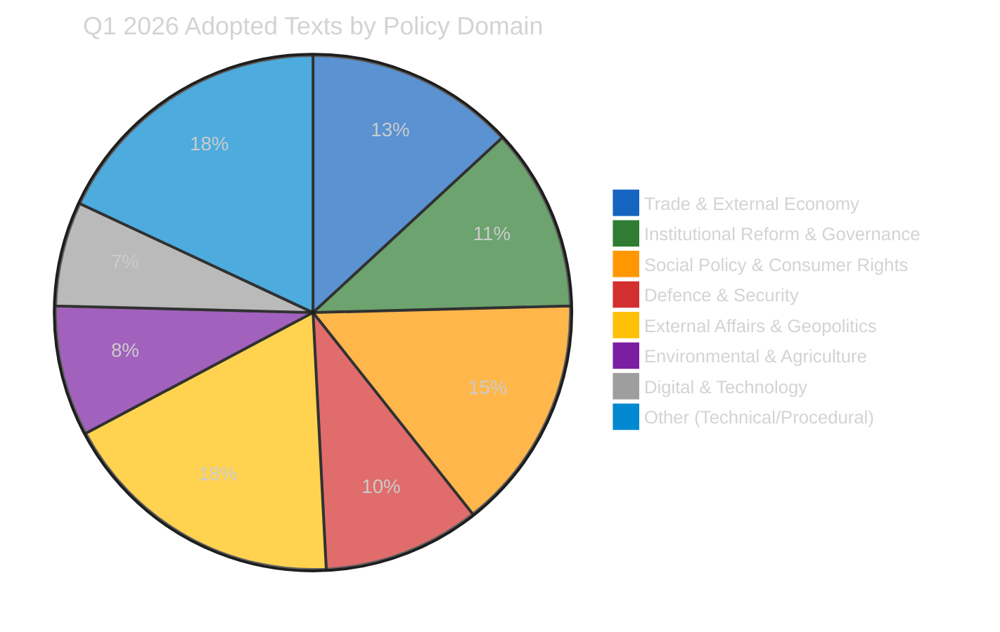
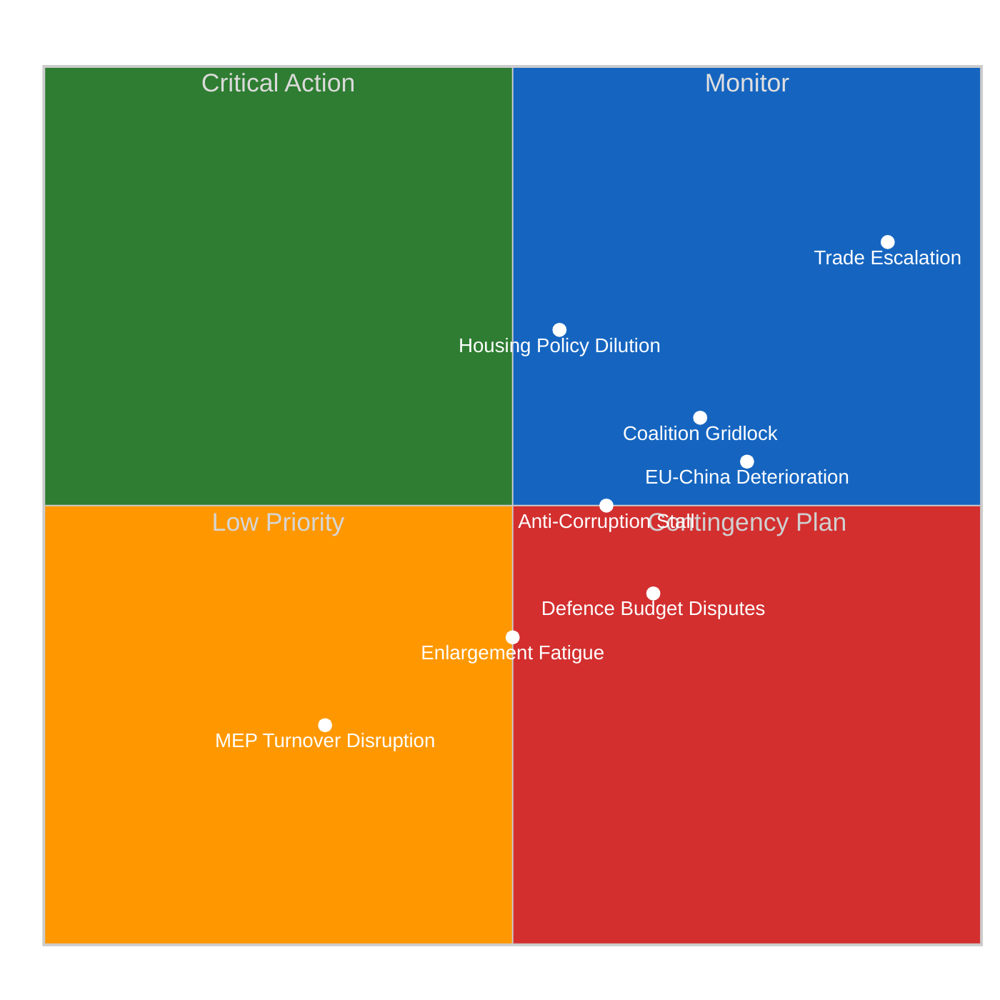
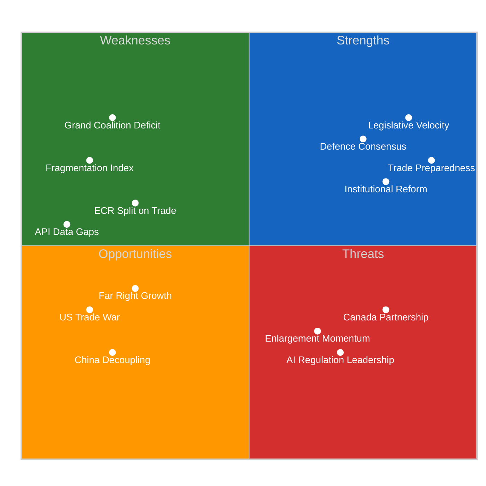
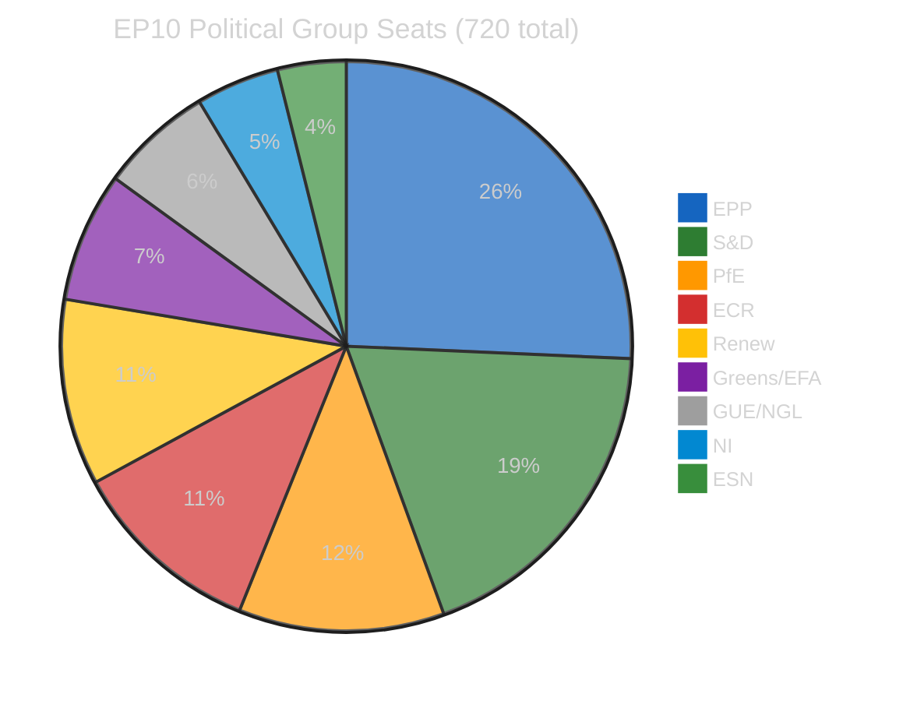
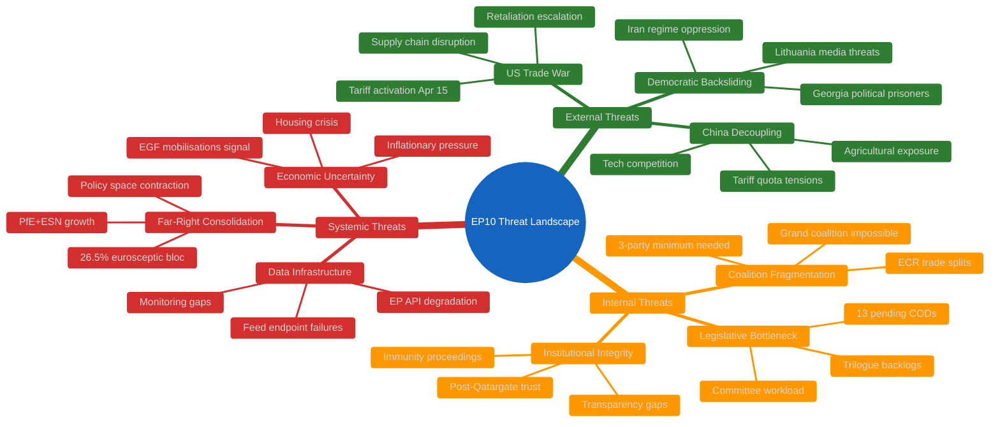
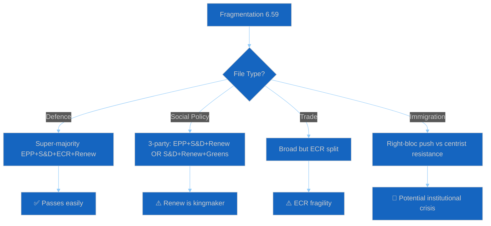

# Breaking — 2026-04-14

<h2 id="section-supplementary-intelligence">Supplementary Intelligence</h2>

### Political Classification

  
  
  

---

### 📋 Classification Context

| Field | Value |
|-------|-------|
| **Classification Date** | 2026-04-14 19:30 UTC |
| **Items Classified** | 61 adopted texts from Q1 2026 (Jan 20 – Mar 26) |
| **Framework** | 7-dimension political classification |
| **articleType** | breaking |

---

### 📊 Policy Domain Distribution

#### Domain Breakdown

##### 1. Trade & External Economy (8 texts, 13%)

| Text | Title | Session | Classification |
|------|-------|---------|---------------|
| TA-10-2026-0096 | US tariff countermeasures | Mar 26 | CRISIS RESPONSE — autonomous trade defence |
| TA-10-2026-0101 | EU-China tariff quotas | Mar 26 | RECALIBRATION — trade partner adjustment |
| TA-10-2026-0030 | EU-Mercosur safeguard | Feb 10 | PROTECTIVE — agricultural defence |
| TA-10-2026-0086 | WTO 14th Ministerial prep | Mar 12 | MULTILATERAL — global trade governance |
| TA-10-2026-0008 | EU-Mercosur ECJ opinion | Jan 21 | CONSTITUTIONAL — Treaty compatibility |
| TA-10-2026-0072 | EU-Ecuador Europol cooperation | Mar 11 | BILATERAL — law enforcement |
| TA-10-2026-0100 | EU-Lebanon scientific cooperation | Mar 26 | PARTNERSHIP — PRIMA programme |
| TA-10-2026-0048 | Agri-food unfair trading practices | Feb 12 | REGULATORY — supply chain enforcement |

**Political dynamics**: Trade is the defining issue of Q1 2026. The US tariff countermeasures (TA-0096) represent the EP's most assertive trade action in years, adopted with broad cross-party support. The simultaneous EU-China (TA-0101) and EU-Mercosur (TA-0030) actions show the EP managing a three-front trade posture. ECR's internal split on TA-0096 revealed right-bloc fragility on economic policy. 🟡 MEDIUM confidence.

##### 2. Institutional Reform & Governance (7 texts, 11%)

| Text | Title | Session | Classification |
|------|-------|---------|---------------|
| TA-10-2026-0094 | Anti-corruption directive | Mar 26 | REFORM — post-Qatargate |
| TA-10-2026-0088 | Braun immunity waiver | Mar 26 | ACCOUNTABILITY — internal discipline |
| TA-10-2026-0063 | Better Law-Making report | Mar 10 | SELF-ASSESSMENT — regulatory fitness |
| TA-10-2026-0065 | Public access to documents | Mar 10 | TRANSPARENCY — citizen access |
| TA-10-2026-0006 | Electoral Act reform | Jan 20 | CONSTITUTIONAL — democratic process |
| TA-10-2026-0060 | ECB VP appointment | Mar 10 | INSTITUTIONAL — monetary governance |
| TA-10-2026-0033 | ECB Supervisory Board VC | Feb 10 | INSTITUTIONAL — banking supervision |

**Political dynamics**: The EP is systematically addressing its post-Qatargate credibility deficit. Anti-corruption (TA-0094) is the flagship, but the broader cluster — transparency, electoral reform, Better Law-Making — shows institutional self-improvement across multiple dimensions. The Braun immunity waiver demonstrates willingness to apply accountability mechanisms to sitting MEPs. 🟢 HIGH confidence.

##### 3. Social Policy & Consumer Rights (9 texts, 15%)

| Text | Title | Session | Classification |
|------|-------|---------|---------------|
| TA-10-2026-0064 | Housing crisis | Mar 10 | SOCIAL — cost of living |
| TA-10-2026-0050 | Workers' rights / subcontracting | Feb 12 | LABOR — gig economy protection |
| TA-10-2026-0009 | Air passenger rights | Jan 21 | CONSUMER — transport |
| TA-10-2026-0085 | Package travel protections | Mar 12 | CONSUMER — tourism |
| TA-10-2026-0076 | European Semester employment | Mar 11 | COORDINATION — social priorities |
| TA-10-2026-0058 | EU Talent Pool | Mar 10 | MIGRATION — skilled labor |
| TA-10-2026-0004 | Financial stability / safeguarding | Jan 20 | ECONOMIC — uncertainty response |
| TA-10-2026-0073 | EGF Tupperware Belgium | Mar 11 | SOCIAL — worker displacement |
| TA-10-2026-0038 | EGF Audi Belgium | Feb 11 | SOCIAL — automotive transition |

**Political dynamics**: The social cluster is the largest, reflecting broad EP attention to cost-of-living and economic security. Two EGF mobilisations (Tupperware and Audi in Belgium) signal continued manufacturing restructuring in key member states. The housing crisis resolution required cross-party building from S&D-Greens toward the centre. 🟢 HIGH confidence on domestic political salience.

##### 4. Defence & Security (6 texts, 10%)

| Text | Title | Session | Classification |
|------|-------|---------|---------------|
| TA-10-2026-0079 | Defence single market | Mar 11 | STRATEGIC — market barriers |
| TA-10-2026-0040 | Strategic defence partnerships | Feb 11 | STRATEGIC — alliance building |
| TA-10-2026-0020 | Drones and new warfare | Jan 22 | TECHNOLOGY — military modernization |
| TA-10-2026-0022 | Tech sovereignty | Jan 22 | STRATEGIC — digital infrastructure |
| TA-10-2026-0015 | EU Magnitsky sanctions | Jan 21 | FOREIGN POLICY — impunity |
| TA-10-2026-0005 | Humanitarian aid principles | Jan 20 | HUMANITARIAN — crisis response |

**Political dynamics**: Defence is a consensus zone across EPP-S&D-ECR-Renew, making it one of the most productive policy domains. The January-to-March acceleration mirrors the Commission's European Defence Industrial Strategy timeline. GUE/NGL and parts of Greens/EFA remain sceptical, but the super-majority coalition on defence is stable. 🟢 HIGH confidence on continued acceleration.

##### 5. External Affairs & Geopolitics (11 texts, 18%)

Key texts include EU enlargement strategy (TA-0077), EU-Canada cooperation (TA-0078), Georgian political prisoners (TA-0083), Ukraine Support Loan (TA-0035), CFSP annual report (TA-0012), Iran oppression (TA-0046), Global Gateway (TA-0104), Syria situation (TA-0053), Lithuania democratic threats (TA-0024), and the Albania/Montenegro accession conventions (TA-0054, TA-0055).

**Political dynamics**: External affairs is the largest domain by text count, reflecting the EP's role as a normative foreign policy actor. Ukraine remains the top priority with continued financial support. The EU-Canada text (TA-0078) is notable as a direct response to geopolitical realignment — Canada seeking closer EU ties as US trade relations deteriorate. 🟡 MEDIUM confidence that enlargement strategy will accelerate given security motivations.

---

### 🧭 Policy Domain Trajectory

**Interpretation**: The legislative agenda intensified month-over-month, with March being the most productive and politically significant session. The March 26 session was a culmination — trade, corruption, and institutional reform texts all reached adoption in a pre-recess sprint.

---

### 📚 Sources

- EP adopted texts year listing (2026, 61 items via MCP)
- EP adopted texts feed (today, 21 items updated)
- Political classification framework per political-classification-guide.md

### Risk Assessment

  
  
  
  

---

### 📋 Risk Assessment Context

| Field | Value |
|-------|-------|
| **Assessment Date** | 2026-04-14 19:35 UTC |
| **Risk Framework** | Likelihood × Impact 5×5 matrix (per political-risk-methodology.md) |
| **Scope** | Post-recess challenges facing EP10 (April–June 2026) |
| **articleType** | breaking |

---

### 📊 Risk Matrix (5×5)

---

### 🔴 Critical Risks (Score ≥ 16/25)

#### Risk 1: US-EU Trade Escalation
| Dimension | Assessment |
|-----------|------------|
| **Likelihood** | 4/5 (HIGH) — Tariff activation April 15 is confirmed |
| **Impact** | 5/5 (CRITICAL) — Direct market effects, supply chain disruption, political bandwidth consumption |
| **Risk Score** | **20/25** 🔴 CRITICAL |
| **Time Horizon** | Immediate (April 15–30) |
| **Affected Groups** | All — EPP leads response, ECR internally divided, PfE anti-free-trade wing energized |
| **Mitigation** | TA-10-2026-0096 already adopted; Commission implementing. EP may need emergency debate if US retaliates further |
| **Confidence** | 🟡 MEDIUM — US response trajectory uncertain |

**Evidence**: TA-10-2026-0096 (COD 2025/0261) adopted March 26 with broad cross-party support. Activates April 15. The EP front-loaded trade defence in Q1 specifically for this contingency. The parallel EU-China tariff quota modification (TA-10-2026-0101) suggests the EP is hedging — adjusting Asian trade terms while confronting US. Three simultaneous trade fronts (US, China, Mercosur) create compound risk.

#### Risk 2: Coalition Paralysis on Domestic Files
| Dimension | Assessment |
|-----------|------------|
| **Likelihood** | 3/5 (MEDIUM) — Fragmentation is structural but Q1 showed coalition-building capacity |
| **Impact** | 4/5 (HIGH) — Housing, workers' rights, consumer protection all require working majorities |
| **Risk Score** | **12/25** 🟠 HIGH |
| **Time Horizon** | Medium-term (April–June 2026) |
| **Affected Groups** | S&D (social agenda), Greens/EFA (environmental), EPP (leadership credibility) |
| **Mitigation** | Renew as kingmaker can bridge EPP-S&D on centrist files |
| **Confidence** | 🟡 MEDIUM — Q1 productivity suggests institutional capacity exists |

**Evidence**: Grand coalition deficit of -41 seats (EPP 185 + S&D 135 = 320 vs. 361 needed). Minimum winning coalition requires 3 parties. Q1 demonstrated this is workable (114 legislative acts), but post-recess dynamics could shift as MEPs return with national-level political pressures. Housing crisis (TA-10-2026-0064) is the litmus test — it requires cross-bloc support that may fracture on implementation details.

---

### 🟠 High Risks (Score 10–15/25)

#### Risk 3: EU-China Trade Deterioration
| Dimension | Assessment |
|-----------|------------|
| **Likelihood** | 3/5 (MEDIUM) — tariff quota modification is a managed adjustment, not a rupture |
| **Impact** | 4/5 (HIGH) — manufacturing, agriculture, and tech sectors all exposed |
| **Risk Score** | **12/25** 🟠 HIGH |
| **Mitigation** | TA-10-2026-0101 provides negotiated framework; not a unilateral action |

#### Risk 4: Housing Policy Dilution During Trilogue
| Dimension | Assessment |
|-----------|------------|
| **Likelihood** | 4/5 (HIGH) — Council typically weakens social texts |
| **Impact** | 3/5 (MEDIUM) — resolution is non-binding, but sets political expectations |
| **Risk Score** | **12/25** 🟠 HIGH |
| **Mitigation** | S&D-Greens coalition pressure + citizen salience may sustain ambition |

#### Risk 5: Anti-Corruption Directive Stall in Council
| Dimension | Assessment |
|-----------|------------|
| **Likelihood** | 3/5 (MEDIUM) — some member states resistant to EU-wide standards |
| **Impact** | 3/5 (MEDIUM) — institutional credibility at stake post-Qatargate |
| **Risk Score** | **9/25** 🟡 MEDIUM |
| **Mitigation** | Strong EP mandate from March 26 adoption; public opinion supportive |

#### Risk 6: Defence Budget Disputes
| Dimension | Assessment |
|-----------|------------|
| **Likelihood** | 2/5 (LOW) — broad consensus exists |
| **Impact** | 4/5 (HIGH) — strategic autonomy timeline at stake |
| **Risk Score** | **8/25** 🟡 MEDIUM |
| **Mitigation** | EPP-S&D-ECR-Renew super-majority on defence files is stable |

---

### 🟢 Low Risks (Score < 10/25)

#### Risk 7: Enlargement Fatigue
| Score | **6/25** | Likelihood 2/5, Impact 3/5 |

Enlargement strategy (TA-10-2026-0077) adopted March 11 with EP support, but accession timelines remain Council-dependent. Ukraine candidacy has security momentum. Western Balkans progress is slow but steady. Risk is more long-term than Q2 2026.

#### Risk 8: MEP Turnover Disruption
| Score | **4/25** | Likelihood 2/5, Impact 2/5 |

37 MEP turnovers in 2026 (5.1% rate) is within normal range. Institutional memory risk rated LOW by precomputed analytics. MEP stability index at 0.949 is strong.

---

### 📈 Risk Trend Analysis

| Risk | Q4 2025 | Q1 2026 | Q2 2026 (Projected) | Trend |
|------|---------|---------|---------------------|-------|
| Trade Escalation | MEDIUM | HIGH | CRITICAL | ↑↑ |
| Coalition Paralysis | LOW | MEDIUM | HIGH | ↑ |
| EU-China Trade | LOW | MEDIUM | HIGH | ↑ |
| Housing Dilution | N/A | HIGH | HIGH | → |
| Anti-Corruption Stall | N/A | LOW | MEDIUM | ↑ |
| Defence Disputes | LOW | LOW | LOW | → |

---

### 📚 Sources

- EP adopted texts (61 items, 2026 Q1) — adoption dates and procedure references
- Precomputed EP statistics 2026 — political composition, fragmentation index
- Prior analysis: Run 171 risk-assessment.md — tariff-focused risk analysis
- Political risk methodology per political-risk-methodology.md

### Significance Scoring

  
  
  

---

### 📋 Scoring Context

| Field | Value |
|-------|-------|
| **Scoring Date** | 2026-04-14 19:25 UTC |
| **Items Scored** | 15 key adopted texts from Q1 2026 |
| **Scoring Framework** | 7-dimension political classification (per political-classification-guide.md) |
| **articleType** | breaking |

---

### 🏆 Significance Rankings

#### Tier 1 — Critical Significance (Score ≥ 8.0)

| Rank | Text ID | Title | Score | Rationale |
|------|---------|-------|-------|-----------|
| 1 | **TA-10-2026-0096** | US Tariff Countermeasures | **9.5/10** | 🔴 CRITICAL — Activates April 15, direct market impact, cross-party adoption signals institutional consensus on trade defence. Unprecedented EU autonomous trade retaliation. First real test of EP10 on crisis legislation. |
| 2 | **TA-10-2026-0094** | Anti-Corruption Directive (COD 2023/0135) | **8.8/10** | Post-Qatargate institutional reform. Cross-party support demonstrates EP self-cleansing capacity. Trilogue ahead will test Council commitment. Sets precedent for EU-wide anti-corruption standards. |
| 3 | **TA-10-2026-0101** | EU-China Tariff Quota Modification | **8.2/10** | Strategic trade recalibration with China alongside US tariff response. Agricultural and manufacturing implications for EU27. Signals EU positioning in US-China trade conflict geometry. |

#### Tier 2 — High Significance (Score 6.0–7.9)

| Rank | Text ID | Title | Score | Rationale |
|------|---------|-------|-------|-----------|
| 4 | **TA-10-2026-0079** | Defence Single Market | **7.8/10** | Core strategic autonomy file. EPP-S&D-ECR-Renew consensus. Implements European Defence Industrial Strategy. Defence spending debates will intensify. |
| 5 | **TA-10-2026-0064** | Housing Crisis Resolution | **7.5/10** | Addresses top citizen concern (cost of living). S&D-Greens flagship with centrist support needed. Implementation will vary dramatically across EU27. |
| 6 | **TA-10-2026-0077** | EU Enlargement Strategy | **7.3/10** | Western Balkans and Ukraine candidacy framework. High geopolitical significance. Council must align on accession timelines. |
| 7 | **TA-10-2026-0035** | Ukraine Support Loan 2026-2027 | **7.2/10** | Continuation of EU financial commitment to Ukraine. Broad coalition support but cost pressures mounting. |
| 8 | **TA-10-2026-0066** | Copyright and Generative AI | **7.0/10** | Emerging tech policy with global impact. Creative industry vs. tech company tensions. Sets regulatory precedent alongside AI Act implementation. |
| 9 | **TA-10-2026-0078** | EU-Canada Enhanced Cooperation | **6.8/10** | Geopolitical hedging against US trade unpredictability. Canada as strategic partner in new trade landscape. |
| 10 | **TA-10-2026-0030** | EU-Mercosur Safeguard Clause | **6.5/10** | Agricultural protection mechanism. Politically sensitive in France, Ireland. Safeguards ease ratification path for broader Mercosur agreement. |

#### Tier 3 — Medium Significance (Score 4.0–5.9)

| Rank | Text ID | Title | Score | Rationale |
|------|---------|-------|-------|-----------|
| 11 | **TA-10-2026-0009** | Air Passenger Rights | **5.8/10** | 13-year legislative journey since COD 2013/0072. Direct consumer impact but incremental reform. |
| 12 | **TA-10-2026-0050** | Subcontracting / Workers' Rights | **5.5/10** | Labor protection in gig economy context. S&D priority. Implementation challenges ahead. |
| 13 | **TA-10-2026-0060** | ECB Vice-President Appointment | **5.2/10** | Institutional continuity. Routine but signals EP oversight of monetary policy governance. |
| 14 | **TA-10-2026-0076** | European Semester Employment 2026 | **5.0/10** | Annual coordination exercise. Policy recommendations non-binding but politically significant. |
| 15 | **TA-10-2026-0104** | Global Gateway Assessment | **4.8/10** | Development aid strategy review. Geopolitical competition with BRI. Limited immediate legislative impact. |

---

### 📈 Scoring Methodology

Each text is scored on a 1-10 scale integrating:

1. **Immediate Impact** (weight 25%): Direct effect on citizens, markets, or institutions within 30 days
2. **Political Significance** (weight 20%): Coalition dynamics implications, group alignment patterns
3. **Legislative Complexity** (weight 15%): Procedure type (COD vs. resolution), trilogue requirements
4. **Geopolitical Relevance** (weight 15%): External affairs implications, EU strategic positioning
5. **Public Salience** (weight 10%): Media attention, citizen concern mapping
6. **Institutional Precedent** (weight 10%): First-of-kind, reform trajectory, constitutional significance
7. **Urgency** (weight 5%): Time-sensitive implementation or activation deadlines

---

### 🎯 Breaking News Threshold Assessment

**Threshold for breaking news article generation**: Score ≥ 8.0 AND publication/event date = TODAY

| Criterion | Result |
|-----------|--------|
| Top-scoring item (TA-10-2026-0096) | Score 9.5 ✅ |
| Published/updated TODAY? | Feed updated today, but adopted 2026-03-26 ⚠️ |
| New information today? | EP data portal bulk metadata refresh only |
| Run 171 coverage? | Already covered tariff T-0 angle |

**Decision**: No breaking news article — the high-scoring items were adopted in earlier sessions and are not "new" today. The feed update represents metadata refresh, not new legislative action. Analysis-only PR is the correct output for this run.

---

### 📚 Data Sources

- EP adopted texts feed (timeframe: today, 21 items)
- EP adopted texts year listing (2026, 61 items)
- Precomputed statistics 2004-2026
- Prior analysis: Run 171 significance-scoring.md

### Swot Analysis

  
  
  

---

### 📋 SWOT Context

| Field | Value |
|-------|-------|
| **Assessment Date** | 2026-04-14 19:40 UTC |
| **Framework** | Evidence-based SWOT per political-swot-framework.md |
| **Scope** | EP10 institutional position for April–June 2026 |
| **articleType** | breaking |

---

### 📊 SWOT Matrix

---

### 💪 Strengths

#### S1: Record Legislative Velocity (Severity: HIGH ✅)
**Evidence**: 114 legislative acts in Q1 2026 vs. 78 total in 2025 (+46%). 61 adopted texts across trade, defence, social, institutional reform, and external affairs. March 26 session was the most productive single session of EP10.

**Strategic implication**: The EP enters the post-recess period with demonstrated institutional capacity. The pre-recess sprint showed that complex multi-party coalitions can be formed and sustained on priority files. This productivity record strengthens the EP's negotiating position vis-à-vis Council and Commission.

#### S2: Defence Policy Consensus (Severity: HIGH ✅)
**Evidence**: Four defence-related texts adopted in Q1 (TA-0020, TA-0022, TA-0040, TA-0079) with EPP-S&D-ECR-Renew support. Defence single market (TA-0079) passed with minimal opposition. Tech sovereignty (TA-0022) bridges the defence-digital divide.

**Strategic implication**: The super-majority on defence (4 groups = ~475 seats) is the EP's most reliable coalition and provides a stable foundation for the European Defence Industrial Strategy implementation.

#### S3: Trade Crisis Preparedness (Severity: CRITICAL ✅)
**Evidence**: TA-10-2026-0096 (US tariff countermeasures) adopted March 26 with cross-party support. The EP acted proactively — the legislation was ready before the April 15 activation date. This is rare institutional foresight for crisis legislation.

**Strategic implication**: The EP can point to concrete legislative action when the tariffs activate. This positions the Parliament as a responsive institution, unlike the Council which often lags on urgent trade matters.

#### S4: Institutional Reform Momentum (Severity: MEDIUM ✅)
**Evidence**: Anti-corruption directive (TA-0094), electoral reform (TA-0006), Better Law-Making (TA-0063), public access to documents (TA-0065), and the Braun immunity waiver (TA-0088) collectively demonstrate sustained self-reform.

**Strategic implication**: The Qatargate shadow is being actively addressed through legislative and procedural means, rebuilding institutional credibility.

---

### 🔻 Weaknesses

#### W1: Grand Coalition Impossibility (Severity: CRITICAL ⚠️)
**Evidence**: EPP (185) + S&D (135) = 320 seats vs. 361 majority threshold. Deficit of -41 seats. This is the most fragmented EP since direct elections began.

**Strategic implication**: Every major legislative file requires at least 3 parties. This creates negotiation complexity and slows consensus-building. The minimum winning coalition (EPP+S&D+Renew = 396) has a comfortable margin, but securing Renew's support on every file is not guaranteed.

#### W2: Extreme Fragmentation (Severity: HIGH ⚠️)
**Evidence**: Fragmentation index 6.59 — indicating an effective 6.6-party system. Eight political groups plus NI. The right bloc (EPP+ECR+PfE+ESN = 376, 52.3%) theoretically holds a majority, but ideological coherence on economic files is questionable.

**Strategic implication**: Coalition-building requires constant issue-by-issue negotiation. There is no stable governing majority. The 52.3% right-bloc share has never been tested on a controversial economic file — the ECR split on tariffs (TA-0096) revealed that right-bloc unity is not automatic.

#### W3: ECR Internal Divisions on Trade (Severity: MEDIUM ⚠️)
**Evidence**: ECR split on US tariff countermeasures (TA-10-2026-0096). Some ECR members opposed retaliatory tariffs, preferring bilateral negotiation with the US. This split mirrors broader tensions between sovereigntist and free-market wings within ECR.

**Strategic implication**: ECR as a reliable coalition partner on economic files is in question. This weakens the "right majority" scenario and makes EPP dependent on Renew or S&D for economic legislation.

#### W4: EP API and Data Infrastructure Gaps (Severity: LOW ⚠️)
**Evidence**: This run encountered 6/13 feed endpoints returning 404, 4 advisory feeds timing out, coalition dynamics API timed out. Only adopted texts and MEPs feeds functioned reliably.

**Strategic implication**: External monitoring and transparency of EP activity is hampered by data infrastructure issues. This reduces real-time accountability and public engagement — ironic given the public access to documents resolution (TA-0065).

---

### 🌟 Opportunities

#### O1: EU-Canada Strategic Partnership (Severity: HIGH 🟢)
**Evidence**: TA-10-2026-0078 adopted March 11 — enhanced cooperation in current geopolitical context, referencing threats to Canada's economic stability. This is a direct geopolitical response to US trade uncertainty.

**Strategic implication**: Canada becomes a strategic alternative trade partner. The EP can position the EU as a reliable partner for democracies seeking to diversify away from US dependency. This strengthens the EU's normative trade model.

#### O2: AI/Copyright Regulatory Leadership (Severity: HIGH 🟢)
**Evidence**: TA-10-2026-0066 (copyright and generative AI) adopted March 10. This complements the AI Act implementation and positions the EU as the global standard-setter on AI governance.

**Strategic implication**: First-mover advantage on AI regulation creates a Brussels Effect, where EU standards become de facto global standards. This is particularly powerful given US regulatory retreat under current administration.

#### O3: Enlargement Momentum (Severity: MEDIUM 🟢)
**Evidence**: TA-10-2026-0077 (EU enlargement strategy) adopted March 11. Ukraine candidacy has security-driven momentum. Western Balkans process continues.

**Strategic implication**: Enlargement offers both geopolitical strengthening and a compelling narrative for EU relevance. The security argument for Ukraine's accession path has shifted previously reluctant member states.

---

### 🔥 Threats

#### T1: US Trade War Escalation (Severity: CRITICAL 🔴)
**Evidence**: TA-10-2026-0096 activates April 15. US retaliation potential is HIGH. Trade bandwidth could consume political energy needed for domestic agenda.

**Strategic implication**: If the US escalates, the EP may need emergency sessions. This could derail the legislative backlog, delay housing and anti-corruption trilogues, and force the Parliament into reactive mode.

#### T2: China Trade Decoupling Pressure (Severity: HIGH 🔴)
**Evidence**: TA-10-2026-0101 (EU-China tariff quotas) adjusts market access terms. This occurs against a backdrop of global supply chain restructuring and US pressure to decouple from China.

**Strategic implication**: The EP is trying to manage — not rupture — the China relationship. But external pressure (US demands for allied decoupling) may force harder choices. Agriculture and manufacturing sectors in Germany, France, and Italy are especially exposed.

#### T3: Far-Right Group Consolidation (Severity: HIGH 🔴)
**Evidence**: PfE (84) + ESN (28) = 112 seats (15.6% combined). When added to ECR (79), the eurosceptic/nationalist bloc reaches 191 seats (26.5%). The right bloc's 52.3% includes these groups.

**Strategic implication**: While the far-right is excluded from formal coalition-building, their growing seat share constrains the policy space available to centrist coalitions. On immigration, sovereignty, and regulatory burden files, the far-right sets the floor for debate. The EP's ability to maintain progressive positions on housing, workers' rights, and environmental policy depends on the centrist 3-party coalition holding.

---

### 📈 SWOT Dynamics Assessment

| Factor | Trajectory | Confidence |
|--------|-----------|------------|
| Legislative velocity | ↑ Increasing | 🟢 HIGH |
| Defence consensus | → Stable | 🟢 HIGH |
| Grand coalition gap | → Stable (structural) | 🟢 HIGH |
| Trade escalation risk | ↑↑ Increasing rapidly | 🟡 MEDIUM |
| Far-right growth | ↗ Gradual increase | 🟡 MEDIUM |
| AI regulatory leadership | ↑ Increasing | 🟢 HIGH |
| Enlargement momentum | ↗ Moderate increase | 🟡 MEDIUM |

---

### 📚 Sources

- EP adopted texts (61 items, Q1 2026)
- Precomputed EP statistics — political composition, fragmentation metrics
- SWOT framework per political-swot-framework.md
- Prior analysis: Run 171 swot-analysis.md

### Synthesis Summary

  
  
  
  

---

### 📋 Synthesis Context

| Field | Value |
|-------|-------|
| **Synthesis ID** | `SYN-2026-04-14-172` |
| **Analysis Date** | `2026-04-14 19:20 UTC` |
| **Documents Analyzed** | 61 adopted texts (Q1 2026) + 737 MEP feed updates + precomputed stats |
| **Analysis Period** | 2026-01-20 to 2026-04-14 (full Q1 review) |
| **Produced By** | news-breaking (Run 172) |
| **Overall Confidence** | 🟡 MEDIUM — EP API degraded (adopted texts + MEPs operational; 6/13 feeds 404) |
| **articleType** | breaking |
| **Differentiation from Run 171** | Run 171 focused on tariff T-0 eve intelligence; this run provides full Q1 productivity audit and multi-domain pressure mapping |

---

### 📊 Intelligence Dashboard

#### Q1 2026 Output Summary

| Metric | Q1 2026 | Full Year 2025 | Change |
|--------|---------|----------------|--------|
| **Legislative Acts** | 114 | 78 | +46% ↑ |
| **Adopted Texts** | 61+ | ~104 (projected 2026) | On pace |
| **Roll-Call Votes** | ~148 (est.) | 567 (proj.) | Tracking |
| **Committee Meetings** | ~614 (est.) | 2,363 (proj.) | Normal |
| **Procedures in System** | 935 | — | Active |
| **MEP Turnover** | 37 (2026) | — | Moderate |

> 🟢 HIGH confidence on legislative acts figure (precomputed stats). 🟡 MEDIUM confidence on quarterly estimates (extrapolated from monthly breakdown).

#### Political Composition (EP10, April 2026)

**Majority threshold**: 361 seats
**Grand coalition (EPP+S&D)**: 320 seats = **DEFICIT of -41** → Grand coalition IMPOSSIBLE
**Minimum winning coalition**: 3 parties (e.g., EPP+S&D+Renew = 396 ✅)

---

### 🔍 Key Intelligence Findings

#### 1. Unprecedented Q1 Legislative Velocity

The European Parliament produced **114 legislative acts in Q1 2026**, compared to **78 for all of 2025** — a **46% acceleration**. This represents the highest Q1 output in the EP10 term and signals:

- **Pre-recess sprint**: March 2026 session (Mar 10-12, Mar 26) pushed through 20+ texts covering trade, defence, corruption, housing, copyright/AI, and institutional reform
- **Conference of Presidents prioritisation**: The legislative agenda was front-loaded, potentially anticipating geopolitical uncertainty from US trade actions
- **Committee pipeline efficiency**: 2,363 projected committee meetings in 2026 indicates sustained institutional machinery

**🟢 HIGH confidence**: The velocity increase is structural, not just a scheduling artifact. The March 26 session alone adopted trade countermeasures (TA-10-2026-0096), anti-corruption directive (TA-10-2026-0094), EU-China tariff modification (TA-10-2026-0101), Global Gateway assessment (TA-10-2026-0104), and immunity waiver proceedings (TA-10-2026-0088).

#### 2. Trade Policy Triangle: US–China–Mercosur

Three distinct trade policy instruments were advanced in Q1 2026:

| Text | Subject | Adopted | Significance |
|------|---------|---------|-------------|
| **TA-10-2026-0096** | US tariff countermeasures (COD 2025/0261) | 2026-03-26 | 🔴 CRITICAL — activates April 15 |
| **TA-10-2026-0101** | EU-China tariff quota modification | 2026-03-26 | 🟡 HIGH — signals trade recalibration |
| **TA-10-2026-0030** | EU-Mercosur bilateral safeguard clause | 2026-02-10 | 🟡 HIGH — agricultural protection |

**Strategic interpretation**: The EP is simultaneously retaliating against US protectionism (TA-0096), adjusting Chinese market access terms (TA-0101), and securing defensive trade instruments for the Mercosur agreement (TA-0030). This three-front trade posture is unprecedented in recent EP history and positions the EU as an assertive trade actor. The **risk** is overextension — managing three complex trade relationships simultaneously while the internal market faces inflationary pressure.

#### 3. Institutional Reform and Governance Cluster

| Text | Subject | Adopted |
|------|---------|---------|
| **TA-10-2026-0094** | Anti-corruption directive (COD 2023/0135) | 2026-03-26 |
| **TA-10-2026-0088** | Immunity waiver — Grzegorz Braun | 2026-03-26 |
| **TA-10-2026-0063** | Better Law-Making report 2023-2024 | 2026-03-10 |
| **TA-10-2026-0065** | Public access to documents 2022-2024 | 2026-03-10 |
| **TA-10-2026-0006** | European Electoral Act reform | 2026-01-20 |

The post-Qatargate reform trajectory continues with the anti-corruption directive (COD 2023/0135) reaching adoption on March 26. The simultaneous immunity waiver for MEP Grzegorz Braun demonstrates the EP is applying internal accountability mechanisms. 🟡 MEDIUM confidence that trilogue negotiations on anti-corruption will proceed on schedule — Council positions remain uncertain.

#### 4. Social Dimension: Housing, Workers' Rights, Consumer Protection

| Text | Subject | Adopted |
|------|---------|---------|
| **TA-10-2026-0064** | Housing crisis resolution | 2026-03-10 |
| **TA-10-2026-0050** | Subcontracting chains / workers' rights | 2026-02-12 |
| **TA-10-2026-0009** | Air passenger rights | 2026-01-21 |
| **TA-10-2026-0085** | Package travel protections | 2026-03-12 |
| **TA-10-2026-0076** | European Semester employment priorities 2026 | 2026-03-11 |

This cluster reveals EP attention to the cost-of-living crisis across multiple dimensions. The housing crisis resolution (TA-10-2026-0064) is politically significant as a S&D-Greens priority that required centrist support. Air passenger rights (TA-10-2026-0009) finally advanced after being pending since COD 2013/0072 — a **13-year legislative journey** that demonstrates both EP persistence and institutional bottlenecks.

#### 5. Strategic Autonomy and Defence

| Text | Subject | Adopted |
|------|---------|---------|
| **TA-10-2026-0079** | Defence single market barriers | 2026-03-11 |
| **TA-10-2026-0040** | EU strategic defence partnerships | 2026-02-11 |
| **TA-10-2026-0020** | Drones and new warfare systems | 2026-01-22 |
| **TA-10-2026-0022** | Tech sovereignty and digital infrastructure | 2026-01-22 |

The defence cluster accelerated throughout Q1, with January resolutions on drones/warfare and tech sovereignty followed by February's strategic partnerships and March's defence single market text. This trajectory aligns with the Commission's European Defence Industrial Strategy and reflects consensus across EPP-S&D-ECR-Renew on security investment. 🟢 HIGH confidence this will be a major April legislative priority.

#### 6. Geopolitical and External Affairs

| Text | Subject | Adopted |
|------|---------|---------|
| **TA-10-2026-0077** | EU enlargement strategy | 2026-03-11 |
| **TA-10-2026-0078** | EU-Canada enhanced cooperation | 2026-03-11 |
| **TA-10-2026-0083** | Georgian political prisoners | 2026-03-12 |
| **TA-10-2026-0104** | Global Gateway assessment | 2026-03-26 |
| **TA-10-2026-0035** | Ukraine Support Loan 2026-2027 | 2026-02-11 |
| **TA-10-2026-0012** | CFSP annual report 2025 | 2026-01-21 |
| **TA-10-2026-0046** | Iran regime oppression | 2026-02-12 |

The external affairs portfolio shows significant EP engagement: Ukraine support continuation, enlargement strategy (Western Balkans + Ukraine candidacy), Georgia human rights, Canada cooperation (geopolitical realignment in response to US trade tensions), and Global Gateway review (development aid strategy). 🟡 MEDIUM confidence that EU-Canada cooperation text reflects strategic hedging against US unpredictability.

---

### 📈 EP Data Portal Signal Analysis

**21 adopted texts were refreshed in the EP data portal feed on April 14, 2026** — the final day of Easter recess. This bulk metadata update is an institutional signal:

- **Official Journal publication**: Several March-adopted texts may have been published in the OJ, triggering metadata refresh
- **Portal preparation for return**: The EP data infrastructure is updating ahead of the April 15 plenary return
- **MEP record update**: 737 of ~720 MEPs had records updated (exceeds active count, likely includes outgoing MEPs), possibly reflecting committee reassignments or parliamentary term metadata updates

---

### 🔮 Forward-Looking Scenarios

#### Scenario A — Productive Return (LIKELY, 40%)
Parliament reconvenes April 15 with strong committee engagement. Tariff countermeasures implementation proceeds smoothly. The legislative backlog (13 pending CODs) begins clearing. Anti-corruption trilogue advances. Defence single market gets Council support.

#### Scenario B — Coalition Gridlock (POSSIBLE, 35%)
The -41 seat grand coalition deficit forces complex 3+ party negotiations on every file. Housing and social files face centre-right resistance. Trade response fragmented by ECR internal divisions. Committee chairs struggle to build working majorities.

#### Scenario C — Trade Crisis Escalation (POSSIBLE, 25%)
US responds aggressively to April 15 tariff activation. Emergency plenary debate called. Fast-track legislative measures considered. Normal legislative calendar disrupted as trade dominates political bandwidth. EU-China tariff quotas become politically toxic.

---

### 📊 Key Metrics for Monitoring

| Indicator | Current Value | Trend | Risk Trigger |
|-----------|---------------|-------|--------------|
| Legislative acts/session | 2.11 | ↑ | Below 1.5 = stall |
| Grand coalition deficit | -41 seats | → | Worsening = institutional crisis |
| Fragmentation index | 6.59 | → | Above 7.0 = ungovernable |
| Right bloc share | 52.3% | → | Above 55% = policy shift |
| MEP turnover rate | 5.1% | → | Above 8% = instability |
| Minimum winning coalition size | 3 parties | → | 4+ = paralysis risk |

---

### 📚 Sources

- European Parliament Open Data Portal — adopted texts feed (21 items, 2026-04-14)
- EP adopted texts year listing (61 items, 2026 Q1)
- MEPs feed (737 records, 2026-04-14)
- Precomputed EP statistics 2004-2026 (155KB dataset, generated 2026-04-08)
- Prior analysis: Run 171 synthesis-summary.md (2026-04-14)
- Editorial context: article-log.json (30-entry rolling log)

### Threat Analysis

  
  
  
  

---

### 📋 Threat Analysis Context

| Field | Value |
|-------|-------|
| **Assessment Date** | 2026-04-14 19:45 UTC |
| **Framework** | Multi-framework threat analysis per political-threat-framework.md |
| **Scope** | Threats to EP democratic governance and legislative capacity, April–June 2026 |
| **articleType** | breaking |

---

### 🌐 Threat Landscape Overview

---

### 🔴 Threat Category 1: External Geopolitical Pressure

#### T1.1: US Trade Escalation (CRITICAL)

| Factor | Assessment |
|--------|------------|
| **Threat Actor** | US administration (trade policy) |
| **Mechanism** | Tariff activation → EU countermeasures → potential retaliation cycle |
| **Timeline** | Immediate (April 15, 2026) |
| **Impact** | Market disruption, political bandwidth consumption, coalition stress |
| **EP Response Capacity** | HIGH — TA-10-2026-0096 already adopted, but emergency debate may be needed |

**Threat chain**: US tariffs activate → EU countermeasures (TA-0096) take effect → US may escalate further → EP faces pressure for emergency session → normal legislative calendar disrupted → domestic files (housing, anti-corruption) delayed.

**Confidence**: 🟡 MEDIUM — The activation is certain; the US response is uncertain. Historical pattern suggests escalation is more likely than de-escalation.

#### T1.2: China Trade Recalibration (HIGH)

| Factor | Assessment |
|--------|------------|
| **Threat Actor** | China (trade negotiations), US (decoupling pressure) |
| **Mechanism** | Tariff quota modification (TA-0101) creates adjustment pressure |
| **Timeline** | Medium-term (Q2-Q3 2026) |
| **Impact** | Agricultural sector, manufacturing supply chains, strategic materials |

The simultaneous adjustment of US and China trade terms creates a **two-front trade exposure** that the EP has never managed before. The EU-Mercosur safeguard (TA-0030) adds a third vector. 🟡 MEDIUM confidence that managed adjustment avoids rupture.

#### T1.3: Democratic Norm Erosion in Partner/Candidate States (MEDIUM)

| Factor | Assessment |
|--------|------------|
| **Threat Actors** | Georgia (Georgian Dream regime), Iran, Lithuania media threats |
| **EP Responses** | TA-0083 (Georgian political prisoners), TA-0046 (Iran), TA-0024 (Lithuania) |
| **Mechanism** | Normative resolutions + sanctions advocacy |

The EP's January-March session addressed three distinct cases of democratic norm erosion. The Georgian political prisoners case (TA-0083) is particularly relevant to enlargement — Georgia's EU candidacy status is in question. 🟢 HIGH confidence that the EP will maintain normative pressure.

---

### 🟠 Threat Category 2: Internal Coalition Dynamics

#### T2.1: Structural Fragmentation (HIGH)

**Threat profile**: The 6.59 fragmentation index creates a permanent coalition-building challenge. Every legislative act requires bespoke majority construction across at least 3 political groups.

**Key vulnerability**: The ECR's internal split on US tariff countermeasures (TA-0096) revealed that the theoretical right-bloc majority (52.3%) does not translate into a working legislative majority on economic files. The right bloc has never been tested on a controversial domestic policy vote (e.g., housing crisis, workers' rights).

**Consequence tree**:

#### T2.2: Legislative Backlog Pressure (MEDIUM)

**Threat profile**: 13 pending COD procedures (from editorial context) await committee assignment and trilogue scheduling. The legislative backlog is the largest post-recess queue in EP10.

**Key vulnerability**: Conference of Presidents must prioritise files in a compressed April-June window before summer recess. Trade emergencies could consume committee bandwidth.

---

### 🟡 Threat Category 3: Systemic Governance Risks

#### T3.1: Far-Right Institutional Influence (HIGH)

**Quantitative assessment**: PfE (84) + ESN (28) = 112 seats. Combined with ECR (79), the eurosceptic/nationalist bloc reaches 191 seats (26.5%). While excluded from formal coalition-building, this bloc constrains centrist policy space.

**Policy areas at risk**: Immigration and asylum, regulatory burden reduction, sovereignty-related files. The "safe third country" concept (TA-10-2026-0026, adopted Feb 10) shows how far-right migration pressure has already shifted centrist positions.

#### T3.2: Post-Qatargate Institutional Trust (MEDIUM)

**Assessment**: The anti-corruption directive (TA-0094) and transparency measures (TA-0065) address the trust deficit, but implementation and enforcement remain uncertain. The immunity waiver for Grzegorz Braun (TA-0088) demonstrates willingness to act, but one case does not constitute systemic reform.

**Confidence**: 🟡 MEDIUM — The legislative foundation is being built, but cultural and enforcement change is slower than legislative adoption.

#### T3.3: EP Data and Transparency Infrastructure (LOW)

**Assessment**: This run encountered 6/13 feed endpoints returning 404, 4 advisory feeds timing out. The EP Open Data Portal's reliability directly affects the quality of democratic oversight and public engagement. The irony of adopting a public access to documents resolution (TA-0065) while the data portal is partially non-functional should not be overlooked.

---

### 📈 Overall Threat Assessment

| Category | Threat Level | Trend |
|----------|-------------|-------|
| External Geopolitical | 🔴 ELEVATED | ↑ Rising |
| Internal Coalition | 🟠 SIGNIFICANT | → Stable |
| Systemic Governance | 🟡 MODERATE | → Stable |
| **Overall** | **🟠 ELEVATED** | **↑ Rising** |

The overall threat level is ELEVATED, driven primarily by the imminent US trade escalation. Internal coalition dynamics remain a structural challenge but have been managed effectively in Q1 2026. Systemic governance risks are moderate and being addressed through the institutional reform cluster.

---

### 📚 Sources

- EP adopted texts (61 items, Q1 2026) — full legislative record
- Precomputed EP statistics — political composition, fragmentation metrics
- Threat analysis framework per political-threat-framework.md
- Prior analysis: Run 171 threat-analysis.md (tariff-focused)
- Editorial context: article-log.json (prior coverage tracking)

> **Provenance & Audit**
>
> - **Article type:** `breaking`
> - **Run date:** 2026-04-14
> - **Run id:** `172`
> - **Gate result:** `PENDING`
> - **Analysis tree:** [analysis/daily/2026-04-14/breaking-run172](https://github.com/Hack23/euparliamentmonitor/tree/main/analysis/daily/2026-04-14/breaking-run172)
> - **Manifest:** [manifest.json](https://github.com/Hack23/euparliamentmonitor/blob/main/analysis/daily/2026-04-14/breaking-run172/manifest.json)

<h2 id="aggregator-tradecraft-references">Tradecraft References</h2>

This article is produced under the [Hack23 AB](https://hack23.com) intelligence tradecraft library. Every methodology and artifact template applied to this run is linked below.

### Methodologies

- [README](https://github.com/Hack23/euparliamentmonitor/blob/main/analysis/methodologies/README.md)
- [Ai Driven Analysis Guide](https://github.com/Hack23/euparliamentmonitor/blob/main/analysis/methodologies/ai-driven-analysis-guide.md)
- [Artifact Catalog](https://github.com/Hack23/euparliamentmonitor/blob/main/analysis/methodologies/artifact-catalog.md)
- [Electoral Domain Methodology](https://github.com/Hack23/euparliamentmonitor/blob/main/analysis/methodologies/electoral-domain-methodology.md)
- [Imf Indicator Mapping](https://github.com/Hack23/euparliamentmonitor/blob/main/analysis/methodologies/imf-indicator-mapping.md)
- [Osint Tradecraft Standards](https://github.com/Hack23/euparliamentmonitor/blob/main/analysis/methodologies/osint-tradecraft-standards.md)
- [Per Artifact Methodologies](https://github.com/Hack23/euparliamentmonitor/blob/main/analysis/methodologies/per-artifact-methodologies.md)
- [Per Document Methodology](https://github.com/Hack23/euparliamentmonitor/blob/main/analysis/methodologies/per-document-methodology.md)
- [Political Classification Guide](https://github.com/Hack23/euparliamentmonitor/blob/main/analysis/methodologies/political-classification-guide.md)
- [Political Risk Methodology](https://github.com/Hack23/euparliamentmonitor/blob/main/analysis/methodologies/political-risk-methodology.md)
- [Political Style Guide](https://github.com/Hack23/euparliamentmonitor/blob/main/analysis/methodologies/political-style-guide.md)
- [Political Swot Framework](https://github.com/Hack23/euparliamentmonitor/blob/main/analysis/methodologies/political-swot-framework.md)
- [Political Threat Framework](https://github.com/Hack23/euparliamentmonitor/blob/main/analysis/methodologies/political-threat-framework.md)
- [Strategic Extensions Methodology](https://github.com/Hack23/euparliamentmonitor/blob/main/analysis/methodologies/strategic-extensions-methodology.md)
- [Structural Metadata Methodology](https://github.com/Hack23/euparliamentmonitor/blob/main/analysis/methodologies/structural-metadata-methodology.md)
- [Synthesis Methodology](https://github.com/Hack23/euparliamentmonitor/blob/main/analysis/methodologies/synthesis-methodology.md)
- [Worldbank Indicator Mapping](https://github.com/Hack23/euparliamentmonitor/blob/main/analysis/methodologies/worldbank-indicator-mapping.md)

### Artifact templates

- [README](https://github.com/Hack23/euparliamentmonitor/blob/main/analysis/templates/README.md)
- [Actor Mapping](https://github.com/Hack23/euparliamentmonitor/blob/main/analysis/templates/actor-mapping.md)
- [Actor Threat Profiles](https://github.com/Hack23/euparliamentmonitor/blob/main/analysis/templates/actor-threat-profiles.md)
- [Analysis Index](https://github.com/Hack23/euparliamentmonitor/blob/main/analysis/templates/analysis-index.md)
- [Coalition Dynamics](https://github.com/Hack23/euparliamentmonitor/blob/main/analysis/templates/coalition-dynamics.md)
- [Coalition Mathematics](https://github.com/Hack23/euparliamentmonitor/blob/main/analysis/templates/coalition-mathematics.md)
- [Comparative International](https://github.com/Hack23/euparliamentmonitor/blob/main/analysis/templates/comparative-international.md)
- [Consequence Trees](https://github.com/Hack23/euparliamentmonitor/blob/main/analysis/templates/consequence-trees.md)
- [Cross Reference Map](https://github.com/Hack23/euparliamentmonitor/blob/main/analysis/templates/cross-reference-map.md)
- [Cross Run Diff](https://github.com/Hack23/euparliamentmonitor/blob/main/analysis/templates/cross-run-diff.md)
- [Cross Session Intelligence](https://github.com/Hack23/euparliamentmonitor/blob/main/analysis/templates/cross-session-intelligence.md)
- [Data Download Manifest](https://github.com/Hack23/euparliamentmonitor/blob/main/analysis/templates/data-download-manifest.md)
- [Deep Analysis](https://github.com/Hack23/euparliamentmonitor/blob/main/analysis/templates/deep-analysis.md)
- [Devils Advocate Analysis](https://github.com/Hack23/euparliamentmonitor/blob/main/analysis/templates/devils-advocate-analysis.md)
- [Economic Context](https://github.com/Hack23/euparliamentmonitor/blob/main/analysis/templates/economic-context.md)
- [Executive Brief](https://github.com/Hack23/euparliamentmonitor/blob/main/analysis/templates/executive-brief.md)
- [Forces Analysis](https://github.com/Hack23/euparliamentmonitor/blob/main/analysis/templates/forces-analysis.md)
- [Forward Indicators](https://github.com/Hack23/euparliamentmonitor/blob/main/analysis/templates/forward-indicators.md)
- [Historical Baseline](https://github.com/Hack23/euparliamentmonitor/blob/main/analysis/templates/historical-baseline.md)
- [Historical Parallels](https://github.com/Hack23/euparliamentmonitor/blob/main/analysis/templates/historical-parallels.md)
- [Imf Vintage Audit](https://github.com/Hack23/euparliamentmonitor/blob/main/analysis/templates/imf-vintage-audit.md)
- [Impact Matrix](https://github.com/Hack23/euparliamentmonitor/blob/main/analysis/templates/impact-matrix.md)
- [Implementation Feasibility](https://github.com/Hack23/euparliamentmonitor/blob/main/analysis/templates/implementation-feasibility.md)
- [Intelligence Assessment](https://github.com/Hack23/euparliamentmonitor/blob/main/analysis/templates/intelligence-assessment.md)
- [Legislative Disruption](https://github.com/Hack23/euparliamentmonitor/blob/main/analysis/templates/legislative-disruption.md)
- [Legislative Velocity Risk](https://github.com/Hack23/euparliamentmonitor/blob/main/analysis/templates/legislative-velocity-risk.md)
- [Mcp Reliability Audit](https://github.com/Hack23/euparliamentmonitor/blob/main/analysis/templates/mcp-reliability-audit.md)
- [Media Framing Analysis](https://github.com/Hack23/euparliamentmonitor/blob/main/analysis/templates/media-framing-analysis.md)
- [Methodology Reflection](https://github.com/Hack23/euparliamentmonitor/blob/main/analysis/templates/methodology-reflection.md)
- [Per File Political Intelligence](https://github.com/Hack23/euparliamentmonitor/blob/main/analysis/templates/per-file-political-intelligence.md)
- [Pestle Analysis](https://github.com/Hack23/euparliamentmonitor/blob/main/analysis/templates/pestle-analysis.md)
- [Political Capital Risk](https://github.com/Hack23/euparliamentmonitor/blob/main/analysis/templates/political-capital-risk.md)
- [Political Classification](https://github.com/Hack23/euparliamentmonitor/blob/main/analysis/templates/political-classification.md)
- [Political Threat Landscape](https://github.com/Hack23/euparliamentmonitor/blob/main/analysis/templates/political-threat-landscape.md)
- [Quantitative Swot](https://github.com/Hack23/euparliamentmonitor/blob/main/analysis/templates/quantitative-swot.md)
- [Reference Analysis Quality](https://github.com/Hack23/euparliamentmonitor/blob/main/analysis/templates/reference-analysis-quality.md)
- [Risk Assessment](https://github.com/Hack23/euparliamentmonitor/blob/main/analysis/templates/risk-assessment.md)
- [Risk Matrix](https://github.com/Hack23/euparliamentmonitor/blob/main/analysis/templates/risk-matrix.md)
- [Scenario Forecast](https://github.com/Hack23/euparliamentmonitor/blob/main/analysis/templates/scenario-forecast.md)
- [Session Baseline](https://github.com/Hack23/euparliamentmonitor/blob/main/analysis/templates/session-baseline.md)
- [Significance Classification](https://github.com/Hack23/euparliamentmonitor/blob/main/analysis/templates/significance-classification.md)
- [Significance Scoring](https://github.com/Hack23/euparliamentmonitor/blob/main/analysis/templates/significance-scoring.md)
- [Stakeholder Impact](https://github.com/Hack23/euparliamentmonitor/blob/main/analysis/templates/stakeholder-impact.md)
- [Stakeholder Map](https://github.com/Hack23/euparliamentmonitor/blob/main/analysis/templates/stakeholder-map.md)
- [Swot Analysis](https://github.com/Hack23/euparliamentmonitor/blob/main/analysis/templates/swot-analysis.md)
- [Synthesis Summary](https://github.com/Hack23/euparliamentmonitor/blob/main/analysis/templates/synthesis-summary.md)
- [Threat Analysis](https://github.com/Hack23/euparliamentmonitor/blob/main/analysis/templates/threat-analysis.md)
- [Threat Model](https://github.com/Hack23/euparliamentmonitor/blob/main/analysis/templates/threat-model.md)
- [Voter Segmentation](https://github.com/Hack23/euparliamentmonitor/blob/main/analysis/templates/voter-segmentation.md)
- [Voting Patterns](https://github.com/Hack23/euparliamentmonitor/blob/main/analysis/templates/voting-patterns.md)
- [Wildcards Blackswans](https://github.com/Hack23/euparliamentmonitor/blob/main/analysis/templates/wildcards-blackswans.md)
- [Workflow Audit](https://github.com/Hack23/euparliamentmonitor/blob/main/analysis/templates/workflow-audit.md)

<h2 id="aggregator-analysis-index">Analysis Index</h2>

Every artifact below was read by the aggregator and contributed to this article. The raw [manifest.json](https://github.com/Hack23/euparliamentmonitor/blob/main/analysis/daily/2026-04-14/breaking-run172/manifest.json) carries the full machine-readable list, including gate-result history.

| Section | Artifact | Path |
|---|---|---|
| section-supplementary-intelligence | [political-classification](https://github.com/Hack23/euparliamentmonitor/blob/main/analysis/daily/2026-04-14/breaking-run172/political-classification.md) | `political-classification.md` |
| section-supplementary-intelligence | [risk-assessment](https://github.com/Hack23/euparliamentmonitor/blob/main/analysis/daily/2026-04-14/breaking-run172/risk-assessment.md) | `risk-assessment.md` |
| section-supplementary-intelligence | [significance-scoring](https://github.com/Hack23/euparliamentmonitor/blob/main/analysis/daily/2026-04-14/breaking-run172/significance-scoring.md) | `significance-scoring.md` |
| section-supplementary-intelligence | [swot-analysis](https://github.com/Hack23/euparliamentmonitor/blob/main/analysis/daily/2026-04-14/breaking-run172/swot-analysis.md) | `swot-analysis.md` |
| section-supplementary-intelligence | [synthesis-summary](https://github.com/Hack23/euparliamentmonitor/blob/main/analysis/daily/2026-04-14/breaking-run172/synthesis-summary.md) | `synthesis-summary.md` |
| section-supplementary-intelligence | [threat-analysis](https://github.com/Hack23/euparliamentmonitor/blob/main/analysis/daily/2026-04-14/breaking-run172/threat-analysis.md) | `threat-analysis.md` |

