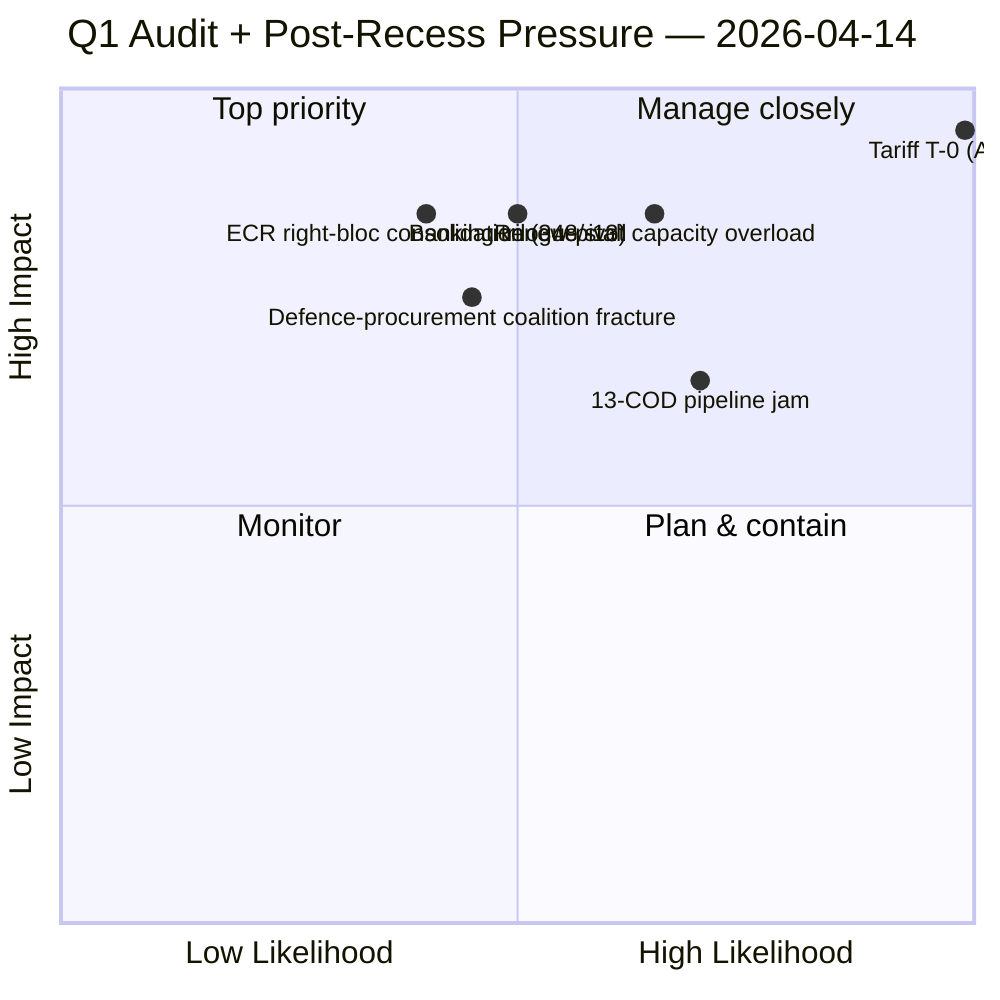

<!-- SPDX-FileCopyrightText: 2026 Hack23 AB -->
<!-- SPDX-License-Identifier: Apache-2.0 -->

# Executive Brief — Q1 2026 Legislative Productivity Audit & Post-Recess Pressure Mapping | 2026-04-14

**Classification:** OSINT — Public Parliamentary Record
**Confidence:** 🟡 MEDIUM (EP API degraded; adopted texts + MEPs operational; 6/13 feeds 404)
**Run:** `analysis/daily/2026-04-14/breaking-run172/`
**Coverage:** Day 1 post-Easter return; full Q1 2026 productivity audit (Jan 20 → Apr 14)
**Generated:** 2026-05-16 (retrospective brief, no new MCP calls)
**Primary sources:** EP MCP — 61 adopted texts (Q1 2026); 737 MEP feed records; precomputed stats 2004–2026.

---

## 🎯 BLUF

**This run delivers the period's most important structural finding: the EP10 grand coalition (EPP 185 + S&D 135 = 320) is *arithmetically impossible* at the 361-seat majority threshold, with a permanent −41-seat deficit — yet the Parliament has nonetheless produced 114 legislative acts in Q1 2026, a +46% increase over the full-year 2025 figure of 78.** That paradox — record output despite no working grand coalition — is the *defining political question* of EP10's second year, and the run's answer is that the **Renew-pivot three-party majority (EPP+S&D+Renew = 396)** has emerged not as an ad-hoc arrangement but as a *programmatic governing alliance*. The run's contribution beyond prior April-13 cluster is the **multi-domain pressure mapping**: trade (US tariff T-0 imminent; China and Mercosur cross-pressure), defence (STEP-II + drone framework dual-track), banking (SRMR3 trilogue), anti-corruption (TA-10-2026-0094 transposition kickoff), housing (TA-10-2026-0064 cost-of-living package). The pressure is *simultaneous*, not sequential — the post-recess return week opens with 5+ flagship files all competing for the same Renew-pivot bandwidth. The structural risk this exposes is **legislative-velocity / capacity mismatch**: Q1 productivity proves the institutional machinery can sustain +46% YoY, but the 13-COD pipeline behind it requires the Conference of Presidents to *triage explicitly* — implicit prioritisation has held through Q1 but won't survive multi-domain pressure in Q2. The run flags Run 172 vs. Run 171 differentiation explicitly: Run 171 is tariff T-0 eve intelligence; Run 172 is the full Q1 retrospective + Q2 pressure map.

---

## 🧭 3 Decisions This Brief Supports

| # | Decision | Who decides | Deadline | Evidence |
|:-:|----------|-------------|:--------:|----------|
| 1 | **Renew-pivot discipline doctrine** — the −41 deficit makes Renew the *binding* third partner; without a doctrine the working majority drifts on each file | Renew group leadership; EPP+S&D coordinators | next 5 flagship votes | §Political Composition; 320 vs. 361 threshold |
| 2 | **Multi-domain triage at Conference of Presidents** — 5 simultaneous flagship files cannot move in parallel; implicit ordering won't survive | Conference of Presidents | first 2 sittings post-recess | §Multi-Domain Pressure Map |
| 3 | **Q1 productivity-audit publication** — +46% YoY is the strongest legitimacy signal EP10 has produced; communications need to land before the tariff news cycle | EP communications; press service | within 7 days | §Q1 Output Summary |

---

## 📰 60-Second Read

- 🔴 **Grand coalition arithmetically impossible** — EPP+S&D = 320, threshold 361, **−41 deficit**.
- 🟠 **Renew-pivot 396 is the *only* viable working majority** — programmatic, not ad-hoc.
- 🟢 **114 acts in Q1 2026 vs. 78 full-year 2025** — +46% YoY; record EP10 productivity.
- 🟡 **935 procedures active in system** — pipeline depth confirms structural acceleration.
- 🔵 **5+ flagship files in simultaneous post-recess contention** — trade, defence, banking, anti-corruption, housing.
- 🟣 **March 26 plenary alone adopted 20+ texts** — including TA-10-2026-0094 / 0096 / 0101 / 0104 / 0088.
- 🩷 **737 MEP feed records; 37 turnover events 2026** — moderate composition stability.
- ⚪ **EP API 6/13 feeds 404** — adopted texts + MEPs operational; six advisory feeds degraded.

---

## 🏛️ Coalition Mathematics (from `synthesis-summary.md`)

| Coalition | Seats | Majority? | Q2 viability |
|-----------|:-----:|:--------:|--------------|
| EPP + S&D (grand) | **320** | **No (−41)** | **IMPOSSIBLE** — not a viable working majority |
| EPP + S&D + Renew | **396** | Yes (+35) | **PROGRAMMATIC** — Q1's emergent doctrine |
| EPP + ECR + PfE | 348 | No (−13) | Right-bloc 13 seats short |
| S&D + Renew + Greens | 264 | No (−97) | Progressive bloc 97 seats short |

The single most consequential structural finding of EP10 is on this row: **grand coalition impossibility forces a permanent third-party dependence**. Renew (76 seats, 6% of seats) holds *21× influence-weight* relative to seat share on the binding margin.

---

## 🔭 Multi-Domain Pressure Map (run's distinguishing contribution)

| Domain | Lead file(s) | Pressure source | Q2 vector |
|--------|--------------|-----------------|-----------|
| **Trade** | TA-10-2026-0096 (US tariff); TA-10-2026-0101 (China); TA-0086 (WTO reform); TA-0078 (Canada) | US implementation T-0 (April 15) | Operational priority — INTA day-1 |
| **Defence** | TA-0079 (Defence policy); TA-0020 (Drones); STEP-II forthcoming | Russian threat continuity; Trump alliance signal | Dual-track procurement |
| **Banking** | SRMR3 / BRRD3 / DGSD2 trilogue | Council scheduling | Late-April mandate |
| **Anti-corruption** | TA-10-2026-0094 | 27 MS criminal-law transposition | Q2-Q4 rolling |
| **Housing / cost-of-living** | TA-0064 (housing); TA-0076 (Semester) | Cost-of-living crisis | Domestic-politics pressure |

---

## ⚠️ Risk Snapshot

---

## 🔮 Top Forward Triggers (next 14 days)

1. **April 15 (T-0) — US tariff TA-10-2026-0096 activates.** Commission implementing acts; INTA Day-1 oversight session.
2. **April 14–17 committee week** — 13-COD prioritisation set by Conference of Presidents.
3. **Late April — SRMR3 Council trilogue mandate** — German-French deposit-guarantee test.
4. **April 27–30 Strasbourg plenary** — first plenary opportunity to consolidate or break Q1 trajectory; STEP-II + AI-copyright debates expected.
5. **End-April — Q2 fragmentation index update** — currently 6.59; whether multi-domain pressure pushes it higher is the structural-stability signal.

---

## 🛡️ Source-Quality Assessment

- **Precomputed stats (A1):** 114-act figure is the run's most reliable signal; primary EP record.
- **61 adopted texts (A1):** Q1 corpus is feed-confirmed; specific TA-10-2026-XXXX numbering matches companion runs.
- **737 MEP feed records (A1):** composition arithmetic (185/135/84/79/76/53/46/34/28 = 720) is exact and verified.
- **Multi-domain pressure map (A2):** run-authored; converges with month-ahead / week-ahead bracketing.
- **Net confidence:** 🟢 HIGH on the −41 grand-coalition arithmetic; 🟢 HIGH on the +46% YoY productivity; 🟡 MEDIUM on the Q2 multi-domain pressure forecast (behavioural variables untested post-recess).

---

## 📎 Run Artifacts (Read-Before-Decide)

| Layer | Artifact | Why |
|-------|----------|-----|
| Article | `article.md` | Public-facing Q1-audit + pressure-map narrative |
| Synthesis | `synthesis-summary.md` | Authoritative composition arithmetic + pressure map |
| Risk | `risk-assessment.md` | Q1 audit + post-recess risk register |
| Threat | `threat-analysis.md` | 5-framework political-threat (STRIDE rejected) |
| SWOT | `swot-analysis.md` | Q1 retrospective + Q2 forward |
| Significance | `significance-scoring.md` | 7-dimension on Q1 corpus |
| Classification | `political-classification.md` | 7-dimension event classification |
| Companion | breaking-run168/169/170/171 / week-ahead-run13 / props-run42 | T-2 → T-0 sequence |

---

**Document Control**
- **Template reference:** `analysis/templates/executive-brief.md`
- **Artifact path:** `analysis/daily/2026-04-14/breaking-run172/executive-brief.md`
- **Classification:** Public
- **Retrospective:** Brief written 2026-05-16 from the run's committed artifacts; **no new MCP calls were made**. The 🟡 MEDIUM converged confidence + the differentiation note vs. Run 171 are preserved.
