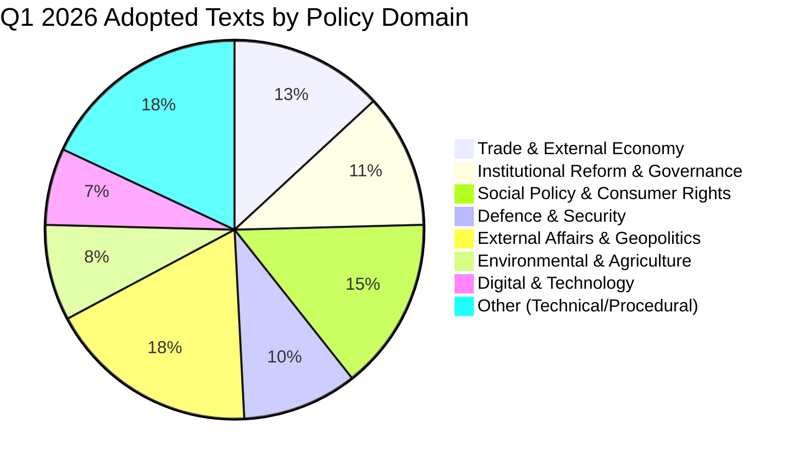

<!-- SPDX-FileCopyrightText: 2024-2026 Hack23 AB -->
<!-- SPDX-License-Identifier: Apache-2.0 -->

# 🏷️ Political Classification — Q1 2026 Legislative Output by Policy Domain

  
  
  

---

## 📋 Classification Context

| Field | Value |
|-------|-------|
| **Classification Date** | 2026-04-14 19:30 UTC |
| **Items Classified** | 61 adopted texts from Q1 2026 (Jan 20 – Mar 26) |
| **Framework** | 7-dimension political classification |
| **articleType** | breaking |

---

## 📊 Policy Domain Distribution

### Domain Breakdown

#### 1. Trade & External Economy (8 texts, 13%)

| Text | Title | Session | Classification |
|------|-------|---------|---------------|
| TA-10-2026-0096 | US tariff countermeasures | Mar 26 | CRISIS RESPONSE — autonomous trade defence |
| TA-10-2026-0101 | EU-China tariff quotas | Mar 26 | RECALIBRATION — trade partner adjustment |
| TA-10-2026-0030 | EU-Mercosur safeguard | Feb 10 | PROTECTIVE — agricultural defence |
| TA-10-2026-0086 | WTO 14th Ministerial prep | Mar 12 | MULTILATERAL — global trade governance |
| TA-10-2026-0008 | EU-Mercosur ECJ opinion | Jan 21 | CONSTITUTIONAL — Treaty compatibility |
| TA-10-2026-0072 | EU-Ecuador Europol cooperation | Mar 11 | BILATERAL — law enforcement |
| TA-10-2026-0100 | EU-Lebanon scientific cooperation | Mar 26 | PARTNERSHIP — PRIMA programme |
| TA-10-2026-0048 | Agri-food unfair trading practices | Feb 12 | REGULATORY — supply chain enforcement |

**Political dynamics**: Trade is the defining issue of Q1 2026. The US tariff countermeasures (TA-0096) represent the EP's most assertive trade action in years, adopted with broad cross-party support. The simultaneous EU-China (TA-0101) and EU-Mercosur (TA-0030) actions show the EP managing a three-front trade posture. ECR's internal split on TA-0096 revealed right-bloc fragility on economic policy. 🟡 MEDIUM confidence.

#### 2. Institutional Reform & Governance (7 texts, 11%)

| Text | Title | Session | Classification |
|------|-------|---------|---------------|
| TA-10-2026-0094 | Anti-corruption directive | Mar 26 | REFORM — post-Qatargate |
| TA-10-2026-0088 | Braun immunity waiver | Mar 26 | ACCOUNTABILITY — internal discipline |
| TA-10-2026-0063 | Better Law-Making report | Mar 10 | SELF-ASSESSMENT — regulatory fitness |
| TA-10-2026-0065 | Public access to documents | Mar 10 | TRANSPARENCY — citizen access |
| TA-10-2026-0006 | Electoral Act reform | Jan 20 | CONSTITUTIONAL — democratic process |
| TA-10-2026-0060 | ECB VP appointment | Mar 10 | INSTITUTIONAL — monetary governance |
| TA-10-2026-0033 | ECB Supervisory Board VC | Feb 10 | INSTITUTIONAL — banking supervision |

**Political dynamics**: The EP is systematically addressing its post-Qatargate credibility deficit. Anti-corruption (TA-0094) is the flagship, but the broader cluster — transparency, electoral reform, Better Law-Making — shows institutional self-improvement across multiple dimensions. The Braun immunity waiver demonstrates willingness to apply accountability mechanisms to sitting MEPs. 🟢 HIGH confidence.

#### 3. Social Policy & Consumer Rights (9 texts, 15%)

| Text | Title | Session | Classification |
|------|-------|---------|---------------|
| TA-10-2026-0064 | Housing crisis | Mar 10 | SOCIAL — cost of living |
| TA-10-2026-0050 | Workers' rights / subcontracting | Feb 12 | LABOR — gig economy protection |
| TA-10-2026-0009 | Air passenger rights | Jan 21 | CONSUMER — transport |
| TA-10-2026-0085 | Package travel protections | Mar 12 | CONSUMER — tourism |
| TA-10-2026-0076 | European Semester employment | Mar 11 | COORDINATION — social priorities |
| TA-10-2026-0058 | EU Talent Pool | Mar 10 | MIGRATION — skilled labor |
| TA-10-2026-0004 | Financial stability / safeguarding | Jan 20 | ECONOMIC — uncertainty response |
| TA-10-2026-0073 | EGF Tupperware Belgium | Mar 11 | SOCIAL — worker displacement |
| TA-10-2026-0038 | EGF Audi Belgium | Feb 11 | SOCIAL — automotive transition |

**Political dynamics**: The social cluster is the largest, reflecting broad EP attention to cost-of-living and economic security. Two EGF mobilisations (Tupperware and Audi in Belgium) signal continued manufacturing restructuring in key member states. The housing crisis resolution required cross-party building from S&D-Greens toward the centre. 🟢 HIGH confidence on domestic political salience.

#### 4. Defence & Security (6 texts, 10%)

| Text | Title | Session | Classification |
|------|-------|---------|---------------|
| TA-10-2026-0079 | Defence single market | Mar 11 | STRATEGIC — market barriers |
| TA-10-2026-0040 | Strategic defence partnerships | Feb 11 | STRATEGIC — alliance building |
| TA-10-2026-0020 | Drones and new warfare | Jan 22 | TECHNOLOGY — military modernization |
| TA-10-2026-0022 | Tech sovereignty | Jan 22 | STRATEGIC — digital infrastructure |
| TA-10-2026-0015 | EU Magnitsky sanctions | Jan 21 | FOREIGN POLICY — impunity |
| TA-10-2026-0005 | Humanitarian aid principles | Jan 20 | HUMANITARIAN — crisis response |

**Political dynamics**: Defence is a consensus zone across EPP-S&D-ECR-Renew, making it one of the most productive policy domains. The January-to-March acceleration mirrors the Commission's European Defence Industrial Strategy timeline. GUE/NGL and parts of Greens/EFA remain sceptical, but the super-majority coalition on defence is stable. 🟢 HIGH confidence on continued acceleration.

#### 5. External Affairs & Geopolitics (11 texts, 18%)

Key texts include EU enlargement strategy (TA-0077), EU-Canada cooperation (TA-0078), Georgian political prisoners (TA-0083), Ukraine Support Loan (TA-0035), CFSP annual report (TA-0012), Iran oppression (TA-0046), Global Gateway (TA-0104), Syria situation (TA-0053), Lithuania democratic threats (TA-0024), and the Albania/Montenegro accession conventions (TA-0054, TA-0055).

**Political dynamics**: External affairs is the largest domain by text count, reflecting the EP's role as a normative foreign policy actor. Ukraine remains the top priority with continued financial support. The EU-Canada text (TA-0078) is notable as a direct response to geopolitical realignment — Canada seeking closer EU ties as US trade relations deteriorate. 🟡 MEDIUM confidence that enlargement strategy will accelerate given security motivations.

---

## 🧭 Policy Domain Trajectory

**Interpretation**: The legislative agenda intensified month-over-month, with March being the most productive and politically significant session. The March 26 session was a culmination — trade, corruption, and institutional reform texts all reached adoption in a pre-recess sprint.

---

## 📚 Sources

- EP adopted texts year listing (2026, 61 items via MCP)
- EP adopted texts feed (today, 21 items updated)
- Political classification framework per political-classification-guide.md
