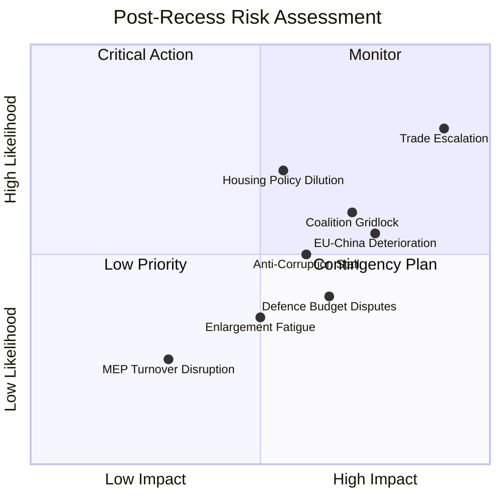

<!-- SPDX-FileCopyrightText: 2024-2026 Hack23 AB -->
<!-- SPDX-License-Identifier: Apache-2.0 -->

# ⚠️ Risk Assessment — Post-Recess Multi-Front Pressure Matrix

  
  
  
  

---

## 📋 Risk Assessment Context

| Field | Value |
|-------|-------|
| **Assessment Date** | 2026-04-14 19:35 UTC |
| **Risk Framework** | Likelihood × Impact 5×5 matrix (per political-risk-methodology.md) |
| **Scope** | Post-recess challenges facing EP10 (April–June 2026) |
| **articleType** | breaking |

---

## 📊 Risk Matrix (5×5)

---

## 🔴 Critical Risks (Score ≥ 16/25)

### Risk 1: US-EU Trade Escalation
| Dimension | Assessment |
|-----------|------------|
| **Likelihood** | 4/5 (HIGH) — Tariff activation April 15 is confirmed |
| **Impact** | 5/5 (CRITICAL) — Direct market effects, supply chain disruption, political bandwidth consumption |
| **Risk Score** | **20/25** 🔴 CRITICAL |
| **Time Horizon** | Immediate (April 15–30) |
| **Affected Groups** | All — EPP leads response, ECR internally divided, PfE anti-free-trade wing energized |
| **Mitigation** | TA-10-2026-0096 already adopted; Commission implementing. EP may need emergency debate if US retaliates further |
| **Confidence** | 🟡 MEDIUM — US response trajectory uncertain |

**Evidence**: TA-10-2026-0096 (COD 2025/0261) adopted March 26 with broad cross-party support. Activates April 15. The EP front-loaded trade defence in Q1 specifically for this contingency. The parallel EU-China tariff quota modification (TA-10-2026-0101) suggests the EP is hedging — adjusting Asian trade terms while confronting US. Three simultaneous trade fronts (US, China, Mercosur) create compound risk.

### Risk 2: Coalition Paralysis on Domestic Files
| Dimension | Assessment |
|-----------|------------|
| **Likelihood** | 3/5 (MEDIUM) — Fragmentation is structural but Q1 showed coalition-building capacity |
| **Impact** | 4/5 (HIGH) — Housing, workers' rights, consumer protection all require working majorities |
| **Risk Score** | **12/25** 🟠 HIGH |
| **Time Horizon** | Medium-term (April–June 2026) |
| **Affected Groups** | S&D (social agenda), Greens/EFA (environmental), EPP (leadership credibility) |
| **Mitigation** | Renew as kingmaker can bridge EPP-S&D on centrist files |
| **Confidence** | 🟡 MEDIUM — Q1 productivity suggests institutional capacity exists |

**Evidence**: Grand coalition deficit of -41 seats (EPP 185 + S&D 135 = 320 vs. 361 needed). Minimum winning coalition requires 3 parties. Q1 demonstrated this is workable (114 legislative acts), but post-recess dynamics could shift as MEPs return with national-level political pressures. Housing crisis (TA-10-2026-0064) is the litmus test — it requires cross-bloc support that may fracture on implementation details.

---

## 🟠 High Risks (Score 10–15/25)

### Risk 3: EU-China Trade Deterioration
| Dimension | Assessment |
|-----------|------------|
| **Likelihood** | 3/5 (MEDIUM) — tariff quota modification is a managed adjustment, not a rupture |
| **Impact** | 4/5 (HIGH) — manufacturing, agriculture, and tech sectors all exposed |
| **Risk Score** | **12/25** 🟠 HIGH |
| **Mitigation** | TA-10-2026-0101 provides negotiated framework; not a unilateral action |

### Risk 4: Housing Policy Dilution During Trilogue
| Dimension | Assessment |
|-----------|------------|
| **Likelihood** | 4/5 (HIGH) — Council typically weakens social texts |
| **Impact** | 3/5 (MEDIUM) — resolution is non-binding, but sets political expectations |
| **Risk Score** | **12/25** 🟠 HIGH |
| **Mitigation** | S&D-Greens coalition pressure + citizen salience may sustain ambition |

### Risk 5: Anti-Corruption Directive Stall in Council
| Dimension | Assessment |
|-----------|------------|
| **Likelihood** | 3/5 (MEDIUM) — some member states resistant to EU-wide standards |
| **Impact** | 3/5 (MEDIUM) — institutional credibility at stake post-Qatargate |
| **Risk Score** | **9/25** 🟡 MEDIUM |
| **Mitigation** | Strong EP mandate from March 26 adoption; public opinion supportive |

### Risk 6: Defence Budget Disputes
| Dimension | Assessment |
|-----------|------------|
| **Likelihood** | 2/5 (LOW) — broad consensus exists |
| **Impact** | 4/5 (HIGH) — strategic autonomy timeline at stake |
| **Risk Score** | **8/25** 🟡 MEDIUM |
| **Mitigation** | EPP-S&D-ECR-Renew super-majority on defence files is stable |

---

## 🟢 Low Risks (Score < 10/25)

### Risk 7: Enlargement Fatigue
| Score | **6/25** | Likelihood 2/5, Impact 3/5 |

Enlargement strategy (TA-10-2026-0077) adopted March 11 with EP support, but accession timelines remain Council-dependent. Ukraine candidacy has security momentum. Western Balkans progress is slow but steady. Risk is more long-term than Q2 2026.

### Risk 8: MEP Turnover Disruption
| Score | **4/25** | Likelihood 2/5, Impact 2/5 |

37 MEP turnovers in 2026 (5.1% rate) is within normal range. Institutional memory risk rated LOW by precomputed analytics. MEP stability index at 0.949 is strong.

---

## 📈 Risk Trend Analysis

| Risk | Q4 2025 | Q1 2026 | Q2 2026 (Projected) | Trend |
|------|---------|---------|---------------------|-------|
| Trade Escalation | MEDIUM | HIGH | CRITICAL | ↑↑ |
| Coalition Paralysis | LOW | MEDIUM | HIGH | ↑ |
| EU-China Trade | LOW | MEDIUM | HIGH | ↑ |
| Housing Dilution | N/A | HIGH | HIGH | → |
| Anti-Corruption Stall | N/A | LOW | MEDIUM | ↑ |
| Defence Disputes | LOW | LOW | LOW | → |

---

## 📚 Sources

- EP adopted texts (61 items, 2026 Q1) — adoption dates and procedure references
- Precomputed EP statistics 2026 — political composition, fragmentation index
- Prior analysis: Run 171 risk-assessment.md — tariff-focused risk analysis
- Political risk methodology per political-risk-methodology.md
