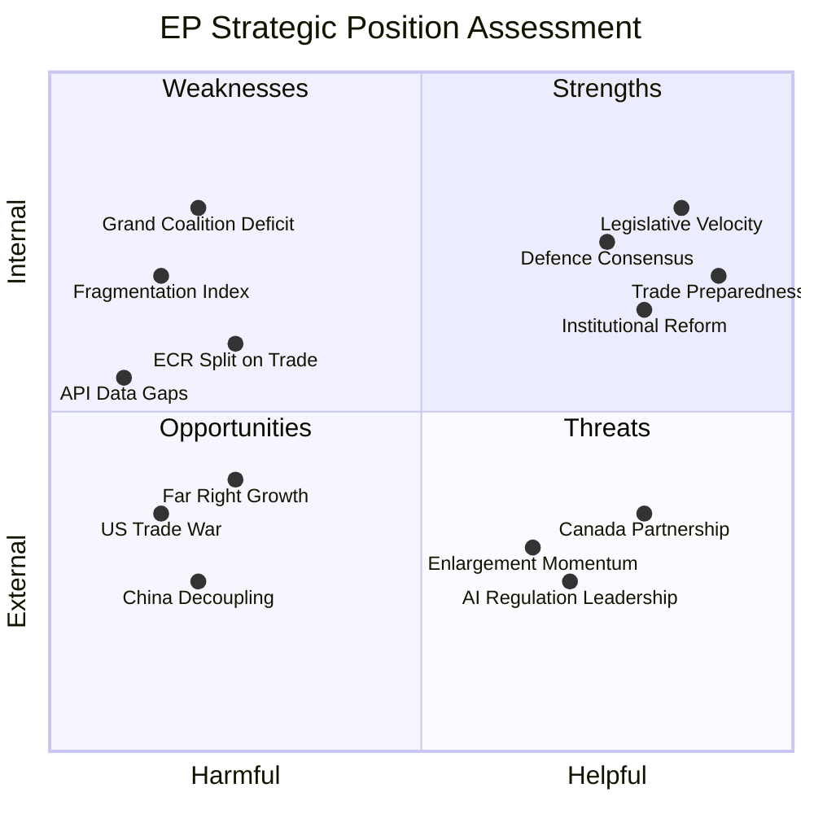

<!-- SPDX-FileCopyrightText: 2024-2026 Hack23 AB -->
<!-- SPDX-License-Identifier: Apache-2.0 -->

# 🔍 SWOT Analysis — European Parliament Strategic Position Entering April 15 Return

  
  
  

---

## 📋 SWOT Context

| Field | Value |
|-------|-------|
| **Assessment Date** | 2026-04-14 19:40 UTC |
| **Framework** | Evidence-based SWOT per political-swot-framework.md |
| **Scope** | EP10 institutional position for April–June 2026 |
| **articleType** | breaking |

---

## 📊 SWOT Matrix

---

## 💪 Strengths

### S1: Record Legislative Velocity (Severity: HIGH ✅)
**Evidence**: 114 legislative acts in Q1 2026 vs. 78 total in 2025 (+46%). 61 adopted texts across trade, defence, social, institutional reform, and external affairs. March 26 session was the most productive single session of EP10.

**Strategic implication**: The EP enters the post-recess period with demonstrated institutional capacity. The pre-recess sprint showed that complex multi-party coalitions can be formed and sustained on priority files. This productivity record strengthens the EP's negotiating position vis-à-vis Council and Commission.

### S2: Defence Policy Consensus (Severity: HIGH ✅)
**Evidence**: Four defence-related texts adopted in Q1 (TA-0020, TA-0022, TA-0040, TA-0079) with EPP-S&D-ECR-Renew support. Defence single market (TA-0079) passed with minimal opposition. Tech sovereignty (TA-0022) bridges the defence-digital divide.

**Strategic implication**: The super-majority on defence (4 groups = ~475 seats) is the EP's most reliable coalition and provides a stable foundation for the European Defence Industrial Strategy implementation.

### S3: Trade Crisis Preparedness (Severity: CRITICAL ✅)
**Evidence**: TA-10-2026-0096 (US tariff countermeasures) adopted March 26 with cross-party support. The EP acted proactively — the legislation was ready before the April 15 activation date. This is rare institutional foresight for crisis legislation.

**Strategic implication**: The EP can point to concrete legislative action when the tariffs activate. This positions the Parliament as a responsive institution, unlike the Council which often lags on urgent trade matters.

### S4: Institutional Reform Momentum (Severity: MEDIUM ✅)
**Evidence**: Anti-corruption directive (TA-0094), electoral reform (TA-0006), Better Law-Making (TA-0063), public access to documents (TA-0065), and the Braun immunity waiver (TA-0088) collectively demonstrate sustained self-reform.

**Strategic implication**: The Qatargate shadow is being actively addressed through legislative and procedural means, rebuilding institutional credibility.

---

## 🔻 Weaknesses

### W1: Grand Coalition Impossibility (Severity: CRITICAL ⚠️)
**Evidence**: EPP (185) + S&D (135) = 320 seats vs. 361 majority threshold. Deficit of -41 seats. This is the most fragmented EP since direct elections began.

**Strategic implication**: Every major legislative file requires at least 3 parties. This creates negotiation complexity and slows consensus-building. The minimum winning coalition (EPP+S&D+Renew = 396) has a comfortable margin, but securing Renew's support on every file is not guaranteed.

### W2: Extreme Fragmentation (Severity: HIGH ⚠️)
**Evidence**: Fragmentation index 6.59 — indicating an effective 6.6-party system. Eight political groups plus NI. The right bloc (EPP+ECR+PfE+ESN = 376, 52.3%) theoretically holds a majority, but ideological coherence on economic files is questionable.

**Strategic implication**: Coalition-building requires constant issue-by-issue negotiation. There is no stable governing majority. The 52.3% right-bloc share has never been tested on a controversial economic file — the ECR split on tariffs (TA-0096) revealed that right-bloc unity is not automatic.

### W3: ECR Internal Divisions on Trade (Severity: MEDIUM ⚠️)
**Evidence**: ECR split on US tariff countermeasures (TA-10-2026-0096). Some ECR members opposed retaliatory tariffs, preferring bilateral negotiation with the US. This split mirrors broader tensions between sovereigntist and free-market wings within ECR.

**Strategic implication**: ECR as a reliable coalition partner on economic files is in question. This weakens the "right majority" scenario and makes EPP dependent on Renew or S&D for economic legislation.

### W4: EP API and Data Infrastructure Gaps (Severity: LOW ⚠️)
**Evidence**: This run encountered 6/13 feed endpoints returning 404, 4 advisory feeds timing out, coalition dynamics API timed out. Only adopted texts and MEPs feeds functioned reliably.

**Strategic implication**: External monitoring and transparency of EP activity is hampered by data infrastructure issues. This reduces real-time accountability and public engagement — ironic given the public access to documents resolution (TA-0065).

---

## 🌟 Opportunities

### O1: EU-Canada Strategic Partnership (Severity: HIGH 🟢)
**Evidence**: TA-10-2026-0078 adopted March 11 — enhanced cooperation in current geopolitical context, referencing threats to Canada's economic stability. This is a direct geopolitical response to US trade uncertainty.

**Strategic implication**: Canada becomes a strategic alternative trade partner. The EP can position the EU as a reliable partner for democracies seeking to diversify away from US dependency. This strengthens the EU's normative trade model.

### O2: AI/Copyright Regulatory Leadership (Severity: HIGH 🟢)
**Evidence**: TA-10-2026-0066 (copyright and generative AI) adopted March 10. This complements the AI Act implementation and positions the EU as the global standard-setter on AI governance.

**Strategic implication**: First-mover advantage on AI regulation creates a Brussels Effect, where EU standards become de facto global standards. This is particularly powerful given US regulatory retreat under current administration.

### O3: Enlargement Momentum (Severity: MEDIUM 🟢)
**Evidence**: TA-10-2026-0077 (EU enlargement strategy) adopted March 11. Ukraine candidacy has security-driven momentum. Western Balkans process continues.

**Strategic implication**: Enlargement offers both geopolitical strengthening and a compelling narrative for EU relevance. The security argument for Ukraine's accession path has shifted previously reluctant member states.

---

## 🔥 Threats

### T1: US Trade War Escalation (Severity: CRITICAL 🔴)
**Evidence**: TA-10-2026-0096 activates April 15. US retaliation potential is HIGH. Trade bandwidth could consume political energy needed for domestic agenda.

**Strategic implication**: If the US escalates, the EP may need emergency sessions. This could derail the legislative backlog, delay housing and anti-corruption trilogues, and force the Parliament into reactive mode.

### T2: China Trade Decoupling Pressure (Severity: HIGH 🔴)
**Evidence**: TA-10-2026-0101 (EU-China tariff quotas) adjusts market access terms. This occurs against a backdrop of global supply chain restructuring and US pressure to decouple from China.

**Strategic implication**: The EP is trying to manage — not rupture — the China relationship. But external pressure (US demands for allied decoupling) may force harder choices. Agriculture and manufacturing sectors in Germany, France, and Italy are especially exposed.

### T3: Far-Right Group Consolidation (Severity: HIGH 🔴)
**Evidence**: PfE (84) + ESN (28) = 112 seats (15.6% combined). When added to ECR (79), the eurosceptic/nationalist bloc reaches 191 seats (26.5%). The right bloc's 52.3% includes these groups.

**Strategic implication**: While the far-right is excluded from formal coalition-building, their growing seat share constrains the policy space available to centrist coalitions. On immigration, sovereignty, and regulatory burden files, the far-right sets the floor for debate. The EP's ability to maintain progressive positions on housing, workers' rights, and environmental policy depends on the centrist 3-party coalition holding.

---

## 📈 SWOT Dynamics Assessment

| Factor | Trajectory | Confidence |
|--------|-----------|------------|
| Legislative velocity | ↑ Increasing | 🟢 HIGH |
| Defence consensus | → Stable | 🟢 HIGH |
| Grand coalition gap | → Stable (structural) | 🟢 HIGH |
| Trade escalation risk | ↑↑ Increasing rapidly | 🟡 MEDIUM |
| Far-right growth | ↗ Gradual increase | 🟡 MEDIUM |
| AI regulatory leadership | ↑ Increasing | 🟢 HIGH |
| Enlargement momentum | ↗ Moderate increase | 🟡 MEDIUM |

---

## 📚 Sources

- EP adopted texts (61 items, Q1 2026)
- Precomputed EP statistics — political composition, fragmentation metrics
- SWOT framework per political-swot-framework.md
- Prior analysis: Run 171 swot-analysis.md
