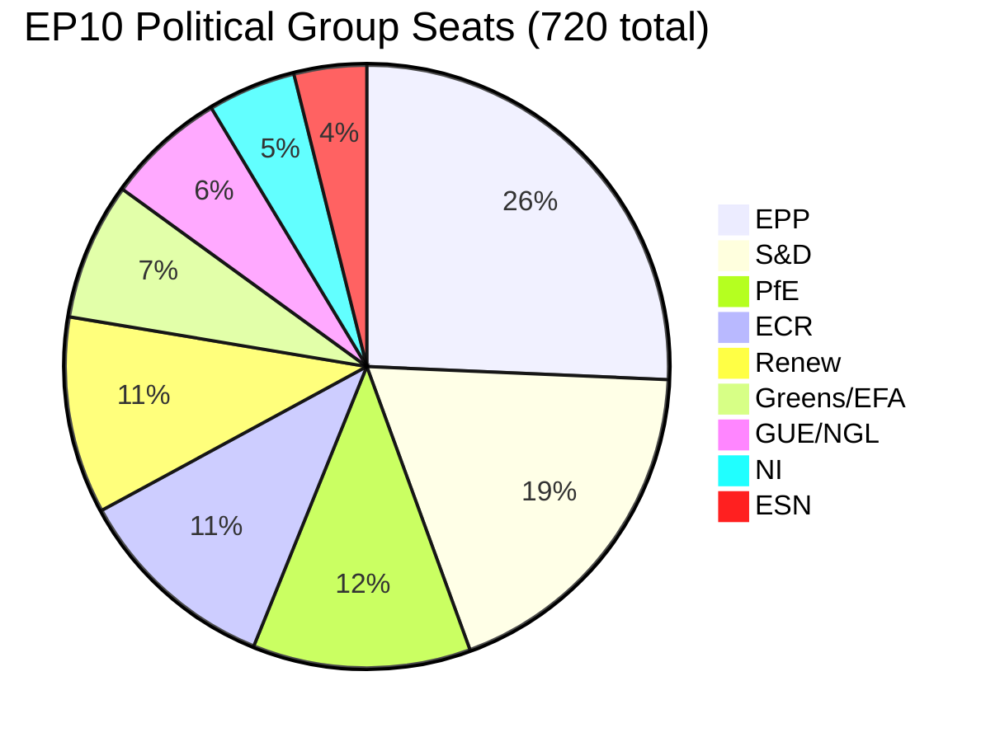

<!-- SPDX-FileCopyrightText: 2024-2026 Hack23 AB -->
<!-- SPDX-License-Identifier: Apache-2.0 -->

# 🧩 Political Intelligence Synthesis — Q1 2026 Legislative Productivity Audit & Post-Recess Pressure Mapping

  
  
  
  

---

## 📋 Synthesis Context

| Field | Value |
|-------|-------|
| **Synthesis ID** | `SYN-2026-04-14-172` |
| **Analysis Date** | `2026-04-14 19:20 UTC` |
| **Documents Analyzed** | 61 adopted texts (Q1 2026) + 737 MEP feed updates + precomputed stats |
| **Analysis Period** | 2026-01-20 to 2026-04-14 (full Q1 review) |
| **Produced By** | news-breaking (Run 172) |
| **Overall Confidence** | 🟡 MEDIUM — EP API degraded (adopted texts + MEPs operational; 6/13 feeds 404) |
| **articleType** | breaking |
| **Differentiation from Run 171** | Run 171 focused on tariff T-0 eve intelligence; this run provides full Q1 productivity audit and multi-domain pressure mapping |

---

## 📊 Intelligence Dashboard

### Q1 2026 Output Summary

| Metric | Q1 2026 | Full Year 2025 | Change |
|--------|---------|----------------|--------|
| **Legislative Acts** | 114 | 78 | +46% ↑ |
| **Adopted Texts** | 61+ | ~104 (projected 2026) | On pace |
| **Roll-Call Votes** | ~148 (est.) | 567 (proj.) | Tracking |
| **Committee Meetings** | ~614 (est.) | 2,363 (proj.) | Normal |
| **Procedures in System** | 935 | — | Active |
| **MEP Turnover** | 37 (2026) | — | Moderate |

> 🟢 HIGH confidence on legislative acts figure (precomputed stats). 🟡 MEDIUM confidence on quarterly estimates (extrapolated from monthly breakdown).

### Political Composition (EP10, April 2026)

**Majority threshold**: 361 seats
**Grand coalition (EPP+S&D)**: 320 seats = **DEFICIT of -41** → Grand coalition IMPOSSIBLE
**Minimum winning coalition**: 3 parties (e.g., EPP+S&D+Renew = 396 ✅)

---

## 🔍 Key Intelligence Findings

### 1. Unprecedented Q1 Legislative Velocity

The European Parliament produced **114 legislative acts in Q1 2026**, compared to **78 for all of 2025** — a **46% acceleration**. This represents the highest Q1 output in the EP10 term and signals:

- **Pre-recess sprint**: March 2026 session (Mar 10-12, Mar 26) pushed through 20+ texts covering trade, defence, corruption, housing, copyright/AI, and institutional reform
- **Conference of Presidents prioritisation**: The legislative agenda was front-loaded, potentially anticipating geopolitical uncertainty from US trade actions
- **Committee pipeline efficiency**: 2,363 projected committee meetings in 2026 indicates sustained institutional machinery

**🟢 HIGH confidence**: The velocity increase is structural, not just a scheduling artifact. The March 26 session alone adopted trade countermeasures (TA-10-2026-0096), anti-corruption directive (TA-10-2026-0094), EU-China tariff modification (TA-10-2026-0101), Global Gateway assessment (TA-10-2026-0104), and immunity waiver proceedings (TA-10-2026-0088).

### 2. Trade Policy Triangle: US–China–Mercosur

Three distinct trade policy instruments were advanced in Q1 2026:

| Text | Subject | Adopted | Significance |
|------|---------|---------|-------------|
| **TA-10-2026-0096** | US tariff countermeasures (COD 2025/0261) | 2026-03-26 | 🔴 CRITICAL — activates April 15 |
| **TA-10-2026-0101** | EU-China tariff quota modification | 2026-03-26 | 🟡 HIGH — signals trade recalibration |
| **TA-10-2026-0030** | EU-Mercosur bilateral safeguard clause | 2026-02-10 | 🟡 HIGH — agricultural protection |

**Strategic interpretation**: The EP is simultaneously retaliating against US protectionism (TA-0096), adjusting Chinese market access terms (TA-0101), and securing defensive trade instruments for the Mercosur agreement (TA-0030). This three-front trade posture is unprecedented in recent EP history and positions the EU as an assertive trade actor. The **risk** is overextension — managing three complex trade relationships simultaneously while the internal market faces inflationary pressure.

### 3. Institutional Reform and Governance Cluster

| Text | Subject | Adopted |
|------|---------|---------|
| **TA-10-2026-0094** | Anti-corruption directive (COD 2023/0135) | 2026-03-26 |
| **TA-10-2026-0088** | Immunity waiver — Grzegorz Braun | 2026-03-26 |
| **TA-10-2026-0063** | Better Law-Making report 2023-2024 | 2026-03-10 |
| **TA-10-2026-0065** | Public access to documents 2022-2024 | 2026-03-10 |
| **TA-10-2026-0006** | European Electoral Act reform | 2026-01-20 |

The post-Qatargate reform trajectory continues with the anti-corruption directive (COD 2023/0135) reaching adoption on March 26. The simultaneous immunity waiver for MEP Grzegorz Braun demonstrates the EP is applying internal accountability mechanisms. 🟡 MEDIUM confidence that trilogue negotiations on anti-corruption will proceed on schedule — Council positions remain uncertain.

### 4. Social Dimension: Housing, Workers' Rights, Consumer Protection

| Text | Subject | Adopted |
|------|---------|---------|
| **TA-10-2026-0064** | Housing crisis resolution | 2026-03-10 |
| **TA-10-2026-0050** | Subcontracting chains / workers' rights | 2026-02-12 |
| **TA-10-2026-0009** | Air passenger rights | 2026-01-21 |
| **TA-10-2026-0085** | Package travel protections | 2026-03-12 |
| **TA-10-2026-0076** | European Semester employment priorities 2026 | 2026-03-11 |

This cluster reveals EP attention to the cost-of-living crisis across multiple dimensions. The housing crisis resolution (TA-10-2026-0064) is politically significant as a S&D-Greens priority that required centrist support. Air passenger rights (TA-10-2026-0009) finally advanced after being pending since COD 2013/0072 — a **13-year legislative journey** that demonstrates both EP persistence and institutional bottlenecks.

### 5. Strategic Autonomy and Defence

| Text | Subject | Adopted |
|------|---------|---------|
| **TA-10-2026-0079** | Defence single market barriers | 2026-03-11 |
| **TA-10-2026-0040** | EU strategic defence partnerships | 2026-02-11 |
| **TA-10-2026-0020** | Drones and new warfare systems | 2026-01-22 |
| **TA-10-2026-0022** | Tech sovereignty and digital infrastructure | 2026-01-22 |

The defence cluster accelerated throughout Q1, with January resolutions on drones/warfare and tech sovereignty followed by February's strategic partnerships and March's defence single market text. This trajectory aligns with the Commission's European Defence Industrial Strategy and reflects consensus across EPP-S&D-ECR-Renew on security investment. 🟢 HIGH confidence this will be a major April legislative priority.

### 6. Geopolitical and External Affairs

| Text | Subject | Adopted |
|------|---------|---------|
| **TA-10-2026-0077** | EU enlargement strategy | 2026-03-11 |
| **TA-10-2026-0078** | EU-Canada enhanced cooperation | 2026-03-11 |
| **TA-10-2026-0083** | Georgian political prisoners | 2026-03-12 |
| **TA-10-2026-0104** | Global Gateway assessment | 2026-03-26 |
| **TA-10-2026-0035** | Ukraine Support Loan 2026-2027 | 2026-02-11 |
| **TA-10-2026-0012** | CFSP annual report 2025 | 2026-01-21 |
| **TA-10-2026-0046** | Iran regime oppression | 2026-02-12 |

The external affairs portfolio shows significant EP engagement: Ukraine support continuation, enlargement strategy (Western Balkans + Ukraine candidacy), Georgia human rights, Canada cooperation (geopolitical realignment in response to US trade tensions), and Global Gateway review (development aid strategy). 🟡 MEDIUM confidence that EU-Canada cooperation text reflects strategic hedging against US unpredictability.

---

## 📈 EP Data Portal Signal Analysis

**21 adopted texts were refreshed in the EP data portal feed on April 14, 2026** — the final day of Easter recess. This bulk metadata update is an institutional signal:

- **Official Journal publication**: Several March-adopted texts may have been published in the OJ, triggering metadata refresh
- **Portal preparation for return**: The EP data infrastructure is updating ahead of the April 15 plenary return
- **MEP record update**: 737 of ~720 MEPs had records updated (exceeds active count, likely includes outgoing MEPs), possibly reflecting committee reassignments or parliamentary term metadata updates

---

## 🔮 Forward-Looking Scenarios

### Scenario A — Productive Return (LIKELY, 40%)
Parliament reconvenes April 15 with strong committee engagement. Tariff countermeasures implementation proceeds smoothly. The legislative backlog (13 pending CODs) begins clearing. Anti-corruption trilogue advances. Defence single market gets Council support.

### Scenario B — Coalition Gridlock (POSSIBLE, 35%)
The -41 seat grand coalition deficit forces complex 3+ party negotiations on every file. Housing and social files face centre-right resistance. Trade response fragmented by ECR internal divisions. Committee chairs struggle to build working majorities.

### Scenario C — Trade Crisis Escalation (POSSIBLE, 25%)
US responds aggressively to April 15 tariff activation. Emergency plenary debate called. Fast-track legislative measures considered. Normal legislative calendar disrupted as trade dominates political bandwidth. EU-China tariff quotas become politically toxic.

---

## 📊 Key Metrics for Monitoring

| Indicator | Current Value | Trend | Risk Trigger |
|-----------|---------------|-------|--------------|
| Legislative acts/session | 2.11 | ↑ | Below 1.5 = stall |
| Grand coalition deficit | -41 seats | → | Worsening = institutional crisis |
| Fragmentation index | 6.59 | → | Above 7.0 = ungovernable |
| Right bloc share | 52.3% | → | Above 55% = policy shift |
| MEP turnover rate | 5.1% | → | Above 8% = instability |
| Minimum winning coalition size | 3 parties | → | 4+ = paralysis risk |

---

## 📚 Sources

- European Parliament Open Data Portal — adopted texts feed (21 items, 2026-04-14)
- EP adopted texts year listing (61 items, 2026 Q1)
- MEPs feed (737 records, 2026-04-14)
- Precomputed EP statistics 2004-2026 (155KB dataset, generated 2026-04-08)
- Prior analysis: Run 171 synthesis-summary.md (2026-04-14)
- Editorial context: article-log.json (30-entry rolling log)
