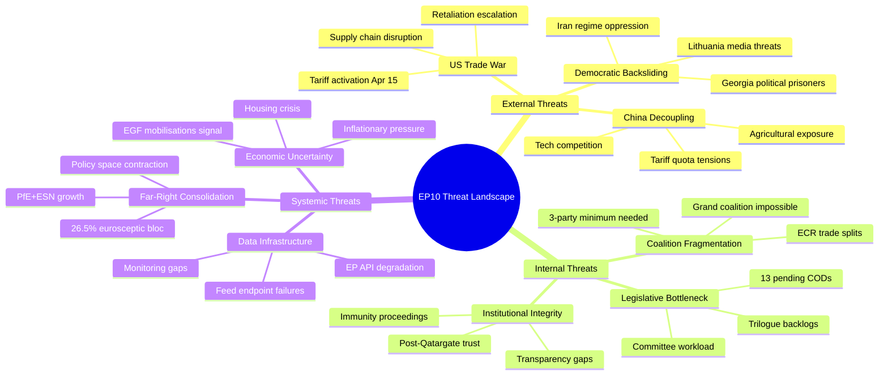
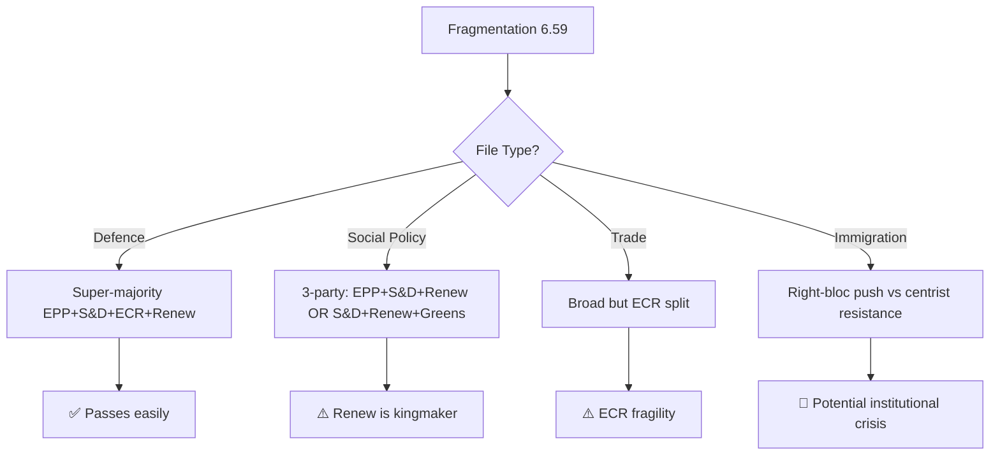

<!-- SPDX-FileCopyrightText: 2024-2026 Hack23 AB -->
<!-- SPDX-License-Identifier: Apache-2.0 -->

# 🛡️ Threat Analysis — Democratic Governance Challenges Post-Recess

  
  
  
  

---

## 📋 Threat Analysis Context

| Field | Value |
|-------|-------|
| **Assessment Date** | 2026-04-14 19:45 UTC |
| **Framework** | Multi-framework threat analysis per political-threat-framework.md |
| **Scope** | Threats to EP democratic governance and legislative capacity, April–June 2026 |
| **articleType** | breaking |

---

## 🌐 Threat Landscape Overview

---

## 🔴 Threat Category 1: External Geopolitical Pressure

### T1.1: US Trade Escalation (CRITICAL)

| Factor | Assessment |
|--------|------------|
| **Threat Actor** | US administration (trade policy) |
| **Mechanism** | Tariff activation → EU countermeasures → potential retaliation cycle |
| **Timeline** | Immediate (April 15, 2026) |
| **Impact** | Market disruption, political bandwidth consumption, coalition stress |
| **EP Response Capacity** | HIGH — TA-10-2026-0096 already adopted, but emergency debate may be needed |

**Threat chain**: US tariffs activate → EU countermeasures (TA-0096) take effect → US may escalate further → EP faces pressure for emergency session → normal legislative calendar disrupted → domestic files (housing, anti-corruption) delayed.

**Confidence**: 🟡 MEDIUM — The activation is certain; the US response is uncertain. Historical pattern suggests escalation is more likely than de-escalation.

### T1.2: China Trade Recalibration (HIGH)

| Factor | Assessment |
|--------|------------|
| **Threat Actor** | China (trade negotiations), US (decoupling pressure) |
| **Mechanism** | Tariff quota modification (TA-0101) creates adjustment pressure |
| **Timeline** | Medium-term (Q2-Q3 2026) |
| **Impact** | Agricultural sector, manufacturing supply chains, strategic materials |

The simultaneous adjustment of US and China trade terms creates a **two-front trade exposure** that the EP has never managed before. The EU-Mercosur safeguard (TA-0030) adds a third vector. 🟡 MEDIUM confidence that managed adjustment avoids rupture.

### T1.3: Democratic Norm Erosion in Partner/Candidate States (MEDIUM)

| Factor | Assessment |
|--------|------------|
| **Threat Actors** | Georgia (Georgian Dream regime), Iran, Lithuania media threats |
| **EP Responses** | TA-0083 (Georgian political prisoners), TA-0046 (Iran), TA-0024 (Lithuania) |
| **Mechanism** | Normative resolutions + sanctions advocacy |

The EP's January-March session addressed three distinct cases of democratic norm erosion. The Georgian political prisoners case (TA-0083) is particularly relevant to enlargement — Georgia's EU candidacy status is in question. 🟢 HIGH confidence that the EP will maintain normative pressure.

---

## 🟠 Threat Category 2: Internal Coalition Dynamics

### T2.1: Structural Fragmentation (HIGH)

**Threat profile**: The 6.59 fragmentation index creates a permanent coalition-building challenge. Every legislative act requires bespoke majority construction across at least 3 political groups.

**Key vulnerability**: The ECR's internal split on US tariff countermeasures (TA-0096) revealed that the theoretical right-bloc majority (52.3%) does not translate into a working legislative majority on economic files. The right bloc has never been tested on a controversial domestic policy vote (e.g., housing crisis, workers' rights).

**Consequence tree**:

### T2.2: Legislative Backlog Pressure (MEDIUM)

**Threat profile**: 13 pending COD procedures (from editorial context) await committee assignment and trilogue scheduling. The legislative backlog is the largest post-recess queue in EP10.

**Key vulnerability**: Conference of Presidents must prioritise files in a compressed April-June window before summer recess. Trade emergencies could consume committee bandwidth.

---

## 🟡 Threat Category 3: Systemic Governance Risks

### T3.1: Far-Right Institutional Influence (HIGH)

**Quantitative assessment**: PfE (84) + ESN (28) = 112 seats. Combined with ECR (79), the eurosceptic/nationalist bloc reaches 191 seats (26.5%). While excluded from formal coalition-building, this bloc constrains centrist policy space.

**Policy areas at risk**: Immigration and asylum, regulatory burden reduction, sovereignty-related files. The "safe third country" concept (TA-10-2026-0026, adopted Feb 10) shows how far-right migration pressure has already shifted centrist positions.

### T3.2: Post-Qatargate Institutional Trust (MEDIUM)

**Assessment**: The anti-corruption directive (TA-0094) and transparency measures (TA-0065) address the trust deficit, but implementation and enforcement remain uncertain. The immunity waiver for Grzegorz Braun (TA-0088) demonstrates willingness to act, but one case does not constitute systemic reform.

**Confidence**: 🟡 MEDIUM — The legislative foundation is being built, but cultural and enforcement change is slower than legislative adoption.

### T3.3: EP Data and Transparency Infrastructure (LOW)

**Assessment**: This run encountered 6/13 feed endpoints returning 404, 4 advisory feeds timing out. The EP Open Data Portal's reliability directly affects the quality of democratic oversight and public engagement. The irony of adopting a public access to documents resolution (TA-0065) while the data portal is partially non-functional should not be overlooked.

---

## 📈 Overall Threat Assessment

| Category | Threat Level | Trend |
|----------|-------------|-------|
| External Geopolitical | 🔴 ELEVATED | ↑ Rising |
| Internal Coalition | 🟠 SIGNIFICANT | → Stable |
| Systemic Governance | 🟡 MODERATE | → Stable |
| **Overall** | **🟠 ELEVATED** | **↑ Rising** |

The overall threat level is ELEVATED, driven primarily by the imminent US trade escalation. Internal coalition dynamics remain a structural challenge but have been managed effectively in Q1 2026. Systemic governance risks are moderate and being addressed through the institutional reform cluster.

---

## 📚 Sources

- EP adopted texts (61 items, Q1 2026) — full legislative record
- Precomputed EP statistics — political composition, fragmentation metrics
- Threat analysis framework per political-threat-framework.md
- Prior analysis: Run 171 threat-analysis.md (tariff-focused)
- Editorial context: article-log.json (prior coverage tracking)
