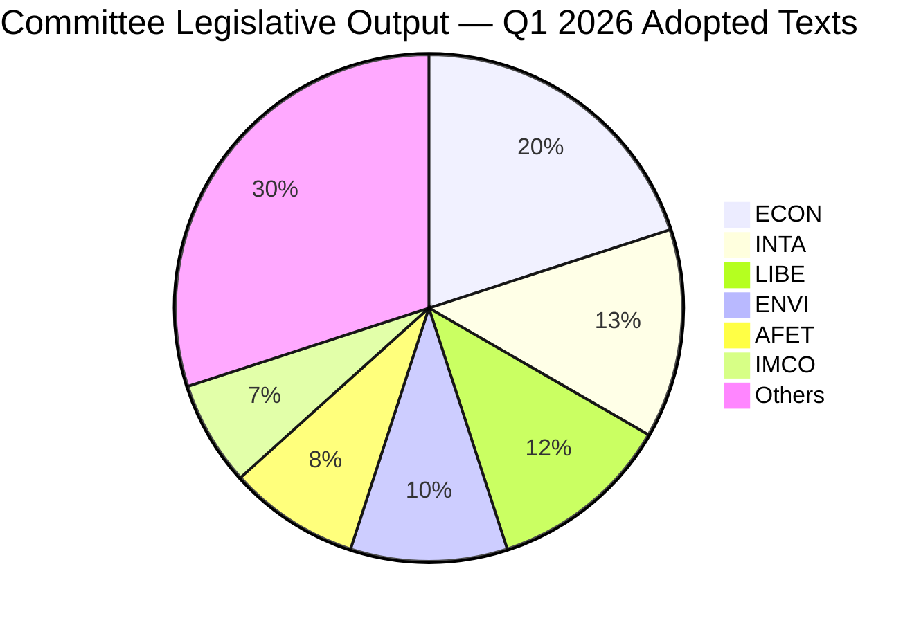

# 📊 Significance Scoring — Committee Reports (2026-04-14)

## Executive Summary

| Rank | Item | Committee | Score | Confidence |
|------|------|-----------|-------|------------|
| 1 | US Tariff Countermeasures (TA-10-2026-0096) | INTA | 25/25 | 🟢 High |
| 2 | Banking Union Triple Package (TA-0090/0091/0092) | ECON | 24/25 | 🟢 High |
| 3 | Anti-Corruption Directive (TA-10-2026-0094) | LIBE | 22/25 | 🟢 High |
| 4 | AI Digital Omnibus (TA-10-2026-0098) | IMCO/ITRE | 20/25 | 🟡 Medium |
| 5 | Water Pollutants (TA-10-2026-0093) | ENVI | 18/25 | 🟢 High |
| 6 | Global Gateway Review (TA-10-2026-0104) | AFET/DEVE | 16/25 | 🟡 Medium |
| 7 | EU-China Trade Concessions (TA-10-2026-0101) | INTA | 15/25 | 🟡 Medium |

## Scoring Methodology

Each item scored on 5 dimensions (1-5 each):
- **Political Impact**: Effect on EU institutional dynamics and group positions
- **Economic Significance**: Market, trade, or fiscal implications
- **Citizen Relevance**: Direct impact on EU residents
- **Procedural Importance**: Stage in legislative pipeline and precedent value
- **Urgency**: Time-sensitivity and immediacy of effect

## Detailed Scoring

### 1. US Tariff Countermeasures — TA-10-2026-0096 (INTA) — 25/25 CRITICAL

| Dimension | Score | Justification |
|-----------|-------|--------------|
| Political Impact | 5/5 | Cross-party unity on trade defence; rare consensus including ECR |
| Economic Significance | 5/5 | Direct trade war powers; billions in bilateral trade affected |
| Citizen Relevance | 5/5 | Consumer prices on US imports; agricultural export markets |
| Procedural Importance | 5/5 | Delegated authority to Commission — constitutional precedent |
| Urgency | 5/5 | April 15 implementation deadline — T-1 as of article date |

**Analysis**: The tariff countermeasure framework (adopted March 26 via procedure 2025/0261) gives the Commission authority to adjust customs duties and open tariff quotas for US-origin goods. With the April 15 deadline one day away, this is the highest-urgency committee output. INTA delivered legislative tools that enable rapid trade response — the first time Parliament has pre-authorised such broad tariff adjustment powers. 🟢 High confidence — verified via TA-10-2026-0096 and TA-10-2026-0097.

### 2. Banking Union Triple Package — TA-10-2026-0090/0091/0092 (ECON) — 24/25

| Dimension | Score | Justification |
|-----------|-------|--------------|
| Political Impact | 5/5 | Multi-year negotiation culmination; EPP-S&D-Renew majority |
| Economic Significance | 5/5 | Compliance costs; deposit protection reform for 450M Europeans |
| Citizen Relevance | 5/5 | Direct deposit protection enhancement under DGSD2 |
| Procedural Importance | 5/5 | Three coordinated legislative files — unprecedented package |
| Urgency | 4/5 | Trilogue expected late April; not immediately effective |

**Analysis**: ECON delivered the Banking Union triple package — DGSD2 (deposit protection scope, procedure 2023/0115), BRRD3 (early intervention and resolution, procedure 2023/0112), SRMR3 (resolution mechanism reform, procedure 2023/0111). These three files were coordinated through related procedures. ECR abstained on SRMR3, signalling sovereignty concerns over centralised resolution authority. 🟢 High confidence — all three texts verified in adopted texts data.

### 3. Anti-Corruption Directive — TA-10-2026-0094 (LIBE) — 22/25

| Dimension | Score | Justification |
|-----------|-------|--------------|
| Political Impact | 5/5 | First EU-wide anti-corruption framework; ideological milestone |
| Economic Significance | 4/5 | Compliance burden for member states; enforcement costs |
| Citizen Relevance | 5/5 | Direct anti-corruption protection; whistleblower safeguards |
| Procedural Importance | 4/5 | Procedure 2023/0135(COD) — ordinary legislative procedure |
| Urgency | 4/5 | Final plenary endorsement window late April |

### 4. AI Digital Omnibus — TA-10-2026-0098 (IMCO/ITRE) — 20/25

| Dimension | Score | Justification |
|-----------|-------|--------------|
| Political Impact | 4/5 | Tech regulation simplification — addresses AI Act complaints |
| Economic Significance | 4/5 | Reduces compliance burden for tech sector |
| Citizen Relevance | 4/5 | Affects AI services used by millions across EU |
| Procedural Importance | 4/5 | Procedure 2025/0359(COD) — fast-track given urgency |
| Urgency | 4/5 | AI Act implementation timeline pressure |

### 5. Water Pollutants — TA-10-2026-0093 (ENVI) — 18/25

| Dimension | Score | Justification |
|-----------|-------|--------------|
| Political Impact | 3/5 | Environmental policy; moderate political contention |
| Economic Significance | 4/5 | Chemical industry compliance; water treatment investment |
| Citizen Relevance | 4/5 | Direct health protection; drinking water quality |
| Procedural Importance | 4/5 | Procedure 2022/0344(COD) — long pipeline since 2022 |
| Urgency | 3/5 | Implementation timeline extends to 2028 |

## Committee Power Rankings (Q1 2026)

| Rank | Committee | Key Dossiers | Power Score |
|------|-----------|--------------|-------------|
| 1 | ECON | Banking Union triple, ECB appointments | 95/100 |
| 2 | INTA | Tariffs, WTO prep, EU-China | 88/100 |
| 3 | LIBE | Anti-Corruption, Safe countries | 85/100 |
| 4 | ENVI | Water Pollutants, Emissions | 78/100 |
| 5 | AFET | CFSP Report, Defence, Gateway | 75/100 |

## Source Attribution

All scores based on European Parliament Open Data Portal adopted texts (TA-10-2026 series), procedures (2026 series), and precomputed statistics (generated 2026-04-08). Data accessed via EP MCP Server v1.2.6.
