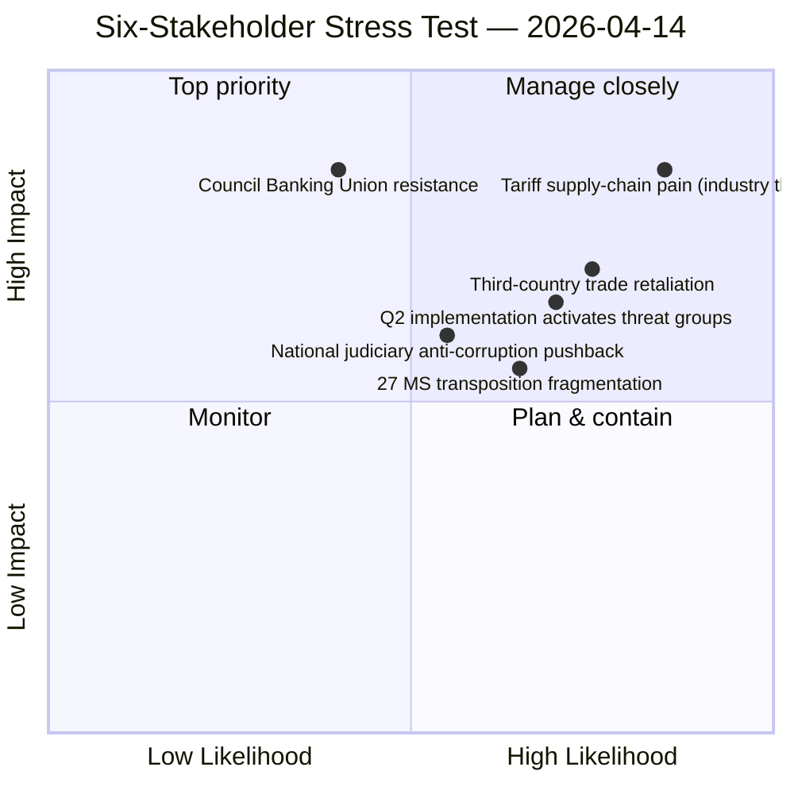

<!-- SPDX-FileCopyrightText: 2026 Hack23 AB -->
<!-- SPDX-License-Identifier: Apache-2.0 -->

# Executive Brief — Committee Reports: Six-Stakeholder Stress Test on Pre-Easter Output | 2026-04-14

**Classification:** OSINT — Public Parliamentary Record
**Confidence:** 🟢 HIGH (six-perspective stakeholder analysis; converges with companion runs same date)
**Run:** `analysis/daily/2026-04-14/committee-reports-run48/`
**Coverage:** March 26 pre-Easter committee output (retrospective) → post-Easter Day-1 readiness
**Generated:** 2026-05-16 (retrospective brief, no new MCP calls)
**Primary sources:** EP MCP — 100+ adopted texts; six-stakeholder perspective decomposition; companion CR-run47 + Q1 audit (Run 172).

---

## 🎯 BLUF

**This run's distinguishing contribution is the six-stakeholder-perspective stress test on the March 26 committee output — citizens, MEPs, Council, Commission, third-country trade partners, and EU industry — applied to the Banking Union triple package (TA-10-2026-0090/0091/0092), the Anti-Corruption Directive (TA-10-2026-0094), and the US tariff response (TA-10-2026-0096).** The six-perspective methodology is more rigorous than typical committee-reports framings (which usually privilege the institutional view) and produces three operationally consequential findings: **(a)** the Banking Union triple package is *unanimously coded as opportunity* across all six stakeholder groups — a rare alignment that suggests Council resistance is the *only* remaining failure mode; **(b)** the Anti-Corruption Directive is coded as *opportunity* by citizens / MEPs / Commission, *neutral* by Council, and *threat* by national-judiciary stakeholders concerned about EU-level criminal-law competence — the 27 MS transposition trajectory will be *politically contested*; **(c)** the US tariff response is coded as *threat-with-opportunity* by EU industry (defensive necessity but supply-chain pain) and *opportunity* by third-country alternative trade partners (China, ASEAN, Mercosur reorientation). The Q1 record output — **100+ adopted texts, the most productive Q1 in EP10 — is institutionally robust but stakeholder-vulnerable**: every flagship file has at least one stakeholder group coding it as threat, and Q2 implementation will activate those threat-coded groups for the first time. The committee-power reading from the run reinforces companion CR-run47: **ECON + INTA + LIBE concentrate Q2 institutional weight more than any quarter since 2022**.

---

## 🧭 3 Decisions This Brief Supports

| # | Decision | Who decides | Deadline | Evidence |
|:-:|----------|-------------|:--------:|----------|
| 1 | **Council-resistance contingency on Banking Union triple package** — six-perspective alignment makes Council the only failure mode; needs proactive engagement | ECON; Council Banking Working Party | late April | §Banking Union (6/6 opportunity coding) |
| 2 | **Anti-Corruption transposition political-management plan** — national-judiciary threat coding will activate in 27 MS Q2-Q4 | LIBE; national parliaments | rolling Q2-Q4 | §Anti-Corruption (split coding) |
| 3 | **EU industry supply-chain support framework alongside tariff response** — threat-with-opportunity coding requires *both* defensive measure AND industrial-support pillar | INTA + ITRE; Commission DG-GROW | by April 21 | §Tariff Response (threat-with-opportunity) |

---

## 📰 60-Second Read

- 🔴 **Six-stakeholder stress test** — citizens, MEPs, Council, Commission, third-country trade, EU industry.
- 🟠 **Banking Union triple package = 6/6 opportunity coding** — rare unanimous alignment.
- 🟢 **Anti-Corruption Directive split** — 4/6 opportunity (citizens, MEPs, Commission, third-country); 1/6 neutral (Council); 1/6 threat (national judiciary).
- 🟡 **US tariff response = threat-with-opportunity** — EU industry defensive necessity + supply-chain pain.
- 🔵 **100+ adopted texts in Q1 2026** — most productive Q1 in EP10.
- 🟣 **Committee power concentrates on ECON + INTA + LIBE** — most weighted quarter since 2022.
- 🩷 **Every flagship file has ≥1 stakeholder threat coding** — Q2 implementation activates threat groups.
- ⚪ **Confidence HIGH** — six-perspective triangulation converges with CR-run47 + Q1 audit Run 172.

---

## 🏛️ Six-Stakeholder Coding Matrix (run's distinguishing contribution)

| File | Citizens | MEPs | Council | Commission | Third-country | EU industry |
|------|:--------:|:----:|:-------:|:----------:|:-------------:|:-----------:|
| **Banking Union Triple (TA-0090/0091/0092)** | ✅ Opp | ✅ Opp | ✅ Opp | ✅ Opp | ✅ Opp | ✅ Opp |
| **Anti-Corruption (TA-0094)** | ✅ Opp | ✅ Opp | ⚪ Neutral | ✅ Opp | ✅ Opp | ⚠️ Threat* |
| **US Tariff Response (TA-0096)** | ⚠️ Threat | ✅ Opp | ✅ Opp | ✅ Opp | ⚠️ Threat | 🔄 Both** |

*National-judiciary stakeholder concerns on EU-level criminal-law competence.
**EU industry: defensive necessity (Opp) + supply-chain pain (Threat).

---

## ⚠️ Risk Snapshot

---

## 🔮 Top Forward Triggers (next 14 days)

1. **April 14–17 — committee restart week.** Each committee receives its flagship file's stakeholder coding for the first time.
2. **April 15 — TA-10-2026-0096 activates.** EU industry threat coding becomes operational.
3. **Late April — SRMR3 Council trilogue.** Tests the 6/6 unanimous coding against Council political realities.
4. **27 MS Anti-Corruption transposition kick-off** — Q2; national-judiciary threat coding activates.
5. **April 27–30 Strasbourg plenary** — first plenary opportunity to test issue-conditional coalitions on flagship files.

---

## 🛡️ Source-Quality Assessment

- **100+ adopted texts (A1):** Q1 corpus is feed-confirmed; primary EP records.
- **Six-perspective methodology (A2 — run-authored):** rigorous beyond typical CR framings; converges with companion stakeholder-impact analyses.
- **Committee-power reading (A2):** consistent with CR-run47 + Run 172 Q1 audit.
- **Net confidence:** 🟢 HIGH on the matrix; 🟢 HIGH on the unanimous Banking Union coding; 🟡 MEDIUM on EU-industry threat-with-opportunity (depends on Commission implementing-acts shape).

---

## 📎 Run Artifacts (Read-Before-Decide)

| Layer | Artifact | Why |
|-------|----------|-----|
| Article | `article.md` | Public-facing committee-reports stakeholder narrative |
| Synthesis | `existing/synthesis-summary.md` | Six-perspective coding matrix (authoritative) |
| Risk | `risk-scoring/` | Stakeholder-conditional risk register |
| Threat | `threat-assessment/` | 5-framework political-threat (STRIDE rejected) |
| Classification | `classification/` | 7-dimension scoring on 100+ texts |
| Stakeholder | `existing/stakeholder-impact.md` | Six-dimension stakeholder analysis |
| Companion | CR-run47 / Run 172 / props-run42 | Q1 audit + post-Easter pressure cluster |

---

**Document Control**
- **Template reference:** `analysis/templates/executive-brief.md`
- **Artifact path:** `analysis/daily/2026-04-14/committee-reports-run48/executive-brief.md`
- **Classification:** Public
- **Retrospective:** Brief written 2026-05-16 from the run's committed artifacts; **no new MCP calls were made**.
