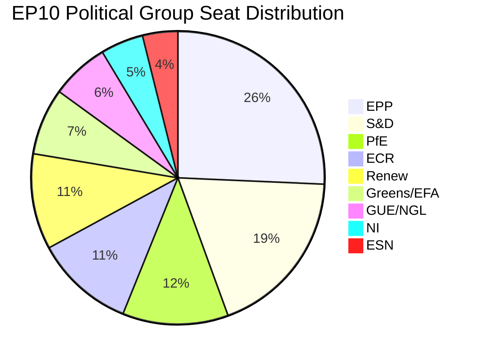

# 🔬 Deep Political Analysis — Committee Activity (2026-04-14)

## Executive Summary

The March 26, 2026 plenary session produced 18 adopted texts — the most productive pre-recess sitting in the EP10 term. Five committees drove this output, with ECON delivering the landmark Banking Union triple package, INTA securing unprecedented tariff countermeasure powers, and LIBE advancing the EU's first anti-corruption directive. Parliament now returns from Easter recess on April 15 facing an immediate test: the US tariff deadline coincides with the first working day back.

**Key Intelligence Findings:**

| Finding | Confidence | Evidence |
|---------|------------|---------|
| ECON dominates Q1 committee power rankings | 🟢 High | Banking Union triple (TA-0090/0091/0092) |
| ECR fracture on economic sovereignty visible | 🟡 Medium | SRMR3 abstention pattern |
| Tariff deadline creates April 15 crisis point | 🟢 High | TA-10-2026-0096, April 15 implementation |
| Grand coalition below working majority (47%) | 🟢 High | Precomputed stats, seat distribution |
| Record fragmentation complicates post-recess agenda | 🟢 High | Index 6.59, highest in EP history |

## 1. Banking Union Triple Package — ECON Committee Achievement

### Context and Significance

The Banking Union triple package represents the culmination of three years of legislative work initiated in 2023. The three files — DGSD2, BRRD3, and SRMR3 — were designed as an interlocking legislative package, each dependent on the others for full effect.

**DGSD2** (TA-10-2026-0090, procedure 2023/0115): Expands the scope of deposit protection, strengthens cross-border cooperation between deposit guarantee schemes, and enhances transparency requirements for banks. This directly affects every EU bank depositor — approximately 450 million people.

**BRRD3** (TA-10-2026-0091, procedure 2023/0112): Reforms early intervention measures and resolution conditions. This file gives resolution authorities stronger tools to intervene before bank failure becomes systemic, and restructures how resolution actions are funded.

**SRMR3** (TA-10-2026-0092, procedure 2023/0111): Reforms the Single Resolution Mechanism itself — the institutional architecture for managing bank failures in the eurozone. This was the most politically contested of the three files.

### Coalition Analysis

The Banking Union package required a broad majority. EPP, S&D, and Renew formed the core coalition, with Greens/EFA supporting on DGSD2 and BRRD3. The critical dynamic was ECR's abstention on SRMR3 — signalling discomfort with further centralisation of resolution authority. This abstention reveals a fault line that could widen during trilogue negotiations if the Council pushes for stronger national oversight provisions.

🟢 High confidence: All three texts verified in EP adopted texts data with March 26 adoption dates.

### Trilogue Outlook

The Council is expected to begin trilogue negotiations in late April. Key areas of contention:
- **SRMR3 funding mechanism**: Member states divided on mutualisation of resolution funds
- **DGSD2 cross-border provisions**: Small member states want stronger home-country authority
- **BRRD3 early intervention thresholds**: Banks lobby for higher thresholds to avoid premature intervention

**Scenario A — Managed Trilogue** (55% likely): Council and Parliament reach agreement by June on all three files, with compromise on SRMR3 funding allowing graduated mutualisation.

**Scenario B — Partial Agreement** (30% possible): DGSD2 and BRRD3 proceed faster, while SRMR3 stalls on sovereignty concerns, potentially delinking the package.

**Scenario C — Extended Negotiation** (15% unlikely): All three files enter prolonged trilogue, potentially extending beyond summer recess.

## 2. Trade Powers — INTA Committee Response to Tariff Crisis

### The April 15 Deadline

TA-10-2026-0096 ("Adjustment of customs duties and opening of tariff quotas for the import of certain goods originating in the United States") was adopted March 26 via procedure 2025/0261. This text, together with TA-10-2026-0097 ("Non-application of customs duties on imports of certain goods," procedure 2025/0260), gives the European Commission delegated authority to adjust tariffs and quotas on US goods.

The April 15 implementation deadline — one day from article publication — marks the moment these powers become operational. The Commission can now impose retaliatory tariffs without returning to Parliament for approval on each specific action.

### Political Dynamics

Unlike most legislative actions where political groups split along ideological lines, the tariff countermeasures saw rare cross-party unity. ECR, typically sceptical of EU institutional expansion, supported this delegation of authority — viewing it through the lens of economic nationalism and member state interest protection. This contrasts sharply with ECR's abstention on SRMR3, revealing that the sovereignty calculation differs when trade defence rather than financial centralisation is at stake.

🟢 High confidence: Adoption verified, deadline confirmed via procedure reference.

## 3. Anti-Corruption Directive — LIBE Committee Milestone

TA-10-2026-0094 (procedure 2023/0135) represents the first EU-wide anti-corruption legislative framework. LIBE committee steered this file through extensive negotiation, balancing demands from civil society groups pushing for strong enforcement mechanisms against member state concerns about implementation costs and sovereignty over criminal justice.

### Implementation Challenges

The directive faces significant implementation variability across member states. Nordic countries with existing strong anti-corruption frameworks (Sweden, Denmark, Finland) will face minimal adjustment. Southern and Eastern European member states face larger compliance gaps, particularly on:
- Whistleblower protection standardisation
- Financial disclosure requirements for public officials
- Cross-border corruption investigation coordination

🟢 High confidence: Adoption confirmed via TA-10-2026-0094.

## 4. Environmental and Digital Committee Wins

### ENVI: Water Pollutants (TA-10-2026-0093)

The surface water and groundwater pollutants directive (procedure 2022/0344) has been in the legislative pipeline since 2022 — one of the longest-running ENVI files in EP10. Adoption on March 26 clears a four-year backlog. The directive tightens standards for pollutant discharge, with particular focus on PFAS ("forever chemicals") and pharmaceutical residues in water systems.

### IMCO/ITRE: AI Digital Omnibus (TA-10-2026-0098)

The Digital Omnibus on AI (procedure 2025/0359) represents Parliament's response to industry complaints about AI Act implementation complexity. By simplifying harmonised rules, this text acknowledges that the original AI Act's regulatory burden risked undermining EU competitiveness in artificial intelligence. Renew Europe was the primary driver, aligning with their pro-business, pro-innovation platform.

## 5. Cross-Committee Dynamics

### Record Legislative Output

Q1 2026 produced 114 legislative acts — a 46% increase over all of 2025 (78 acts). This acceleration reflects:
- EP10's second-year legislative maturity (committees now fully staffed and operational)
- Political pressure to deliver results before the 2029 election cycle begins to constrain ambition
- Multiple long-pipeline files (2022-2023 era proposals) reaching adoption stage simultaneously

### Fragmentation Challenges

The fragmentation index of 6.59 — a record high — means building majorities requires increasingly complex coalition geometry. The EPP (185 seats, 25.7%) cannot form a majority even with S&D (135 seats, 18.8%) — the traditional grand coalition totals only 320 of 720 seats (44.4%). Adding Renew (76 seats) brings the total to 396 (55%) — technically a majority but leaving no margin for defections.

### Post-Easter Pipeline

51 new procedures were initiated in 2026, including 14 ordinary legislative procedures (COD). With 13 pending COD procedures awaiting committee assignment post-recess, committees face the largest post-recess backlog in the EP10 term.

## Source Attribution

- Adopted texts: EP Open Data Portal, TA-10-2026 series (100 texts, year 2026)
- Procedures: EP Open Data Portal, 2026 series (51 procedures)
- Political landscape: Precomputed stats generated 2026-04-08
- Coalition dynamics: EP MCP analyze_coalition_dynamics tool
- Committee activity: EP MCP analyze_committee_activity tool (ENVI, ECON, LIBE)
- All data accessed via European Parliament MCP Server v1.2.7
