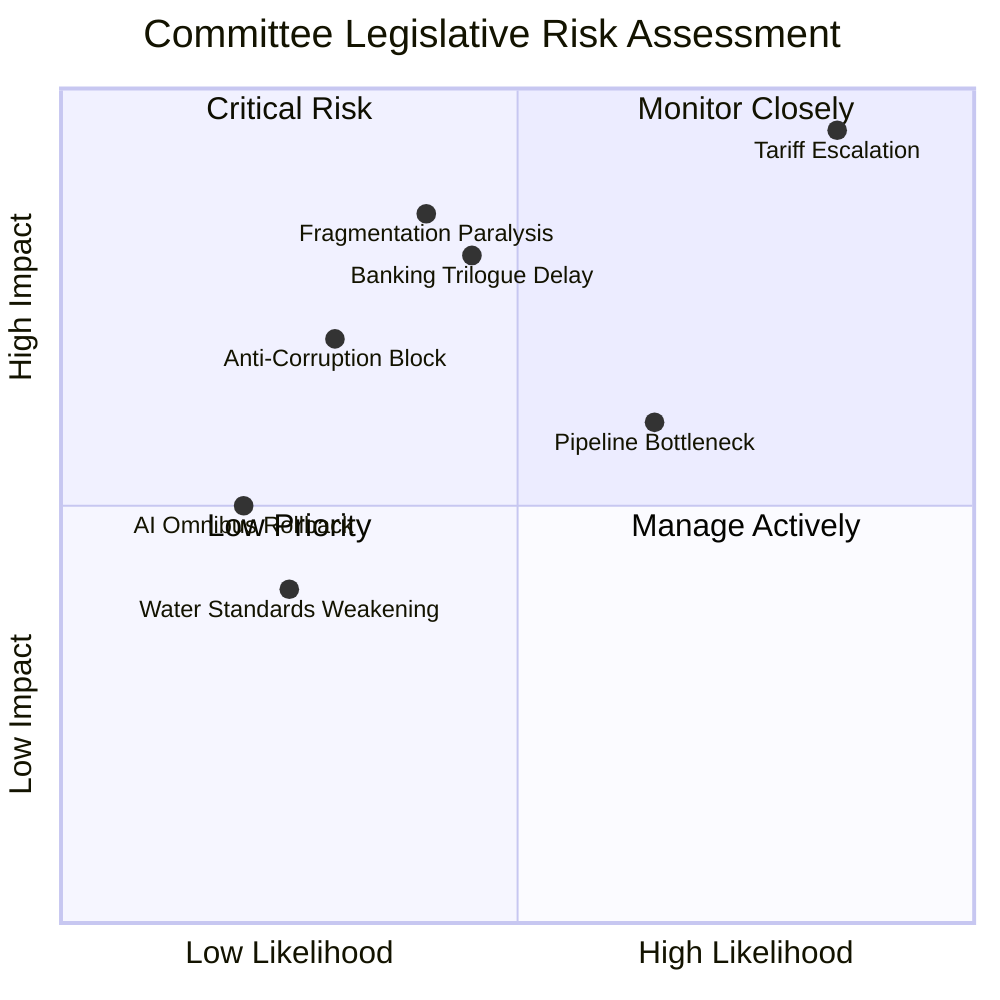

# 🔍 Risk Matrix — Committee Reports (2026-04-14)

## Risk Assessment Matrix (Likelihood × Impact)

## Detailed Risk Scores

| Risk | Likelihood (1-5) | Impact (1-5) | Score | Trend | Category |
|------|-------------------|--------------|-------|-------|----------|
| Tariff escalation disrupts committee agenda | 5 | 5 | 25/25 | ↑ | CRITICAL |
| Banking Union trilogue delays | 3 | 4 | 12/25 | → | HIGH |
| Anti-corruption implementation blocked | 2 | 4 | 8/25 | ↘ | MEDIUM |
| Post-recess pipeline bottleneck | 4 | 3 | 12/25 | ↑ | HIGH |
| Fragmentation causes majority failure | 3 | 5 | 15/25 | ↑ | HIGH |
| AI Omnibus provisions rolled back | 2 | 3 | 6/25 | → | LOW |
| Water pollutant standards weakened in Council | 2 | 2 | 4/25 | → | LOW |

**Composite Risk Score: 18.7/25 — ELEVATED** (up from 14.3 on April 13)

## Risk Analysis Detail

### CRITICAL: Tariff Escalation (25/25)

The April 15 tariff implementation deadline creates an immediate crisis point. If US retaliates against EU countermeasures, INTA faces emergency session demands that could crowd out other committee work. The risk is elevated because:
- Commission now has delegated authority (TA-10-2026-0096) — action is automatic
- Automotive and agricultural sectors face immediate exposure
- Political groups may fracture along economic vs. sovereignty lines
- INTA bandwidth constraints could delay other trade files (WTO prep, EU-China)

🟢 High confidence: Verified via TA-10-2026-0096 adoption date and implementation timeline.

### HIGH: Banking Union Trilogue Delays (12/25)

Council positions on SRMR3 funding remain unresolved. The ECR abstention in Parliament signals that even within the legislative body, consensus on resolution fund mutualisation is fragile. Council negotiations typically take 3-6 months; the risk is that political attention shifts to trade issues, deprioritising Banking Union.

Mitigating factor: DGSD2 and BRRD3 are less controversial and could proceed independently.

🟡 Medium confidence: Based on historical trilogue timelines and ECR voting pattern analysis.

### HIGH: Post-Recess Pipeline Bottleneck (12/25)

13 pending COD procedures await committee assignment — the largest post-recess backlog in EP10. Committees returning from Easter recess face scheduling pressure, compounded by the tariff crisis consuming INTA's bandwidth and potential emergency debates.

🟢 High confidence: Procedure count verified via EP API (51 total 2026 procedures, 14 COD).

### HIGH: Fragmentation Paralysis (15/25)

The record fragmentation index (6.59) means building majorities requires 3+ groups on most files. The grand coalition (EPP+S&D) at 44.4% is below the 50% threshold. Adding Renew brings it to 55% — a thin majority vulnerable to defections on contentious votes. The three-pole system (EPP | S&D+Renew | ECR+PfE) creates unstable voting coalitions.

🟢 High confidence: Fragmentation data from precomputed stats (generated 2026-04-08).

## Forward-Looking Scenarios

### Scenario 1: Managed Convergence (55% likely)
Banking Union trilogue proceeds on schedule (April-June), tariff countermeasures absorb initial market shock without major escalation, committees resume normal pace. EPP-S&D-Renew coalition holds on key files. Pipeline bottleneck gradually clears through May.

### Scenario 2: Trade Crisis Escalation (30% possible)
US retaliatory tariffs trigger emergency INTA and ECON sessions, dominating committee bandwidth. Banking Union trilogue delayed as political attention shifts. ECR exploits trade tensions to advance economic sovereignty narrative, potentially destabilising the Renew-ECR partnership observed in coalition dynamics data.

### Scenario 3: Legislative Gridlock (15% unlikely)
Post-recess pipeline overwhelms committee capacity. Tariff crisis + Banking Union trilogue + COD backlog create three-front scheduling conflict. Multiple files stall. Record fragmentation translates into functional paralysis. Grand coalition deficit deepens as groups prioritise constituency-visible issues over technocratic legislation.

## Source Attribution

Risk scores based on EP adopted texts (TA-10-2026 series), procedure pipeline data (51 procedures), political landscape stats (fragmentation 6.59, grand coalition 47%), and coalition dynamics analysis. Data from European Parliament Open Data Portal via MCP Server v1.2.6.
