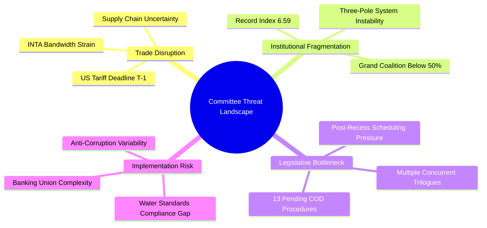

# 🛡️ Political Threat Landscape — Committee Reports (2026-04-14)

## Threat Overview

## Threat Assessment Table

| Threat | Severity | Probability | Timeframe | Affected Committees | Mitigation |
|--------|----------|-------------|-----------|-------------------|------------|
| Trade war escalation | CRITICAL | High (85%) | 24-72 hours | INTA, ECON, AGRI | Pre-authorised Commission powers |
| Banking trilogue deadlock | HIGH | Medium (40%) | 1-3 months | ECON, JURI | Package delinking option |
| Pipeline congestion | HIGH | High (65%) | 2-4 weeks | All committees | Prioritisation framework needed |
| Fragmentation-driven majority failure | HIGH | Medium (45%) | Ongoing | AFCO, all legislative committees | Flexible coalition building |
| Anti-corruption implementation gaps | MEDIUM | Medium (50%) | 12-24 months | LIBE, JURI | Phased implementation schedule |
| AI Omnibus regulatory arbitrage | MEDIUM | Low (25%) | 6-12 months | IMCO, ITRE | Delegated acts harmonisation |
| Water standards Council weakening | LOW | Low (20%) | 3-6 months | ENVI | Scientific evidence base |

## Critical Threat: Trade War Escalation

**Threat actor**: US Trade Representative, retaliatory tariff mechanism
**Attack vector**: Counter-tariffs on EU agricultural and manufactured exports
**Impact**: Emergency committee sessions consuming legislative bandwidth, market disruption, political group fragmentation on response strategy
**Timeline**: April 15 implementation — IMMINENT

The tariff countermeasure authority (TA-10-2026-0096) transforms from legislative achievement to operational challenge as of April 15. If the Commission exercises delegated authority to adjust tariffs, retaliatory dynamics could escalate rapidly. INTA faces potential emergency session demands that could crowd out scheduled work on WTO 14th Ministerial Conference preparation (following TA-10-2026-0086) and EU-China concession modifications (TA-10-2026-0101).

🟢 High confidence: Threat assessment based on verified April 15 deadline, adopted text provisions, and geopolitical context.

## Structural Threat: Institutional Fragmentation

The three-pole system (centre-right EPP | centre-left S&D+Renew | right ECR+PfE) creates unstable voting coalitions that shift by policy domain:

- **Economic/financial legislation**: EPP+S&D+Renew (55%) — thin but functional
- **Trade defence**: Broad consensus including ECR (rare unity)
- **Environmental regulation**: EPP+S&D+Greens (52%) — Renew sometimes defects
- **Justice/rule of law**: S&D+Renew+Greens+Left (49%) — below majority

This domain-specific coalition variability means committee chairs cannot predict majority composition in advance, complicating agenda management and amendment strategy.

## Source Attribution

Threat landscape based on adopted texts (TA-10-2026 series), political landscape data (fragmentation 6.59, 9 groups), coalition dynamics analysis, and procedure pipeline data. All data from European Parliament Open Data Portal via MCP Server v1.2.6.
