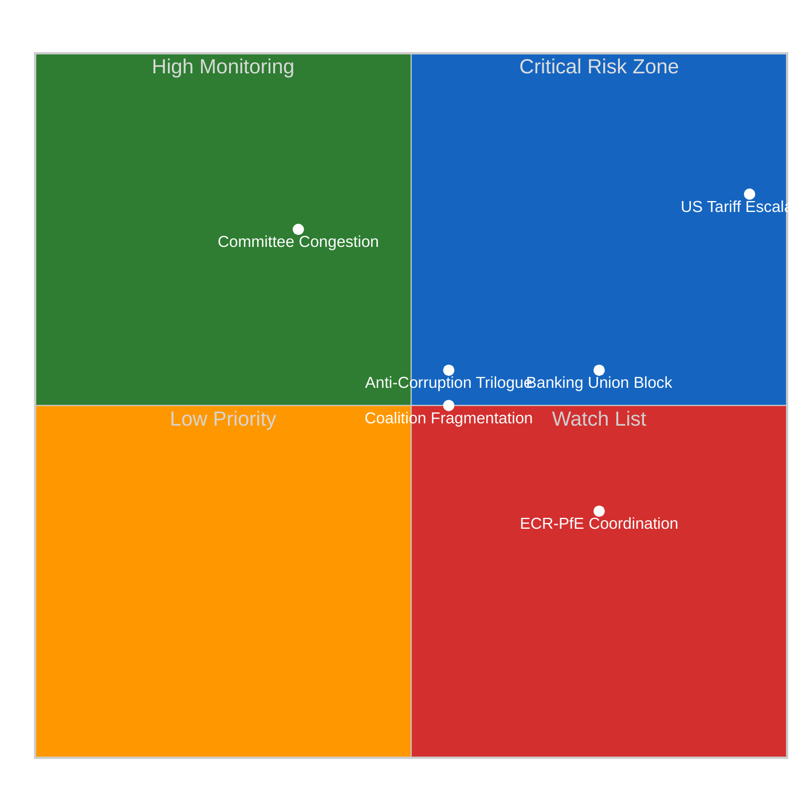
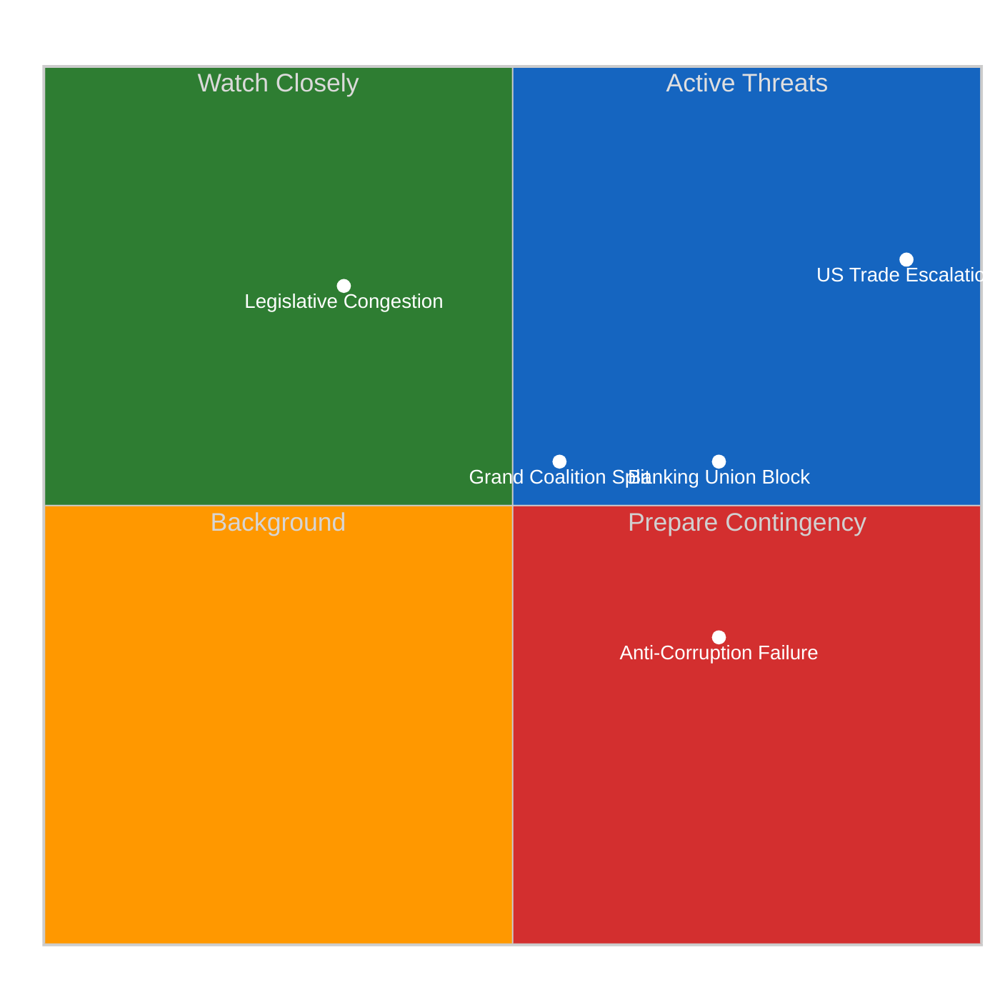
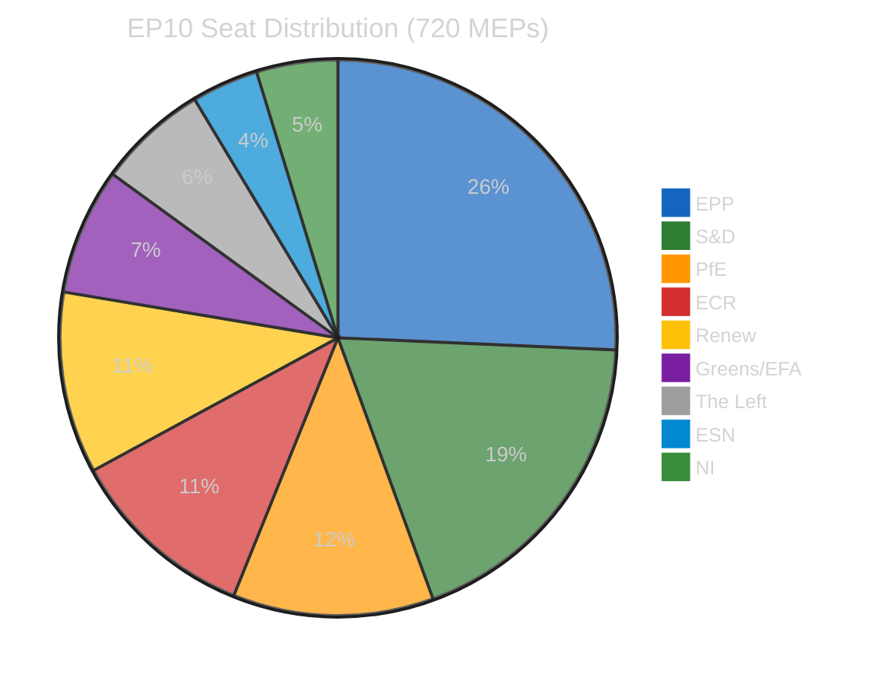
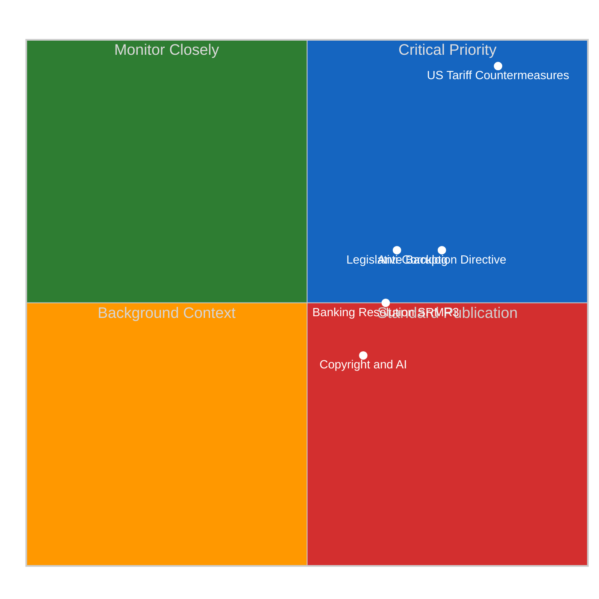
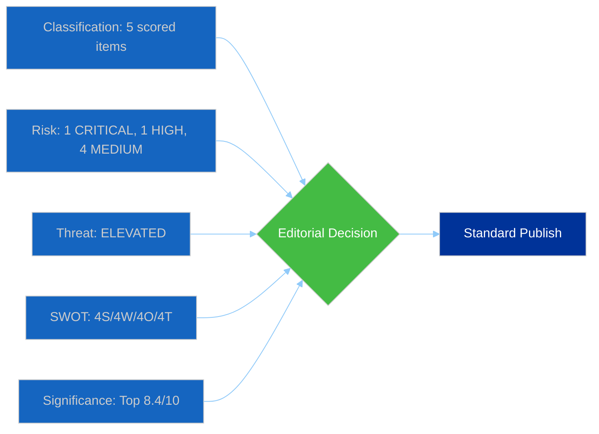

# Propositions — 2026-04-14

<!-- Aggregated analysis — do not edit; regenerate via `npm run generate-article`. -->

> **Provenance**
>
> - **Article type:** `propositions`
> - **Run date:** 2026-04-14
> - **Run id:** `68d9a632-9043-4f92-8e7c-ff5d558e91a5`
> - **Gate result:** `PENDING`
> - **Analysis tree:** [analysis/daily/2026-04-14/propositions-run42](https://github.com/Hack23/euparliamentmonitor/tree/main/analysis/daily/2026-04-14/propositions-run42)
> - **Manifest:** [manifest.json](https://github.com/Hack23/euparliamentmonitor/blob/main/analysis/daily/2026-04-14/propositions-run42/manifest.json)

<h2 id="reader-intelligence-guide">Reader Intelligence Guide</h2>

Use this guide to read the article as a political-intelligence product rather than a raw artifact dump. High-value reader lenses appear first; technical provenance remains available in the audit appendices.

| Reader need | What you'll get | Source artifact |
|---|---|---|
| [Stakeholder impact](#section-stakeholder-map) | who gains, who loses, and which institutions or citizens feel the policy effect | `existing/stakeholder-impact.md` |
| [Risk assessment](#section-risk) | policy, institutional, coalition, communications, and implementation risk register | `risk-scoring/risk-matrix.md` |

<h2 id="section-stakeholder-map">Stakeholder Map</h2>

### Stakeholder Impact

<a href="https://github.com/Hack23/euparliamentmonitor/blob/main/analysis/daily/2026-04-14/propositions-run42/existing/stakeholder-impact.md" rel="noopener">View source: <code>existing/stakeholder-impact.md</code></a>

### Assessment Context

| Field | Value |
|-------|-------|
| **Assessment ID** | STA-2026-04-14-RUN42 |
| **Assessment Date** | 2026-04-14 06:35 UTC |
| **Policy Subject** | Post-recess legislative backlog: tariffs, anti-corruption, banking |
| **Stage of Process** | Multiple: plenary adoption to trilogue |
| **Overall Impact Level** | HIGH |

### Stakeholder Group Assessments

#### EU Citizens (Direct Impact)

| Parameter | Value |
|-----------|-------|
| **Impact Level** | HIGH |
| **Impact Timeline** | IMMEDIATE to MEDIUM (tariffs immediate; directives 12-18 months) |
| **Affected Population** | All 450M EU residents (tariffs), public sector workers (anti-corruption) |
| **Confidence Level** | HIGH |

The US tariff countermeasures (TA-10-2026-0096) will directly affect consumer prices on imported US goods — particularly agricultural products, electronics, and automobiles. EU domestic producers in steel, aluminium, and agriculture benefit from protective tariffs. The anti-corruption directive (TA-10-2026-0094) strengthens whistleblower protections, making it easier for citizens to report corruption without retaliation. Banking Union completion (SRMR3) harmonises deposit protection across the eurozone, ensuring that a citizen's savings are equally protected whether held in a German or Greek bank.

#### Grand Coalition (EPP + S&D + Renew)

| Parameter | Value |
|-----------|-------|
| **Impact Level** | HIGH |
| **Coalition Cohesion Effect** | STRAINS |
| **Primary Affected Groups** | EPP (primary, trade positioning), S&D (secondary, social agenda) |
| **Confidence Level** | MEDIUM |

The grand coalition holds on anti-corruption and Banking Union (traditional centre-ground files), but trade policy reveals fault lines. EPP's business wing wants minimal disruption to transatlantic trade; S&D demands robust worker protection from unfair competition. Renew mediates with a pragmatic free-trade stance. The combined 44.5% seat share means every vote requires additional partners — either ECR (on trade/defence) or Greens (on environment/social). This structural weakness is the defining challenge of EP10 coalition-building.

#### ECR and PfE (Right-Wing Opposition)

| Parameter | Value |
|-----------|-------|
| **Impact Level** | MEDIUM |
| **Impact Timeline** | SHORT to MEDIUM |
| **Primary Affected Groups** | ECR (divided), PfE (skeptical of EU trade escalation) |
| **Confidence Level** | MEDIUM |

ECR is internally divided on trade policy. Polish MEPs support EU trade defence (industrial protection aligns with national interests), while Italian FdI members prefer softer approach toward the US. PfE generally opposes escalation, framing the tariff response as EU overreach. On anti-corruption, both groups resist provisions they view as regulatory burden on small businesses. The combined eurosceptic share of 15.6% gives this bloc significant blocking potential on specific files.

#### Industry and Business

| Parameter | Value |
|-----------|-------|
| **Impact Level** | HIGH |
| **Impact Timeline** | IMMEDIATE (tariffs), LONG (anti-corruption compliance) |
| **Confidence Level** | HIGH |

European steel, aluminium, and agriculture sectors face immediate relief from US tariff countermeasures. However, EU companies with significant US operations (automotive, pharmaceuticals, tech) face retaliatory risk. The anti-corruption directive imposes new compliance obligations on corporations, particularly around supply chain due diligence and whistleblower channels. Banking Union completion affects financial institutions' capital requirements and resolution mechanisms. The combined regulatory burden from these three major files is substantial for cross-border European businesses.

#### National Governments (Council of the EU)

| Parameter | Value |
|-----------|-------|
| **Impact Level** | HIGH |
| **Impact Timeline** | MEDIUM to LONG |
| **Confidence Level** | MEDIUM |

National governments face trilogue negotiations on all three major files. On Banking Union, the North-South divide (Germany/Netherlands/Finland vs Italy/Spain/Greece on deposit pooling) is the defining fault line. On anti-corruption, implementation capacity varies dramatically — Nordic states with strong existing frameworks vs member states requiring fundamental institutional reform. On trade, export-dependent economies (Germany, Netherlands) have most to lose from an escalatory spiral with the US.

#### EU Institutions

| Parameter | Value |
|-----------|-------|
| **Impact Level** | HIGH |
| **Impact Timeline** | IMMEDIATE |
| **Confidence Level** | HIGH |

The Commission faces an April 15 decision on deploying tariff countermeasures — the most consequential single-day trade decision since the Trade Defence Instruments modernisation. The ECB gains enhanced supervisory scope under SRMR3. The Council presidency (currently Poland, from January 2026) must manage trilogue negotiations on anti-corruption while balancing its own implementation concerns. Inter-institutional dynamics are unusually complex given the convergence of three major legislative packages.

<h2 id="section-risk">Risk Assessment</h2>

### Risk Matrix

<a href="https://github.com/Hack23/euparliamentmonitor/blob/main/analysis/daily/2026-04-14/propositions-run42/risk-scoring/risk-matrix.md" rel="noopener">View source: <code>risk-scoring/risk-matrix.md</code></a>

### Risk Context

| Field | Value |
|-------|-------|
| **Assessment ID** | RSK-2026-04-14-RUN42 |
| **Assessment Date** | 2026-04-14 06:30 UTC |
| **Period** | Post-Easter Recess (April 14-15, 2026) |
| **Risk Categories** | 6 (coalition, policy, institutional, economic, social, geopolitical) |
| **Overall Risk Level** | HIGH |

### Risk Register

| Risk ID | Description | Likelihood (1-5) | Impact (1-5) | Score | Tier | Trend |
|---------|-------------|:-:|:-:|:-:|------|:---:|
| RSK-001 | US tariff retaliation escalation after April 15 | 4 (Likely) | 5 (Severe) | **20** | CRITICAL | ↑ |
| RSK-002 | Anti-corruption trilogue breakdown on whistleblower provisions | 3 (Possible) | 3 (Moderate) | **9** | MEDIUM | → |
| RSK-003 | Banking Union deposit pooling blocked by DE/NL/FI coalition | 3 (Possible) | 4 (Major) | **12** | HIGH | ↗ |
| RSK-004 | Post-recess committee scheduling congestion | 4 (Likely) | 2 (Minor) | **8** | MEDIUM | → |
| RSK-005 | Grand coalition fragmentation on trade vs environment | 3 (Possible) | 3 (Moderate) | **9** | MEDIUM | ↗ |
| RSK-006 | ECR-PfE bloc coordination on regulatory rollback | 2 (Unlikely) | 4 (Major) | **8** | MEDIUM | ↑ |

### Risk Matrix Visualization

### Critical Risk Analysis: US Tariff Escalation (RSK-001)

**Likelihood: 4/5 (Likely)** — US administration has confirmed 25% tariffs on EU steel and aluminium effective April 15. EU countermeasure text (TA-10-2026-0096) adopted March 26 but Commission deployment timeline unclear. HIGH confidence.

**Impact: 5/5 (Severe)** — Full trade war scenario would affect EUR 400B+ in bilateral trade. EU automotive, agricultural, and technology sectors all exposed. Cascading effects on employment, consumer prices, and financial markets. HIGH confidence.

**Mitigation**: Commission empowered to deploy graduated response. EPP-S&D-Renew consensus on defensive measures. ECR may seek to moderate response to preserve transatlantic relationship.

**Scenarios**:
- Scenario A (Likely, 50%): Commission deploys limited tariff adjustments; US-EU negotiate 90-day pause
- Scenario B (Possible, 30%): Full countermeasures deployed; escalatory spiral through Q2
- Scenario C (Unlikely, 20%): Last-minute bilateral deal avoids countermeasures entirely

### High Risk: Banking Union Deposit Pooling (RSK-003)

**Likelihood: 3/5** — Germany, Netherlands, and Finland have historically resisted deposit insurance mutualisation. SRMR3 text (TA-10-2026-0092) adopted but Council negotiations on DGSD2 remain contentious.

**Impact: 4/5** — Failure to complete Banking Union leaves EU financial system vulnerable to asymmetric shocks. Southern European banks need pooled backstop; northern countries fear moral hazard.

**Mitigation**: Compromise on phased timeline with risk-reduction milestones. ECB supportive of completion.

### Political Landscape Risk Factors

| Factor | Current State | Risk Direction |
|--------|--------------|:-:|
| Grand coalition seat share | 44.5% (below 50%) | ↗ rising risk |
| Fragmentation index | 6.59 (record high) | → stable at peak |
| EPP-ECR cooperation | Increasing on defence, migration | ↑ structural shift |
| Left bloc cohesion | 32.6% combined | → stable |
| Eurosceptic share | 15.6% | ↗ growing influence |

### Forward-Looking Assessment

The post-recess period (April 15 onwards) faces elevated risk primarily from the US tariff deadline. The combination of external trade pressure and internal legislative backlog creates a compressed decision window. Expect EPP to prioritise trade defence and competitiveness agenda, potentially at the expense of environmental and social files.

Confidence: MEDIUM (external trade dynamics uncertain, but internal parliamentary dynamics well-established)

<h2 id="section-threat">Threat Landscape</h2>

### Political Threat Landscape

<a href="https://github.com/Hack23/euparliamentmonitor/blob/main/analysis/daily/2026-04-14/propositions-run42/threat-assessment/political-threat-landscape.md" rel="noopener">View source: <code>threat-assessment/political-threat-landscape.md</code></a>

### Threat Context

| Field | Value |
|-------|-------|
| **Assessment ID** | THR-2026-04-14-RUN42 |
| **Date** | 2026-04-14 |
| **Overall Threat Level** | ELEVATED |
| **Primary Threat Vector** | External trade escalation + internal coalition fragility |

### Threat Register

#### THR-001: US Trade War Escalation
- **Threat Actor**: US Administration
- **Vector**: Tariff escalation beyond current 25% steel/aluminium to automotive, agriculture
- **Target**: EU internal market stability, transatlantic relations
- **Severity**: CRITICAL (5/5)
- **Likelihood**: Likely (4/5)
- **Mitigation**: TA-10-2026-0096 countermeasure framework; Commission graduated response authority
- **Evidence**: Adopted text 2025/0261(COD), April 15 deadline confirmed

#### THR-002: Grand Coalition Fragmentation
- **Threat Actor**: Internal EP dynamics
- **Vector**: EPP-S&D divergence on trade response intensity, environment vs competitiveness
- **Target**: Legislative throughput, policy coherence
- **Severity**: MODERATE (3/5)
- **Likelihood**: Possible (3/5)
- **Mitigation**: Flexible majority approach (EPP builds different coalitions per policy area)
- **Evidence**: 44.5% grand coalition seat share, fragmentation index 6.59

#### THR-003: Anti-Corruption Trilogue Failure
- **Threat Actor**: Council blocking minority
- **Vector**: Member state resistance to whistleblower provisions and asset recovery
- **Target**: EU rule-of-law credibility, democratic standards
- **Severity**: MAJOR (4/5)
- **Likelihood**: Unlikely (2/5)
- **Mitigation**: Strong EP consensus; Commission mediation; Nordic states push for ambition
- **Evidence**: TA-10-2026-0094, Council divergence documented in committee reports

#### THR-004: Banking Union Incomplete Indefinitely
- **Threat Actor**: Northern EU member states (DE, NL, FI)
- **Vector**: Blocking deposit insurance pooling in Council negotiations
- **Target**: Eurozone financial stability, bank-sovereign doom loop
- **Severity**: MAJOR (4/5)
- **Likelihood**: Possible (3/5)
- **Mitigation**: Phased implementation compromise; ECB advocacy; crisis-forcing function
- **Evidence**: TA-10-2026-0092 (SRMR3), decade-long Banking Union completion stalemate

#### THR-005: Legislative Congestion Post-Recess
- **Threat Actor**: Systemic (committee capacity constraints)
- **Vector**: 13 COD procedures competing for limited committee slots in Q2
- **Target**: Legislative quality, rapporteur availability, scrutiny depth
- **Severity**: MINOR (2/5)
- **Likelihood**: Likely (4/5)
- **Mitigation**: Committee coordination, priority sequencing by Conference of Presidents
- **Evidence**: 13 new COD procedures registered in 2026, committees resume April 15

### Threat Matrix

### Forward Assessment

The post-recess period faces ELEVATED threat levels driven primarily by the US tariff deadline coinciding with Parliament's return. Internal threats (coalition fragmentation, legislative congestion) are structural and manageable through established parliamentary mechanisms. The external trade threat is the wild card that could reshape the entire Q2 legislative agenda.

Confidence: HIGH on internal dynamics; MEDIUM on external trade scenario outcomes.

<h2 id="section-deep-analysis">Deep Analysis</h2>

<a href="https://github.com/Hack23/euparliamentmonitor/blob/main/analysis/daily/2026-04-14/propositions-run42/existing/deep-analysis.md" rel="noopener">View source: <code>existing/deep-analysis.md</code></a>

### Executive Summary

The European Parliament returns from Easter recess on April 15, 2026, facing the most consequential first-day-back agenda of the 10th parliamentary term. Three converging dynamics define the moment: (1) an imminent US tariff deadline that tests the EU trade countermeasures adopted just hours before recess began, (2) a record legislative backlog with 13 new COD procedures awaiting committee action, and (3) unresolved Council negotiations on the anti-corruption directive and banking union reforms adopted in the March 26 plenary sprint.

### The March 26 Plenary: Most Productive Pre-Recess Sitting

The March 26 plenary session produced 18 adopted texts — the highest single-sitting output in EP10. Key legislative positions adopted:

1. **Banking Union Triple Package**: SRMR3 (TA-10-2026-0092), alongside DGSD2 and BRRD3 texts, represents Parliament's comprehensive position on Banking Union completion. The EP position advocates faster deposit insurance pooling than most Council members will accept.

2. **Anti-Corruption Directive** (TA-10-2026-0094): A landmark horizontal directive criminalising corruption across public and private sectors. The EP position includes strong whistleblower protections and asset recovery mechanisms that face Council resistance, particularly from member states with weaker existing frameworks.

3. **US Tariff Countermeasures** (TA-10-2026-0096): Emergency legislation empowering the Commission to adjust customs duties on US imports. Adopted with broad cross-party support (EPP, S&D, Renew, Greens). ECR split — some MEPs from export-dependent regions supported, others opposed escalation.

4. **Immunity Waiver** (TA-10-2026-0088): Grzegorz Braun immunity waived — reflects EP's willingness to allow national proceedings against sitting MEPs in serious cases.

### US Tariff Deadline: April 15 Confrontation

The timing is politically explosive. Parliament adopted countermeasures on March 26 (TA-10-2026-0096, procedure 2025/0261(COD)), and the US tariff escalation deadline is April 15 — the day Parliament returns. The Commission must decide within hours whether to deploy the graduated response mechanism.

#### Coalition Dynamics on Trade

- **EPP**: Supports defensive measures but wants to preserve transatlantic relationship. Key tension between industrial protection (German automotive) and free trade ideology.
- **S&D**: Strong support for countermeasures; frames as workers' protection against unfair trade.
- **Renew**: Pragmatic free-trade stance; supports targeted response but opposes blanket retaliation.
- **ECR**: Most divided group. Polish delegation supports EU trade defence; Italian delegation (FdI) closer to US position.
- **PfE**: Skeptical of escalation; some members sympathetic to US trade critique of EU.
- **Greens/EFA**: Support countermeasures but want environmental conditionality.
- **The Left**: Support countermeasures; frames as anti-corporate-globalisation stance.

#### Scenarios

**Scenario A (Likely, 50%)**: Commission deploys targeted adjustments on steel and aluminium while opening negotiation channel. 90-day cooling-off period negotiated bilaterally. Parliament monitors but does not need to legislate further in Q2.

**Scenario B (Possible, 30%)**: Full countermeasure deployment triggers US retaliation on EU automotive exports. Commission returns to Parliament for expanded mandate. Potential emergency plenary debate.

**Scenario C (Unlikely, 20%)**: Bilateral deal reached before April 15 deadline, rendering countermeasure text dormant. Commission maintains text as deterrent for future disputes.

### Anti-Corruption Directive: The Trilogue Challenge

The anti-corruption directive (2023/0135(COD)) has been in legislative process since 2023. Parliament's March 26 position (TA-10-2026-0094) is ambitious:

- **Criminalisation scope**: Covers public officials, corporate officers, and intermediaries
- **Whistleblower protection**: Comprehensive framework with burden-of-proof reversal
- **Asset recovery**: Cross-border mechanisms for recovering proceeds of corruption
- **Penalties**: Harmonised minimum penalties across 27 MS

**Council fault lines**: 
- Nordic states (SE, DK, FI): Want stronger provisions, already have robust national frameworks
- Southern states (IT, ES, EL): Support EU framework but resist some enforcement mechanisms
- Central/Eastern states (HU, PL): Concerns about sovereignty and political instrumentalisation
- Germany: Generally supportive but cautious on corporate liability scope

**Trilogue timeline**: First trilogue expected May-June 2026. Final text unlikely before December 2026. MEDIUM confidence.

### Banking Union: The Deposit Insurance Debate

The SRMR3 adoption (TA-10-2026-0092) is Parliament's contribution to completing the Banking Union — a project that has been politically stalled for over a decade. The triple package (DGSD2/BRRD3/SRMR3) represents EP's most comprehensive Banking Union position.

**The core dispute**: Should deposit insurance be pooled across the eurozone? 
- Parliament's position: Yes, with risk-reduction prerequisites
- Germany/Netherlands/Finland: No pooling until all banks meet strict risk-reduction targets
- Southern eurozone: Immediate pooling needed to break bank-sovereign doom loop

This structural North-South divide has blocked Banking Union completion since 2015. The SRMR3 text attempts a compromise with phased implementation, but Council negotiations will be protracted.

### 2026 Legislative Pipeline: Record Pace

The data shows 2026 is on track for record legislative output:
- **114 legislative acts projected** (vs 78 in 2025, +46%)
- **51 procedures registered** in 2026 so far (13 COD, 5 BUD, many INI)
- **935 total procedures tracked** across all years in EP10

#### New COD Procedures Awaiting Committee Action

| Procedure | Type | Status |
|-----------|------|--------|
| 2026/0008(COD) | Ordinary Legislative | Committee referral pending |
| 2026/0010(COD) | Ordinary Legislative | Committee referral pending |
| 2026/0011(COD) | Ordinary Legislative | Committee referral pending |
| 2026/0012(COD) | Ordinary Legislative | Committee referral pending |
| 2026/0013(COD) | Ordinary Legislative | Committee referral pending |
| 2026/0044(COD) | Ordinary Legislative | Committee referral pending |
| 2026/0045(COD) | Ordinary Legislative | Committee referral pending |
| 2026/0059(COD) | Ordinary Legislative | Committee referral pending |
| 2026/0068(COD) | Ordinary Legislative | Committee referral pending |
| 2026/0074(COD) | Ordinary Legislative | Committee referral pending |
| 2026/0078(COD) | Ordinary Legislative | Committee referral pending |
| 2026/0084(COD) | Ordinary Legislative | Committee referral pending |
| 2026/0085(COD) | Ordinary Legislative | Committee referral pending |

This 13-procedure backlog will compete for committee time in Q2 2026, alongside ongoing files inherited from 2024-2025.

### Political Landscape Context

#### Fragmentation at Record Levels

The effective number of parliamentary parties stands at 6.59 — the highest in EP history. No two-party majority is possible (EPP+S&D = 44.5%, below 50% threshold). Every legislative vote requires at least 3 groups.

#### Coalition Geometry

**Minimum winning coalitions (361+ seats)**:
- EPP + S&D + Renew = 396 (traditional grand coalition)
- EPP + S&D + ECR = 399 (centre-right pivot)
- EPP + ECR + PfE + Renew = 424 (right-wing super-majority, rarely cohesive)

**Key dynamic**: EPP increasingly builds flexible majorities — with S&D+Renew on economic governance, with ECR on defence/migration. This à la carte approach is the defining feature of EP10 legislating.

### SWOT Analysis

#### Strengths
- Record legislative output pace (+46% YoY) demonstrates institutional productivity
- Broad cross-party consensus on trade defence (tariff countermeasures)
- Banking Union triple package adoption shows EP can deliver on complex financial legislation
- Anti-corruption directive represents democratic accountability advancement

#### Weaknesses
- Grand coalition below majority threshold (44.5%) complicates routine legislation
- Record fragmentation (6.59) increases negotiation complexity for every vote
- EP API data gaps during recess limit real-time monitoring
- Council positioning on key files (Banking Union, anti-corruption) remains uncertain

#### Opportunities
- Post-recess agenda allows fresh prioritisation of 13 new COD procedures
- US tariff crisis could strengthen internal EU cohesion and common trade policy
- Copyright/AI resolution positions EP ahead of Commission legislative proposal
- European Semester and enlargement strategy texts set policy direction for 2026-2027

#### Threats
- US trade war escalation beyond tariff countermeasure mandate
- Anti-corruption trilogue failure could damage EP credibility on rule of law
- Banking Union deposit pooling blocked indefinitely by Northern bloc
- ECR-PfE coordination on regulatory rollback agenda (15.6% eurosceptic share)

<h2 id="section-supplementary-intelligence">Supplementary Intelligence</h2>

### Significance Scoring

<a href="https://github.com/Hack23/euparliamentmonitor/blob/main/analysis/daily/2026-04-14/propositions-run42/classification/significance-scoring.md" rel="noopener">View source: <code>classification/significance-scoring.md</code></a>

### Scoring Context

| Field | Value |
|-------|-------|
| **Score ID** | SIG-2026-04-14-RUN42 |
| **Scoring Date** | 2026-04-14 06:30 UTC |
| **Scored By** | news-propositions (run 42) |
| **Documents Analyzed** | 51 adopted texts + 51 procedures (2026) |
| **Overall Confidence** | HIGH |

### Top-5 Significance Scores

#### 1. US Tariff Countermeasures (TA-10-2026-0096)

| Dimension | Score | Rationale |
|-----------|:-----:|-----------|
| Parliamentary Significance | 8/10 | Plenary adoption March 26, all 720 MEPs, emergency trade response |
| Policy Impact | 9/10 | International scope, permanent trade defence, EU-US relations |
| Public Interest | 8/10 | Consumer prices, employment in steel, agriculture, automotive |
| Urgency | 10/10 | Commission must deploy by April 15 TOMORROW |
| Cross-Group Relevance | 7/10 | EPP+S&D+Renew consensus; ECR divided |
| **COMPOSITE** | **8.4/10** | **CRITICAL PRIORITY** |

Evidence: TA-10-2026-0096, procedure 2025/0261(COD). Authorises customs duties adjustment and tariff quotas for US goods. HIGH confidence.

#### 2. Anti-Corruption Directive (TA-10-2026-0094)

| Dimension | Score | Rationale |
|-----------|:-----:|-----------|
| Parliamentary Significance | 8/10 | Major COD directive, new EU-wide framework |
| Policy Impact | 8/10 | 27 MS transposition, public procurement, whistleblower protection |
| Public Interest | 8/10 | Corruption top-3 citizen concern |
| Urgency | 6/10 | Council trilogue, 6-12 month timeline |
| Cross-Group Relevance | 7/10 | EPP-S&D consensus; ECR/PfE resist whistleblower burden |
| **COMPOSITE** | **7.4/10** | **PRIORITY** |

Evidence: TA-10-2026-0094, procedure 2023/0135(COD). MEDIUM confidence on trilogue timeline.

#### 3. Post-Recess Legislative Backlog (13 COD procedures)

| Dimension | Score | Rationale |
|-----------|:-----:|-----------|
| Parliamentary Significance | 7/10 | 13 COD procedures awaiting committee referral |
| Policy Impact | 7/10 | Diverse: digital, environment, trade, social |
| Public Interest | 5/10 | Process story but signals 2026 priorities |
| Urgency | 6/10 | Committees resume April 15 |
| Cross-Group Relevance | 8/10 | All groups legislative agenda affected |
| **COMPOSITE** | **6.6/10** | **SIGNIFICANT** |

Evidence: 13 new COD files (2026/0008-2026/0085). 51 total 2026 procedures. HIGH confidence.

#### 4. Banking Resolution Reform SRMR3 (TA-10-2026-0092)

| Dimension | Score | Rationale |
|-----------|:-----:|-----------|
| Parliamentary Significance | 7/10 | Banking Union triple package adopted March 26 |
| Policy Impact | 8/10 | Financial stability, deposit protection harmonisation |
| Public Interest | 6/10 | Technical but affects 450M depositors |
| Urgency | 5/10 | Council positioning pending |
| Cross-Group Relevance | 6/10 | EPP-S&D lead; Nordic delegations cautious |
| **COMPOSITE** | **6.4/10** | **SIGNIFICANT** |

Evidence: TA-10-2026-0092, procedure 2023/0111(COD). MEDIUM confidence on Council timeline.

#### 5. Copyright and Generative AI (TA-10-2026-0066)

| Dimension | Score | Rationale |
|-----------|:-----:|-----------|
| Parliamentary Significance | 6/10 | Own-initiative resolution |
| Policy Impact | 7/10 | AI training data, creator compensation |
| Public Interest | 7/10 | Generative AI high salience |
| Urgency | 4/10 | Non-binding |
| Cross-Group Relevance | 6/10 | Tech vs culture divide |
| **COMPOSITE** | **6.0/10** | **PUBLISH** |

Evidence: TA-10-2026-0066. MEDIUM confidence on Commission timeline.

### Score Distribution

### Editorial Decision

PUBLISH as standard propositions article. Lead with US tariff countermeasures (8.4/10 significance, CRITICAL urgency due to April 15 deadline). Sub-lead with anti-corruption directive and Banking Union reforms.

### Synthesis Summary

<a href="https://github.com/Hack23/euparliamentmonitor/blob/main/analysis/daily/2026-04-14/propositions-run42/existing/synthesis-summary.md" rel="noopener">View source: <code>existing/synthesis-summary.md</code></a>

### Synthesis Context

| Field | Value |
|-------|-------|
| **Synthesis ID** | SYN-2026-04-14-RUN42 |
| **Analysis Date** | 2026-04-14 |
| **Documents Analyzed** | 51 adopted texts + 51 procedures + political landscape |
| **Period** | Post-Easter Recess day (April 14) to Q2 2026 |
| **Overall Confidence** | HIGH |
| **Article Type** | propositions |

### Intelligence Dashboard

**Decision**: PUBLISH as standard propositions article. Top significance score 8.4/10 on US tariff countermeasures. No items reach Breaking threshold.

### Top Findings by Significance

| Rank | Item | Score | Urgency | Action |
|:---:|-------|:-----:|:-------:|--------|
| 1 | US Tariff Countermeasures (TA-10-2026-0096) | 8.4 | CRITICAL | Lead story |
| 2 | Anti-Corruption Directive (TA-10-2026-0094) | 7.4 | HIGH | Sub-lead |
| 3 | Legislative Backlog (13 COD) | 6.6 | MEDIUM | Context section |
| 4 | Banking Resolution SRMR3 (TA-10-2026-0092) | 6.4 | MEDIUM | Analysis section |
| 5 | Copyright and AI (TA-10-2026-0066) | 6.0 | LOW | Background |

### Cross-Document Intelligence

#### Thematic Clusters

1. **Trade and Competitiveness**: Tariff countermeasures + Mercosur safeguard clause (TA-10-2026-0030) + WTO preparation (TA-10-2026-0086) + EU-Canada cooperation (TA-10-2026-0078)
2. **Financial Governance**: Banking Union package (SRMR3/DGSD2/BRRD3) + ECB appointments (TA-10-2026-0033, 0060) + European Semester (TA-10-2026-0076) + EGF mobilisations (TA-10-2026-0038, 0073, 0103)
3. **Democratic Standards**: Anti-corruption directive + Electoral Act reform (TA-10-2026-0006) + Public access to documents (TA-10-2026-0065) + Immunity waivers (TA-10-2026-0088)
4. **External Relations and Security**: CFSP annual report (TA-10-2026-0012) + Defence market barriers (TA-10-2026-0079) + Drones/warfare (TA-10-2026-0020) + Enlargement (TA-10-2026-0077) + EU Magnitsky Act (TA-10-2026-0015)
5. **Digital and Technology**: Copyright/AI (TA-10-2026-0066) + Technological sovereignty (TA-10-2026-0022) + Air passenger rights (TA-10-2026-0009)
6. **Social Policy**: Housing crisis (TA-10-2026-0064) + Workers' rights subcontracting (TA-10-2026-0050) + EU Talent Pool (TA-10-2026-0058)

#### Coalition Patterns

The March 26 plenary votes revealed two distinct coalition patterns:
- **Grand coalition + Greens** on trade defence and anti-corruption (broad consensus)
- **EPP + ECR + partial PfE** on defence market and security files (right-of-centre)

This bifurcated pattern will likely persist through Q2 2026 as the legislative agenda mixes economic competitiveness (right-leaning coalitions) with social and environmental policy (traditional grand coalition).

### Risk Summary

| Category | Risk Level | Key Driver |
|----------|:----------:|------------|
| Geopolitical | CRITICAL | US tariff deadline April 15 |
| Policy Implementation | HIGH | Banking Union Council negotiations |
| Institutional | MEDIUM | Anti-corruption trilogue timeline |
| Coalition Stability | MEDIUM | Grand coalition below majority |
| Legislative Throughput | MEDIUM | 13 new COD backlog |

### Outlook

**Q2 2026 Scenarios**:

**Scenario A: Managed Trade Tension (Likely, 50%)**  
Commission deploys limited countermeasures, bilateral negotiations produce 90-day pause. Parliament focuses on legislative backlog. Anti-corruption trilogue begins in May. Banking Union negotiations continue slowly.

**Scenario B: Escalation and Legislative Acceleration (Possible, 30%)**  
Full trade war forces emergency plenary sessions. Parliament fast-tracks competitiveness legislation. Anti-corruption trilogue delayed as Council diverts attention to trade crisis. Banking Union linked to broader financial stability concerns.

**Scenario C: Status Quo Continuation (Unlikely, 20%)**  
Trade deal averts confrontation. Normal legislative rhythm resumes. All 13 COD procedures progress through committee in Q2. Anti-corruption and Banking Union trilogue on standard timeline.

### Data Sources

- European Parliament Open Data Portal (adopted texts, procedures, plenary sessions)
- EP MCP Server v1.2.7 (get_adopted_texts, get_procedures, get_adopted_texts_feed)
- Precomputed statistics (get_all_generated_stats, 2024-2026)
- Political landscape analysis (generate_political_landscape)
- Prior analysis: analysis/daily/2026-04-13/propositions-run41/existing/synthesis-summary.md

<h2 id="aggregator-tradecraft-references">Tradecraft References</h2>

This article is produced under the [Hack23 AB](https://hack23.com) intelligence tradecraft library. Every methodology and artifact template applied to this run is linked below.

### Methodologies

- [README](https://github.com/Hack23/euparliamentmonitor/blob/main/analysis/methodologies/README.md)
- [Ai Driven Analysis Guide](https://github.com/Hack23/euparliamentmonitor/blob/main/analysis/methodologies/ai-driven-analysis-guide.md)
- [Artifact Catalog](https://github.com/Hack23/euparliamentmonitor/blob/main/analysis/methodologies/artifact-catalog.md)
- [Electoral Domain Methodology](https://github.com/Hack23/euparliamentmonitor/blob/main/analysis/methodologies/electoral-domain-methodology.md)
- [Imf Indicator Mapping](https://github.com/Hack23/euparliamentmonitor/blob/main/analysis/methodologies/imf-indicator-mapping.md)
- [Osint Tradecraft Standards](https://github.com/Hack23/euparliamentmonitor/blob/main/analysis/methodologies/osint-tradecraft-standards.md)
- [Per Artifact Methodologies](https://github.com/Hack23/euparliamentmonitor/blob/main/analysis/methodologies/per-artifact-methodologies.md)
- [Per Document Methodology](https://github.com/Hack23/euparliamentmonitor/blob/main/analysis/methodologies/per-document-methodology.md)
- [Political Classification Guide](https://github.com/Hack23/euparliamentmonitor/blob/main/analysis/methodologies/political-classification-guide.md)
- [Political Risk Methodology](https://github.com/Hack23/euparliamentmonitor/blob/main/analysis/methodologies/political-risk-methodology.md)
- [Political Style Guide](https://github.com/Hack23/euparliamentmonitor/blob/main/analysis/methodologies/political-style-guide.md)
- [Political Swot Framework](https://github.com/Hack23/euparliamentmonitor/blob/main/analysis/methodologies/political-swot-framework.md)
- [Political Threat Framework](https://github.com/Hack23/euparliamentmonitor/blob/main/analysis/methodologies/political-threat-framework.md)
- [Strategic Extensions Methodology](https://github.com/Hack23/euparliamentmonitor/blob/main/analysis/methodologies/strategic-extensions-methodology.md)
- [Structural Metadata Methodology](https://github.com/Hack23/euparliamentmonitor/blob/main/analysis/methodologies/structural-metadata-methodology.md)
- [Synthesis Methodology](https://github.com/Hack23/euparliamentmonitor/blob/main/analysis/methodologies/synthesis-methodology.md)
- [Worldbank Indicator Mapping](https://github.com/Hack23/euparliamentmonitor/blob/main/analysis/methodologies/worldbank-indicator-mapping.md)

### Artifact templates

- [README](https://github.com/Hack23/euparliamentmonitor/blob/main/analysis/templates/README.md)
- [Actor Mapping](https://github.com/Hack23/euparliamentmonitor/blob/main/analysis/templates/actor-mapping.md)
- [Actor Threat Profiles](https://github.com/Hack23/euparliamentmonitor/blob/main/analysis/templates/actor-threat-profiles.md)
- [Analysis Index](https://github.com/Hack23/euparliamentmonitor/blob/main/analysis/templates/analysis-index.md)
- [Coalition Dynamics](https://github.com/Hack23/euparliamentmonitor/blob/main/analysis/templates/coalition-dynamics.md)
- [Coalition Mathematics](https://github.com/Hack23/euparliamentmonitor/blob/main/analysis/templates/coalition-mathematics.md)
- [Comparative International](https://github.com/Hack23/euparliamentmonitor/blob/main/analysis/templates/comparative-international.md)
- [Consequence Trees](https://github.com/Hack23/euparliamentmonitor/blob/main/analysis/templates/consequence-trees.md)
- [Cross Reference Map](https://github.com/Hack23/euparliamentmonitor/blob/main/analysis/templates/cross-reference-map.md)
- [Cross Run Diff](https://github.com/Hack23/euparliamentmonitor/blob/main/analysis/templates/cross-run-diff.md)
- [Cross Session Intelligence](https://github.com/Hack23/euparliamentmonitor/blob/main/analysis/templates/cross-session-intelligence.md)
- [Data Download Manifest](https://github.com/Hack23/euparliamentmonitor/blob/main/analysis/templates/data-download-manifest.md)
- [Deep Analysis](https://github.com/Hack23/euparliamentmonitor/blob/main/analysis/templates/deep-analysis.md)
- [Devils Advocate Analysis](https://github.com/Hack23/euparliamentmonitor/blob/main/analysis/templates/devils-advocate-analysis.md)
- [Economic Context](https://github.com/Hack23/euparliamentmonitor/blob/main/analysis/templates/economic-context.md)
- [Executive Brief](https://github.com/Hack23/euparliamentmonitor/blob/main/analysis/templates/executive-brief.md)
- [Forces Analysis](https://github.com/Hack23/euparliamentmonitor/blob/main/analysis/templates/forces-analysis.md)
- [Forward Indicators](https://github.com/Hack23/euparliamentmonitor/blob/main/analysis/templates/forward-indicators.md)
- [Historical Baseline](https://github.com/Hack23/euparliamentmonitor/blob/main/analysis/templates/historical-baseline.md)
- [Historical Parallels](https://github.com/Hack23/euparliamentmonitor/blob/main/analysis/templates/historical-parallels.md)
- [Imf Vintage Audit](https://github.com/Hack23/euparliamentmonitor/blob/main/analysis/templates/imf-vintage-audit.md)
- [Impact Matrix](https://github.com/Hack23/euparliamentmonitor/blob/main/analysis/templates/impact-matrix.md)
- [Implementation Feasibility](https://github.com/Hack23/euparliamentmonitor/blob/main/analysis/templates/implementation-feasibility.md)
- [Intelligence Assessment](https://github.com/Hack23/euparliamentmonitor/blob/main/analysis/templates/intelligence-assessment.md)
- [Legislative Disruption](https://github.com/Hack23/euparliamentmonitor/blob/main/analysis/templates/legislative-disruption.md)
- [Legislative Velocity Risk](https://github.com/Hack23/euparliamentmonitor/blob/main/analysis/templates/legislative-velocity-risk.md)
- [Mcp Reliability Audit](https://github.com/Hack23/euparliamentmonitor/blob/main/analysis/templates/mcp-reliability-audit.md)
- [Media Framing Analysis](https://github.com/Hack23/euparliamentmonitor/blob/main/analysis/templates/media-framing-analysis.md)
- [Methodology Reflection](https://github.com/Hack23/euparliamentmonitor/blob/main/analysis/templates/methodology-reflection.md)
- [Per File Political Intelligence](https://github.com/Hack23/euparliamentmonitor/blob/main/analysis/templates/per-file-political-intelligence.md)
- [Pestle Analysis](https://github.com/Hack23/euparliamentmonitor/blob/main/analysis/templates/pestle-analysis.md)
- [Political Capital Risk](https://github.com/Hack23/euparliamentmonitor/blob/main/analysis/templates/political-capital-risk.md)
- [Political Classification](https://github.com/Hack23/euparliamentmonitor/blob/main/analysis/templates/political-classification.md)
- [Political Threat Landscape](https://github.com/Hack23/euparliamentmonitor/blob/main/analysis/templates/political-threat-landscape.md)
- [Quantitative Swot](https://github.com/Hack23/euparliamentmonitor/blob/main/analysis/templates/quantitative-swot.md)
- [Reference Analysis Quality](https://github.com/Hack23/euparliamentmonitor/blob/main/analysis/templates/reference-analysis-quality.md)
- [Risk Assessment](https://github.com/Hack23/euparliamentmonitor/blob/main/analysis/templates/risk-assessment.md)
- [Risk Matrix](https://github.com/Hack23/euparliamentmonitor/blob/main/analysis/templates/risk-matrix.md)
- [Scenario Forecast](https://github.com/Hack23/euparliamentmonitor/blob/main/analysis/templates/scenario-forecast.md)
- [Session Baseline](https://github.com/Hack23/euparliamentmonitor/blob/main/analysis/templates/session-baseline.md)
- [Significance Classification](https://github.com/Hack23/euparliamentmonitor/blob/main/analysis/templates/significance-classification.md)
- [Significance Scoring](https://github.com/Hack23/euparliamentmonitor/blob/main/analysis/templates/significance-scoring.md)
- [Stakeholder Impact](https://github.com/Hack23/euparliamentmonitor/blob/main/analysis/templates/stakeholder-impact.md)
- [Stakeholder Map](https://github.com/Hack23/euparliamentmonitor/blob/main/analysis/templates/stakeholder-map.md)
- [Swot Analysis](https://github.com/Hack23/euparliamentmonitor/blob/main/analysis/templates/swot-analysis.md)
- [Synthesis Summary](https://github.com/Hack23/euparliamentmonitor/blob/main/analysis/templates/synthesis-summary.md)
- [Threat Analysis](https://github.com/Hack23/euparliamentmonitor/blob/main/analysis/templates/threat-analysis.md)
- [Threat Model](https://github.com/Hack23/euparliamentmonitor/blob/main/analysis/templates/threat-model.md)
- [Voter Segmentation](https://github.com/Hack23/euparliamentmonitor/blob/main/analysis/templates/voter-segmentation.md)
- [Voting Patterns](https://github.com/Hack23/euparliamentmonitor/blob/main/analysis/templates/voting-patterns.md)
- [Wildcards Blackswans](https://github.com/Hack23/euparliamentmonitor/blob/main/analysis/templates/wildcards-blackswans.md)
- [Workflow Audit](https://github.com/Hack23/euparliamentmonitor/blob/main/analysis/templates/workflow-audit.md)

<h2 id="aggregator-analysis-index">Analysis Index</h2>

Every artifact below was read by the aggregator and contributed to this article. The raw [manifest.json](https://github.com/Hack23/euparliamentmonitor/blob/main/analysis/daily/2026-04-14/propositions-run42/manifest.json) carries the full machine-readable list, including gate-result history.

| Section | Artifact | Path |
|---|---|---|
| section-stakeholder-map | [stakeholder-impact](https://github.com/Hack23/euparliamentmonitor/blob/main/analysis/daily/2026-04-14/propositions-run42/existing/stakeholder-impact.md) | `existing/stakeholder-impact.md` |
| section-risk | [risk-matrix](https://github.com/Hack23/euparliamentmonitor/blob/main/analysis/daily/2026-04-14/propositions-run42/risk-scoring/risk-matrix.md) | `risk-scoring/risk-matrix.md` |
| section-threat | [political-threat-landscape](https://github.com/Hack23/euparliamentmonitor/blob/main/analysis/daily/2026-04-14/propositions-run42/threat-assessment/political-threat-landscape.md) | `threat-assessment/political-threat-landscape.md` |
| section-deep-analysis | [deep-analysis](https://github.com/Hack23/euparliamentmonitor/blob/main/analysis/daily/2026-04-14/propositions-run42/existing/deep-analysis.md) | `existing/deep-analysis.md` |
| section-supplementary-intelligence | [significance-scoring](https://github.com/Hack23/euparliamentmonitor/blob/main/analysis/daily/2026-04-14/propositions-run42/classification/significance-scoring.md) | `classification/significance-scoring.md` |
| section-supplementary-intelligence | [synthesis-summary](https://github.com/Hack23/euparliamentmonitor/blob/main/analysis/daily/2026-04-14/propositions-run42/existing/synthesis-summary.md) | `existing/synthesis-summary.md` |

