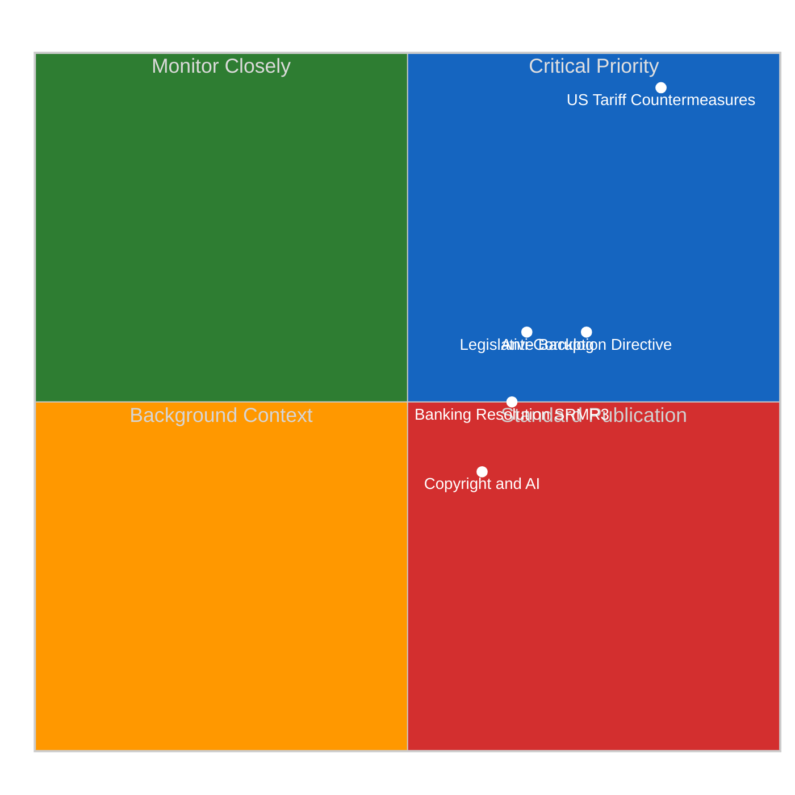

# Significance Scoring — Legislative Procedures (2026-04-14)

## Scoring Context

| Field | Value |
|-------|-------|
| **Score ID** | SIG-2026-04-14-RUN42 |
| **Scoring Date** | 2026-04-14 06:30 UTC |
| **Scored By** | news-propositions (run 42) |
| **Documents Analyzed** | 51 adopted texts + 51 procedures (2026) |
| **Overall Confidence** | HIGH |

## Top-5 Significance Scores

### 1. US Tariff Countermeasures (TA-10-2026-0096)

| Dimension | Score | Rationale |
|-----------|:-----:|-----------|
| Parliamentary Significance | 8/10 | Plenary adoption March 26, all 720 MEPs, emergency trade response |
| Policy Impact | 9/10 | International scope, permanent trade defence, EU-US relations |
| Public Interest | 8/10 | Consumer prices, employment in steel, agriculture, automotive |
| Urgency | 10/10 | Commission must deploy by April 15 TOMORROW |
| Cross-Group Relevance | 7/10 | EPP+S&D+Renew consensus; ECR divided |
| **COMPOSITE** | **8.4/10** | **CRITICAL PRIORITY** |

Evidence: TA-10-2026-0096, procedure 2025/0261(COD). Authorises customs duties adjustment and tariff quotas for US goods. HIGH confidence.

### 2. Anti-Corruption Directive (TA-10-2026-0094)

| Dimension | Score | Rationale |
|-----------|:-----:|-----------|
| Parliamentary Significance | 8/10 | Major COD directive, new EU-wide framework |
| Policy Impact | 8/10 | 27 MS transposition, public procurement, whistleblower protection |
| Public Interest | 8/10 | Corruption top-3 citizen concern |
| Urgency | 6/10 | Council trilogue, 6-12 month timeline |
| Cross-Group Relevance | 7/10 | EPP-S&D consensus; ECR/PfE resist whistleblower burden |
| **COMPOSITE** | **7.4/10** | **PRIORITY** |

Evidence: TA-10-2026-0094, procedure 2023/0135(COD). MEDIUM confidence on trilogue timeline.

### 3. Post-Recess Legislative Backlog (13 COD procedures)

| Dimension | Score | Rationale |
|-----------|:-----:|-----------|
| Parliamentary Significance | 7/10 | 13 COD procedures awaiting committee referral |
| Policy Impact | 7/10 | Diverse: digital, environment, trade, social |
| Public Interest | 5/10 | Process story but signals 2026 priorities |
| Urgency | 6/10 | Committees resume April 15 |
| Cross-Group Relevance | 8/10 | All groups legislative agenda affected |
| **COMPOSITE** | **6.6/10** | **SIGNIFICANT** |

Evidence: 13 new COD files (2026/0008-2026/0085). 51 total 2026 procedures. HIGH confidence.

### 4. Banking Resolution Reform SRMR3 (TA-10-2026-0092)

| Dimension | Score | Rationale |
|-----------|:-----:|-----------|
| Parliamentary Significance | 7/10 | Banking Union triple package adopted March 26 |
| Policy Impact | 8/10 | Financial stability, deposit protection harmonisation |
| Public Interest | 6/10 | Technical but affects 450M depositors |
| Urgency | 5/10 | Council positioning pending |
| Cross-Group Relevance | 6/10 | EPP-S&D lead; Nordic delegations cautious |
| **COMPOSITE** | **6.4/10** | **SIGNIFICANT** |

Evidence: TA-10-2026-0092, procedure 2023/0111(COD). MEDIUM confidence on Council timeline.

### 5. Copyright and Generative AI (TA-10-2026-0066)

| Dimension | Score | Rationale |
|-----------|:-----:|-----------|
| Parliamentary Significance | 6/10 | Own-initiative resolution |
| Policy Impact | 7/10 | AI training data, creator compensation |
| Public Interest | 7/10 | Generative AI high salience |
| Urgency | 4/10 | Non-binding |
| Cross-Group Relevance | 6/10 | Tech vs culture divide |
| **COMPOSITE** | **6.0/10** | **PUBLISH** |

Evidence: TA-10-2026-0066. MEDIUM confidence on Commission timeline.

## Score Distribution

## Editorial Decision

PUBLISH as standard propositions article. Lead with US tariff countermeasures (8.4/10 significance, CRITICAL urgency due to April 15 deadline). Sub-lead with anti-corruption directive and Banking Union reforms.
