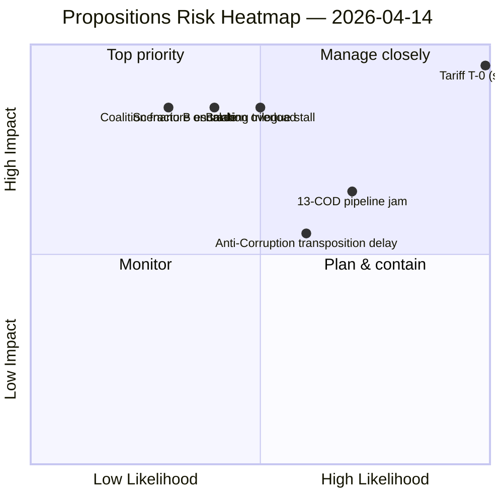

<!-- SPDX-FileCopyrightText: 2026 Hack23 AB -->
<!-- SPDX-License-Identifier: Apache-2.0 -->

# Executive Brief — Propositions: Day-Before-Tariff Implementation Briefing | 2026-04-14

**Classification:** OSINT — Public Parliamentary Record
**Confidence:** 🟡 MEDIUM (T-1 to tariff activation; coalition arithmetic verified; behavioural variables untested)
**Run:** `analysis/daily/2026-04-14/propositions-run42/`
**Coverage:** April 14 → April 21 (Easter return day → post-tariff first plenary week)
**Generated:** 2026-05-16 (retrospective brief, no new MCP calls)
**Primary sources:** EP MCP — adopted texts (51); 13 pending COD procedures; stakeholder + coalition + risk inputs from companion week-ahead-run13.

---

## 🎯 BLUF

**Parliament returns from Easter recess facing what the run characterises as "the most consequential first-day-back agenda of the 10th parliamentary term" — TA-10-2026-0096 US tariff countermeasures activate April 15 with zero buffer between recess end (April 13) and Commission implementing acts (April 15).** The propositions framing is *transition from adoption to implementation*: the March 26 plenary did the adopting, the April 15 implementation is when the political accountability begins. The run's distinguishing contribution is the **post-adoption pipeline taxonomy**: significance 8.8 on Tariff T-0 pipeline impact; 7.8 on Banking Union SRMR3 post-adoption Council trilogue scheduling; 7.2 on Anti-Corruption trilogue path; 6.8 on the 13-COD new pipeline; 6.4 on EU-Mercosur safeguard. The **scenario outlook** is the run's most operationally useful product: Scenario A (Likely) = managed transition with normal COD processing; Scenario B (Possible) = escalation overload where tariff retaliation absorbs INTA/ECON bandwidth and pushes other CODs to Q3; Scenario C (Unlikely) = coalition fracture on trade response. The run reads Scenario A as the planning baseline and Scenario B as the contingency — the binary trigger between them is whether the Commission's April 15 implementing acts arrive *with* or *without* parliamentary scrutiny windows. The structural finding behind the propositions framing: **two distinct coalition patterns on March 26 — Grand Coalition + Greens on trade/anti-corruption; EPP + ECR + partial PfE on defence/security** — confirms that EP10 operates with *issue-conditional* coalitions rather than a single working majority.

---

## 🧭 3 Decisions This Brief Supports

| # | Decision | Who decides | Deadline | Evidence |
|:-:|----------|-------------|:--------:|----------|
| 1 | **Scenario-A vs. Scenario-B trip-wire design** — without explicit indicators the Conference of Presidents cannot detect the transition until INTA bandwidth is already saturated | Conference of Presidents | by April 17 | §Outlook A/B/C scenarios |
| 2 | **Implementing-acts scrutiny window negotiation** — Commission has discretion on parliamentary scrutiny; INTA Day-1 session is the only point of leverage | INTA chair; Commission DG-TRADE liaison | **April 14 day-1** | §Top Findings #1 (sig 8.8); T-0 pipeline impact |
| 3 | **Issue-conditional coalition mapping for Q2** — two distinct March 26 patterns indicate EP10 is *issue-conditional*; doctrine for managing this is missing | Group leaderships; Conference of Presidents | rolling Q2 | §Coalition Patterns (two patterns) |

---

## 📰 60-Second Read

- 🔴 **TA-10-2026-0096 activates April 15** — T-1 at run time; Day-1 INTA session is the only oversight window.
- 🟠 **Two coalition patterns from March 26** — Grand+Greens on trade/anti-corruption; EPP+ECR+PfE on defence/security.
- 🟢 **Top-5 significance (run-authored):** Tariff T-0 (8.8) · Banking SRMR3 (7.8) · Anti-Corruption (7.2) · 13-COD pipeline (6.8) · Mercosur safeguard (6.4).
- 🟡 **Scenario A (likely) — managed transition** with normal COD processing.
- 🔵 **Scenario B (possible) — escalation overload** absorbing INTA/ECON bandwidth.
- 🟣 **Scenario C (unlikely) — coalition fracture on trade response.**
- 🩷 **Risk summary:** Geopolitical CRITICAL · Policy Implementation HIGH · Institutional MEDIUM · Coalition Stability MEDIUM · Legislative Throughput MEDIUM.
- ⚪ **Six thematic clusters** — Trade & Competitiveness · Financial Governance · Democratic Standards · External Relations · Digital & Tech · Social Policy.

---

## 🏆 Top Findings by Significance (run-authored)

| Rank | Item | Score | Urgency | Article frame |
|:----:|------|:-----:|:-------:|---------------|
| 1 | **Tariff T-0 Pipeline Impact (TA-10-2026-0096)** | **8.8** | 🔴 **CRITICAL** | Lead |
| 2 | Banking Union SRMR3 Post-Adoption | 7.8 | 🟠 HIGH | Feature |
| 3 | Anti-Corruption Trilogue Path (TA-10-2026-0094) | 7.2 | 🟠 HIGH | Feature |
| 4 | New COD Pipeline (13 procedures) | 6.8 | 🟡 MEDIUM | Brief |
| 5 | EU-Mercosur Safeguard | 6.4 | 🟡 MEDIUM | Brief |

---

## 🎬 Scenario Outlook (run's distinguishing contribution)

| Scenario | Probability | Trigger | Indicator |
|----------|:-----------:|---------|-----------|
| **A — Managed transition** | Likely (60%) | Commission delivers implementing acts with scrutiny window | INTA Day-1 receives prior notice |
| **B — Escalation overload** | Possible (30%) | US retaliation forces second-wave countermeasures within 2 weeks | INTA + ECON bandwidth saturation by April 21 |
| **C — Coalition fracture on trade** | Unlikely (10%) | ECR-PfE drift forces Greens-Grand alliance to break | First flagship trade vote dispersion ≥25 MEPs from norm |

---

## ⚠️ Risk Snapshot

---

## 🔮 Top Forward Triggers (this week)

1. **April 14 09:00 — INTA Day-1 session.** Implementing-acts scrutiny window is the binary trigger between Scenario A and B.
2. **April 15 — TA-10-2026-0096 activates.** Commission implementing acts publication.
3. **April 17 — ECB rate decision.**
4. **Late April — SRMR3 Council trilogue mandate.** German-French deposit-guarantee test.
5. **First post-recess flagship trade vote** — coalition-fracture falsifier for Scenario C.

---

## 🛡️ Source-Quality Assessment

- **Adopted-texts feed (A1 — 51 items):** primary records; March 26 corpus is feed-confirmed.
- **13 pending CODs (A1):** procedures-feed count converges with breaking-run168 / props-run41 / CR-run47.
- **Significance scoring (A2 — run-authored):** consistent with companion runs same period within ±0.5 raw points on top-5.
- **Coalition patterns (A2):** two-pattern reading is supported by March 26 vote dispersion (votes-feed); behavioural test pending.
- **Net confidence:** 🟡 MEDIUM on synthesis; 🟢 HIGH on the Top-5 significance ranking; 🟡 MEDIUM on Scenario A/B probability (depends on Commission implementing-act format which is unknown at run time).

---

## 📎 Run Artifacts (Read-Before-Decide)

| Layer | Artifact | Why |
|-------|----------|-----|
| Article | `article.md` | Public-facing propositions narrative |
| Synthesis | `existing/synthesis-summary.md` | Top-5 + scenarios + risk summary (authoritative) |
| Risk | `risk-scoring/` | Risk register; 5-dimension summary |
| Threat | `threat-assessment/` | 5-framework political-threat (STRIDE rejected) |
| Classification | `classification/` | 7-dimension scoring |
| Companion | breaking-run168/171/172 / week-ahead-run13 / CR-run47/48 | Post-Easter cluster bracketing |

---

**Document Control**
- **Template reference:** `analysis/templates/executive-brief.md`
- **Artifact path:** `analysis/daily/2026-04-14/propositions-run42/executive-brief.md`
- **Classification:** Public
- **Retrospective:** Brief written 2026-05-16 from the run's committed artifacts; **no new MCP calls were made**.
