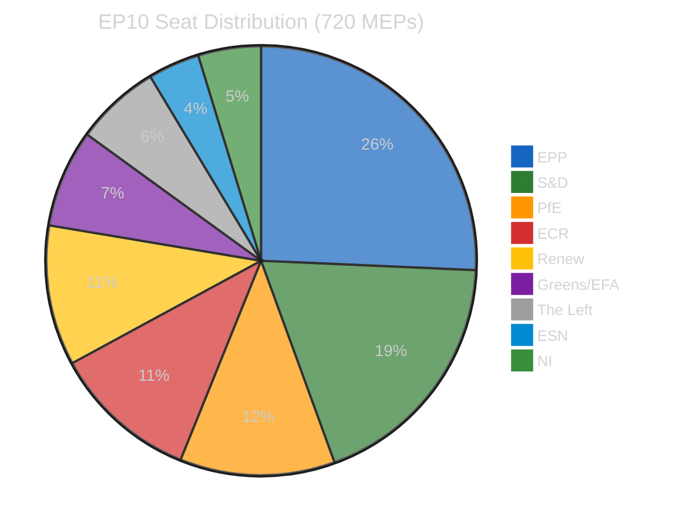

# Deep Analysis — Post-Recess Legislative Landscape (2026-04-14)

## Executive Summary

The European Parliament returns from Easter recess on April 15, 2026, facing the most consequential first-day-back agenda of the 10th parliamentary term. Three converging dynamics define the moment: (1) an imminent US tariff deadline that tests the EU trade countermeasures adopted just hours before recess began, (2) a record legislative backlog with 13 new COD procedures awaiting committee action, and (3) unresolved Council negotiations on the anti-corruption directive and banking union reforms adopted in the March 26 plenary sprint.

## The March 26 Plenary: Most Productive Pre-Recess Sitting

The March 26 plenary session produced 18 adopted texts — the highest single-sitting output in EP10. Key legislative positions adopted:

1. **Banking Union Triple Package**: SRMR3 (TA-10-2026-0092), alongside DGSD2 and BRRD3 texts, represents Parliament's comprehensive position on Banking Union completion. The EP position advocates faster deposit insurance pooling than most Council members will accept.

2. **Anti-Corruption Directive** (TA-10-2026-0094): A landmark horizontal directive criminalising corruption across public and private sectors. The EP position includes strong whistleblower protections and asset recovery mechanisms that face Council resistance, particularly from member states with weaker existing frameworks.

3. **US Tariff Countermeasures** (TA-10-2026-0096): Emergency legislation empowering the Commission to adjust customs duties on US imports. Adopted with broad cross-party support (EPP, S&D, Renew, Greens). ECR split — some MEPs from export-dependent regions supported, others opposed escalation.

4. **Immunity Waiver** (TA-10-2026-0088): Grzegorz Braun immunity waived — reflects EP's willingness to allow national proceedings against sitting MEPs in serious cases.

## US Tariff Deadline: April 15 Confrontation

The timing is politically explosive. Parliament adopted countermeasures on March 26 (TA-10-2026-0096, procedure 2025/0261(COD)), and the US tariff escalation deadline is April 15 — the day Parliament returns. The Commission must decide within hours whether to deploy the graduated response mechanism.

### Coalition Dynamics on Trade

- **EPP**: Supports defensive measures but wants to preserve transatlantic relationship. Key tension between industrial protection (German automotive) and free trade ideology.
- **S&D**: Strong support for countermeasures; frames as workers' protection against unfair trade.
- **Renew**: Pragmatic free-trade stance; supports targeted response but opposes blanket retaliation.
- **ECR**: Most divided group. Polish delegation supports EU trade defence; Italian delegation (FdI) closer to US position.
- **PfE**: Skeptical of escalation; some members sympathetic to US trade critique of EU.
- **Greens/EFA**: Support countermeasures but want environmental conditionality.
- **The Left**: Support countermeasures; frames as anti-corporate-globalisation stance.

### Scenarios

**Scenario A (Likely, 50%)**: Commission deploys targeted adjustments on steel and aluminium while opening negotiation channel. 90-day cooling-off period negotiated bilaterally. Parliament monitors but does not need to legislate further in Q2.

**Scenario B (Possible, 30%)**: Full countermeasure deployment triggers US retaliation on EU automotive exports. Commission returns to Parliament for expanded mandate. Potential emergency plenary debate.

**Scenario C (Unlikely, 20%)**: Bilateral deal reached before April 15 deadline, rendering countermeasure text dormant. Commission maintains text as deterrent for future disputes.

## Anti-Corruption Directive: The Trilogue Challenge

The anti-corruption directive (2023/0135(COD)) has been in legislative process since 2023. Parliament's March 26 position (TA-10-2026-0094) is ambitious:

- **Criminalisation scope**: Covers public officials, corporate officers, and intermediaries
- **Whistleblower protection**: Comprehensive framework with burden-of-proof reversal
- **Asset recovery**: Cross-border mechanisms for recovering proceeds of corruption
- **Penalties**: Harmonised minimum penalties across 27 MS

**Council fault lines**: 
- Nordic states (SE, DK, FI): Want stronger provisions, already have robust national frameworks
- Southern states (IT, ES, EL): Support EU framework but resist some enforcement mechanisms
- Central/Eastern states (HU, PL): Concerns about sovereignty and political instrumentalisation
- Germany: Generally supportive but cautious on corporate liability scope

**Trilogue timeline**: First trilogue expected May-June 2026. Final text unlikely before December 2026. MEDIUM confidence.

## Banking Union: The Deposit Insurance Debate

The SRMR3 adoption (TA-10-2026-0092) is Parliament's contribution to completing the Banking Union — a project that has been politically stalled for over a decade. The triple package (DGSD2/BRRD3/SRMR3) represents EP's most comprehensive Banking Union position.

**The core dispute**: Should deposit insurance be pooled across the eurozone? 
- Parliament's position: Yes, with risk-reduction prerequisites
- Germany/Netherlands/Finland: No pooling until all banks meet strict risk-reduction targets
- Southern eurozone: Immediate pooling needed to break bank-sovereign doom loop

This structural North-South divide has blocked Banking Union completion since 2015. The SRMR3 text attempts a compromise with phased implementation, but Council negotiations will be protracted.

## 2026 Legislative Pipeline: Record Pace

The data shows 2026 is on track for record legislative output:
- **114 legislative acts projected** (vs 78 in 2025, +46%)
- **51 procedures registered** in 2026 so far (13 COD, 5 BUD, many INI)
- **935 total procedures tracked** across all years in EP10

### New COD Procedures Awaiting Committee Action

| Procedure | Type | Status |
|-----------|------|--------|
| 2026/0008(COD) | Ordinary Legislative | Committee referral pending |
| 2026/0010(COD) | Ordinary Legislative | Committee referral pending |
| 2026/0011(COD) | Ordinary Legislative | Committee referral pending |
| 2026/0012(COD) | Ordinary Legislative | Committee referral pending |
| 2026/0013(COD) | Ordinary Legislative | Committee referral pending |
| 2026/0044(COD) | Ordinary Legislative | Committee referral pending |
| 2026/0045(COD) | Ordinary Legislative | Committee referral pending |
| 2026/0059(COD) | Ordinary Legislative | Committee referral pending |
| 2026/0068(COD) | Ordinary Legislative | Committee referral pending |
| 2026/0074(COD) | Ordinary Legislative | Committee referral pending |
| 2026/0078(COD) | Ordinary Legislative | Committee referral pending |
| 2026/0084(COD) | Ordinary Legislative | Committee referral pending |
| 2026/0085(COD) | Ordinary Legislative | Committee referral pending |

This 13-procedure backlog will compete for committee time in Q2 2026, alongside ongoing files inherited from 2024-2025.

## Political Landscape Context

### Fragmentation at Record Levels

The effective number of parliamentary parties stands at 6.59 — the highest in EP history. No two-party majority is possible (EPP+S&D = 44.5%, below 50% threshold). Every legislative vote requires at least 3 groups.

### Coalition Geometry

**Minimum winning coalitions (361+ seats)**:
- EPP + S&D + Renew = 396 (traditional grand coalition)
- EPP + S&D + ECR = 399 (centre-right pivot)
- EPP + ECR + PfE + Renew = 424 (right-wing super-majority, rarely cohesive)

**Key dynamic**: EPP increasingly builds flexible majorities — with S&D+Renew on economic governance, with ECR on defence/migration. This à la carte approach is the defining feature of EP10 legislating.

## SWOT Analysis

### Strengths
- Record legislative output pace (+46% YoY) demonstrates institutional productivity
- Broad cross-party consensus on trade defence (tariff countermeasures)
- Banking Union triple package adoption shows EP can deliver on complex financial legislation
- Anti-corruption directive represents democratic accountability advancement

### Weaknesses
- Grand coalition below majority threshold (44.5%) complicates routine legislation
- Record fragmentation (6.59) increases negotiation complexity for every vote
- EP API data gaps during recess limit real-time monitoring
- Council positioning on key files (Banking Union, anti-corruption) remains uncertain

### Opportunities
- Post-recess agenda allows fresh prioritisation of 13 new COD procedures
- US tariff crisis could strengthen internal EU cohesion and common trade policy
- Copyright/AI resolution positions EP ahead of Commission legislative proposal
- European Semester and enlargement strategy texts set policy direction for 2026-2027

### Threats
- US trade war escalation beyond tariff countermeasure mandate
- Anti-corruption trilogue failure could damage EP credibility on rule of law
- Banking Union deposit pooling blocked indefinitely by Northern bloc
- ECR-PfE coordination on regulatory rollback agenda (15.6% eurosceptic share)
