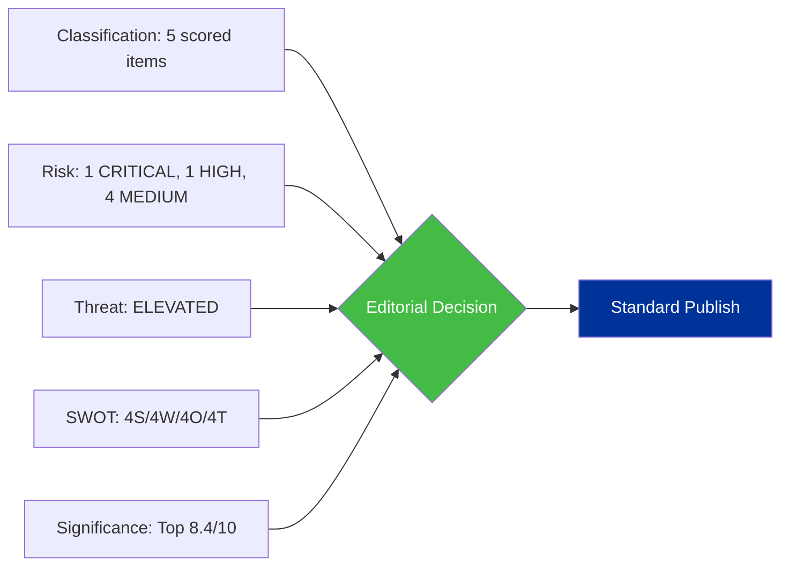

# Synthesis Summary — Legislative Procedures (2026-04-14)

## Synthesis Context

| Field | Value |
|-------|-------|
| **Synthesis ID** | SYN-2026-04-14-RUN42 |
| **Analysis Date** | 2026-04-14 |
| **Documents Analyzed** | 51 adopted texts + 51 procedures + political landscape |
| **Period** | Post-Easter Recess day (April 14) to Q2 2026 |
| **Overall Confidence** | HIGH |
| **Article Type** | propositions |

## Intelligence Dashboard

**Decision**: PUBLISH as standard propositions article. Top significance score 8.4/10 on US tariff countermeasures. No items reach Breaking threshold.

## Top Findings by Significance

| Rank | Item | Score | Urgency | Action |
|:---:|-------|:-----:|:-------:|--------|
| 1 | US Tariff Countermeasures (TA-10-2026-0096) | 8.4 | CRITICAL | Lead story |
| 2 | Anti-Corruption Directive (TA-10-2026-0094) | 7.4 | HIGH | Sub-lead |
| 3 | Legislative Backlog (13 COD) | 6.6 | MEDIUM | Context section |
| 4 | Banking Resolution SRMR3 (TA-10-2026-0092) | 6.4 | MEDIUM | Analysis section |
| 5 | Copyright and AI (TA-10-2026-0066) | 6.0 | LOW | Background |

## Cross-Document Intelligence

### Thematic Clusters

1. **Trade and Competitiveness**: Tariff countermeasures + Mercosur safeguard clause (TA-10-2026-0030) + WTO preparation (TA-10-2026-0086) + EU-Canada cooperation (TA-10-2026-0078)
2. **Financial Governance**: Banking Union package (SRMR3/DGSD2/BRRD3) + ECB appointments (TA-10-2026-0033, 0060) + European Semester (TA-10-2026-0076) + EGF mobilisations (TA-10-2026-0038, 0073, 0103)
3. **Democratic Standards**: Anti-corruption directive + Electoral Act reform (TA-10-2026-0006) + Public access to documents (TA-10-2026-0065) + Immunity waivers (TA-10-2026-0088)
4. **External Relations and Security**: CFSP annual report (TA-10-2026-0012) + Defence market barriers (TA-10-2026-0079) + Drones/warfare (TA-10-2026-0020) + Enlargement (TA-10-2026-0077) + EU Magnitsky Act (TA-10-2026-0015)
5. **Digital and Technology**: Copyright/AI (TA-10-2026-0066) + Technological sovereignty (TA-10-2026-0022) + Air passenger rights (TA-10-2026-0009)
6. **Social Policy**: Housing crisis (TA-10-2026-0064) + Workers' rights subcontracting (TA-10-2026-0050) + EU Talent Pool (TA-10-2026-0058)

### Coalition Patterns

The March 26 plenary votes revealed two distinct coalition patterns:
- **Grand coalition + Greens** on trade defence and anti-corruption (broad consensus)
- **EPP + ECR + partial PfE** on defence market and security files (right-of-centre)

This bifurcated pattern will likely persist through Q2 2026 as the legislative agenda mixes economic competitiveness (right-leaning coalitions) with social and environmental policy (traditional grand coalition).

## Risk Summary

| Category | Risk Level | Key Driver |
|----------|:----------:|------------|
| Geopolitical | CRITICAL | US tariff deadline April 15 |
| Policy Implementation | HIGH | Banking Union Council negotiations |
| Institutional | MEDIUM | Anti-corruption trilogue timeline |
| Coalition Stability | MEDIUM | Grand coalition below majority |
| Legislative Throughput | MEDIUM | 13 new COD backlog |

## Outlook

**Q2 2026 Scenarios**:

**Scenario A: Managed Trade Tension (Likely, 50%)**  
Commission deploys limited countermeasures, bilateral negotiations produce 90-day pause. Parliament focuses on legislative backlog. Anti-corruption trilogue begins in May. Banking Union negotiations continue slowly.

**Scenario B: Escalation and Legislative Acceleration (Possible, 30%)**  
Full trade war forces emergency plenary sessions. Parliament fast-tracks competitiveness legislation. Anti-corruption trilogue delayed as Council diverts attention to trade crisis. Banking Union linked to broader financial stability concerns.

**Scenario C: Status Quo Continuation (Unlikely, 20%)**  
Trade deal averts confrontation. Normal legislative rhythm resumes. All 13 COD procedures progress through committee in Q2. Anti-corruption and Banking Union trilogue on standard timeline.

## Data Sources

- European Parliament Open Data Portal (adopted texts, procedures, plenary sessions)
- EP MCP Server v1.2.7 (get_adopted_texts, get_procedures, get_adopted_texts_feed)
- Precomputed statistics (get_all_generated_stats, 2024-2026)
- Political landscape analysis (generate_political_landscape)
- Prior analysis: analysis/daily/2026-04-13/propositions-run41/existing/synthesis-summary.md
