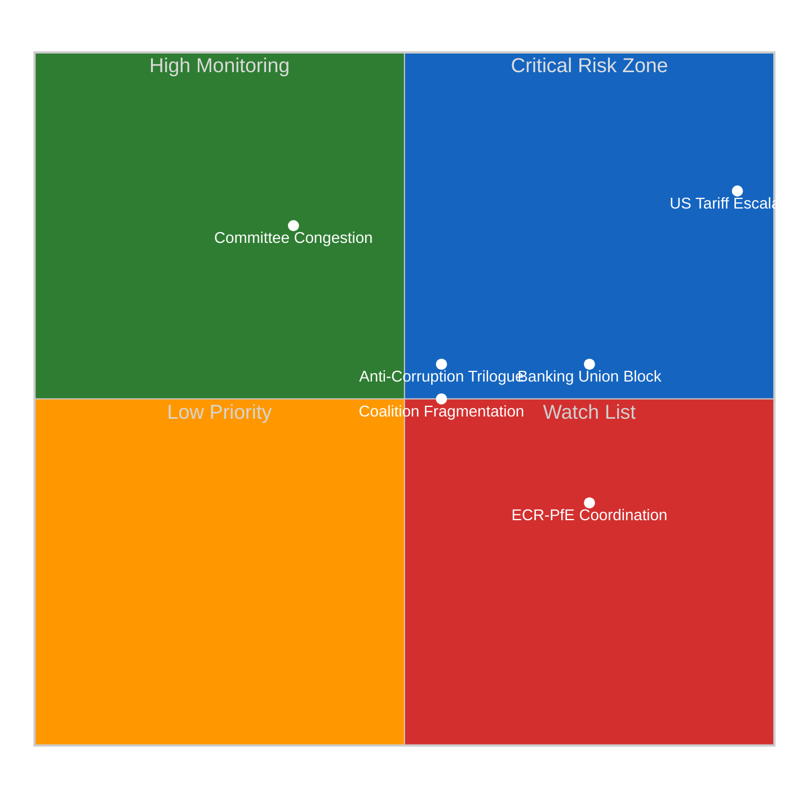

# Risk Matrix — Legislative Procedures (2026-04-14)

## Risk Context

| Field | Value |
|-------|-------|
| **Assessment ID** | RSK-2026-04-14-RUN42 |
| **Assessment Date** | 2026-04-14 06:30 UTC |
| **Period** | Post-Easter Recess (April 14-15, 2026) |
| **Risk Categories** | 6 (coalition, policy, institutional, economic, social, geopolitical) |
| **Overall Risk Level** | HIGH |

## Risk Register

| Risk ID | Description | Likelihood (1-5) | Impact (1-5) | Score | Tier | Trend |
|---------|-------------|:-:|:-:|:-:|------|:---:|
| RSK-001 | US tariff retaliation escalation after April 15 | 4 (Likely) | 5 (Severe) | **20** | CRITICAL | ↑ |
| RSK-002 | Anti-corruption trilogue breakdown on whistleblower provisions | 3 (Possible) | 3 (Moderate) | **9** | MEDIUM | → |
| RSK-003 | Banking Union deposit pooling blocked by DE/NL/FI coalition | 3 (Possible) | 4 (Major) | **12** | HIGH | ↗ |
| RSK-004 | Post-recess committee scheduling congestion | 4 (Likely) | 2 (Minor) | **8** | MEDIUM | → |
| RSK-005 | Grand coalition fragmentation on trade vs environment | 3 (Possible) | 3 (Moderate) | **9** | MEDIUM | ↗ |
| RSK-006 | ECR-PfE bloc coordination on regulatory rollback | 2 (Unlikely) | 4 (Major) | **8** | MEDIUM | ↑ |

## Risk Matrix Visualization

## Critical Risk Analysis: US Tariff Escalation (RSK-001)

**Likelihood: 4/5 (Likely)** — US administration has confirmed 25% tariffs on EU steel and aluminium effective April 15. EU countermeasure text (TA-10-2026-0096) adopted March 26 but Commission deployment timeline unclear. HIGH confidence.

**Impact: 5/5 (Severe)** — Full trade war scenario would affect EUR 400B+ in bilateral trade. EU automotive, agricultural, and technology sectors all exposed. Cascading effects on employment, consumer prices, and financial markets. HIGH confidence.

**Mitigation**: Commission empowered to deploy graduated response. EPP-S&D-Renew consensus on defensive measures. ECR may seek to moderate response to preserve transatlantic relationship.

**Scenarios**:
- Scenario A (Likely, 50%): Commission deploys limited tariff adjustments; US-EU negotiate 90-day pause
- Scenario B (Possible, 30%): Full countermeasures deployed; escalatory spiral through Q2
- Scenario C (Unlikely, 20%): Last-minute bilateral deal avoids countermeasures entirely

## High Risk: Banking Union Deposit Pooling (RSK-003)

**Likelihood: 3/5** — Germany, Netherlands, and Finland have historically resisted deposit insurance mutualisation. SRMR3 text (TA-10-2026-0092) adopted but Council negotiations on DGSD2 remain contentious.

**Impact: 4/5** — Failure to complete Banking Union leaves EU financial system vulnerable to asymmetric shocks. Southern European banks need pooled backstop; northern countries fear moral hazard.

**Mitigation**: Compromise on phased timeline with risk-reduction milestones. ECB supportive of completion.

## Political Landscape Risk Factors

| Factor | Current State | Risk Direction |
|--------|--------------|:-:|
| Grand coalition seat share | 44.5% (below 50%) | ↗ rising risk |
| Fragmentation index | 6.59 (record high) | → stable at peak |
| EPP-ECR cooperation | Increasing on defence, migration | ↑ structural shift |
| Left bloc cohesion | 32.6% combined | → stable |
| Eurosceptic share | 15.6% | ↗ growing influence |

## Forward-Looking Assessment

The post-recess period (April 15 onwards) faces elevated risk primarily from the US tariff deadline. The combination of external trade pressure and internal legislative backlog creates a compressed decision window. Expect EPP to prioritise trade defence and competitiveness agenda, potentially at the expense of environmental and social files.

Confidence: MEDIUM (external trade dynamics uncertain, but internal parliamentary dynamics well-established)
