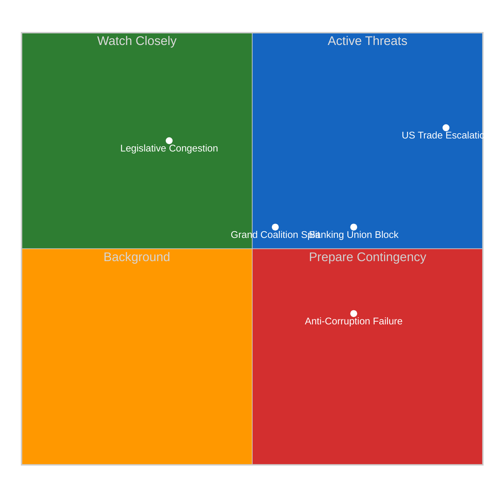

# Political Threat Landscape — Legislative Procedures (2026-04-14)

## Threat Context

| Field | Value |
|-------|-------|
| **Assessment ID** | THR-2026-04-14-RUN42 |
| **Date** | 2026-04-14 |
| **Overall Threat Level** | ELEVATED |
| **Primary Threat Vector** | External trade escalation + internal coalition fragility |

## Threat Register

### THR-001: US Trade War Escalation
- **Threat Actor**: US Administration
- **Vector**: Tariff escalation beyond current 25% steel/aluminium to automotive, agriculture
- **Target**: EU internal market stability, transatlantic relations
- **Severity**: CRITICAL (5/5)
- **Likelihood**: Likely (4/5)
- **Mitigation**: TA-10-2026-0096 countermeasure framework; Commission graduated response authority
- **Evidence**: Adopted text 2025/0261(COD), April 15 deadline confirmed

### THR-002: Grand Coalition Fragmentation
- **Threat Actor**: Internal EP dynamics
- **Vector**: EPP-S&D divergence on trade response intensity, environment vs competitiveness
- **Target**: Legislative throughput, policy coherence
- **Severity**: MODERATE (3/5)
- **Likelihood**: Possible (3/5)
- **Mitigation**: Flexible majority approach (EPP builds different coalitions per policy area)
- **Evidence**: 44.5% grand coalition seat share, fragmentation index 6.59

### THR-003: Anti-Corruption Trilogue Failure
- **Threat Actor**: Council blocking minority
- **Vector**: Member state resistance to whistleblower provisions and asset recovery
- **Target**: EU rule-of-law credibility, democratic standards
- **Severity**: MAJOR (4/5)
- **Likelihood**: Unlikely (2/5)
- **Mitigation**: Strong EP consensus; Commission mediation; Nordic states push for ambition
- **Evidence**: TA-10-2026-0094, Council divergence documented in committee reports

### THR-004: Banking Union Incomplete Indefinitely
- **Threat Actor**: Northern EU member states (DE, NL, FI)
- **Vector**: Blocking deposit insurance pooling in Council negotiations
- **Target**: Eurozone financial stability, bank-sovereign doom loop
- **Severity**: MAJOR (4/5)
- **Likelihood**: Possible (3/5)
- **Mitigation**: Phased implementation compromise; ECB advocacy; crisis-forcing function
- **Evidence**: TA-10-2026-0092 (SRMR3), decade-long Banking Union completion stalemate

### THR-005: Legislative Congestion Post-Recess
- **Threat Actor**: Systemic (committee capacity constraints)
- **Vector**: 13 COD procedures competing for limited committee slots in Q2
- **Target**: Legislative quality, rapporteur availability, scrutiny depth
- **Severity**: MINOR (2/5)
- **Likelihood**: Likely (4/5)
- **Mitigation**: Committee coordination, priority sequencing by Conference of Presidents
- **Evidence**: 13 new COD procedures registered in 2026, committees resume April 15

## Threat Matrix

## Forward Assessment

The post-recess period faces ELEVATED threat levels driven primarily by the US tariff deadline coinciding with Parliament's return. Internal threats (coalition fragmentation, legislative congestion) are structural and manageable through established parliamentary mechanisms. The external trade threat is the wild card that could reshape the entire Q2 legislative agenda.

Confidence: HIGH on internal dynamics; MEDIUM on external trade scenario outcomes.
