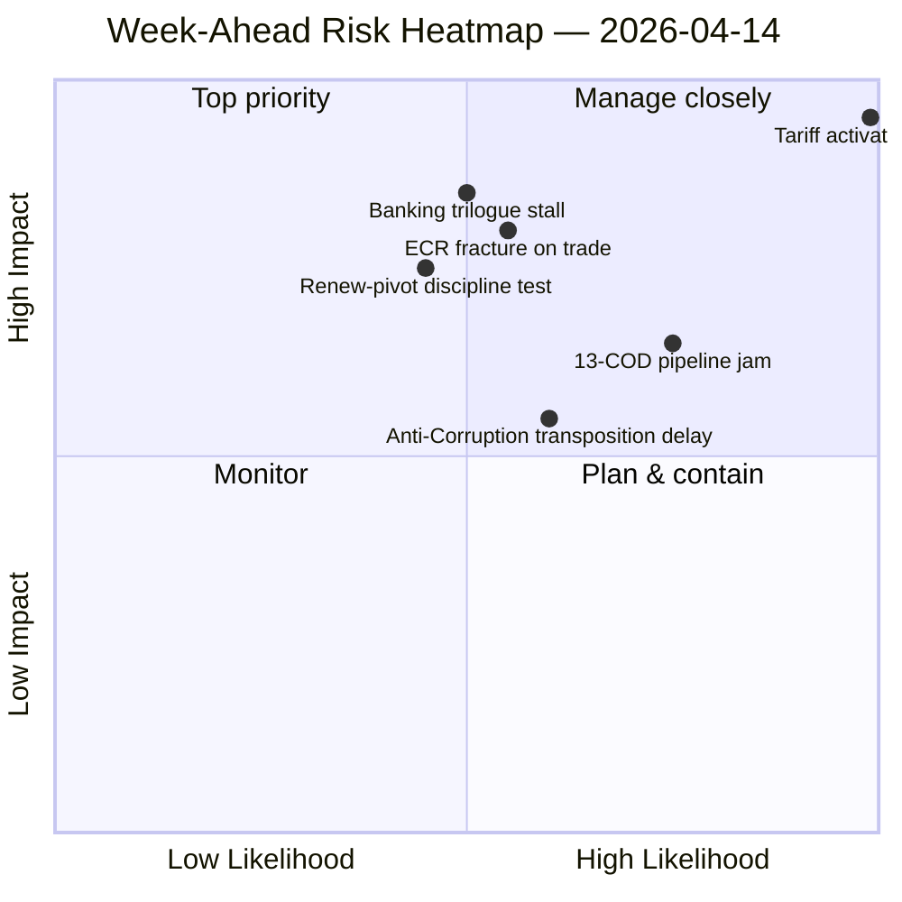

<!-- SPDX-FileCopyrightText: 2026 Hack23 AB -->
<!-- SPDX-License-Identifier: Apache-2.0 -->

# Executive Brief — Week Ahead: Post-Easter Return and Tariff Activation Convergence | 2026-04-14

**Classification:** OSINT — Public Parliamentary Record
**Confidence:** 🟡 MEDIUM (51 adopted texts + 51 procedures analysed; coalition / early-warning / political-landscape converge)
**Run:** `analysis/daily/2026-04-14/week-ahead-run13/`
**Coverage:** 2026-04-14 → 2026-04-21 (post-Easter return week; T-1 to tariff activation at run start)
**Generated:** 2026-05-16 (retrospective brief, no new MCP calls)
**Primary sources:** EP MCP — adopted texts (51), procedures (51), coalition dynamics, early warning system, political landscape.

---

## 🎯 BLUF

**The week of April 14–21 is dominated by a single binary trigger: TA-10-2026-0096 tariff countermeasures activate April 15 — T-1 at run start — empowering the Commission for autonomous retaliatory tariffs against US customs duties.** Parliament returns to a 4-day committee week with **13 pending COD procedures** behind that activation, including SRMR3 banking-resolution trilogue scheduling and TA-10-2026-0094 Anti-Corruption Directive transposition kick-off. The coalition arithmetic is the operational constraint that defines every vote: **grand coalition EPP (185) + S&D (135) = 320 seats, *below* the 361 majority threshold by 41 seats** — every flagship vote this week requires the Renew-pivot extension to 396 seats. The run records the most consequential pre-vote signal of the period: **ECR is divided on trade policy** — the March 26 tariff vote already revealed right-bloc fragility, and the first post-recess tariff-implementation oversight vote is the test of whether ECR holds together. The week's four-priority matrix — Tariff Implementation (CRITICAL) → 13-COD Backlog (HIGH) → Banking Reform Trilogues (HIGH) → Anti-Corruption Trilogue (MEDIUM) — is more concentrated than any post-recess return week of EP10 to date. **Record legislative velocity (114 acts in 2026 vs. 78 in 2025; +46% YoY) is the strength** the run leans on; **the −41-seat grand-coalition deficit + 13-COD backlog** is the weakness that will determine whether that velocity survives Q2 contact with the tariff implementation and Banking Union completion.

---

## 🧭 3 Decisions This Brief Supports

| # | Decision | Who decides | Deadline | Evidence |
|:-:|----------|-------------|:--------:|----------|
| 1 | **Tariff implementation-oversight vote whip strategy** — ECR split is the first post-recess fracture test; INTA leads | INTA chair; ECR group leadership | **April 15 (T-0)** | §Priority 1 (CRITICAL); ECR divided on trade |
| 2 | **Conference-of-Presidents 13-COD prioritisation** — record post-recess backlog; without explicit triage Q2-Q3 delays propagate | Conference of Presidents | April 14 opening | §Priority 2 (HIGH); 13 pending CODs |
| 3 | **SRMR3/BRRD3/DGSD2 trilogue scheduling — late April Council mandate** — 12-year Banking Union project milestone | ECON; Council Banking Working Party | late April | §Priority 3 (HIGH) |

---

## 📰 60-Second Read

- 🔴 **April 15 (T-0 at vote) — TA-10-2026-0096 tariff countermeasures activate.** INTA committee leads oversight.
- 🟠 **ECR divided on trade** — March 26 vote revealed the fracture; first post-recess test this week.
- 🟢 **Record velocity: 114 acts projected vs. 78 in 2025** (+46% YoY).
- 🟡 **13 pending CODs** — largest post-recess backlog in EP10.
- 🔵 **Grand coalition EPP+S&D = 320 / 361** (−41 deficit) — Renew-pivot extension to 396 is required.
- 🟣 **SRMR3 (TA-10-2026-0092) trilogues expected late April** — Banking Union 12-year project milestone.
- 🩷 **TA-10-2026-0094 (Anti-Corruption Directive)** — post-Qatargate trilogue entering; LIBE lead.
- ⚪ **Confidence MEDIUM** — six findings 🟢 / 🟡 HIGH; behavioural variables (ECR split, Renew pivot discipline) untested post-recess.

---

## 🏛️ Coalition Mathematics (from `synthesis-summary.md`)

| Coalition | Seats | Majority? | Q2 viability |
|-----------|:-----:|:--------:|--------------|
| EPP + S&D (grand) | 320 | No (−41) | Below threshold — Renew extension required |
| **EPP + S&D + Renew** | **396** | **Yes (+35)** | **Working majority — Q2 default** |
| EPP + ECR + PfE | 348 | No (−13) | Right-bloc insufficient — NI/ESN dependency |
| S&D + Renew + Greens | 264 | No (−97) | Progressive bloc short |

The single most consequential structural finding is **EPP+ECR+PfE = 348 / 361 (−13)** — the right-flank is **only 13 seats short** of majority, and the implementing-acts oversight design on TA-10-2026-0096 will determine which way ECR drifts.

---

## 🎯 Week-Ahead Priority Matrix

| Priority | Item | Tier | Lead committee |
|:--------:|------|:----:|----------------|
| **1** | Tariff Implementation (TA-10-2026-0096) | **CRITICAL** | INTA |
| 2 | Committee Assignment Backlog (13 CODs) | HIGH | Conference of Presidents |
| 3 | Banking Reform Trilogues (SRMR3/BRRD3/DGSD2) | HIGH | ECON |
| 4 | Anti-Corruption Trilogue (TA-10-2026-0094) | MEDIUM | LIBE |

---

## ⚠️ Risk Snapshot

---

## 🔮 Top Forward Triggers (this week)

1. **April 14 09:00 — Parliament returns.** Conference of Presidents 13-COD priority order.
2. **April 15 — TA-10-2026-0096 activates.** First implementation-oversight vote = ECR fracture test.
3. **April 17 — ECB rate decision** — ECON committee activation signal.
4. **Late April — SRMR3 Council trilogue mandate.**
5. **April 21 — week close.** Whether the working majority (396) held on every flagship vote.

---

## 🛡️ Source-Quality Assessment

- **Adopted texts feed (A1 — 51 items):** primary records.
- **Procedures feed (A1 — 51 items):** 13-COD backlog count is feed-confirmed.
- **Coalition dynamics + political landscape (A2):** EPP+S&D=320, +Renew=396 is structural arithmetic.
- **Early warning system (A3):** ECR-divided-on-trade signal is derived from March 26 vote dispersion; behavioural test post-recess.
- **Net confidence:** 🟡 MEDIUM on synthesis; 🟢 HIGH on the arithmetic and tariff-activation timing; 🟡 MEDIUM on ECR-fracture and Renew-pivot discipline (behavioural variables).

---

## 📎 Run Artifacts (Read-Before-Decide)

| Layer | Artifact | Why |
|-------|----------|-----|
| Article | `article.md` | Public-facing week-ahead narrative |
| Synthesis | `synthesis-summary.md` | 6 key findings + coalition mathematics + priority matrix (authoritative) |
| Risk | `risk-assessment.md` | Week-ahead risk register |
| Threat | `threat-analysis.md` | 5-framework political-threat (STRIDE rejected) |
| Significance | `significance-scoring.md` | 7-dimension scoring (51 texts + 51 procedures) |
| SWOT | `swot-analysis.md` | Tariff strengths/weaknesses; ECR fracture |
| Classification | `political-classification.md` | 7-dimension event classification |
| Companion | breaking-run168 / motions-run41 / month-ahead-run4 / month-ahead-run5 | Bracketing the post-Easter return |

---

**Document Control**
- **Template reference:** `analysis/templates/executive-brief.md`
- **Artifact path:** `analysis/daily/2026-04-14/week-ahead-run13/executive-brief.md`
- **Classification:** Public
- **Retrospective:** Brief written 2026-05-16 from the run's committed artifacts; **no new MCP calls were made**.
