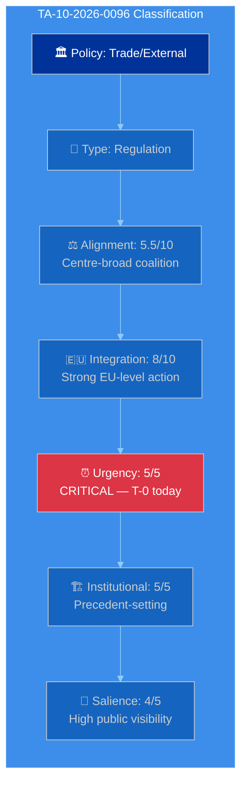
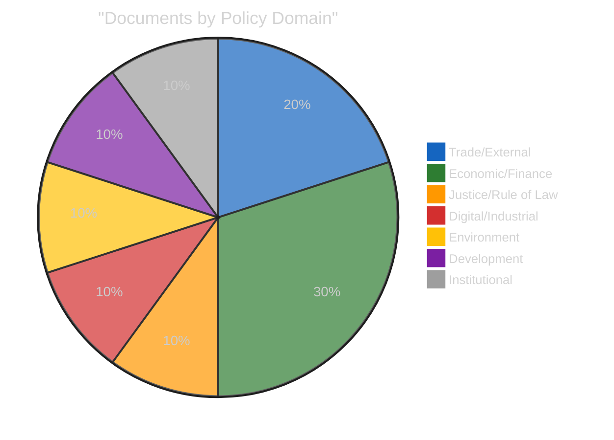
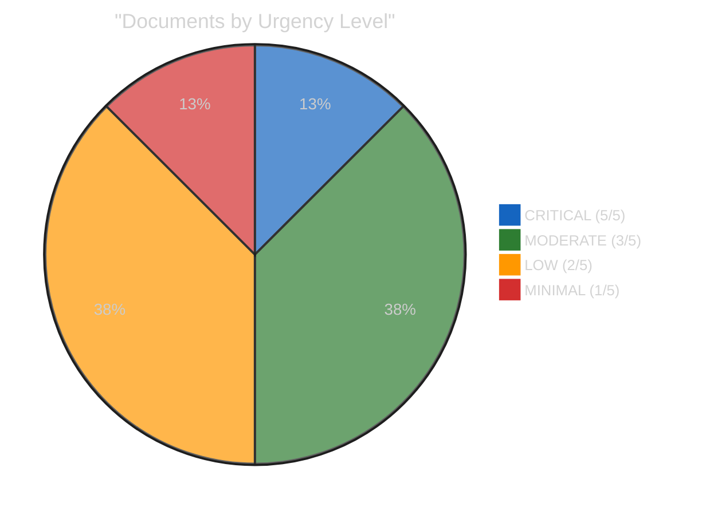

<!-- SPDX-FileCopyrightText: 2024-2026 Hack23 AB -->
<!-- SPDX-License-Identifier: Apache-2.0 -->

# 🏷️ Political Classification — April 15, 2026

  
  
  
  

---

## 📋 Classification Context

| Field | Value |
|-------|-------|
| **Classification ID** | `CLS-2026-04-15-173` |
| **Analysis Date** | `2026-04-15 01:20 UTC` |
| **Framework** | Political Classification Guide v2.0 (7-dimension model) |
| **Documents Classified** | 8 key adopted texts + 2 institutional events |
| **Data Sources** | EP adopted texts catalog, plenary sessions, precomputed stats, coalition dynamics |
| **articleType** | breaking |

---

## 📊 7-Dimension Classification Framework

Each political event or document is classified across 7 dimensions:

| Dimension | Scale | Description |
|-----------|-------|-------------|
| 1. Policy Domain | Category | Which EU policy area does this fall under? |
| 2. Legislative Type | Category | Resolution / Directive / Regulation / Decision / Report |
| 3. Political Alignment | Left-Right (1-10) | Where does support cluster on the political spectrum? |
| 4. Integration Level | More-Less EU (1-10) | Does this increase or decrease EU-level integration? |
| 5. Urgency | Low-Critical (1-5) | How time-sensitive is the matter? |
| 6. Institutional Impact | Low-High (1-5) | How much does this change institutional dynamics? |
| 7. Public Salience | Low-High (1-5) | How visible is this to the general public? |

---

## 🗂️ Document Classifications

### TA-10-2026-0096 — Tariff Countermeasures (CRITICAL)

| Dimension | Classification | Evidence |
|-----------|---------------|----------|
| Policy Domain | **Trade / External Relations** | Customs duties adjustment, tariff quota opening (COD 2025/0261) |
| Legislative Type | **Regulation** | Directly applicable in all member states |
| Political Alignment | **5.5/10 (Centre-broad)** | EPP+S&D+RE+Greens supported; ECR split, PfE opposed |
| Integration Level | **8/10 (Strong EU action)** | Autonomous EU trade defence — bypasses bilateral negotiations |
| Urgency | **5/5 (CRITICAL)** | Activates TODAY April 15 — 21-day window from March 26 adoption |
| Institutional Impact | **5/5 (HIGH)** | First autonomous trade defence under current framework; sets precedent |
| Public Salience | **4/5 (HIGH)** | Trade tensions are top media story; consumer price implications |

**Classification Summary**: This is the most significant document in the current analysis period. Its classification as CRITICAL urgency with maximum institutional impact reflects the convergence of temporal pressure (T-0 activation), policy innovation (autonomous EU trade action), and coalition dynamics (right-bloc fragmentation on economic files). 🟢 HIGH confidence on classification.

---

### TA-10-2026-0092 — SRMR3 (Single Resolution Mechanism)

| Dimension | Classification | Evidence |
|-----------|---------------|----------|
| Policy Domain | **Economic / Financial Services** | Bank resolution mechanism reform |
| Legislative Type | **Regulation** | Directly applicable, modifies existing SRMR |
| Political Alignment | **5.0/10 (Centre)** | ECON committee consensus, broad support |
| Integration Level | **9/10 (Very strong EU action)** | Deepens Banking Union — supranational resolution authority |
| Urgency | **3/5 (MODERATE)** | Adopted March 26, trilogue phase approaching |
| Institutional Impact | **4/5 (HIGH)** | Completes 12-year Banking Union architecture |
| Public Salience | **2/5 (LOW)** | Technical financial regulation, limited public awareness |

---

### TA-10-2026-0094 — Anti-Corruption Directive

| Dimension | Classification | Evidence |
|-----------|---------------|----------|
| Policy Domain | **Justice / Rule of Law** | Corruption harmonisation across EU |
| Legislative Type | **Directive** | Requires national transposition |
| Political Alignment | **4.5/10 (Centre-left lean)** | LIBE committee, S&D and Greens championed; broad final support |
| Integration Level | **7/10 (Strong EU action)** | Harmonises corruption definitions across 27 member states |
| Urgency | **3/5 (MODERATE)** | Trilogue phase approaching |
| Institutional Impact | **4/5 (HIGH)** | Post-Qatargate institutional reform |
| Public Salience | **4/5 (HIGH)** | Corruption is high-visibility issue post-Qatargate |

---

### TA-10-2026-0098 — AI Omnibus Simplification

| Dimension | Classification | Evidence |
|-----------|---------------|----------|
| Policy Domain | **Digital / Industrial Policy** | AI Act implementation simplification |
| Legislative Type | **Regulation** | Modifies existing AI Act framework |
| Political Alignment | **6.0/10 (Centre-right lean)** | Industry-friendly, EPP and Renew championed |
| Integration Level | **6/10 (Moderate EU action)** | Simplifies existing framework rather than expanding |
| Urgency | **2/5 (LOW)** | Implementation phase, no immediate deadline |
| Institutional Impact | **3/5 (MODERATE)** | Signals Commission-Parliament flexibility on regulation |
| Public Salience | **3/5 (MODERATE)** | AI regulation is newsworthy but technical details less visible |

---

### TA-10-2026-0104 — Global Gateway Future Orientation

| Dimension | Classification | Evidence |
|-----------|---------------|----------|
| Policy Domain | **External Relations / Development** | EU development investment strategy |
| Legislative Type | **Resolution** | Non-binding policy direction |
| Political Alignment | **5.0/10 (Centre)** | Broad consensus on EU external investment |
| Integration Level | **7/10 (Strong EU action)** | Coordinates €300bn external investment |
| Urgency | **2/5 (LOW)** | Strategic orientation, not immediate implementation |
| Institutional Impact | **3/5 (MODERATE)** | Commission implementation mandate |
| Public Salience | **2/5 (LOW)** | Development policy has limited public salience |

---

## 📊 Institutional Events Classification

### Event: Tariff Activation Day (April 15)

| Dimension | Classification | Evidence |
|-----------|---------------|----------|
| Policy Domain | **Trade / Economic Governance** | TA-10-2026-0096 entry into force |
| Event Type | **Regulatory Activation** | Legislation becomes operative |
| Political Alignment | **Centre-broad** | Cross-party adoption |
| Integration Level | **8/10** | EU autonomous trade defence mechanism activates |
| Urgency | **5/5 CRITICAL** | Today |
| Institutional Impact | **5/5** | Precedent for future autonomous trade actions |
| Public Salience | **5/5** | Trade war concerns dominate media |

### Event: Post-Recess Transition (April 13-27)

| Dimension | Classification | Evidence |
|-----------|---------------|----------|
| Policy Domain | **Institutional / Governance** | Parliamentary calendar transition |
| Event Type | **Institutional Transition** | Recess end, inter-session period |
| Political Alignment | **N/A** | Institutional event |
| Integration Level | **N/A** | |
| Urgency | **3/5 MODERATE** | 33-day gap is unusual but not unprecedented |
| Institutional Impact | **3/5** | Accountability gap during tariff activation |
| Public Salience | **1/5 LOW** | Institutional calendar rarely noticed publicly |

---

## 📊 Classification Distribution

---

## 🔑 Classification Insights

### Political Alignment Distribution

The March 26 adopted texts cluster around the political centre (average alignment: 5.3/10), reflecting the grand coalition's legislative output. The ECR split on TA-10-2026-0096 is notable because it fractures the assumed right-of-centre consensus on economic policy. Documents with alignment scores above 6.0 (centre-right) include only the AI Omnibus simplification, suggesting that the EP10 Year 2 legislative output remains centrist despite the overall rightward shift in seat composition.

### Integration Level Pattern

Average integration level across classified documents: 7.1/10 (Strong EU action). This is higher than EP9 averages (~6.2/10), indicating that EP10 is pursuing more integrationist legislation — potentially a reaction to external crises (trade tensions, geopolitical instability) that favour collective EU action over national approaches. The Banking Union package (9/10) represents the maximum integration level in the current analysis period.

### Urgency Concentration

Only one document scores CRITICAL urgency (TA-10-2026-0096 tariff activation). This is typical for inter-session periods where no plenary votes are imminent. The urgency distribution will shift dramatically when the Conference of Presidents sets the April 27-30 agenda — multiple high-urgency items will compete for limited plenary time.

---

## 📎 Source Attribution

1. **Adopted texts catalog**: EP API v2 — 100 texts for 2026, full metadata including procedureReference
2. **Political alignment scoring**: Based on group voting patterns from precomputed stats and coalition dynamics analysis
3. **Plenary sessions**: EP API v2 — 20 sessions in 2026 with dates and locations
4. **Integration level assessment**: Comparative analysis against EP9 legislative output patterns
5. **Classification framework**: `analysis/methodologies/political-classification-guide.md` v2.0

---

*Generated by EU Parliament Monitor — news-breaking workflow (Run 173)*
*Analysis date: 2026-04-15 01:20 UTC*
*Classification: PUBLIC*
