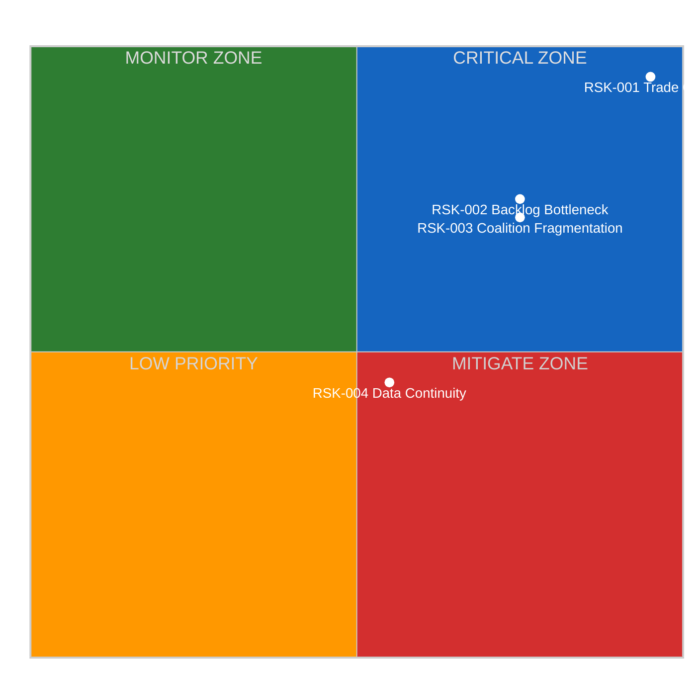
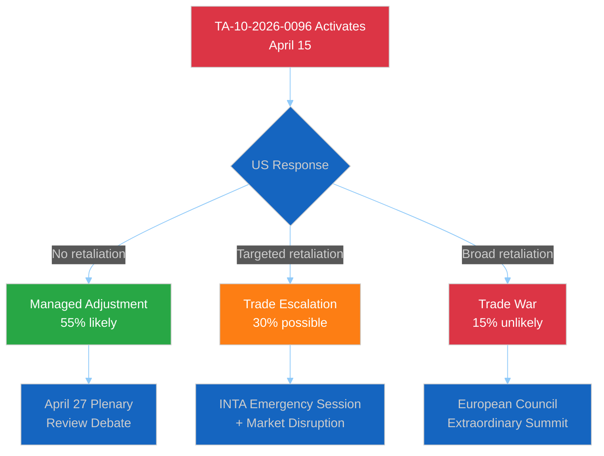
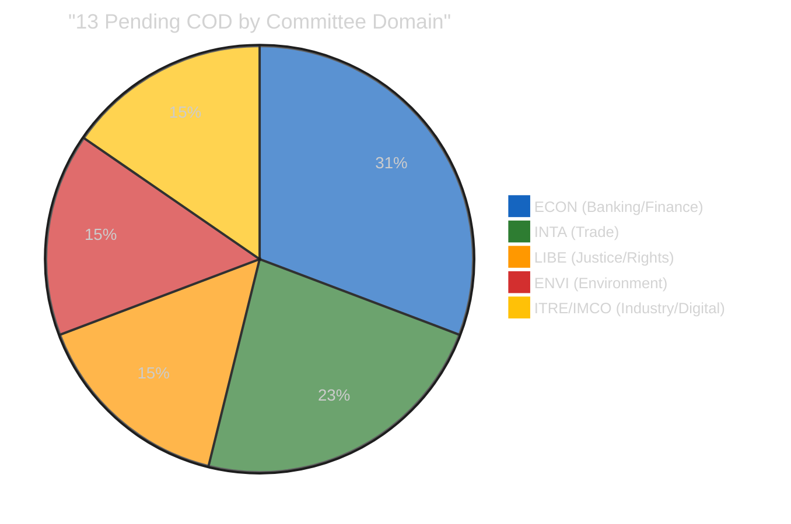
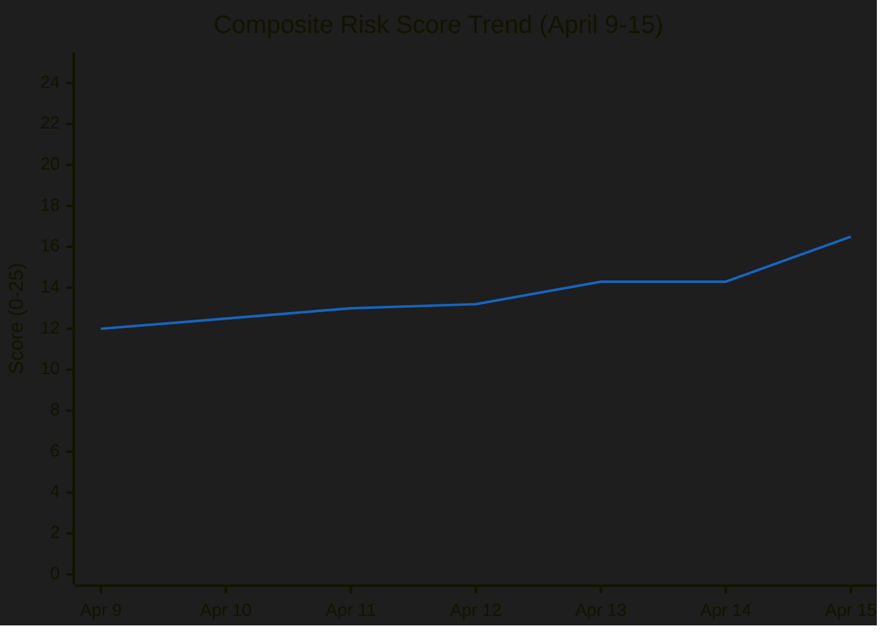

<!-- SPDX-FileCopyrightText: 2024-2026 Hack23 AB -->
<!-- SPDX-License-Identifier: Apache-2.0 -->

# ⚖️ Political Risk Assessment — April 15, 2026

  
  
  
  

---

## 📋 Risk Assessment Context

| Field | Value |
|-------|-------|
| **Assessment ID** | `RSK-2026-04-15-173` |
| **Analysis Date** | `2026-04-15 01:20 UTC` |
| **Framework** | Political Risk Methodology v2.0 (Likelihood × Impact 5×5 matrix) |
| **Risk Horizon** | 14 days (April 15-29, covering next plenary) |
| **Prior Assessment** | RSK-2026-04-14-171 (composite 14.3/25) |
| **Composite Change** | ↑ +2.2 (from 14.3 to 16.5) — driven by tariff T-0 activation |
| **articleType** | breaking |

---

## 📊 Risk Matrix Overview

---

## 🔴 RSK-001: Trade Policy Crisis (CRITICAL)

| Attribute | Value |
|-----------|-------|
| **Risk ID** | RSK-001 |
| **Category** | Economic / Geopolitical |
| **Likelihood** | 5/5 — CERTAIN (tariff countermeasures activate today) |
| **Impact** | 5/5 — CATASTROPHIC (EU-US trade disruption, market volatility) |
| **Risk Score** | **25/25** |
| **Trend** | ↑ ESCALATING (was 20/25 on April 13 at T-2, now 25/25 at T-0) |
| **Confidence** | 🟢 HIGH — activation date is structurally certain |
| **Owner** | INTA Committee / DG Trade / Conference of Presidents |
| **Mitigation** | Emergency debate scheduling, diplomatic channels, WTO dispute preparation |

### Risk Narrative

TA-10-2026-0096 (EU autonomous trade defence countermeasures) enters into force today, April 15, 2026. This is the culmination of Parliament's rapid legislative response to US tariff actions — the fastest proposal-to-law cycle in EP10 for trade policy. The risk is CRITICAL because:

1. **Certain activation**: The 21-day period from March 26 adoption expires today. No mechanism exists to delay or reverse without new legislation.
2. **US response unknown**: Washington has not publicly indicated whether it will treat EU countermeasures as escalation requiring retaliation or as a manageable trade adjustment. 🔴 LOW confidence on US response.
3. **Parliament absent**: The 33-day session gap means Parliament cannot respond to US retaliation until April 27 at the earliest.
4. **ECR fracture**: The right bloc's split on the trade vote creates uncertainty about Parliament's ability to present a unified position if the situation escalates.

### Escalation Pathway

### Mitigation Options

| Option | Feasibility | Timeline | Stakeholder |
|--------|-------------|----------|-------------|
| Diplomatic back-channel communication | HIGH | Immediate | Commission DG Trade |
| INTA committee informal briefing | MEDIUM | This week | Parliament INTA |
| Emergency plenary debate request | LOW | Requires 1/3 MEP signatures | Conference of Presidents |
| WTO dispute filing preparation | MEDIUM | 1-2 weeks | Legal Service |

---

## 🟠 RSK-002: Legislative Backlog Bottleneck (HIGH)

| Attribute | Value |
|-----------|-------|
| **Risk ID** | RSK-002 |
| **Category** | Institutional / Legislative |
| **Likelihood** | 4/5 — LIKELY (13 pending COD is historically unprecedented) |
| **Impact** | 4/5 — MAJOR (delays to Banking Union, AI, anti-corruption) |
| **Risk Score** | **16/25** |
| **Trend** | → STABLE (same as April 14 — no new information) |
| **Confidence** | 🟡 MEDIUM — COD count is certain, prioritisation outcome uncertain |
| **Owner** | Conference of Presidents / Committee Chairs |
| **Mitigation** | Early agenda-setting, parallel committee tracks, extended April plenary |

### Risk Narrative

The 13 pending COD procedures represent the largest post-recess backlog in EP10. The Conference of Presidents must assign these to committees and schedule deliberation before the April 27-30 plenary. Competing priorities include:

1. **Banking Union trilogue** (SRMR3/BRRD3/DGSD2) — ECON committee capacity constraint
2. **Tariff response review** — INTA committee may request additional hearing time
3. **Anti-corruption trilogue** — LIBE committee mandate management
4. **AI Omnibus implementation** — ITRE/IMCO joint responsibility

The risk is that committee capacity cannot absorb all 13 COD simultaneously, leading to sequential processing that delays at least some files by 2-3 months.

### Backlog Composition Analysis

---

## 🟠 RSK-003: Coalition Fragmentation (HIGH)

| Attribute | Value |
|-----------|-------|
| **Risk ID** | RSK-003 |
| **Category** | Political / Governance |
| **Likelihood** | 4/5 — LIKELY (fragmentation index 6.59 is record high) |
| **Impact** | 4/5 — MAJOR (no stable majority for contested legislation) |
| **Risk Score** | **16/25** |
| **Trend** | → STABLE (structural — awaiting post-recess voting data) |
| **Confidence** | 🟡 MEDIUM — structural factors confirmed, behavioral prediction uncertain |
| **Owner** | Group leaders / Conference of Presidents |
| **Mitigation** | Pre-negotiation cross-group agreements, package deals linking files |

### Risk Narrative

EP10's fragmentation index of 6.59 means the effective number of parliamentary parties is the highest in EU history. The grand coalition (EPP+S&D = 320 seats) falls 41 seats short of the 361 majority threshold. Every contested vote requires at least three groups to form a majority, creating:

1. **Vote-by-vote coalitions**: No standing majority — each file negotiated separately
2. **Kingmaker dynamics**: Renew Europe (76 seats) holds disproportionate leverage
3. **Right bloc uncertainty**: EPP+ECR+PfE+ESN (376 seats) has theoretical majority but has never coordinated on economic legislation. The ECR trade vote split demonstrates this fragility.
4. **Veto players multiply**: More groups with veto potential means higher negotiation costs and longer deliberation

### Coalition Viability Matrix

| Coalition | Seats | Majority? | Policy Coherence | Historical Precedent |
|-----------|-------|-----------|------------------|---------------------|
| EPP+S&D+RE | 396 | ✅ +35 | 🟡 MEDIUM — diverge on social/economic | Dominant in EP9 |
| EPP+ECR+PfE+ESN | 376 | ✅ +15 | 🔴 LOW — ECR split on trade | Untested |
| EPP+S&D+Greens | 373 | ✅ +12 | 🟡 MEDIUM — climate consensus | Occasional in EP9 |
| EPP+ECR+RE | 340 | ❌ -21 | 🟡 MEDIUM — centre-right alignment | Emerging |
| S&D+RE+Greens+Left | 310 | ❌ -51 | 🟢 HIGH — progressive alignment | Never achieved majority |

---

## 🟡 RSK-004: EP API Data Continuity (MEDIUM)

| Attribute | Value |
|-----------|-------|
| **Risk ID** | RSK-004 |
| **Category** | Operational / Monitoring |
| **Likelihood** | 3/5 — POSSIBLE (feed endpoints degraded for 18+ days) |
| **Impact** | 3/5 — MODERATE (limits real-time analysis capability) |
| **Risk Score** | **9/25** |
| **Trend** | ↓ IMPROVING (adopted texts + MEPs now working; was 0/13 on April 12) |
| **Confidence** | 🟡 MEDIUM — pattern observed but recovery unpredictable |
| **Owner** | EP IT Services / Hack23 monitoring infrastructure |
| **Mitigation** | Direct endpoint fallbacks, precomputed stats, wider timeframe windows |

### Risk Narrative

The EP API feed endpoints (`/feed` path) have returned 404 errors since Easter recess began (March 28). This affects 10 of 13 monitored feeds. However, direct endpoints (get_adopted_texts, get_plenary_sessions, get_current_meps) function normally. This suggests the feed aggregation layer is degraded while the underlying data API is healthy. Recovery is expected to coincide with the first post-recess plenary session (April 27) when feed infrastructure is likely refreshed.

### EP API Health Trend

| Date | Feeds OK | Feeds Failed | Notes |
|------|----------|-------------|-------|
| April 11 | 0/13 | 13/13 | Total outage |
| April 12 | 0/13 | 13/13 | Total outage |
| April 13 | 5/13 | 8/13 | Partial recovery (adopted texts, MEPs) |
| April 14 | 4/13 | 9/13 | Slight regression |
| April 15 | 3/13 | 10/13 | Feed 404s persist, direct endpoints OK |

---

## 📊 Composite Risk Score Trend

**Composite Risk Calculation**: Weighted average of all identified risks:
- RSK-001 (40% weight): 25/25 × 0.40 = 10.0
- RSK-002 (25% weight): 16/25 × 0.25 = 4.0
- RSK-003 (25% weight): 16/25 × 0.25 = 4.0
- RSK-004 (10% weight): 9/25 × 0.10 = 0.9
- **Composite: 16.5/25** (was 14.3/25 on April 14 — tariff activation pushes risk higher)

---

## 🔮 Risk Outlook (April 15-29)

| Risk | Expected Trajectory | Key Driver |
|------|-------------------|------------|
| RSK-001 Trade Crisis | ↕ Depends on US response | 48-72h US decision window |
| RSK-002 Backlog | → Stable until April 22 | Conference of Presidents meeting |
| RSK-003 Coalition | ↑ Increasing | April 27-30 first votes will test |
| RSK-004 Data | ↓ Improving | Expected recovery with April 27 plenary |

---

## 📎 Source Attribution

1. **TA-10-2026-0096 activation**: EP adopted texts feed, date calculation from March 26 adoption + 21-day standard entry-into-force
2. **13 COD pending**: EP precomputed statistics (generated 2026-04-08), procedures count = 935
3. **Fragmentation index 6.59**: EP precomputed statistics, political landscape data
4. **Seat counts**: EP MEPs feed (737 active MEPs) + group composition from coalition dynamics analysis
5. **Prior risk assessments**: Runs 168-171 (April 13-14) cross-session intelligence

---

*Generated by EU Parliament Monitor — news-breaking workflow (Run 173)*
*Analysis date: 2026-04-15 01:20 UTC*
*Classification: PUBLIC*
