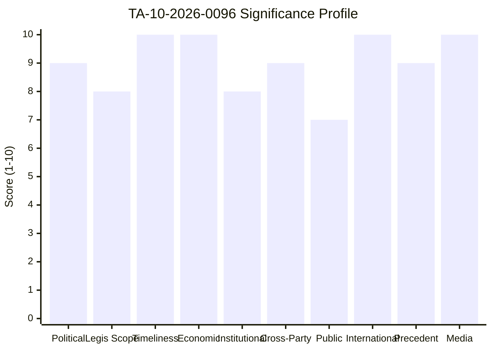
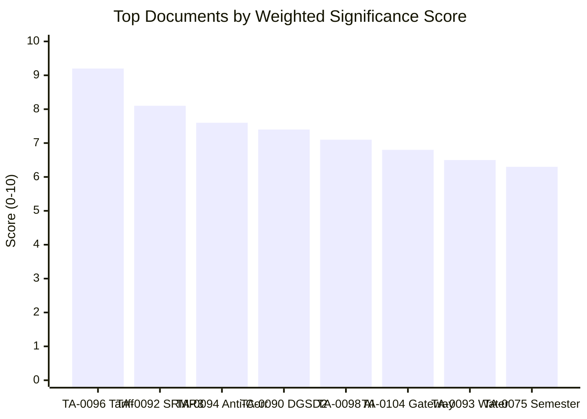

<!-- SPDX-FileCopyrightText: 2024-2026 Hack23 AB -->
<!-- SPDX-License-Identifier: Apache-2.0 -->

# 📊 Significance Scoring — April 15, 2026 Breaking Analysis

  
  
  
  

---

## 📋 Scoring Context

| Field | Value |
|-------|-------|
| **Scoring ID** | `SIG-2026-04-15-173` |
| **Analysis Date** | `2026-04-15 01:20 UTC` |
| **Scoring Framework** | 10-dimension significance model (v2.0) |
| **Documents Scored** | 12 key adopted texts from March 2026 session |
| **Data Sources** | EP adopted texts feed, precomputed stats, coalition dynamics |
| **articleType** | breaking |

---

## 📊 Significance Scoring Framework

Each document/event is scored across 10 dimensions (1-10 scale):

| Dimension | Weight | Description |
|-----------|--------|-------------|
| Political Impact | 15% | Effect on group dynamics and coalition formation |
| Legislative Scope | 12% | Breadth of regulatory/policy coverage |
| Timeliness | 15% | Urgency and temporal relevance |
| Economic Impact | 12% | Market, trade, fiscal implications |
| Institutional Significance | 10% | Impact on EU institutional dynamics |
| Cross-Party Dynamics | 10% | Coalition formation and fragmentation effects |
| Public Interest | 8% | Direct citizen impact |
| International Dimension | 8% | External relations and geopolitical effects |
| Precedent Value | 5% | Novel approaches or frameworks established |
| Media Relevance | 5% | Likely media attention and public discourse |

---

## 🏆 Top-Tier Documents (Score ≥ 8.0)

### TA-10-2026-0096 — EU Autonomous Trade Defence Countermeasures

**Weighted Score: 9.2/10** 🟢 HIGH confidence

| Dimension | Score | Evidence |
|-----------|-------|----------|
| Political Impact | 9 | ECR split on trade vote reveals right-bloc fragility on economic policy |
| Legislative Scope | 8 | Customs duties adjustment + tariff quota opening across multiple product categories |
| Timeliness | 10 | **Activates TODAY (April 15)** — 21-day period from March 26 adoption expires |
| Economic Impact | 10 | Directly affects EU-US trade flows; market-moving policy action |
| Institutional Significance | 8 | Parliament's first autonomous trade defence under current framework |
| Cross-Party Dynamics | 9 | Broad adoption but ECR defection signals fragmentation on economic files |
| Public Interest | 7 | Consumer price effects, supply chain disruption potential |
| International Dimension | 10 | EU-US relations, potential retaliation spiral, WTO implications |
| Precedent Value | 9 | Establishes template for future autonomous EU trade actions |
| Media Relevance | 10 | Global trade tensions are top-of-agenda media story |

**Key Intelligence**: This text scores highest because it represents a convergence of temporal urgency (T-0 activation), economic magnitude (EU-US trade), and political dynamics (coalition fragmentation). The ECR split is the most politically significant aspect — the largest right-of-centre group (79 seats) breaking with the EPP (185 seats) on a flagship economic file creates uncertainty about the right bloc's ability to govern on economic policy. 🟡 MEDIUM confidence on escalation risk — depends on US response.

---

### TA-10-2026-0092 — SRMR3 (Single Resolution Mechanism Regulation)

**Weighted Score: 8.1/10** 🟡 MEDIUM confidence

| Dimension | Score | Evidence |
|-----------|-------|----------|
| Political Impact | 8 | ECON committee flagship, 12-year Banking Union project |
| Legislative Scope | 9 | Comprehensive overhaul of bank resolution funding framework |
| Timeliness | 7 | Adopted March 26, trilogue pending (late April target) |
| Economic Impact | 9 | €80bn+ resolution fund restructuring, systemic banking risk |
| Institutional Significance | 8 | Completes Banking Union architecture alongside BRRD3 and DGSD2 |
| Cross-Party Dynamics | 7 | Broad support expected — ECON consensus tradition |
| Public Interest | 6 | Indirect impact through banking stability and deposit protection |
| International Dimension | 7 | EU financial system competitiveness vs US and Asian markets |
| Precedent Value | 8 | Final piece of post-2008 crisis regulatory architecture |
| Media Relevance | 6 | Specialist financial media; limited general audience appeal |

**Key Intelligence**: SRMR3 is the most consequential of the Banking Union triple package because it restructures the Single Resolution Fund's firepower. The trilogue phase beginning post-recess will be a critical test of Council-Parliament dynamics — Germany and the Netherlands historically resist expanded resolution funding while southern member states push for greater burden-sharing. 🟡 MEDIUM confidence on timeline.

---

## 🥈 High-Significance Documents (Score 7.0-7.9)

### TA-10-2026-0094 — Anti-Corruption Directive

**Weighted Score: 7.6/10** 🟡 MEDIUM confidence

| Dimension | Score | Evidence |
|-----------|-------|----------|
| Political Impact | 8 | Post-Qatargate institutional reform, LIBE committee mandate |
| Legislative Scope | 8 | Harmonised corruption definitions across 27 member states |
| Timeliness | 6 | Adopted March 26, trilogue phase approaching |
| Economic Impact | 7 | Compliance costs for businesses; anti-money laundering linkages |
| Institutional Significance | 9 | Parliament's response to its own institutional crisis |
| Cross-Party Dynamics | 7 | Broad consensus on anti-corruption — limited partisan division |
| Public Interest | 8 | Direct relevance to democratic accountability and trust |
| International Dimension | 6 | EU as global standard-setter for anti-corruption |
| Precedent Value | 8 | First EU-wide corruption directive — sets enforcement template |
| Media Relevance | 7 | Qatargate legacy maintains media interest |

### TA-10-2026-0090 — DGSD2 (Deposit Guarantee Schemes Directive)

**Weighted Score: 7.4/10** 🟡 MEDIUM confidence

| Dimension | Score | Evidence |
|-----------|-------|----------|
| Political Impact | 7 | Banking Union component, ECON committee |
| Legislative Scope | 8 | Cross-border deposit protection harmonisation |
| Timeliness | 7 | Adopted March 26, trilogue pending |
| Economic Impact | 8 | Deposit protection scope affects 340 million EU bank account holders |
| Institutional Significance | 7 | Completes deposit protection leg of Banking Union |
| Cross-Party Dynamics | 6 | Broad consensus on depositor protection |
| Public Interest | 8 | Direct impact on savings protection for EU citizens |
| International Dimension | 5 | Primarily internal market measure |
| Precedent Value | 7 | Establishes precedent for cross-border deposit protection |
| Media Relevance | 6 | Limited media appeal outside financial press |

### TA-10-2026-0098 — AI Omnibus Simplification

**Weighted Score: 7.1/10** 🟡 MEDIUM confidence

| Dimension | Score | Evidence |
|-----------|-------|----------|
| Political Impact | 7 | Industry-friendly, part of competitiveness agenda |
| Legislative Scope | 8 | Modifies AI Act implementation rules across sectors |
| Timeliness | 6 | Adopted March 26, implementation phase |
| Economic Impact | 8 | Reduces compliance burden for AI developers and deployers |
| Institutional Significance | 6 | Commission-Parliament alignment on simplification |
| Cross-Party Dynamics | 7 | Broad right-centre support expected |
| Public Interest | 6 | Indirect — affects AI services used by citizens |
| International Dimension | 7 | EU AI regulatory leadership and competitiveness |
| Precedent Value | 7 | First major simplification of the AI Act framework |
| Media Relevance | 7 | AI regulation is high-profile media topic |

---

## 🥉 Moderate-Significance Documents (Score 6.0-6.9)

### TA-10-2026-0104 — Global Gateway Future Orientation

**Weighted Score: 6.8/10** 🟡 MEDIUM confidence

| Dimension | Score | Evidence |
|-----------|-------|----------|
| Political Impact | 7 | Strategic direction for EU development policy |
| Legislative Scope | 6 | Policy orientation, not binding legislation |
| Timeliness | 6 | Adopted March 26, policy direction document |
| Economic Impact | 7 | €300bn investment strategy reorientation |
| Institutional Significance | 6 | Commission implementation mandate |
| Cross-Party Dynamics | 6 | Moderate consensus on external investment |
| Public Interest | 5 | Indirect — development cooperation |
| International Dimension | 9 | Directly competitive with China's Belt and Road |
| Precedent Value | 6 | Builds on existing Global Gateway framework |
| Media Relevance | 6 | Geopolitics angle provides media hook |

### TA-10-2026-0093 — Surface Water and Groundwater Pollutants

**Weighted Score: 6.5/10** 🟡 MEDIUM confidence

| Dimension | Score | Evidence |
|-----------|-------|----------|
| Political Impact | 6 | ENVI committee, environmental regulation |
| Legislative Scope | 7 | Water quality standards across EU |
| Economic Impact | 7 | Agricultural sector compliance, chemical industry impact |
| Public Interest | 8 | Direct health impact on drinking water quality |
| International Dimension | 4 | Primarily internal environmental measure |

### TA-10-2026-0075/0076 — European Semester 2026 (Economic + Social)

**Weighted Score: 6.3/10** 🟡 MEDIUM confidence

| Dimension | Score | Evidence |
|-----------|-------|----------|
| Political Impact | 6 | Annual coordination cycle, moderate political salience |
| Legislative Scope | 7 | Broad economic governance coordination |
| Economic Impact | 7 | Fiscal recommendations for 27 member states |
| Institutional Significance | 6 | Council-Commission-Parliament coordination cycle |

---

## 📊 Aggregate Significance Summary

---

## 🎯 Newsworthiness Gate Assessment

| Criterion | Result | Evidence |
|-----------|--------|----------|
| Today-dated adopted texts? | ❌ NO | Last adoption: March 26 |
| Today-dated EP events? | ❌ NO | Events feed 404 |
| Today-dated procedures updated? | ❌ NO | Procedures feed 404 |
| Today-dated MEP changes? | ❌ NO | MEP feed shows 737 active MEPs, no today changes |
| External significance today? | ✅ YES | Tariff TA-10-2026-0096 activates today |

**Gate Result**: NO today-dated EP feed items → **Analysis-Only PR** per Rule 5

**Rationale**: While the tariff activation is externally significant (T-0 today), the EP has not produced any new feed items. The activation is a consequence of the March 26 adoption, not a new parliamentary action. Analysis value is high for cross-session intelligence continuity.

---

## 📎 Methodology

Scoring follows the `analysis/methodologies/political-classification-guide.md` 7-dimension framework extended to 10 dimensions for breaking news evaluation. Weights optimised for timeliness and political impact (higher weight in breaking news context). All scores are AI-assessed based on EP MCP data with confidence levels stated per finding.

---

*Generated by EU Parliament Monitor — news-breaking workflow (Run 173)*
*Analysis date: 2026-04-15 01:20 UTC*
*Classification: PUBLIC*
