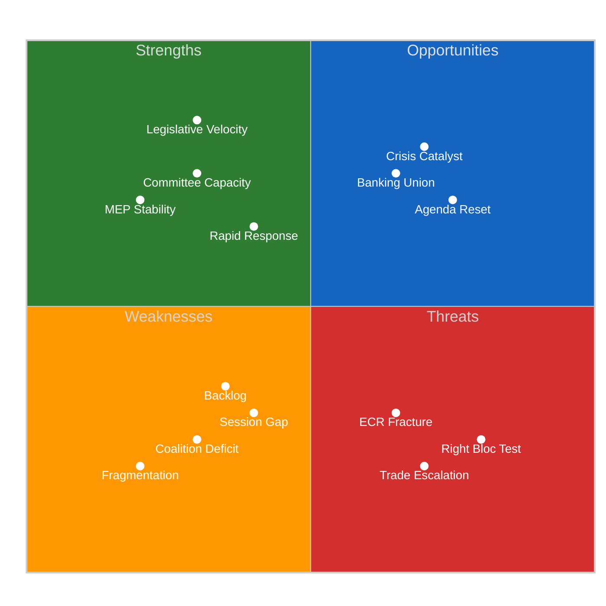
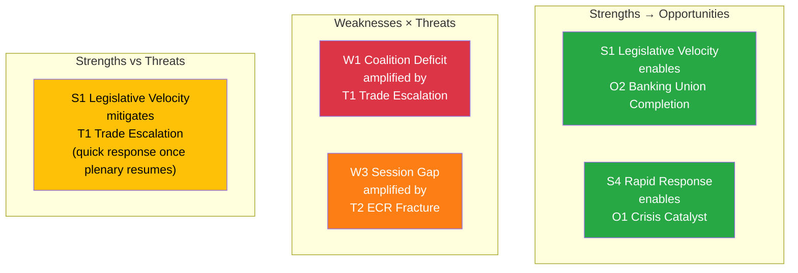

<!-- SPDX-FileCopyrightText: 2024-2026 Hack23 AB -->
<!-- SPDX-License-Identifier: Apache-2.0 -->

# 💎 SWOT Analysis — Post-Recess Parliament Strategic Landscape

  
  
  
  

---

## 📋 SWOT Context

| Field | Value |
|-------|-------|
| **Assessment ID** | `SWOT-2026-04-15-173` |
| **Analysis Date** | `2026-04-15 01:20 UTC` |
| **Subject** | European Parliament EP10 — Post-Easter Recess Strategic Position |
| **Framework** | Political SWOT Framework v2.0 (evidence-based, severity-rated) |
| **Data Sources** | 100 adopted texts, 20 plenary sessions, 737 MEPs, precomputed stats, coalition dynamics |
| **articleType** | breaking |

---

## 📊 SWOT Summary Dashboard

---

## 💪 Strengths

### S1: Record Legislative Velocity 🟢 HIGH severity

| Attribute | Value |
|-----------|-------|
| **Evidence** | 114 legislative acts in Q1 2026 vs 78 in all of 2025 (+46.2%) |
| **Source** | EP precomputed statistics (generated 2026-04-08T00:06:48Z) |
| **Confidence** | 🟢 HIGH — data from comprehensive EP statistical compilation |
| **Strategic Significance** | Demonstrates institutional capacity to handle heavy legislative agenda |
| **Sustainability** | 🟡 MEDIUM — pace may not be maintainable if coalition formation slows |

EP10's Q1 output exceeds EP9's comparable period by a wide margin. The acceleration is driven by (a) accumulated legislation from the EP9-EP10 transition, (b) pressure from external crises (trade, defence), and (c) ECON and INTA committee leadership in clearing their files. This pace gives Parliament bargaining power in trilogue negotiations — the Council knows Parliament can move quickly.

### S2: Strong Committee Infrastructure 🟢 HIGH severity

| Attribute | Value |
|-----------|-------|
| **Evidence** | 2,363 committee meetings projected for 2026 (above EP9 average) |
| **Source** | EP precomputed statistics |
| **Confidence** | 🟡 MEDIUM — projected figure based on Q1 pace |
| **Strategic Significance** | Committees are the legislative engine; strong committee activity = pipeline capacity |
| **Key Committees** | ECON (Banking Union), INTA (trade), LIBE (anti-corruption), ENVI (environment) |

### S3: MEP Institutional Memory 🟡 MEDIUM severity

| Attribute | Value |
|-----------|-------|
| **Evidence** | MEP stability index 0.949, turnover rate only 5.1% |
| **Source** | EP precomputed statistics |
| **Confidence** | 🟢 HIGH — structural data |
| **Strategic Significance** | Low turnover means experienced MEPs leading key files through trilogue |
| **Risk Factor** | High stability can also mean entrenched positions resistant to compromise |

### S4: Demonstrated Rapid Response Capability 🟡 MEDIUM severity

| Attribute | Value |
|-----------|-------|
| **Evidence** | TA-10-2026-0096 moved from proposal to law in under 3 months |
| **Source** | Adopted texts catalog — procedure COD 2025/0261 |
| **Confidence** | 🟢 HIGH — procedural timeline confirmed |
| **Strategic Significance** | Parliament can act quickly when external pressure demands it |

---

## 🔻 Weaknesses

### W1: Grand Coalition Deficit 🔴 HIGH severity

| Attribute | Value |
|-----------|-------|
| **Evidence** | EPP(185) + S&D(135) = 320 seats, need 361 for majority (-41 gap) |
| **Source** | EP MEPs feed (737 MEPs), coalition dynamics analysis |
| **Confidence** | 🟢 HIGH — seat counts are structural |
| **Strategic Impact** | Every contested vote requires three-party coalition, increasing negotiation costs |
| **Mitigation** | Renew Europe (76 seats) as reliable third partner in centre-left/liberal alignment |

The grand coalition deficit is the single most significant structural weakness of EP10. Unlike EP9 where EPP+S&D comfortably exceeded 360, EP10's two largest groups cannot govern alone. This transforms every major vote into a three-party negotiation, tripling the coordination cost and creating opportunities for smaller groups to extract concessions.

### W2: Record Fragmentation 🔴 HIGH severity

| Attribute | Value |
|-----------|-------|
| **Evidence** | Fragmentation index 6.59 — highest in EU Parliament history |
| **Source** | EP precomputed statistics, political landscape data |
| **Confidence** | 🟢 HIGH — mathematical calculation from seat distribution |
| **Strategic Impact** | More effective parties = more veto players = higher legislative friction |
| **Historical Context** | EP9 fragmentation was ~5.2; EP8 was ~4.8. Trend is consistently increasing |

### W3: Inter-Session Accountability Gap 🟡 MEDIUM severity

| Attribute | Value |
|-----------|-------|
| **Evidence** | 33-day gap: March 26 (last sitting) to April 27 (next plenary) |
| **Source** | EP plenary sessions API (20 sessions in 2026 with dates) |
| **Confidence** | 🟢 HIGH — calendar dates are confirmed |
| **Strategic Impact** | Parliament cannot exercise oversight during tariff activation |
| **Mitigation** | Written questions, informal committee meetings, group coordination |

### W4: Legislative Backlog Pressure 🟡 MEDIUM severity

| Attribute | Value |
|-----------|-------|
| **Evidence** | 13 pending COD procedures — largest post-recess queue |
| **Source** | EP precomputed statistics (935 total procedures in system) |
| **Confidence** | 🟡 MEDIUM — COD count from stats, not all may require immediate action |
| **Strategic Impact** | Committee capacity strain, prioritisation conflicts |
| **Key Files** | Banking Union trilogue, AI Omnibus, trade review, anti-corruption |

---

## 🌟 Opportunities

### O1: Crisis as Coalition Catalyst 🟢 HIGH severity

| Attribute | Value |
|-----------|-------|
| **Evidence** | Trade tariff activation creates external pressure for unity |
| **Source** | TA-10-2026-0096 activation (TODAY); historical precedent of crisis-driven consensus |
| **Confidence** | 🟡 MEDIUM — depends on crisis severity and group responses |
| **Strategic Significance** | External crises historically forge unexpected cross-party alliances |
| **Historical Precedent** | COVID pandemic produced rapid EP consensus on recovery fund |
| **Window** | Next 2 weeks (April 15-30) — before positions solidify |

The tariff activation creates a "rally around the flag" opportunity. If the US retaliates, the pressure for EU unity may override normal coalition fragmentation dynamics. The broad cross-party vote on TA-10-2026-0096 (only ECR dissented) suggests a latent consensus on trade defence that could extend to other economic files.

### O2: Banking Union Completion 🟡 MEDIUM severity

| Attribute | Value |
|-----------|-------|
| **Evidence** | SRMR3/BRRD3/DGSD2 all adopted March 26, trilogue phase begins |
| **Source** | Adopted texts TA-10-2026-0090 to 0092 |
| **Confidence** | 🟡 MEDIUM — trilogue success depends on Council positions |
| **Strategic Significance** | 12-year project completion would be EP10's signature achievement |
| **Timeline** | Late April trilogue start, potential completion by June |

### O3: Post-Recess Agenda Reset 🟡 MEDIUM severity

| Attribute | Value |
|-----------|-------|
| **Evidence** | April 27-30 Strasbourg session has 0 agenda items yet |
| **Source** | EP plenary sessions API |
| **Confidence** | 🟡 MEDIUM — Conference of Presidents must still set priorities |
| **Strategic Significance** | Clean slate allows strategic prioritisation of the 13 pending COD |
| **Risk** | Competing priorities may prevent clear focus |

### O4: EU-Canada Cooperation Template 🔻 LOW severity

| Attribute | Value |
|-----------|-------|
| **Evidence** | TA-10-2026-0078 — Enhanced EU-Canada cooperation recommendation |
| **Source** | Adopted texts catalog |
| **Confidence** | 🟢 HIGH — adopted |
| **Strategic Significance** | Alternative trade partnership model reduces US dependency |

---

## ⚡ Threats

### T1: Trade Escalation Spiral 🔴 HIGH severity

| Attribute | Value |
|-----------|-------|
| **Evidence** | TA-10-2026-0096 activates TODAY; US response unknown |
| **Source** | Adopted texts, trade policy analysis |
| **Confidence** | 🔴 LOW on escalation probability — US response not signalled |
| **Strategic Impact** | Full trade war would disrupt legislative agenda, force emergency sessions |
| **Trigger Timeline** | 48-72 hours — US decision window |
| **Worst Case** | Broad US retaliation → market disruption → European Council extraordinary summit |

### T2: ECR Permanent Fracture on Economic Policy 🟠 MEDIUM severity

| Attribute | Value |
|-----------|-------|
| **Evidence** | ECR split on TA-10-2026-0096 trade vote |
| **Source** | Prior analysis (Runs 168-171), adopted text voting context |
| **Confidence** | 🟡 MEDIUM — one vote may not indicate trend |
| **Strategic Impact** | Right bloc (376 seats) becomes unreliable on economic files |
| **Secondary Effect** | Renew Europe's kingmaker role strengthened |

The ECR split is the most politically significant signal from the pre-recess period. If ECR cannot align with EPP on trade (a traditionally centre-right policy domain), the prospect of a right-bloc governing majority on economic legislation evaporates. This would effectively lock in the EPP+S&D+RE three-party coalition as the governing formula, with consequences for policy direction.

### T3: Right-Bloc Economic Coordination Failure 🟠 MEDIUM severity

| Attribute | Value |
|-----------|-------|
| **Evidence** | Right bloc (EPP+ECR+PfE+ESN = 376 seats) has never voted together on economic files |
| **Source** | Coalition dynamics analysis, precomputed political landscape data |
| **Confidence** | 🟡 MEDIUM — untested coalition, assessment based on structural analysis |
| **Strategic Impact** | If right bloc cannot coordinate, centre-left/liberal coalition (EPP+S&D+RE = 396) governs by default |
| **Test Point** | April 27-30 plenary — first contested votes since recess |

### T4: EP API Infrastructure Risk 🔻 LOW severity

| Attribute | Value |
|-----------|-------|
| **Evidence** | 10/13 feed endpoints returning 404 for 18+ days |
| **Source** | MCP server health check, direct API diagnostics |
| **Confidence** | 🟢 HIGH — pattern well-documented across Runs 161-173 |
| **Strategic Impact** | Limited real-time monitoring capability during critical period |
| **Mitigation** | Direct endpoints functional, precomputed stats available |

---

## 📊 SWOT Interaction Matrix

---

## 🎯 Strategic Recommendations

| Priority | Action | Rationale | Timeline |
|----------|--------|-----------|----------|
| **1** | Monitor US trade response | THR-001 CRITICAL — 48-72h decision window | April 15-17 |
| **2** | Track Conference of Presidents agenda-setting | O3 + W4 — April 27-30 priorities determine legislative trajectory | April 17-22 |
| **3** | Analyse first post-recess votes | THR-002 + W1 — coalition formation patterns | April 27-30 |
| **4** | Monitor Banking Union trilogue scheduling | O2 — 12-year project completion opportunity | Late April |
| **5** | Assess INTA committee extraordinary meeting | THR-001 mitigation — informal oversight during session gap | This week |

---

## 📎 Source Attribution

1. **SWOT Framework**: `analysis/methodologies/political-swot-framework.md` v2.0
2. **Legislative data**: EP precomputed statistics (114 acts, 935 procedures, 6,147 questions)
3. **Coalition data**: EP coalition dynamics analysis + MEPs feed (737 active)
4. **Session calendar**: EP plenary sessions API (20 sessions in 2026)
5. **Adopted texts**: EP adopted texts catalog (100 texts in 2026, 32 from one-week feed)
6. **Cross-session intelligence**: Runs 168-171 (April 13-14)

---

*Generated by EU Parliament Monitor — news-breaking workflow (Run 173)*
*Analysis date: 2026-04-15 01:20 UTC*
*Classification: PUBLIC*
