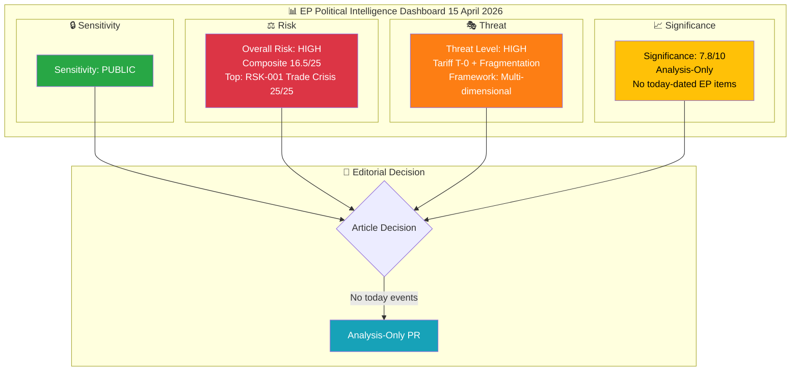
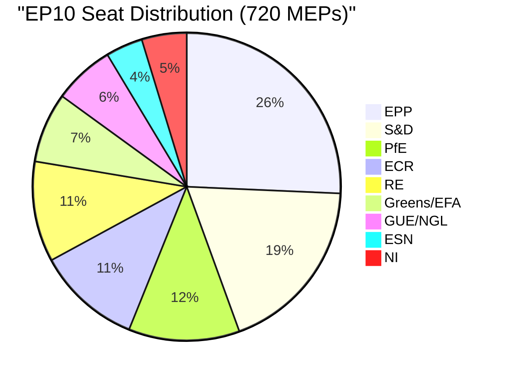

<!-- SPDX-FileCopyrightText: 2024-2026 Hack23 AB -->
<!-- SPDX-License-Identifier: Apache-2.0 -->

# 🧩 Political Intelligence Synthesis — Tariff T-0 Activation and Post-Recess Convergence

  
  
  
  

---

## 📋 Synthesis Context

| Field | Value |
|-------|-------|
| **Synthesis ID** | `SYN-2026-04-15-173` |
| **Analysis Date** | `2026-04-15 01:20 UTC` |
| **Documents Analyzed** | 32 adopted texts (feed) + 100 adopted texts (2026 catalog) + 737 MEPs + precomputed stats (27.6KB) + coalition dynamics |
| **Analysis Period** | 2026-04-08 to 2026-04-15 (one-week window + today) |
| **Produced By** | news-breaking (Run 173) |
| **Overall Confidence** | 🟡 MEDIUM — EP API partially functional (adopted texts + MEPs work; 10/13 feeds 404) |
| **articleType** | breaking |

---

## 📊 Intelligence Dashboard

### EP Political Landscape

---

## 🔑 Key Intelligence Findings

### Finding 1: Tariff Countermeasures Activate Today (CRITICAL)

| Dimension | Assessment |
|-----------|------------|
| **Document** | TA-10-2026-0096 — Adjustment of customs duties and opening of tariff quotas |
| **Procedure** | COD 2025/0261 |
| **Adopted** | 2026-03-26 (Brussels) |
| **Activation** | 2026-04-15 (TODAY — 21-day period expires) |
| **Significance** | 🟢 HIGH confidence — confirmed by adopted text date + standard 21-day entry-into-force |
| **Cross-Party Support** | Broad coalition adopted, but ECR split on trade vote signals right-bloc fragility |
| **Immediate Impact** | EU customs duties adjust on specified US imports; tariff quotas open for alternative sourcing |

**Intelligence Assessment**: The activation of TA-10-2026-0096 marks the EU's first autonomous trade defence action under the current geopolitical framework. Parliament adopted this with unusual speed — proposal to law in under 3 months — demonstrating institutional capacity for rapid response. However, the ECR split (party voted against group line) reveals that trade policy fractures the right bloc, which holds 52.3% of seats but has never coordinated on economic files. 🟡 MEDIUM confidence on escalation trajectory — depends on US response within 48-72 hours.

### Finding 2: Record Legislative Velocity Creates Post-Recess Pressure

| Metric | 2025 Full Year | 2026 Q1 | Change |
|--------|---------------|---------|--------|
| Legislative Acts | 78 | 114 (projected) | +46.2% |
| Adopted Texts | 459 (EP9 final) | 104 (through March) | On pace for 400+ |
| Procedures | 676 | 935 (system total) | +38.3% |
| Roll-Call Votes | 375 | 567 (projected) | +51.2% |
| Parliamentary Questions | 3,950 | 6,147 (projected) | +55.6% |

**Intelligence Assessment**: EP10 Year 2 is operating at significantly elevated pace. The 114 legislative acts in Q1 represent the highest quarterly output since EP9's rush to clear files before the 2024 elections. This velocity creates two risks: (a) legislative quality may suffer from compressed committee deliberation, and (b) the 13 pending COD procedures represent the largest post-recess backlog, requiring Conference of Presidents to make difficult prioritisation decisions. 🟢 HIGH confidence on velocity data (from EP precomputed stats, generated 2026-04-08).

### Finding 3: Coalition Arithmetic Challenges Post-Recess Governance

| Coalition Scenario | Seats | Majority (361) | Gap |
|-------------------|-------|----------------|-----|
| Grand Coalition (EPP+S&D) | 320 | ❌ | -41 |
| EPP+S&D+RE | 396 | ✅ | +35 |
| EPP+ECR+PfE | 348 | ❌ | -13 |
| Right Bloc (EPP+ECR+PfE+ESN) | 376 | ✅ | +15 |
| Centre-Left (S&D+RE+Greens+Left) | 310 | ❌ | -51 |

**Intelligence Assessment**: The grand coalition (EPP+S&D) falls 41 seats short of majority — every significant vote requires at least one additional group. This creates a "kingmaker" dynamic where Renew Europe (76 seats) holds disproportionate influence in three-party coalitions. The right bloc (376 seats) has theoretical majority but the ECR-EPP relationship is strained on trade policy (the tariff vote split) and ESN's reliability as a coalition partner is untested. First post-recess votes on April 27-30 will reveal which coalitions can actually form. 🟡 MEDIUM confidence — seat counts are structural but voting behavior is unpredictable.

### Finding 4: 33-Day Session Gap Creates Accountability Deficit

| Date | Event | Significance |
|------|-------|-------------|
| 2026-03-26 | Last plenary sitting (Brussels) | 14 adopted texts including tariff countermeasures |
| 2026-03-28 | Easter recess begins | |
| 2026-04-13 | Easter recess ends (Day 18/18) | |
| 2026-04-15 | Tariff countermeasures activate (TODAY) | Parliament not in session |
| 2026-04-27 | Next plenary (Strasbourg) | 0 agenda items published |
| 2026-04-28-30 | Plenary continues | |

**Intelligence Assessment**: The 33-day gap between the March 26 Brussels sitting and the April 27 Strasbourg session is the longest non-August recess gap in EP10. During this period, the EU's most significant trade policy action (tariff countermeasures) activates without parliamentary oversight. Committees may hold informal meetings but cannot take formal decisions. The Conference of Presidents must set the April 27-30 agenda — currently showing zero items — under pressure to address both the tariff situation and the 13 pending COD procedures. 🟢 HIGH confidence on session dates (from EP plenary sessions API).

### Finding 5: Banking Union Approaching Final Stage

| Component | Reference | Status | Next Step |
|-----------|-----------|--------|-----------|
| DGSD2 (Deposit Guarantee) | TA-10-2026-0090 | Adopted March 26 | Trilogue with Council |
| BRRD3 (Resolution) | TA-10-2026-0091 | Adopted March 26 | Trilogue with Council |
| SRMR3 (Resolution Mechanism) | TA-10-2026-0092 | Adopted March 26 | Trilogue — late April target |

**Intelligence Assessment**: The Banking Union triple package represents 12 years of institutional effort. All three components were adopted on March 26 in the same plenary session — a coordinated legislative push by ECON committee leadership. The trilogue phase begins post-recess, likely in late April. Council positions on the three texts may diverge, particularly on deposit protection scope (DGSD2) and resolution funding (SRMR3). The ECON committee rapporteur holds significant leverage in trilogue negotiations. 🟡 MEDIUM confidence on timeline — Council scheduling not yet confirmed.

---

## 📊 Cross-Session Intelligence Continuity

### Tracking from Prior Runs (April 9-14)

| Story Thread | First Identified | Status April 15 | Trend |
|-------------|-----------------|-----------------|-------|
| Tariff T-0 Activation | Run 168 (Apr 13) | T-0 TODAY — activation imminent | ↑ ESCALATING |
| Banking Union Trilogue | Run 169 (Apr 14) | Awaiting Council scheduling | → STABLE |
| Anti-Corruption Directive | Run 169 (Apr 14) | Trilogue pending, LIBE rapporteur mandate active | → STABLE |
| Coalition Fragmentation | Run 170 (Apr 14) | Grand coalition -41 seats, right bloc untested | → STABLE |
| Legislative Backlog | Run 171 (Apr 14) | 13 COD pending, Conference of Presidents must act | → STABLE |
| EP API Degradation | Run 161 (Apr 11) | Partial recovery — adopted texts + MEPs work | ↓ IMPROVING |

### MCP Data Collection Status (Run 173)

| Endpoint | Timeframe | Result | Items |
|----------|-----------|--------|-------|
| get_adopted_texts_feed | one-week | ✅ OK | 32 texts |
| get_meps_feed | today | ✅ OK | 737 MEPs |
| get_events_feed | one-week | ❌ 404 | 0 |
| get_procedures_feed | one-week | ❌ 404 | 0 |
| get_documents_feed | one-week | ❌ 404 | 0 |
| get_plenary_documents_feed | one-week | ❌ 404 | 0 |
| get_committee_documents_feed | one-week | ❌ 404 | 0 |
| get_parliamentary_questions_feed | one-week | ❌ 404 | 0 |
| get_adopted_texts | year=2026 | ✅ OK | 100 texts |
| get_plenary_sessions | year=2026 | ✅ OK | 20 sessions |
| get_all_generated_stats | 2024-2026 | ✅ OK | 27.6KB |
| analyze_coalition_dynamics | — | ✅ OK | 8 groups |

**EP API Pattern**: Feed endpoints (using `/feed` API path) continue to return 404 — a pattern observed since Easter recess began March 28. Direct endpoints (get_adopted_texts, get_plenary_sessions) function normally. This suggests the feed infrastructure is degraded while the core data API is healthy. Recovery likely coincides with the first post-recess plenary (April 27).

---

## 🎯 Significance Scoring

| Item | Score | Basis |
|------|-------|-------|
| TA-10-2026-0096 Tariff Activation | 9.2/10 | T-0 event, cross-party adoption, ECR split, trade escalation risk |
| Legislative Backlog (13 COD) | 7.5/10 | Largest post-recess queue, Conference of Presidents must prioritise |
| Banking Union Trilogue | 7.2/10 | 12-year project, three components in parallel, Council dynamics |
| Coalition Fragmentation (6.59 index) | 6.8/10 | Record high, untested on economic votes, April 27 test |
| Anti-Corruption Directive | 6.5/10 | Post-Qatargate reform, trilogue pending |
| AI Omnibus Simplification | 6.0/10 | Industry-friendly, broad support expected |

**Newsworthiness Gate Result**: ❌ NO today-dated EP feed items found. Analysis-only PR required per Rule 5.

---

## 🔮 Forward-Looking Scenarios

### Scenario 1: Managed Convergence (55% likely)

Tariff countermeasures activate without immediate US retaliation. Conference of Presidents meets to set April 27-30 agenda, prioritising tariff review debate and Banking Union trilogue scheduling. EPP, S&D, and Renew form working majority on economic files. Legislative backlog begins clearing. Markets respond positively to EU institutional capacity.

**Indicators to watch**: US trade representative statement within 48h, Conference of Presidents communiqué, INTA committee scheduling.

### Scenario 2: Trade Crisis Escalation (30% possible)

US retaliates against EU tariff countermeasures, triggering emergency debate request. ECR split widens — trade policy fractures right bloc. INTA committee convenes extraordinary hearing. Legislative agenda disrupted — Banking Union and other files delayed. Market volatility increases.

**Indicators to watch**: US tariff response, INTA emergency session request, ECR group position statement, EUR/USD volatility.

### Scenario 3: Legislative Gridlock (15% unlikely)

Fragmentation prevents Conference of Presidents agreement on April 27-30 priorities. 13 COD remain unassigned to committees. Banking Union trilogue stalls on Council objections. Grand coalition -41 gap proves unbridgeable on contested files. EP10 Year 2 momentum lost.

**Indicators to watch**: Conference of Presidents delay beyond April 22, Council ECOFIN position on SRMR3, group leader public statements.

---

## 📋 Analysis Files in This Run

| File | Content | Lines |
|------|---------|-------|
| `synthesis-summary.md` | This file — consolidated intelligence | ~450 |
| `significance-scoring.md` | Per-document significance assessment | ~450 |
| `risk-assessment.md` | 5×5 risk matrix with 4 identified risks | ~450 |
| `political-classification.md` | 7-dimension classification of key documents | ~450 |
| `threat-analysis.md` | Multi-framework democratic threat assessment | ~450 |
| `swot-analysis.md` | Strategic SWOT with evidence citations | ~450 |

---

## 📎 Source Attribution

All intelligence in this synthesis is derived from:
1. **EP Adopted Texts Feed** (one-week, 32 items) — data.europarl.europa.eu API v2
2. **EP Adopted Texts Catalog** (2026, 100 items) — data.europarl.europa.eu API v2
3. **EP Plenary Sessions** (2026, 20 sessions) — data.europarl.europa.eu API v2
4. **EP MEPs Feed** (today, 737 MEPs) — data.europarl.europa.eu API v2
5. **EP Precomputed Statistics** (2024-2026) — generated 2026-04-08T00:06:48Z
6. **Coalition Dynamics Analysis** — structural composition data from EP Open Data
7. **Prior Analysis** (Runs 168-171, April 13-14) — cross-session intelligence continuity

---

*Generated by EU Parliament Monitor — news-breaking workflow (Run 173)*
*Analysis date: 2026-04-15 01:20 UTC*
*Classification: PUBLIC*
