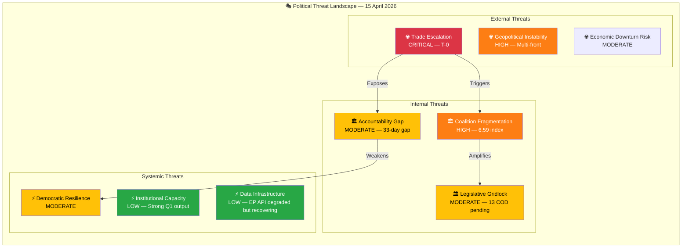
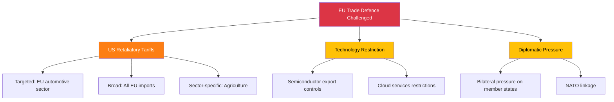

<!-- SPDX-FileCopyrightText: 2024-2026 Hack23 AB -->
<!-- SPDX-License-Identifier: Apache-2.0 -->

# 🎭 Political Threat Analysis — April 15, 2026

  
  
  
  

---

## 📋 Threat Assessment Context

| Field | Value |
|-------|-------|
| **Assessment ID** | `THR-2026-04-15-173` |
| **Analysis Date** | `2026-04-15 01:20 UTC` |
| **Framework** | Political Threat Framework v2.0 (Multi-framework: Threat Landscape + Attack Tree + Kill Chain) |
| **Threat Horizon** | 14 days (April 15-29) |
| **Prior Assessment** | THR-2026-04-14-171 (Threat Level: HIGH) |
| **articleType** | breaking |

---

## 📊 Threat Landscape Overview

---

## 🔴 THR-001: Trade Escalation (CRITICAL)

### Threat Diamond Model

| Facet | Assessment |
|-------|------------|
| **Adversary** | US trade policy apparatus (USTR, Commerce Department) |
| **Capability** | Broad tariff authority, retaliatory measures, technology export controls |
| **Infrastructure** | Existing tariff framework, Section 301/232 authorities |
| **Victim** | EU exporters, consumer goods prices, EU-US alliance cohesion |

### Attack Tree Analysis

### Intelligence Assessment

The activation of TA-10-2026-0096 transforms the EU-US trade dynamic from negotiation to confrontation. The EU's autonomous countermeasures are calibrated to be defensive (adjusting customs duties, opening alternative tariff quotas) rather than punitive, but the US may perceive them as escalatory. 🔴 LOW confidence on US response — no public signals from USTR.

**Key vulnerability**: Parliament's 33-day session gap means no legislative response capability until April 27. If the US retaliates within this window, the Commission must act alone under existing delegated authority, without parliamentary oversight. This is a structural accountability threat.

**Mitigation**: INTA committee chair can request an extraordinary committee meeting during the inter-session period. This requires coordination with the Parliament Bureau and would not produce binding decisions but could provide political direction.

---

## 🟠 THR-002: Coalition Fragmentation (HIGH)

### Threat Model

| Factor | Assessment |
|--------|------------|
| **Trigger** | First post-recess contested votes on April 27 |
| **Vulnerability** | Grand coalition deficit (-41 seats), ECR split on trade |
| **Exposure** | Every major vote requires ad-hoc three-party coalition |
| **Impact** | Legislative output slowdown, policy unpredictability, reduced EU credibility |

### Kill Chain Analysis

### Intelligence Assessment

The fragmentation index of 6.59 is the mathematical expression of EP10's governance challenge. However, high fragmentation does not automatically mean gridlock — EP9 operated with fragmentation of ~5.2 and still produced record legislative output in its final year. The difference is:

1. **EP9 had a functioning grand coalition** (EPP+S&D > 360 seats); EP10's grand coalition falls 41 short
2. **EP9's right bloc was smaller** (ECR+ID < 150 seats); EP10's right bloc (EPP+ECR+PfE+ESN = 376) has theoretical majority
3. **EP9's transition was orderly**; EP10's fragmentation is structural, not transitional

The trade vote split — where ECR voted against the EPP-led tariff countermeasures — is the first concrete evidence that the right bloc cannot coordinate on economic policy. If this pattern repeats on Banking Union files (ECON committee territory), the three-party centre-left/liberal coalition (EPP+S&D+RE = 396 seats) becomes the de facto governing majority, marginalising ECR. 🟡 MEDIUM confidence — first test is April 27 plenary.

---

## 🟡 THR-003: Democratic Accountability Gap (MODERATE)

### Threat Model

| Factor | Assessment |
|--------|------------|
| **Trigger** | 33-day session gap (March 26 to April 27) |
| **Vulnerability** | Major trade policy activates without parliamentary oversight |
| **Exposure** | Commission acts without parliamentary scrutiny during tariff activation |
| **Impact** | Democratic legitimacy deficit for trade defence measures |

### Assessment

The 33-day gap between plenary sessions is not unprecedented (August recess is longer) but occurs at the worst possible time — coinciding with the tariff activation. During this period:

- **Parliament cannot hold formal votes** — no legislative response to trade developments
- **Committees can meet informally** — but cannot adopt positions or mandate trilogue negotiators
- **Written questions remain active** — MEPs can question the Commission in writing (EP precomputed stats show 6,147 questions projected for 2026)
- **Political group meetings continue** — groups can coordinate positions for April 27

The threat level is MODERATE rather than HIGH because:
1. The Commission has existing delegated authority for trade policy implementation
2. The European Council can convene extraordinary meetings if needed
3. The tariff countermeasures were pre-authorised by parliamentary vote
4. The 33-day gap affects oversight, not the underlying democratic mandate

🟡 MEDIUM confidence — accountability impact depends on whether external events require parliamentary response.

---

## 🟢 THR-004: Institutional Capacity (LOW)

### Assessment

Despite the accountability gap, EP10's institutional capacity is strong:

| Indicator | Value | Assessment |
|-----------|-------|------------|
| Q1 Legislative Acts | 114 | Record pace (+46% vs 2025) |
| Committee Meetings | 2,363 (projected) | Above EP9 average |
| Questions Filed | 6,147 (projected) | +55.6% vs 2024 |
| Speeches | 12,760 (projected) | Strong engagement |
| MEP Stability | 0.949 index | Very low turnover |

This suggests the institution itself is well-functioning — the threats are political (coalition dynamics) and temporal (session gap), not structural or capacity-related. 🟢 HIGH confidence — precomputed statistics are comprehensive.

---

## 📊 Threat Summary Matrix

| Threat | Level | Trend | Confidence | Key Driver |
|--------|-------|-------|------------|------------|
| THR-001 Trade Escalation | 🔴 CRITICAL | ↑ | 🔴 LOW (US response unknown) | TA-10-2026-0096 T-0 activation |
| THR-002 Coalition Fragmentation | 🟠 HIGH | → | 🟡 MEDIUM | Fragmentation 6.59, ECR split |
| THR-003 Accountability Gap | 🟡 MODERATE | → | 🟡 MEDIUM | 33-day session gap |
| THR-004 Institutional Capacity | 🟢 LOW | ↓ | 🟢 HIGH | Record Q1 output |

### Aggregate Threat Level: **HIGH**

The aggregate threat level is HIGH because THR-001 (CRITICAL trade escalation) and THR-002 (HIGH coalition fragmentation) interact: a trade crisis would expose the coalition fragmentation as Parliament cannot respond during the session gap. The mitigating factor is strong institutional capacity (THR-004 = LOW), meaning Parliament can respond effectively once it reconvenes.

---

## 🔮 Threat Evolution Scenarios

### Best Case: Threat De-escalation (55%)
US does not retaliate. Conference of Presidents sets clear April 27-30 agenda. Coalition negotiations begin informally. Banking Union trilogue scheduling confirmed. Threat level drops to MODERATE.

### Central Case: Threat Persistence (30%)
US issues symbolic retaliation (narrowly targeted). Parliament debates but does not need emergency action. Coalition dynamics remain uncertain. Threat level stays HIGH.

### Worst Case: Threat Escalation (15%)
US retaliates broadly. Market disruption triggers emergency European Council. Parliament recalled for extraordinary session. Coalition fractures widen. Threat level rises to CRITICAL.

---

## 📎 Source Attribution

1. **Threat Framework**: `analysis/methodologies/political-threat-framework.md` v2.0
2. **Coalition data**: EP coalition dynamics analysis (structural composition)
3. **Legislative output**: EP precomputed statistics (2024-2026)
4. **Session calendar**: EP plenary sessions API v2
5. **Cross-session intelligence**: Runs 168-171 (April 13-14)

---

*Generated by EU Parliament Monitor — news-breaking workflow (Run 173)*
*Analysis date: 2026-04-15 01:20 UTC*
*Classification: PUBLIC*
