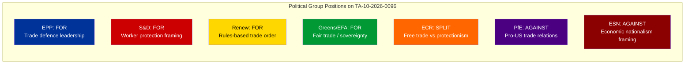
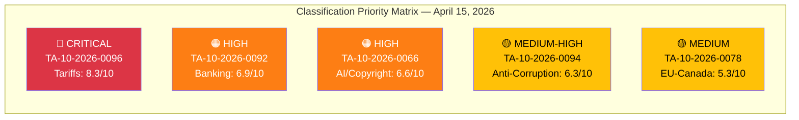

<!-- SPDX-FileCopyrightText: 2024-2026 Hack23 AB -->
<!-- SPDX-License-Identifier: Apache-2.0 -->

# 🏷️ Political Classification — 15 April 2026 (Run 174)

  
  
  
  

---

articleType: breaking

---

## 📋 Classification Context

| Field | Value |
|-------|-------|
| **Classification ID** | `CLS-2026-04-15-174` |
| **Classification Date** | 2026-04-15 07:20 UTC |
| **Methodology** | 7-dimension political classification (per political-classification-guide.md) |
| **Documents Classified** | 5 key adopted texts from March 2026 session |
| **Classified By** | news-breaking (Run 174) |
| **EP API Status** | DEGRADED MODE |

---

## 📊 Classification 1: Tariff Countermeasures (TA-10-2026-0096)

| Field | Value |
|-------|-------|
| **Document** | Adjustment of customs duties and opening of tariff quotas for the import of certain goods originating in the United States of America |
| **EP Reference** | TA-10-2026-0096 |
| **Procedure** | COD 2025/0261 |
| **Adopted** | 2026-03-26 |
| **Entry into Force** | 2026-04-15 (TODAY) |

### 7-Dimension Classification

| Dimension | Classification | Score | Rationale |
|-----------|:-------------:|:-----:|-----------|
| **1. Policy Domain** | Trade & External Relations | 9/10 | EU-US bilateral trade; tariff authority delegation; WTO implications |
| **2. Legislative Type** | Regulation (directly applicable) | 8/10 | No transposition needed — immediate effect across all 27 member states |
| **3. Political Alignment** | Cross-party (centre-left to centre-right) | 7/10 | EPP, S&D, Renew, Greens supported; ECR split; PfE/ESN opposed |
| **4. Institutional Impact** | Commission empowerment | 8/10 | Delegates tariff adjustment power; EP oversight role established |
| **5. Geographic Scope** | EU-wide + Transatlantic | 9/10 | All member states + direct US bilateral impact |
| **6. Temporal Horizon** | Immediate (days to weeks) | 9/10 | Activates today; Commission must decide implementation parameters |
| **7. Controversy Level** | HIGH — contested | 8/10 | ECR split, PfE opposition; trade war rhetoric; consumer impact debate |

**Overall Classification:** 🔴 **HIGH SIGNIFICANCE — CRITICAL TIMELINE** (Composite: 8.3/10)

---

## 📊 Classification 2: Banking Union — SRMR3 (TA-10-2026-0092)

| Field | Value |
|-------|-------|
| **Document** | Early intervention measures, conditions for resolution and funding of resolution action |
| **EP Reference** | TA-10-2026-0092 |
| **Procedure** | COD 2023/0111 |
| **Adopted** | 2026-03-26 |
| **Stage** | Trilogue with Council |

### 7-Dimension Classification

| Dimension | Classification | Score | Rationale |
|-----------|:-------------:|:-----:|-----------|
| **1. Policy Domain** | Financial Regulation / Banking | 8/10 | Eurozone Banking Union completion; SRMR reform |
| **2. Legislative Type** | Regulation (amending existing framework) | 7/10 | Amends existing SRM Regulation; complex technical provisions |
| **3. Political Alignment** | Grand coalition + Renew | 7/10 | EPP, S&D, Renew consensus; ECR cautious; Greens supportive with caveats |
| **4. Institutional Impact** | SRB + ECB + National authorities | 8/10 | Strengthens Single Resolution Board; harmonises resolution tools |
| **5. Geographic Scope** | Eurozone (19→20 states) + EU-wide framework | 7/10 | Primary impact on eurozone; framework applies to all EU banks |
| **6. Temporal Horizon** | Medium-term (months to years) | 5/10 | Trilogue phase = weeks; transposition = 18-24 months |
| **7. Controversy Level** | MEDIUM — technical disagreements | 6/10 | National interest divergences (Germany vs France on DGSD); technical not ideological |

**Overall Classification:** 🟠 **HIGH SIGNIFICANCE — EXTENDED TIMELINE** (Composite: 6.9/10)

---

## 📊 Classification 3: Anti-Corruption Directive (TA-10-2026-0094)

| Field | Value |
|-------|-------|
| **Document** | Combating corruption |
| **EP Reference** | TA-10-2026-0094 |
| **Procedure** | COD 2023/0135 |
| **Adopted** | 2026-03-26 |
| **Stage** | Trilogue with Council |

### 7-Dimension Classification

| Dimension | Classification | Score | Rationale |
|-----------|:-------------:|:-----:|-----------|
| **1. Policy Domain** | Justice & Home Affairs | 7/10 | Anti-corruption harmonisation; criminal law approximation |
| **2. Legislative Type** | Directive (requires transposition) | 7/10 | Member state implementation required; allows national adaptation |
| **3. Political Alignment** | Broad cross-party | 8/10 | Near-universal support at adoption; anti-corruption consensus |
| **4. Institutional Impact** | Judicial cooperation strengthened | 7/10 | New EU-level corruption offences; enhanced cross-border investigation |
| **5. Geographic Scope** | EU-wide | 7/10 | All 27 member states must transpose |
| **6. Temporal Horizon** | Medium-term (trilogue + transposition) | 4/10 | Months of negotiation; 2-year transposition period |
| **7. Controversy Level** | LOW — broad consensus | 4/10 | Anti-corruption enjoys universal rhetorical support; implementation details may generate disagreement |

**Overall Classification:** 🟡 **MEDIUM-HIGH SIGNIFICANCE — CONSENSUS TRACK** (Composite: 6.3/10)

---

## 📊 Classification 4: EU-Canada Cooperation (TA-10-2026-0078)

| Field | Value |
|-------|-------|
| **Document** | Enhanced EU-Canada cooperation in the current geopolitical context |
| **EP Reference** | TA-10-2026-0078 |
| **Adopted** | 2026-03-11 |

### 7-Dimension Classification Summary

| Dimension | Score | Rationale |
|-----------|:-----:|-----------|
| Policy Domain | 7/10 | Foreign affairs; geopolitical alignment |
| Legislative Type | 5/10 | Recommendation (non-binding) |
| Political Alignment | 8/10 | Broad cross-party support for Canada partnership |
| Institutional Impact | 5/10 | Commission and EEAS empowered to deepen cooperation |
| Geographic Scope | 6/10 | Bilateral EU-Canada |
| Temporal Horizon | 3/10 | Long-term strategic relationship |
| Controversy Level | 3/10 | Low — Canada perceived as aligned partner |

**Overall Classification:** 🟡 **MEDIUM SIGNIFICANCE — STRATEGIC CONTEXT** (Composite: 5.3/10)

---

## 📊 Classification 5: Copyright and Generative AI (TA-10-2026-0066)

| Field | Value |
|-------|-------|
| **Document** | Copyright and generative artificial intelligence – opportunities and challenges |
| **EP Reference** | TA-10-2026-0066 |
| **Adopted** | 2026-03-10 |

### 7-Dimension Classification Summary

| Dimension | Score | Rationale |
|-----------|:-----:|-----------|
| Policy Domain | 8/10 | Digital policy; AI governance; intellectual property |
| Legislative Type | 6/10 | Resolution (non-legislative but politically significant) |
| Political Alignment | 6/10 | Divided: tech industry vs creative sectors; EPP/Renew vs S&D/Greens |
| Institutional Impact | 6/10 | Signals EP position for future AI Act amendments |
| Geographic Scope | 8/10 | Global implications (AI companies worldwide affected) |
| Temporal Horizon | 5/10 | Medium-term; sets political direction for 2027 legislative proposals |
| Controversy Level | 7/10 | HIGH — deep divide between technology and creative industries |

**Overall Classification:** 🟠 **HIGH SIGNIFICANCE — DIVISIVE FUTURE POLICY** (Composite: 6.6/10)

---

## 📊 Classification Summary Table

| Rank | Document | Composite | Domain | Timeline |
|:----:|----------|:---------:|--------|----------|
| 1 | TA-10-2026-0096 (Tariffs) | 8.3/10 | Trade | TODAY |
| 2 | TA-10-2026-0092 (SRMR3) | 6.9/10 | Banking | Weeks |
| 3 | TA-10-2026-0066 (AI/Copyright) | 6.6/10 | Digital | Months |
| 4 | TA-10-2026-0094 (Anti-Corruption) | 6.3/10 | Justice | Months |
| 5 | TA-10-2026-0078 (EU-Canada) | 5.3/10 | Foreign Affairs | Long-term |

---

*Political classification produced by EU Parliament Monitor — news-breaking Run 174. Methodology: 7-dimension classification per analysis/methodologies/political-classification-guide.md.*
